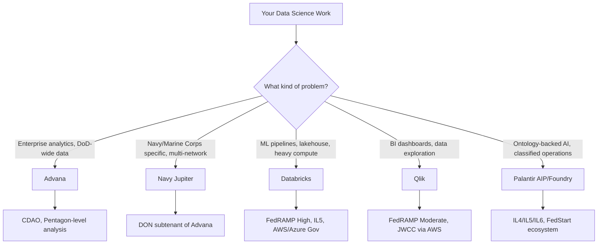

# Chapter 01: Introduction to Data Science in Government

The meeting invite said "data science onboarding" and blocked off two hours on a Thursday. Sarah Chen had been on the contract for eleven days. She'd shipped machine learning models at two fintech startups before this, so she came in expecting the usual: here's the stack, here's the Git workflow, here are the environment variables, go build something.

Instead, the first forty-five minutes were security briefings.

Her laptop needed a specific build. Her badge needed to be activated on three separate systems. She needed to fill out a DD Form 2875 before she could even look at the data she'd been hired to analyze. The team lead, a retired Navy lieutenant commander named Marcus Webb, watched her scribble through the paperwork with the patient expression of a man who had watched this scene play out many times before.

"You're doing great," he said. "The last guy took four weeks to get access."

She looked up. "Four weeks?"

"He kept forgetting the CAC reader."

This is the first thing you need to understand about data science in the federal government: the work itself — the modeling, the analysis, the Python, the pipelines — is largely the same as anywhere else. What is different is everything around the work. Access controls. Classification levels. Compliance requirements that are not bureaucratic annoyances but load-bearing constraints that determine what you can build, who can see it, and where it can run. The data scientist who treats security as someone else's problem will spend their entire contract waiting for access they never get, building on data they don't understand, and deploying to environments that reject their code.

The ones who succeed learn the environment the way a carpenter learns a new shop. You figure out what tools are on the wall, how the material behaves, and what the building codes require before you make your first cut.

*Note: Sarah is a composite character drawn from multiple onboarding experiences described by federal data science practitioners. No single individual is depicted.*

## What You'll Build

By the end of this chapter, you will be able to:

- Explain the five major platforms (Advana, Databricks, Qlik, Navy Jupiter, Palantir AIP/Foundry) and which use cases each serves
- Describe what an authorization level means and why it shapes every architectural decision you make
- Authenticate to and run a basic query on whichever platform your contract uses
- Orient yourself in a new DoD data environment in under a week instead of under a month

## The Federal Data Science Environment Is Not Academic Data Science

Walk into any university data science program and the curriculum assumes you control your environment. You can install packages. You can download datasets. You can spin up a Jupyter notebook on your laptop and start exploring.

Walk onto a federal contract and almost none of that is true.

Your laptop may be managed with a mobile device management agent that restricts what you can install. Your internet traffic routes through a government proxy. The datasets you need are on classified networks your personal machine cannot touch. The Python version on the approved platform might be six months behind what you'd use at home — and that matters because package dependencies are validated against it.

This is not a complaint. It is a description of the operational reality, and understanding it is the first professional skill you will develop.

The upside is real: federal data problems are genuinely hard and genuinely important. You are working with data about the readiness of an aircraft carrier, the disbursement of $750 billion in procurement spending, the health outcomes of 9.6 million military beneficiaries. The stakes create a kind of focus that is hard to replicate in commercial analytics. When your model flags a logistics anomaly that saves two weeks on a ship deployment cycle, people notice.

### What "Data Science" Actually Means on a DoD Contract

The phrase "data science" covers a wide range in the federal space. On a given week, a data scientist on a DoD analytics contract might:

- Pull a dataset from a data catalog (Collibra on Jupiter or Advana), check its lineage, and validate it against the gold-tier standard before using it in a report
- Write a PySpark transform in a Databricks notebook that cleans 18 months of maintenance records for a fleet of amphibious ships
- Build a Qlik dashboard that gives a program manager a single-screen view of contract obligations across five fiscal years
- Develop an ML model in Palantir Foundry's Code Workspace, publish it with `palantir_models`, and integrate it into an operational decision-support application
- Sit in a requirements meeting with an O-5 and translate "I want to know which ships are going to miss their maintenance windows" into a specific data request, a specific model type, and a specific output format

That last one matters more than most practitioners expect. The ability to decompose a commander's question into a tractable data problem is a distinct skill. It is not the same as feature engineering. It is closer to systems analysis, and the federal environment rewards it disproportionately.

## The Five Platforms

You will encounter five platforms repeatedly in DoD data science work. Each has a different history, a different architecture, and a different reason to exist. Knowing which platform to reach for — and when — is the first technical judgment call you will make on any new engagement.

*Figure: Platform selection decision tree. The answer depends on what you are building, who needs access, and what classification level your data lives at.*

### Advana: The Pentagon's Data Platform

Advana — short for "Advancing Analytics" — is the DoD's enterprise-wide data and analytics platform. Built originally by Booz Allen Hamilton under a $674 million GSA contract, it was designed to aggregate data from thousands of incompatible DoD business systems for one specific purpose: pass the Pentagon's financial audit. The platform's statutory basis is FY18 NDAA Sections 911-913 (financial data transparency and enterprise analytics capability), reinforced by the May 2021 Deputy SecDef memo designating it as the single enterprise authoritative data platform for all DoD components.

That narrow origin explains a lot about how Advana evolved. Starting from financial management, it grew to cover logistics, readiness, procurement, personnel, and health — all the domains DoD cares about measuring. As of 2024, it serves more than 100,000 users across 55+ organizations with 3,000+ NIPRNET data sources ingested and 250-300 applications in production.

The CDAO (Chief Digital and Artificial Intelligence Office) owns it. That is important because the CDAO is also where the government's AI strategy lives. Advana is not just a data warehouse; it is the intended foundation for DoD-wide AI application development.

Here is the hard part: as of early 2026, Advana is mid-restructuring. The January 2026 Hegseth memo split it into three tracks — a War Data Platform for AI development, a Financial Management track for audit remediation, and an Application Services track for consolidating legacy tools. The CDAO lost approximately 60% of its civilian workforce in 2025, with losses concentrated in the legacy DDS and JAIC teams. The gap has been partially filled by borrowed government labor from other organizations, but the institutional machinery around the platform is thinner than it was two years ago. The $15 billion AAMAC recompete was halted. The platform still serves 100,000+ users.

**What this means for you:** If you are working at the OSD level, on a combatant command analytics project, or anywhere that touches DoD-wide financial or logistics data, Advana is your platform. Get your DD Form 2875 filed early. Access Advana University for onboarding. Understand that the restructuring affects contracting vehicles, not day-to-day platform access — the data and tools are still there.

### Navy Jupiter: The DON's Data Environment

Jupiter is the Department of the Navy's enterprise data platform, and the most important structural fact about it is this: Jupiter is the DON subtenant of Advana. It is not a competing platform. It is a layer that sits on top of Advana's infrastructure and provides Navy- and Marine Corps-specific data governance, tooling, and community spaces.

That architecture has a practical consequence. A data scientist working in Jupiter gets two things: access to DON-specific data that has been cataloged and governed within the DON community spaces, and access to the broader DoD tool ecosystem (Databricks, Qlik, Collibra) that runs on the underlying Advana infrastructure.

Jupiter runs on three networks: NIPRNET, SIPRNET, and JWICS. That tri-network accreditation is operationally significant. Very few platforms support analytics across all three classification tiers. Jupiter also has explicit approvals for processing PII and PHI, which matters for personnel analytics and health readiness work that other platforms cannot support without separate authorization.

The data quality model is bronze/silver/gold:

| Tier | What It Is | When to Use It |
|------|-----------|----------------|
| Bronze | Raw data as ingested from source systems | Development, exploration |
| Silver | Cleaned, structured, de-duplicated | Intermediate analytics |
| Gold | Verified, validated, authoritative | Official reports, command briefings |

The CNO Executive Metrics Dashboard — built by NIWC Atlantic and launched in January 2025 — pulls only gold-tier data from Jupiter. It is updated automatically and is what Admiral Franchetti uses for Pentagon and congressional briefings. That is the production standard you are building toward.

**What this means for you:** If your contract is DON-specific — Navy, Marine Corps, or the DON staff — start at jupiter.data.mil. Your CAC gets you baseline access. Contact DON_Data@navy.mil for onboarding. Treat the Collibra data catalog as your first stop before touching any dataset.

### Databricks: The Lakehouse for Heavy Compute

Databricks is the commercial company behind Apache Spark, and its government offering is straightforward: a managed, FedRAMP-authorized lakehouse platform for data engineering, machine learning, and AI workloads that need real compute scale.

The platform achieved FedRAMP High authorization on AWS GovCloud on February 27, 2025 — a significant milestone that expanded what agencies could do with it. It holds DoD IL5 authorization on both AWS and Azure Government, and it serves more than 80% of U.S. federal executive departments.

On Advana and Jupiter, Databricks is the ML development environment. When a data scientist builds a model in the DoD ecosystem, they are typically doing it in a Databricks notebook — Python or PySpark, version-controlled through GitLab, tracked through MLflow, and deployed via the model registry. That is the stack.

The core technology — Unity Catalog for governance, Delta Lake for storage, MLflow for experiment tracking — is all open source or open standard. That matters in a government context where vendor lock-in and data sovereignty concerns are real. As of December 2025, all new Databricks accounts exclusively use Unity Catalog. If you are starting fresh, that is the governance layer you are working with.

**What this means for you:** Databricks is where you write production ML code in the DoD ecosystem. Learn PySpark alongside pandas — at the scale of DoD logistics and financial data, distributed processing is not optional. Get certified on Data Engineer Associate if you are building pipelines; Machine Learning Associate if your work is model-focused.

### Qlik: The Analytics and BI Layer

Qlik is the primary visualization and business intelligence platform on Advana. When program managers and command staff look at dashboards — readiness metrics, contract spend, maintenance status — they are usually looking at Qlik.

The differentiating technology is the QIX Engine, Qlik's in-memory associative analytics engine. Unlike SQL-based BI tools that execute a new query every time a user makes a selection, the QIX Engine holds the entire data model in memory and instantly highlights related and unrelated data across all charts simultaneously. A logistics analyst clicking "denied supply requests" immediately sees every correlated dimension light up or go gray — without a database round trip, without a new query.

For data scientists, the relevant entry point is Server-Side Extensions (SSE) — a gRPC-based protocol that lets you call Python or R from within a Qlik application. You can run a scikit-learn model from inside a Qlik dashboard, pass procurement data to a Prophet forecasting function, or apply NLP to free-text fields and surface the results as chart expressions. The computation runs on your external server; the results render in Qlik.

Qlik holds FedRAMP Moderate authorization. It does not (as of early 2026) hold FedRAMP High or confirmed IL5 authorization. As of February 2026, Qlik Cloud Government - DoD became available through JWCC (Joint Warfighting Cloud Capability) on AWS Marketplace, which streamlines DoD procurement.

**What this means for you:** If your deliverable is a dashboard a human will look at — a program manager, a flag officer, a contracting officer — you are building in Qlik. Learn the Data Load Script language. Understand how SSE works if you need to embed ML results. Do not try to do deep model development here; that belongs in Databricks.

### Palantir AIP/Foundry: The Ontology-Backed Platform

Palantir Foundry occupies a different conceptual space than the other four platforms. It is not a BI tool and it is not a lakehouse. It is an operational platform — designed to take integrated data, connect it to real-world objects and relationships through a semantic layer called the Ontology, and then deploy AI agents and decision-support applications that can write back to those objects.

The Ontology is the key concept. When you work in Foundry, you are not querying tables. You are working with Objects (like "Aircraft" or "Supplier"), Links between them (like "this aircraft uses this component"), and Actions (like "approve this maintenance order"). When Palantir's AIP connects an LLM to your data, the LLM interacts through the Ontology — grounded in semantics your organization defines, not hallucinating from raw SQL.

That architecture makes Foundry particularly well-suited for complex operational use cases: command-and-control applications, supply chain management, intelligence fusion, anything where the output is not a chart but a decision. The Maven Smart System — now a DoD Program of Record as of March 2026 — processes battlefield data from satellites, radars, drones, and sensors and provides an operational map with target identification and natural language queries. That is what Foundry + AIP looks like at the operational edge.

In December 2024, Palantir received FedRAMP High authorization covering its entire product suite: AIP, Apollo, Foundry, Gotham, and FedStart. The Army Enterprise Agreement signed in July/August 2025, valued at up to $10 billion over 10 years, consolidated 75 separate contracts and made the platform available to other DoD components.

**What this means for you:** If your work involves operational decision support, complex multi-source data integration, or AI agents that write back to enterprise systems, Foundry is worth understanding. The learning curve is real — the Ontology model is different enough from standard data engineering that it takes time to internalize. Start with Code Workspaces (JupyterLab), which gives you the familiar notebook environment while you learn the platform's data access model.

## Security and Compliance as Architecture

Here is where most practitioners from commercial backgrounds get tripped up. In a startup, security is a layer you add. You build the thing, then you harden it. In the federal government, security is structural — it determines where your data can live, what tools you can use, who can see your outputs, and how your model can be deployed.

The framework you need to understand is Impact Levels.

### DoD Impact Levels

| Level | What It Covers | Access Requirement |
|-------|---------------|-------------------|
| IL2 | Non-CUI public or low-sensitivity data | No clearance required |
| IL4 | Controlled Unclassified Information (CUI) | U.S. person restriction; NIPRNET; ITAR applicability |
| IL5 | Mission Critical National Security Information | Stricter CUI handling; U.S. citizen access only in some cases |
| IL6 | Classified (Secret) | Secret clearance minimum; SIPRNET |

Most commercial federal data science work operates at IL2-IL4. The platforms covered in this handbook have the following clearances:

| Platform | IL2 | IL4 | IL5 | IL6/Classified | JWICS |
|----------|-----|-----|-----|----------------|-------|
| Advana (WDP) | Yes | Yes | Yes | Yes | Yes |
| Navy Jupiter | Yes | Yes | Yes | Yes | Yes (shared stack with WDP) |
| Databricks | Yes | Yes | Yes (SaaS) | No | In progress (expected early 2027) |
| Qlik | Yes | Yes | Not confirmed | No | No |
| Palantir AIP/Foundry | Yes | Yes | Yes | Yes (via Azure Gov Top Secret) | Yes (via Azure Gov Top Secret) |

The classification level of your data determines which platform you can use to process it. This is not a guideline. It is a legal requirement.

### FedRAMP: The Civilian Side

FedRAMP (Federal Risk and Authorization Management Program) is the civilian equivalent of the DoD IL framework. It has three tiers: Low, Moderate, and High. If you are working on a civilian agency contract or a contract that touches both civilian and defense systems, FedRAMP authorization is what you check first.

All five platforms covered in this handbook hold FedRAMP Moderate at minimum. Databricks and Palantir hold FedRAMP High. Qlik holds Moderate. Advana and Jupiter operate under DoD-specific ATOs that exist in parallel with FedRAMP.

> **Sanity check:** "We can just put this in commercial cloud." You can't. Data with a CUI marking has residency requirements. FedRAMP High or IL4-authorized infrastructure is required. "But it's just a test dataset." If it came from a DoD source system, assume it has restrictions until you confirm otherwise. The penalties for mishandling CUI are not hypothetical.

### Zero Trust and What It Means Day-to-Day

The DoD's Zero Trust Architecture mandate requires that every access request be verified regardless of network location. This surfaces in your daily work as:

- CAC authentication for every platform, every session
- Role-based access controls on datasets (you may have platform access but not dataset access)
- Audit logging of every query, model run, and data export
- Time-limited credentials that expire and need renewal

Plan for this. Build authentication logic into your code from day one rather than hardcoding credentials. Every platform covered in this handbook supports CAC/PIV-based SSO. Use it.

## The Practitioner's Day-to-Day

Three months into a typical DoD data science contract, your week looks like this.

Monday starts with a stand-up that is half technical, half operational — the program manager wants to know whether the maintenance anomaly model is ready for the O-6 brief on Wednesday. You spend the morning in a Databricks notebook cleaning a new batch of maintenance records that came in over the weekend. The data has duplicates, inconsistent unit codes, and three date fields in different formats. This is not unusual. The DoD runs on decades of legacy systems that were never designed to talk to each other.

Tuesday you connect with the data steward for the readiness dataset — you found a cluster of records where the "mission capable" flag disagrees with the maintenance completion dates. This requires a human to confirm which field to trust. The steward checks with the source system owner. These conversations take time. Budget for them.

Wednesday is the brief. The O-6 asks why the model flagged a specific ship class more frequently than others. You have the SHAP values. You walk through the top three features. She asks a follow-up about a specific maintenance event type you did not include. You take a note. The model gets better next iteration.

Thursday you build the Qlik dashboard that will let the command staff monitor the model's outputs without needing to log into Databricks. SSE calls your Python scoring function from within Qlik; the results render as a risk heat map by ship. You test it against three months of gold-tier data from Jupiter.

Friday is documentation and a security scan before any of this goes to staging.

That is what the work looks like. The modeling is real. So is the coordination, the data quality work, the access management, and the stakeholder translation. All of it counts.

## Setting Up Your Environment

### Step 1: Get Your CAC/PIV Working

Before anything else, your Common Access Card needs to work with your browser. On macOS, this requires:

1. Install the OpenSC middleware or the official DoD middleware package
2. Install the DoD root certificates (available from the DoD Cyber Exchange at cyber.mil/pki-pke)
3. Test authentication against a CAC-enabled site before trying to access any platform

On Windows, the ActivClient middleware is standard. Your agency IT support will configure this; if they haven't, do not try to work around it.

### Step 2: Submit Your Access Requests Early

Access on federal platforms is not instantaneous. The DD Form 2875 (System Authorization Access Request) for Advana typically takes one to two weeks when properly completed. For Jupiter, baseline access is granted on CAC authentication alone — but higher-sensitivity data spaces require additional approval.

Submit all forms on day one. Do not wait until you need access to request it.

### Step 3: Set Up Your Development Environment

For most DoD data science work, your development environment will be one of these:

- **Databricks Notebooks** (Python/PySpark/SQL) — the ML development environment on Advana and Jupiter
- **Palantir Code Workspaces** (JupyterLab or RStudio) — for Foundry-based contracts
- **Qlik Data Load Editor** — for dashboard and analytics work

For local development (when permitted by your program), install:

- Python 3.10 or 3.11 (match the version running on your platform's cluster)
- VS Code with the GitLab or GitHub extension (for reviewing code before committing to the platform)
- The DoD CA certificates bundle (required to authenticate to government endpoints)

## Platform Comparison

| Dimension | Advana | Navy Jupiter | Databricks | Qlik | Palantir Foundry |
|-----------|--------|-------------|-----------|------|-----------------|
| Primary use | DoD enterprise analytics, AI development | DON-specific analytics + ML | Data engineering, ML, AI | BI, dashboards, analytics | Operational AI, ontology-based integration |
| Managed by | CDAO | DON CIO/CDO | Commercial (deployed on GovCloud) | Commercial (deployed on AWS GovCloud) | Commercial (deployed on Azure/AWS Gov) |
| User scale | 100,000+ | 4,000+ | 80% of federal executive depts | Federal civilian + DoD | DoD + civilian agencies |
| Networks | NIPR, SIPR, IL5, IL6, JWICS | NIPR, SIPR, JWICS (shared stack with WDP) | IL2-IL5 (SaaS), JWICS expected 2027 | IL2-IL4 | IL2-IL6, JWICS (Azure Gov Top Secret) |
| PII/PHI | Yes | Yes (explicit approval) | With IL5 controls | With data governance | With ATO |
| Key tools | Qlik, Databricks, MLflow, Collibra | iQuery, Qlik, Databricks, Collibra, Tableau | Spark, MLflow, Unity Catalog, Mosaic AI | QIX Engine, Predict, SSE, Answers | Ontology, AIP Logic, Agent Studio, Workshop |
| ML capability | Via Databricks/DataRobot | Via Databricks | Native (full MLOps) | No-code via Qlik Predict | Full (models + LLM agents) |
| Access mechanism | CAC + DD Form 2875 | CAC/PIV baseline | Via GovCloud tenant | Via JWCC / FedRAMP marketplace | Via FedRAMP / Army EA |
| Audit/compliance | DoD ATO; NIPR/SIPR accreditation | DoD ATO; tri-network | FedRAMP High, IL5 | FedRAMP Moderate, IL4 | FedRAMP High, IL5/IL6 |
| Cost model | Program-funded (BAH prime); transitioning to WDP budget lines | Program-funded (inherits Advana infrastructure) | Consumption (DBU-based); Carahsoft GSA / JWCC Marketplace | License-based; FedRAMP Moderate tier | Enterprise contract (Army EA up to $10B); consumption for other agencies |
| When to use | Pentagon-level, DoD-wide | DON-specific, multi-network | Heavy ML, data engineering | Dashboards, exploration | Operational AI, classified |

## Where This Goes Wrong

Every cohort of new federal data scientists makes roughly the same set of mistakes. Not because they are careless, but because the environment is genuinely counterintuitive coming from commercial backgrounds.

**Failure Mode 1: Treating Access as a Formality**

**The mistake:** Submitting access requests late, assuming "I'll figure it out when I need it," or assuming that being on contract means you automatically have access.

**Why smart people make it:** In commercial environments, access is often granted by default and restricted by exception. Federal environments work the opposite way: access is denied by default and granted by request. The mental model transfers badly.

**How to recognize you're making it:**
- You submitted your DD Form 2875 the week you needed to actually start working
- You are three weeks in and still browsing pre-built dashboards someone else built
- Your task estimates don't include time for access requests
- You've been told "we'll get that sorted" about a dataset you need

**What to do instead:** On day one, identify every system and dataset you will need for the next 90 days. Submit all access requests simultaneously. Build a two-week buffer into any timeline that requires new data access.

---

**Failure Mode 2: Building Without Checking the Data Catalog**

**The mistake:** Connecting directly to a data source and starting to analyze without checking whether that data has already been documented, validated, and tiered in the platform's data catalog (Collibra, on both Advana and Jupiter).

**Why smart people make it:** Exploratory analysts are impatient. Checking the catalog feels like overhead. The data source is right there, and you can tell a lot about it by looking at it directly.

**What you miss:** Whether the data has known quality issues. Whether there is a gold-tier version you should be using instead. Whether someone else on a different team has already cleaned this dataset and published the transform. Whether there are access restrictions you have not been told about.

**How to recognize you're making it:**
- Your analysis is based on bronze-tier data and you didn't know there was a gold version
- You spent a week cleaning data that was already cleaned upstream
- Your model training set contains duplicates that the governance team had documented
- You find out in the O-6 brief that the data you used is under dispute

**What to do instead:** First stop, always: the data catalog. In Collibra (Jupiter, Advana), search for your dataset before you write a single line of code. Read the lineage, check the tier, verify the access permissions, and contact the data steward if anything looks off.

---

**Failure Mode 3: Choosing the Wrong Platform**

**The mistake:** Building something on the most familiar platform rather than the right one for the use case — typically either building ML models in Qlik (wrong) or building dashboards in Databricks (also wrong, but for different reasons).

**Why smart people make it:** You learned Qlik first. Or you love notebooks. The path of least resistance is to use the tool you already know.

**The actual cost:** A Python ML model embedded in a Qlik SSE pipeline that was really an IL4 use case now has governance and latency issues. A Databricks notebook that produces a CSV for someone to manually paste into a PowerPoint could have been a live Qlik dashboard in half the time.

**How to recognize you're making it:**
- "Can Qlik do this?" is a question you ask about a model deployment
- "Can Databricks do this?" is a question you ask about a stakeholder visualization
- Your deliverable has to be explained to the end user before they can use it
- You are building workarounds for things the right platform handles natively

**What to do instead:** Read the Platform Comparison table above again. Scope the deliverable first. A decision-support tool for an operator uses Palantir. A dashboard for a program manager uses Qlik. A predictive maintenance model uses Databricks. Start from the output, not the tool.

## Practical Takeaway: Your First-Week Checklist

Use this on day one of any new federal data science engagement.

**Access and Infrastructure**
- [ ] CAC/PIV middleware installed and tested on your machine
- [ ] DoD root certificates installed in your browser's trust store
- [ ] DD Form 2875 submitted for all platforms you will need (Advana, Jupiter, Palantir — pick the relevant ones)
- [ ] GitLab/GitHub access granted for the program's code repository
- [ ] VPN or network access confirmed (NIPRNET access if required)

**Platform Orientation**
- [ ] Logged in to at least one platform and run a test query
- [ ] Located the data catalog (Collibra) and searched for one dataset you will need
- [ ] Verified the classification level of your primary datasets
- [ ] Identified your data steward for each major data source

**Team and Context**
- [ ] Identified who manages data access on your contract (usually a data steward or platform admin)
- [ ] Located the program's existing code in version control
- [ ] Read the last data quality report or data issue log if one exists
- [ ] Confirmed which network your work will live on (NIPR/SIPR/JWICS)

**Compliance**
- [ ] Confirmed your clearance level and verified it covers the data you will access
- [ ] Reviewed the program's security plan for handling CUI
- [ ] Asked your security officer about rules for exporting data (even to a presentation)

If you can check every box in this list by end of day five, you are ahead of schedule.

## Putting It Together

Everything in the chapters that follow depends on understanding the environment you just read about. The Python syntax is the same. The machine learning math is the same. What is different is where your code runs, who can see the outputs, and what compliance controls your pipeline needs to pass before it reaches production.

When Marcus Webb told Sarah Chen that the last analyst took four weeks to get access, he was not being critical. He was telling her the fastest way to be valuable was to solve the access problem first, before anything else. She filed the DD Form 2875 that afternoon. She had her Databricks environment running by the following Tuesday. She shipped her first model to staging in week six.

That is the pace the environment rewards.

## Chapter Close

**The one thing to remember:** Platform choice is not a technical preference — it is a compliance decision, and getting it wrong costs weeks.

**What to do Monday morning:** File every access request you will need for the next 90 days. Today. Not when you need the data. Find the CAC authentication documentation for your target platform, locate the DD Form 2875 (for Advana) or the equivalent access request form, and submit before lunch. If you are already on a contract and are missing access to something, file it now — every week you wait is a week of productivity you will not recover.

**What comes next:** You are oriented. Now you need tools. Chapter 02 covers Python and R in the federal context — specifically, how to write code that works inside managed environments where you do not control the package manifest, how to structure notebooks for the MLflow tracking that Databricks expects, and how to build data pipelines that meet the audit logging requirements your security officer will ask about. The concepts are familiar; the constraints are new.
