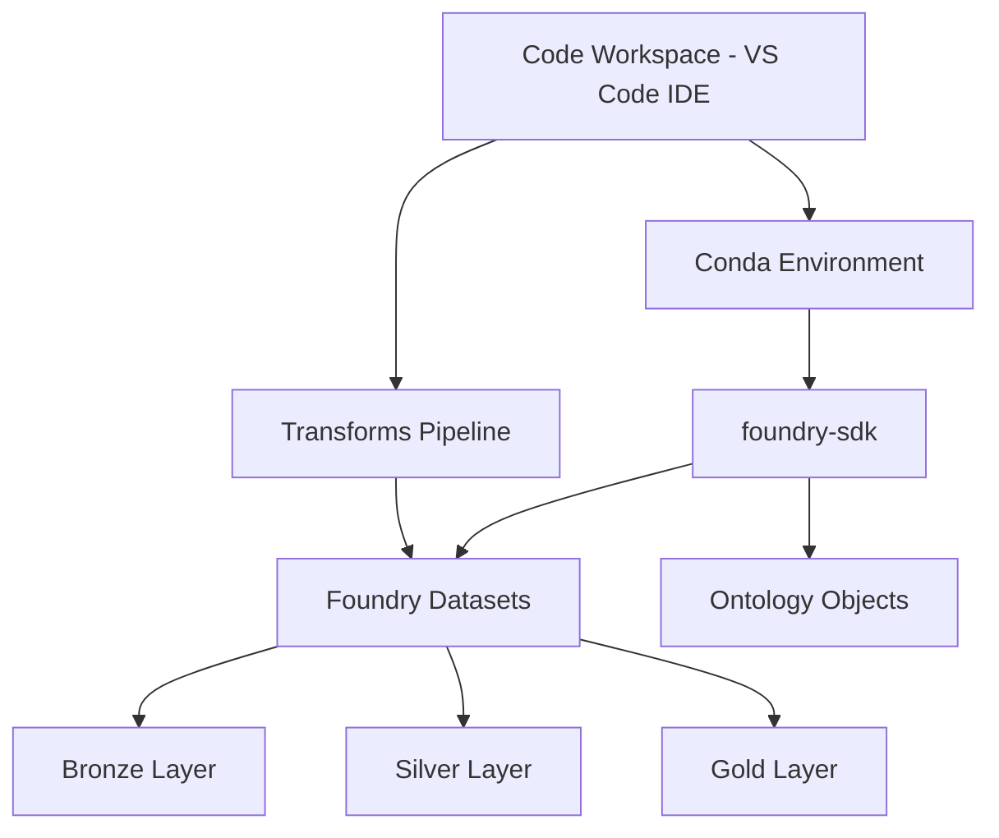
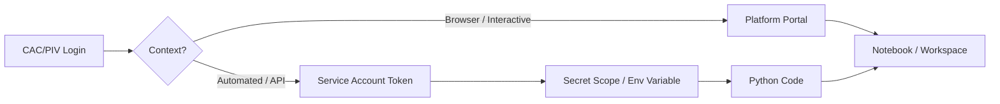

# Chapter 02: Python and R Foundations for Federal Platforms

Priya had been waiting three weeks to get her Python environment set up.

Not three weeks for IT to provision a machine — she'd had the laptop since week one. Three weeks to get approval for `pandas`, `scikit-learn`, and `matplotlib`. Three packages. The standard data science trifecta. The kind of thing a junior analyst in fintech installs in fifteen seconds with `pip install`. On the Navy Jupiter platform she'd been assigned to, package installation requests went through a software authorization request process reviewed by the platform security office. The queue was long. Nobody had told her that during onboarding.

She burned those weeks writing SQL queries by hand, exploring bronze-tier data in the Databricks notebook the platform team had provisioned for her, and reading documentation. Not the worst use of time, in retrospect — by the time her approved package list came back, she actually understood what the data looked like. But she also learned something nobody had written down anywhere: the rules governing your Python environment on a federal platform are not an inconvenience. They are the environment. Master them before you write your first model.

This chapter is about that mastery.

Every platform covered in this handbook — Advana, Databricks, Palantir Foundry, Qlik, and Navy Jupiter — runs Python. Most of them run R in at least some configuration. None of them run Python the way you're used to running it. The package list is curated. The network may be air-gapped. The authentication method assumes you have a CAC card. The virtual environment, if it exists at all, is managed by the platform, not by you. Understanding what you can and cannot do before you write your first line of code is the difference between a productive first week and a frustrating first month.

## What You'll Build

By the end of this chapter, you'll be able to:

- Authenticate to each of the five platforms using CAC/PIV credentials and understand what that means for automated workflows
- Set up Python working environments on Databricks, Palantir Foundry, and Advana/Jupiter with the packages available to you
- Use R in Databricks notebooks and Palantir Code Workspaces where the platform supports it
- Write platform-specific import patterns that work in air-gapped and restricted-network environments
- Build and manipulate the data structures that matter — pandas DataFrames, PySpark DataFrames, and numpy arrays — in the specific contexts where you'll actually use them
- Recognize and work around the most common environment constraints before they become blockers

---

## The Environment Is the Constraint

Most Python tutorials assume you control your environment. You choose the Python version, you install the packages you want, you decide whether to use conda or venv or pyenv. On a federal platform, that assumption breaks.

Here is how it actually works on each platform.

### Databricks on Advana and Jupiter

Databricks is the primary Python data science environment on both Advana and Navy Jupiter. When you open a Databricks notebook, you are running Python inside a managed cluster — a set of virtual machines provisioned by the platform with a specific Databricks Runtime version already installed.

The Databricks Runtime (DBR) matters. DBR 14.x ships with Python 3.10 and a pre-installed library list including `pandas`, `numpy`, `scikit-learn`, `matplotlib`, `seaborn`, `mlflow`, and PySpark. DBR ML variants (DBR 14.x ML) add `torch`, `tensorflow`, `xgboost`, `lightgbm`, and `huggingface_hub`. You do not install these — they are baked into the cluster image.

What you can additionally install depends on your platform configuration. On commercial Databricks, you can add packages from PyPI directly in a notebook with `%pip install package-name`. On government Databricks (AWS GovCloud, DoD IL5), the default configuration may block outbound PyPI requests entirely — the cluster has no path to the internet. In that configuration, your options are:

1. **Pre-approved cluster-level libraries:** Your platform team installs additional packages at the cluster level. You submit a request. You wait.
2. **Wheel files uploaded to DBFS:** You obtain a `.whl` file for the package, upload it to the Databricks File System (DBFS), and install it with `%pip install /dbfs/path/to/package.whl`. This requires getting the wheel file through your organization's software approval process first.
3. **Unity Catalog volumes:** On platforms using Unity Catalog (all Databricks accounts after December 2025), you can store wheel files in a Unity Catalog volume and reference them for installation.

The practical reality: plan your package list before you start a project, not during it. Know which packages come pre-installed on your DBR version and which you'll need to request.

> **Note:** Python linting and syntax highlighting in Databricks notebooks is configurable via `pyproject.toml`, a feature added to GovCloud in May 2025. If your workspace doesn't have this enabled, contact your platform administrator — it's a quality-of-life improvement worth pursuing.

### Palantir Foundry Code Workspaces

Palantir Foundry's primary Python environment is Code Workspaces — a VS Code-like browser IDE with integrated access to Foundry datasets, Ontology objects, and platform APIs. Code Workspaces run in containerized compute environments managed by Palantir.

The Python environment in Code Workspaces is managed through Conda environments stored in Foundry. Your team can create and share environment definitions. The key difference from Databricks: Palantir's government deployments may operate in environments where internet connectivity is restricted, but Foundry maintains its own internal package registry. The packages available depend on what your specific deployment includes.

R is available in Foundry. You can run R code in Code Workspaces and in Transforms (Foundry's data pipeline system). The `foundry` R package provides native access to Foundry datasets from R scripts. Python is more common in production Foundry workflows, but teams doing statistical analysis often prefer R and the platform supports it.

The Foundry SDK (`foundry-sdk` Python package) is the primary mechanism for interacting with platform data programmatically. It provides:
- Dataset read and write operations
- Ontology object access
- Branch and transaction management for versioned data



*Figure: Palantir Foundry Python environment structure. Code Workspaces access Foundry datasets through the SDK; Transforms pipelines write to versioned dataset layers.*

### Advana / Qlik Server-Side Extensions

Python on Advana's Qlik layer works through Server-Side Extensions (SSE) — a gRPC-based protocol that lets Qlik call an external Python process for computation. This is not a notebook environment. You are writing Python functions that Qlik calls during data load or chart rendering.

The SSE pattern is common on older Advana deployments and in organizations that built their analytics workflow around Qlik before Databricks was available. If you join a project running this way, you'll write Python scikit-learn or statsmodels code in a plugin that runs alongside the Qlik Sense server. The `qlik-py-tools` open-source package provides a ready-made SSE implementation with common ML algorithms already wired up.

This is not the primary way you'll write Python for data science on Advana anymore. Databricks handles the modeling side; Qlik handles the visualization. SSE is the connector between them when you need dynamic scoring inside a dashboard.

### Navy Jupiter

Jupiter is the DON subtenant of Advana, which means the same tool ecosystem applies: Databricks for Python data science, Qlik for visualization. The distinction is at the data layer, not the compute layer.

One Jupiter-specific consideration: the bronze/silver/gold data tiering affects how you write your code. Bronze-tier data is raw — expect nulls, duplicates, inconsistent formats, and columns whose meaning you'll need to verify with a data steward. Gold-tier data is authoritative and validated. The CNO's readiness dashboard runs on gold. Your exploratory analysis should run on silver. Your production model inputs should be validated against gold definitions before deployment.

Accessing Jupiter data through Databricks means working through Collibra (the data catalog) to find the right dataset paths, then reading them into your notebook environment. The catalog access requires CAC authentication — more on that below.

---

## CAC Authentication in Practice

The Common Access Card is not just a login mechanism. It shapes your entire workflow on these platforms.

Every platform covered in this handbook requires CAC or PIV authentication. For browser-based access — navigating to `advana.data.mil`, logging into a Databricks workspace, opening a Foundry environment — this is straightforward. You plug in your CAC reader, authenticate when prompted, and you're in.

The problem appears when you try to automate things.

Jupyter notebooks you run locally cannot reach `advana.data.mil` directly. Scheduled jobs and CI/CD pipelines cannot use your CAC. Any Python script that needs to call a platform API from outside the platform environment needs a different authentication path.

The standard approach across these platforms is **service account tokens** with limited-scope permissions:

- **Databricks:** Personal access tokens (PATs) stored as secrets in Databricks Secret Scopes. Your code references `dbutils.secrets.get(scope="my-scope", key="token")` rather than hardcoding credentials. On government Databricks, OAuth with single-use refresh tokens is available for applications requiring rotation-based credential security.
- **Palantir Foundry:** Foundry API tokens scoped to specific resources. The `foundry-sdk` accepts token authentication for non-interactive contexts.
- **Advana/Jupiter platform APIs:** DD Form 2875 (System Authorization Access Request) is required for initial account setup; service account tokens are managed through the platform's help desk process.

> **Sanity check:** Never hardcode a token or credential in a notebook or script that will be committed to Git. On platforms using GitLab for source control (Advana does), pre-commit hooks may catch this — or they may not. Don't find out the hard way. Use environment variables or secret management from day one.



*Figure: Authentication paths for interactive and automated workflows. Automated workflows cannot use CAC directly and require service account tokens stored in secret management.*

---

## Data Structures That Matter

You already know DataFrames and arrays. What you may not know is how they behave differently across these platforms, and which ones to reach for when.

### pandas DataFrames: The Workhorse, With Limits

pandas DataFrames are available on every platform that runs Python. They are the right choice for:
- Datasets that fit in memory (say, under 10 million rows before you start noticing pain)
- Exploratory analysis where you want rich indexing, groupby, and reshaping operations
- Integration with scikit-learn and statsmodels
- Prototype work before you scale to Spark

The memory limit is real. On Databricks, your driver node (the node running your Python process) has a fixed memory allocation. Load a 50-million-row procurement table into a pandas DataFrame on a standard cluster and you will kill your notebook session. The platform does not warn you before it happens.

```python
import pandas as pd

# Reading a manageable slice for exploratory work
# Always filter before you load — don't load then filter
df = spark.sql("""
    SELECT contract_id, vendor, obligation_amount, naics_code, period_of_performance_end
    FROM procurement.gold.contract_actions
    WHERE fiscal_year = 2024
      AND obligation_amount > 1000000
""").toPandas()

print(f"Rows: {len(df):,} | Memory: {df.memory_usage(deep=True).sum() / 1e6:.1f} MB")
```

That pattern — filter in SQL/Spark first, then convert to pandas with `.toPandas()` — is the right one on Databricks. Use Spark for the heavy lifting, land a manageable result set in pandas for the interactive analysis.

### PySpark DataFrames: When the Data Is Big

PySpark DataFrames are the native structure for Databricks. They are lazy — operations don't execute until you trigger an action (`.show()`, `.count()`, `.toPandas()`, writing to a table). The distributed compute engine handles datasets that would crash pandas without complaint.

On Advana and Jupiter, the data is often big. A table of all DoD contract actions for a fiscal year might have 15 million rows. A table of maintenance records for a surface fleet might have hundreds of millions of rows across years of history. These are Spark problems, not pandas problems.

```python
from pyspark.sql import SparkSession
from pyspark.sql import functions as F

spark = SparkSession.getActiveSession()

# PySpark DataFrame — lazy, distributed
maintenance_df = spark.table("jupiterdb.silver.maintenance_records")

# Filter and aggregate before bringing to driver
fleet_summary = (
    maintenance_df
    .filter(F.col("hull_class") == "DDG")
    .filter(F.col("work_order_year") >= 2022)
    .groupBy("ship_hull_number", "maintenance_category")
    .agg(
        F.count("work_order_id").alias("work_order_count"),
        F.sum("labor_hours").alias("total_labor_hours"),
        F.avg("days_to_complete").alias("avg_days_to_complete")
    )
    .orderBy("ship_hull_number")
)

# Only now does Spark execute — and only the filtered/aggregated result
fleet_summary.show(20)
```

The key mental shift: stop thinking "load data, then filter." Start thinking "filter first, then load." On Spark, the optimizer will push filters down into the storage layer — your query reads only the data it needs.

### numpy Arrays: For Math

numpy arrays are the substrate for numeric computation. scikit-learn expects them. PyTorch expects them. When you fit a model, you're usually converting from a DataFrame to a numpy array at the last step before training.

On these platforms, numpy is always available. The practical consideration is where in your pipeline you make the conversion — too early and you lose the indexing and metadata that DataFrames provide; too late and you're doing operations in pandas that would be faster in numpy.

```python
import numpy as np
from sklearn.preprocessing import StandardScaler

# Convert feature columns to numpy at the model boundary
feature_cols = ["obligation_amount", "vendor_age_days", "prior_award_count"]
X = df[feature_cols].to_numpy()  # shape: (n_samples, n_features)
y = df["award_exceeded_estimate"].to_numpy()  # shape: (n_samples,)

scaler = StandardScaler()
X_scaled = scaler.fit_transform(X)

print(f"Feature matrix shape: {X_scaled.shape}")
print(f"Mean per feature (should be ~0): {X_scaled.mean(axis=0).round(4)}")
```

---

## Platform-Specific SDKs and Libraries

Each platform exposes Python SDKs that data scientists need to know exist, even if they don't use them daily.

### The foundry-sdk (Palantir)

The Palantir Foundry SDK provides the primary programmatic interface to Foundry data from Python. In Code Workspaces, it's pre-installed. In Transforms (Foundry's pipeline system), it's the mechanism by which your transform function reads inputs and writes outputs.

```python
# Foundry Transform pattern — the function signature is fixed
# @transform_df is the primary decorator for DataFrame transforms
from transforms.api import transform_df, Input, Output

@transform_df(
    Output("/path/to/output/dataset"),
    raw=Input("/path/to/input/dataset"),
)
def compute(raw):
    # raw is a Spark DataFrame — standard PySpark operations apply
    return (
        raw
        .filter(raw["status"] != "CANCELLED")
        .withColumn("obligation_m", raw["obligation_amount"] / 1_000_000)
    )
```

The Foundry Transforms pattern is opinionated: inputs and outputs are declared as decorators, not passed as arguments you figure out at runtime. This makes the data lineage graph automatic — every transform's upstream dependencies are known to the platform and tracked in the data catalog.

### databricks-sdk (Databricks)

The `databricks-sdk` Python package provides a native Python client for Databricks REST APIs. It's useful when you need to automate workspace operations — creating jobs, managing secrets, triggering workflows — from outside a notebook.

```python
from databricks.sdk import WorkspaceClient

w = WorkspaceClient()  # Reads auth from environment or ~/.databrickscfg

# List running clusters
for cluster in w.clusters.list():
    if cluster.state.value == "RUNNING":
        print(f"{cluster.cluster_id}: {cluster.cluster_name} | DBR {cluster.spark_version}")
```

In a government Databricks environment, you'll typically use this for MLOps automation — triggering retraining jobs, promoting model versions in the registry, or querying job run history from a reporting dashboard.

### advana-sdk / Platform APIs

Advana does not have a publicly documented Python SDK in the same way Palantir and Databricks do. Access to Advana data from Python happens primarily through:

1. Databricks notebooks with direct table access (the primary path for data scientists)
2. SQL queries via JDBC/ODBC connectors to the Advana data warehouse
3. REST APIs for specific Advana applications (documented internally, access via platform help desk)

The practical implication: most Python code written for Advana data science runs inside the platform (in Databricks), not against it from outside.

---

## Jupyter vs. Platform-Native Notebooks vs. Code Repositories

You may be used to running Jupyter locally. That habit needs adjustment for these environments.

Local Jupyter notebooks are fine for personal analysis on data you've exported from a platform. They are not the right tool for working with platform data at scale, for collaborating with teammates on live data, or for building anything that needs to run in production.

Here is how the notebook and IDE options actually break down:

| Environment | Platform | When to Use |
|---|---|---|
| Databricks Notebooks | Databricks (Advana, Jupiter) | Interactive exploration, prototyping, initial EDA |
| Databricks Repos | Databricks (Advana, Jupiter) | Code that needs version control and peer review |
| Foundry Code Workspaces | Palantir | All Python/R development; VS Code experience |
| Foundry Transforms | Palantir | Production data pipelines |
| Qlik Data Load Editor | Qlik / Advana | Data model scripting and SSE integration |
| Local Jupyter | Any | Working with exported data; offline development |

Databricks Notebooks have real-time co-authoring — two analysts can work in the same notebook simultaneously, like Google Docs. This is genuinely useful for collaborative EDA sessions. But notebooks are not version-controlled by default. Anything you write that you want to keep should be committed to a Git repository through Databricks Repos.

Databricks Repos integrates with GitLab (the source control system Advana uses), GitHub, and Azure DevOps. The workflow: develop in a notebook, extract mature code into `.py` files in your repo, commit. The notebooks live alongside the `.py` files, but the logic you're proud of should be in source-controlled Python.

Palantir Code Workspaces flip this around — you start in a proper VS Code IDE. The experience is more like local development: you write `.py` files, use a terminal, manage a conda environment. The platform-specific part is that your code has direct access to Foundry datasets through the SDK, and your version control is Foundry's branching system (analogous to Git branches, but managed within Foundry).

---

## Working Within Platform Constraints

Here is where practitioners get burned most often.

### Approved Package Lists

Every government platform has some version of an approved software list. On Databricks AWS GovCloud (DoD), the Databricks Runtime pre-installed packages are your baseline. Adding packages requires either a cluster policy that allows PyPI access (rare in high-restriction environments) or going through an approval process.

Before you start a project, do this:

1. Spin up a notebook and run `%pip list` to see what's pre-installed
2. Compare against the packages you know you'll need
3. Submit requests early — not after you've already started prototyping

The packages that are almost always available on government Databricks (DBR 14.x): `pandas`, `numpy`, `scipy`, `scikit-learn`, `matplotlib`, `seaborn`, `statsmodels`, `mlflow`, `pyspark`, `pyarrow`, `delta-spark`, `requests`, `boto3`.

The packages you'll need to request or bring in: specialized NLP libraries (`spacy`, `transformers`), graph analytics (`networkx`, `stellargraph`), anything domain-specific, most third-party API clients.

### Air-Gapped Network Behavior

Some Advana and Jupiter environments operate in configurations where the compute environment has no outbound internet access. This affects more than package installation.

Any code that tries to reach the internet — fetching a dataset from a URL, downloading a pre-trained model, calling an external API — will fail silently or throw a connection timeout. Pre-trained model weights from HuggingFace Hub, for example, require an internet connection to download on first use. In an air-gapped environment, you'll need to download model weights separately, transfer them through your organization's approved data transfer process, and load them from local storage.

The `requests` library works fine for calling internal APIs within the platform network. External API calls need to go through your organization's approved proxy configuration — and many don't have one set up for data science workloads.

### Package Version Conflicts

Government platforms often run specific, locked versions of packages. A cluster running DBR 13.3 LTS (a long-term support release commonly deployed in government because it's stable and security-reviewed) ships with `scikit-learn 1.3.x` and `pandas 1.5.x`. If your code requires features from `scikit-learn 1.4` or `pandas 2.0`, you have a problem.

Write code that works with the versions available, not the latest. Test against the actual runtime version before you commit to an approach.

```python
# Always check your runtime versions before assuming feature availability
import sklearn
import pandas as pd
import numpy as np

print(f"scikit-learn: {sklearn.__version__}")
print(f"pandas: {pd.__version__}")
print(f"numpy: {np.__version__}")

# pandas 2.0 changed the default dtype for integer columns —
# code that relied on pandas 1.x behavior for NaN in integer columns may break
```

---

## Where This Goes Wrong

**Failure Mode 1: Writing Code Locally Then Porting to Platform**

**The mistake:** Building a data science workflow in a local Python environment with `pip install whatever-you-want`, then trying to port it to Advana or Databricks GovCloud.

**Why smart people make it:** Local development is faster. You can iterate without waiting for cluster startup. The data you're working with is a representative sample, so it seems fine. The mental model of "I'll clean it up when I move it to the platform" is seductive.

**How to recognize you're making it:**
- Your `requirements.txt` has 40+ packages, many of which you haven't checked against the platform's approved list
- You're using package features that require recent versions
- You have API calls to external services baked into your pipeline
- Your data loading code assumes a local file path

**What to do instead:** Do your development in a Databricks notebook from day one. Use the data that's actually on the platform. Accept the slower iteration pace. The code you write will actually work in production.

---

**Failure Mode 2: Misunderstanding the pandas / Spark Boundary**

**The mistake:** Loading an entire large table into pandas with `.toPandas()` at the beginning of your notebook, then doing all your work in pandas.

**Why smart people make it:** pandas is familiar. PySpark syntax is different. It's tempting to get to familiar ground as fast as possible.

**How to recognize you're making it:**
- Your notebook crashes with `OutOfMemory` errors on the driver
- The `.toPandas()` call takes ten minutes to run
- You're calling `.collect()` on a DataFrame with millions of rows
- Your first notebook cell is `df = spark.table("large_table").toPandas()`

**What to do instead:** Keep data in Spark DataFrames as long as possible. Push all filtering, aggregation, and joining to Spark before collecting results to the driver. Convert to pandas only for the final analysis or model-input-sized result sets.

---

**Failure Mode 3: Ignoring Data Tier (Bronze/Silver/Gold)**

**The mistake:** Building models or dashboards directly on bronze-tier data because it's the easiest to access and "good enough for a prototype."

**Why smart people make it:** Bronze data is available immediately. Getting access to gold-tier data requires working with data stewards and governance workflows. The prototype doesn't need to be perfect.

**How to recognize you're making it:**
- Your model performs well in dev but produces garbage recommendations in production
- You're handling the same data quality issues in multiple places instead of once at the pipeline layer
- Your outputs for the same question differ from the official dashboard because you're reading different data
- You're spending more time on data quality than on modeling

**What to do instead:** Treat the data tier as a contract. Use bronze for data discovery. Build your pipelines to write silver. Validate your model inputs against gold definitions before you declare anything ready for production use.

---

## Practical Takeaway: Platform Readiness Checklist

Before you write your first substantive notebook on any of these platforms, run through this checklist. It takes 30 minutes and saves days.

**Access verification:**
- [ ] Can you authenticate via CAC and reach the platform portal?
- [ ] Do you have a compute resource provisioned (cluster on Databricks, Code Workspace on Foundry)?
- [ ] Do you know your data path? (Which database/schema/catalog holds your domain's data)
- [ ] Do you have a service account token configured for any automated workflows?

**Environment baseline:**
- [ ] Have you run `%pip list` (Databricks) or checked your conda environment (Foundry) to know what's installed?
- [ ] Have you checked which packages you need that aren't pre-installed?
- [ ] Have you submitted package approval requests for anything missing?
- [ ] Have you verified the Python version and key package versions against your code?

**Data access:**
- [ ] Have you searched the data catalog (Collibra on Jupiter/Advana, Foundry data catalog on Palantir) for the datasets you need?
- [ ] Do you know what tier your primary data is (bronze/silver/gold on Jupiter; raw/structured/curated on Databricks)?
- [ ] Have you read a sample and checked schema, row counts, and null rates before writing any analysis?
- [ ] Do you know who the data steward is for your primary dataset if you need to ask questions?

**Version control:**
- [ ] Is your Databricks workspace connected to a Git repo?
- [ ] Have you configured your identity in git (`git config user.name`, `user.email`)?
- [ ] Do you have a `.gitignore` that excludes output files, model artifacts, and any data files?

---

## Platform Comparison

| Dimension | Advana (Databricks) | Palantir Foundry | Databricks Gov | Qlik (SSE) | Navy Jupiter (Databricks) |
|---|---|---|---|---|---|
| Primary Python environment | Databricks notebooks | Code Workspaces (VS Code) | Databricks notebooks | External Python process | Databricks notebooks |
| R support | Yes (DBR) | Yes (Foundry Transforms) | Yes (DBR) | Yes (SSE R plugin) | Yes (DBR) |
| Package management | Cluster libraries + wheel files | Conda environments | Cluster libraries + wheel files | Requirements for SSE process | Cluster libraries + wheel files |
| Air-gap risk | Medium-High (GovCloud) | Medium (deployment-dependent) | High (GovCloud DoD) | Low-Medium (on-prem) | Medium-High (GovCloud) |
| CAC auth | Required (portal) | Required (portal) | Required (portal) | N/A (Qlik handles auth) | Required (portal) |
| Automated auth | Service account token | Foundry API token | PAT / OAuth | Qlik service account | Service account token |
| Data structure | Delta tables (Unity Catalog) | Foundry datasets | Delta tables (Unity Catalog) | In-memory QIX model | Delta tables (Unity Catalog) |
| Version control | GitLab | Foundry branches | GitLab / GitHub | Limited | GitLab |
| Data governance | Unity Catalog + Collibra | Ontology + Foundry catalog | Unity Catalog | Qlik lineage | Collibra (Bronze/Silver/Gold) |
| IL5 support | Yes (Advana SIPR) | Yes | Yes | No (FedRAMP Moderate only) | Yes (SIPR/JWICS) |

---

## Putting It Together

Here is a realistic scenario: you're three days into a new Navy Jupiter contract and you need to build a prototype predictive maintenance model for DDG-class destroyer maintenance scheduling. Walk through how you'd actually start.

Day one: authenticate to `jupiter.data.mil` via CAC. Navigate to the Databricks workspace linked through Jupiter. Open the Collibra data catalog and search for "maintenance records" — find the silver-tier table `jupiterdb.silver.maintenance_work_orders` and bronze-tier `jupiterdb.bronze.ship_system_readings`. Note the data steward contact in the catalog entry.

Day two: open a new Databricks notebook. Run your package list check. Load a small sample from the silver maintenance table with Spark, convert to pandas, and look at it — schema, nulls, date ranges, key identifiers. Write notes directly in notebook markdown cells about what you see. Do not build anything yet.

Day three: submit your package request if you need anything beyond the standard runtime. Start the actual EDA. Use Spark for any query that touches more than a few million rows. Stay in Spark until you have a feature set small enough to fit in memory, then use pandas for correlation analysis and visualization.

```python
# Day 2 sample exploration pattern — always start here
from pyspark.sql import SparkSession
from pyspark.sql import functions as F
import pandas as pd

spark = SparkSession.getActiveSession()

# Sample first — never load the full table blind
sample = spark.table("jupiterdb.silver.maintenance_work_orders").sample(0.01, seed=42)

# Quick schema and quality check
print(f"Estimated full table size: ~{sample.count() * 100:,} rows")
print("\nSchema:")
sample.printSchema()

# Check for key quality indicators
print("\nNull rates (% missing) for key columns:")
null_rates = (
    sample.select([
        (F.sum(F.col(c).isNull().cast("int")) / F.count("*") * 100).alias(c)
        for c in sample.columns[:10]  # first 10 columns to start
    ])
    .toPandas()
    .T
    .rename(columns={0: "null_pct"})
    .sort_values("null_pct", ascending=False)
)
print(null_rates.round(1).to_string())
```

This pattern — authenticate, catalog, sample, assess quality, only then build — is the discipline that separates practitioners who ship things from practitioners who spend three weeks confused about why their model doesn't match the official dashboard.

---

## Exercises

See the [exercises/](./exercises/exercises.md) directory for hands-on problems and solutions.

---

## Chapter Close

**The one thing to remember:** Your Python environment on a federal platform is a constraint you manage, not a configuration you control — understand what's installed, what's approved, and what the data tiers mean before you write your first line of model code.

**What to do Monday morning:** Log into your assigned platform (Advana, Jupiter, or Foundry), open a new notebook or workspace, run a package inventory, sample a dataset from your domain's data catalog, and document the schema and quality characteristics. Don't build anything. Just observe. The next project will go faster for it.

**What comes next:** You have a Python environment and you understand how it behaves on each platform. Chapter 03 covers data acquisition — specifically, how to find government data, what the Collibra catalog actually tells you about a dataset, how to read from Delta tables and Foundry datasets efficiently, and what to do when the data you need doesn't exist yet in the catalog. The data access question is where most DoD data science projects stall. Chapter 03 explains why, and what you can do about it.
