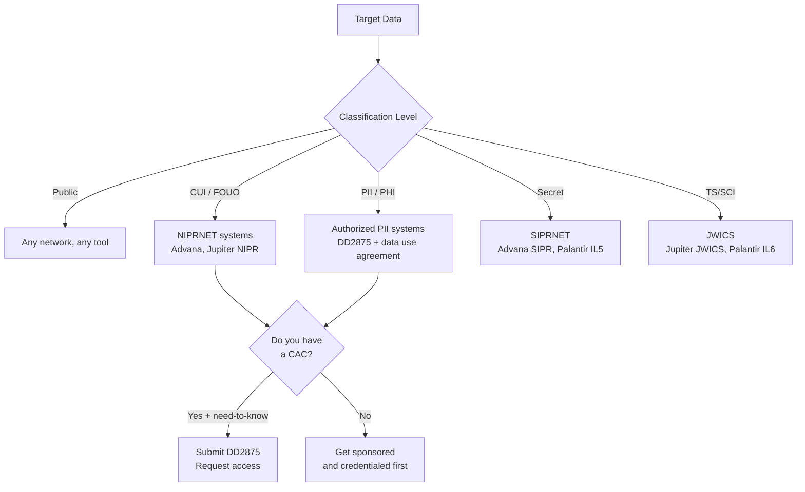

# Chapter 03: Data Acquisition and Government Data Sources

Priya had been on the contract for six weeks when she got the assignment: build a predictive model for ship maintenance intervals using historical maintenance records from the past five years. The program manager pointed at a SharePoint folder and said the data was "in there." He was not wrong, technically.

There were 847 Excel files. Each one had been built by a different command. Some used date formats like `14MAR2021`, others used `03/14/2021`, and at least one used a custom scheme that appeared to be Julian dates run through a transposition error. Two of the files were password-protected. Eleven had scanned tables embedded as images inside the spreadsheet. One was a Word document renamed with a `.xlsx` extension.

The model never got built. Not in those first six weeks, anyway.

This is where most government data science projects actually start. Not with a clean API call and a DataFrame that pops up in thirty seconds. With a pile of files, a SharePoint link, and the quiet realization that the first month of your timeline just evaporated.

Data acquisition in the federal government is not a solved problem. The data exists. Enormous quantities of it. FPDS has contract action records going back to 2004. USAspending.gov tracks every federal obligation down to the dollar. Census.gov publishes hundreds of datasets covering the entire American population. But getting from "the data exists" to "I have a clean, analyzable DataFrame" is the work this chapter is about.

## What You'll Build

By the end of this chapter, you will be able to:

- Connect to federal open data APIs (USAspending, data.gov, SAM, FPDS) and pull data programmatically
- Understand classification levels (CUI, FOUO, PII, PHI) and what that means for where your data can live and who can touch it
- Use the Advana data catalog and Jupiter data catalog to discover what data exists before starting a project
- Work with Palantir Foundry's Ontology to discover and access pre-integrated data objects
- Query datasets in Databricks Unity Catalog on government cloud environments
- Handle the actual file formats you'll encounter: legacy CSVs, FOIA PDFs, Excel nightmares, and fixed-width flat files
- Understand CAC-authenticated network access and how to connect to databases that live behind that wall

## The Data Classification Wall

Before you write a single line of code, you need to know what you can access.

Federal data exists on a classification continuum, and the tools you use, the networks you work on, and even where you can save intermediate files all depend on where your target data falls on that continuum. This is not an abstract policy concern. People have gotten their security clearances pulled for handling data at the wrong classification level on the wrong network.

Here is the practical breakdown:

**Publicly releasable data** — Published to data.gov, USAspending.gov, FedAPI.gov, or agency public websites. No login required. Accessible from any network. You can query these APIs from your personal laptop on home Wi-Fi without any security implications. Examples: federal spending records, contract awards, census data, public health statistics, FEC filings, federal register entries.

**Controlled Unclassified Information (CUI)** — Unclassified but requires protection. FOUO (For Official Use Only) is the legacy term; CUI replaced it via Executive Order 13556 (2010), though you will still see FOUO used interchangeably in DoD environments. CUI lives on NIPRNET-connected systems and requires a need-to-know and appropriate credentials. It cannot leave the network perimeter without authorization. Most Advana NIPR data is CUI. Personnel records, contract-sensitive procurement data, and some logistics records fall here.

**PII (Personally Identifiable Information)** — A CUI subset, but with specific legal handling requirements under the Privacy Act of 1974, FISMA, and agency-specific policies. PII includes name, SSN, date of birth, medical records, financial account numbers, and biometric data. Jupiter is explicitly approved for PII/PHI processing, meaning the platform has controls in place to handle it — but your specific workspace and notebook may not have been authorized. Check before you start writing PII to disk.

**PHI (Protected Health Information)** — Governed by HIPAA. DoD/VA health data, Tricare records, medical readiness data. Even more restricted than standard PII. Requires specific data use agreements and system authorizations.

**Secret / Top Secret** — Classified. SIPRNET (Secret) and JWICS (TS/SCI). Different physical machines, different networks, often different tools. Advana operates on SIPRNET as well as NIPRNET; Palantir Foundry/Gotham serves IL5 and IL6 workloads. The code patterns you use on the unclassified side generally translate — you are still writing Python — but the infrastructure is air-gapped or logically separated, and the access control process is entirely different.

> **Sanity check:** "Can I just copy this data to my personal Google Drive to work on it from home?" No. This seems obvious, but it happens. CUI and above cannot leave authorized systems. Even public data pulls from unclassified APIs should not be combined with CUI in uncontrolled environments. If you are not sure where a dataset sits on this spectrum, stop and ask your data owner or security officer before touching it.

The practical implication for your workflow: identify the classification level of your target data before you figure out which tools you will use. A model you want to build against Secret readiness data cannot be trained in a Databricks notebook on your personal AWS account. It has to run in an authorized environment — Advana's SIPR workspace, Palantir Foundry at IL5, or a classified enclave your customer manages.



*Figure: Data classification drives tool selection. Determine where your data lives before choosing your access method.*

## Federal Open Data: Where to Start Without a CAC

The public-facing federal data ecosystem is larger than most data scientists realize, and it is free, unclassified, and accessible today.

### USAspending.gov

USAspending is the authoritative public source for federal spending data, mandated by the Digital Accountability and Transparency Act (DATA Act) of 2014. Every federal contract action, grant award, loan, and direct payment flows into this system. As of FY2025, it covers approximately $6.7 trillion in annual federal spending across more than 200 agencies.

The API is RESTful, requires no authentication for public data, and returns JSON. Rate limits are generous — 1,000 requests per hour for unauthenticated users. The most useful endpoints for procurement analytics:

- `/api/v2/spending_by_category/` — aggregate spending by awarding agency, recipient, NAICS code, or PSC
- `/api/v2/search/spending_by_award/` — award-level search with filtering
- `/api/v2/awards/{award_id}/` — full detail on a specific contract or grant
- `/api/v2/download/awards/` — bulk file downloads for large queries

The data quality is imperfect. Vendor names are frequently inconsistent (you will find "BOOZ ALLEN HAMILTON INC", "Booz Allen Hamilton", and "BOOZ ALLEN & HAMILTON" as separate entities in the same dataset). NAICS codes are self-reported and occasionally wrong. Dollar amounts are accurate, but they represent obligated amounts, not disbursed amounts — a distinction that matters if you are tracking actual payments rather than contract ceiling.

### FPDS-NG (Federal Procurement Data System)

FPDS is the source system that feeds USAspending on the contract side. It is older, has a more granular data model, and has records back to 2004. The ATOM feed API returns XML and is rate-limited more aggressively. Most analysts use the USAspending API as their entry point, but if you need fields that USAspending does not expose (certain legacy award types, specific IDV hierarchy data), FPDS is the fallback.

FPDS also has a legacy web interface at fpds.gov that supports manual queries — useful when you want to verify a specific award before committing to a bulk pull.

### SAM.gov

The System for Award Management is the federal vendor registry. Every company that wants to do business with the federal government must register in SAM. The public API exposes entity registration data, exclusions (companies and individuals banned from receiving federal awards), and opportunity data for active solicitations.

The SAM API requires registration for an API key, but registration is free and takes minutes. Rate limit for registered users is 10 requests per second with a daily cap of 10,000 requests. The entity data is useful for enriching procurement datasets with vendor information — CAGE codes, business size designations, socioeconomic status (8(a), SDVOSB, WOSB), and primary NAICS.

### data.gov and Federal Data Catalogs

data.gov is the central catalog for federal open datasets — approximately 300,000 datasets as of 2025, spanning every cabinet agency and many independent agencies. The catalog uses the DCAT-US (Data Catalog Vocabulary) metadata standard, which means datasets are machine-discoverable.

The data.gov API allows you to search the catalog programmatically, retrieve dataset metadata, and access download links. The data itself lives on agency websites or other endpoints. Data quality varies enormously: some datasets are well-maintained with regular updates; others were published in 2012 and never touched since.

### Census.gov APIs

The Census Bureau runs one of the most developer-friendly open data operations in the federal government. The API at api.census.gov supports the American Community Survey (ACS), Decennial Census, Economic Census, Population Estimates, and dozens of other surveys.

Every call requires a free API key. The response format is JSON with a header row followed by data rows — not standard JSON objects — which catches most new users.

> **Note:** Census data has geography encoded as FIPS codes: state (2-digit), county (3-digit), census tract (6-digit), block group (1-digit). A full FIPS code like `24003700102` breaks down as Maryland (24) + Anne Arundel County (003) + tract 700102. When joining Census data to other datasets, you will almost always need to handle FIPS codes as strings, not integers — leading zeros matter and will get silently dropped if you cast to int.

## Working with Government APIs: Practical Patterns

The mechanics of federal APIs share common patterns regardless of the source. Authentication, pagination, and rate limiting all follow predictable shapes.

### Authentication Patterns

Most federal public APIs use one of three authentication schemes:

**API Key in header or query parameter** — Most common. Register once, get a key, pass it with every request. SAM.gov, Census.gov, and data.gov all use this pattern.

**OAuth 2.0** — Less common in the older federal API ecosystem, more common in newer ones and in agency-specific systems. USDS and 18F-built APIs tend toward OAuth.

**CAC/PKI-based authentication** — For internal government systems and sensitive data sources. Your Common Access Card holds an X.509 certificate. Systems authenticate against that certificate rather than a username/password. From a code perspective, this means your HTTP client needs to present the client certificate on every request. More on this below.

USAspending.gov has no authentication at all for public data, which is the exception rather than the rule.

### Pagination

Every federal API that returns more than a few hundred records uses pagination. The two patterns you will encounter:

**Offset/limit pagination** — Standard page-based. Pass `page=1&limit=100`, increment the page number, stop when you get fewer records than the limit. USAspending uses this.

**Cursor/token pagination** — Better for large or changing datasets. The response includes a cursor or next-page token you pass in the next request. Less common in older federal systems.

Always check the response metadata for total record counts before deciding whether to paginate in a loop or use the bulk download endpoint. Pulling 50,000 records one page at a time when a bulk download of the same dataset is available at a single endpoint is a waste of API quota and your time.

### Rate Limiting and Backoff

Federal APIs are typically more conservative with rate limits than commercial APIs. The standard pattern for production-grade API clients: exponential backoff with jitter on HTTP 429 (Too Many Requests) responses.

```python
# See code-examples/python/01_api_connections.py for full implementation
```

## Government Data Catalogs: Knowing What Exists

The biggest bottleneck in government data science projects is not access. It is discovery. Personnel rotate every 18–24 months. Documentation is sparse. The analyst who knew where the maintenance records were has rotated to a new duty station.

Platform data catalogs exist to solve this. All five major platforms have catalog capabilities, though they differ in implementation.

### Advana / Jupiter: Collibra-based Catalog

Both Advana and Jupiter use Collibra as their data governance and catalog layer. Collibra stores dataset metadata: source system, data steward, data domain, classification level, update frequency, and access requirements. It also tracks data lineage — where a dataset came from, what transformations it went through, who has accessed it.

When you get access to Jupiter or Advana for the first time, before touching any tool, go to the Collibra catalog. Search for datasets related to your mission area. You will find datasets you did not know existed, and you will learn which datasets require additional access requests before you can query them.

Jupiter's catalog covers Navy-specific data assets across warfighting, business, and readiness domains. The search interface is keyword-based; you can filter by data domain (logistics, finance, personnel, etc.) and by classification level.

The CNO Executive Metrics Dashboard — built by Naval Information Warfare Center Atlantic in January 2025 and used in Pentagon briefings — pulls exclusively from Gold-tier Jupiter data. The Gold tier designation means the data has been validated, has an assigned steward, and carries an SLA for update frequency. That distinction matters when you are building something that will go into a flag-level briefing versus something exploratory.

### Palantir Foundry: Ontology-Based Discovery

Foundry's data discovery works differently from a traditional catalog. The **Ontology** is the primary interface.

When you open Foundry's Object Explorer, you are browsing a semantic model of your organization's data — not raw tables, but typed objects with properties and relationships. An object type called "Maintenance Work Order" has properties like `wo_number`, `system_code`, `due_date`, `status`, and links to related object types like "Aircraft" and "Technician."

This matters for acquisition because you are not hunting for a table named `maint_wo_fy2024_final_v3.csv`. You are searching for "Maintenance Work Order" as a concept. When you find it, Foundry shows you the properties available, the access requirements, the owning team, and how to query it. It also shows you what other object types it links to, which leads you organically to related datasets you might need.

The tradeoff: Foundry's catalog only surfaces data that has been ingested and modeled into the Ontology. Data that lives in a SharePoint folder or a legacy SFTP server that nobody has connected to Foundry is invisible. Coverage is excellent for data the platform team has prioritized and poor for ad hoc files that have not been integrated.

### Databricks Unity Catalog

Unity Catalog is Databricks' governance and discoverability layer, and as of December 2025, all new Databricks accounts exclusively use it. The hierarchy is: **Catalog → Schema → Table/View/Volume/Function/Model**.

In a government Databricks environment, catalogs typically correspond to organizational units or data domains: `navy_logistics`, `finance_audit`, `personnel_readiness`. Within a catalog, schemas correspond to data sources or time periods, and tables correspond to individual datasets.

Discovery in Unity Catalog is through the catalog explorer UI or via SQL:

```sql
SHOW CATALOGS;
SHOW SCHEMAS IN navy_logistics;
SHOW TABLES IN navy_logistics.maintenance;
DESCRIBE TABLE navy_logistics.maintenance.work_orders;
```

Unity Catalog also supports column-level comments and table-level tags, so well-maintained catalogs include field descriptions, data owner contacts, and classification markings directly in the metadata. The `information_schema` views expose all of this programmatically.

```python
# Query Unity Catalog metadata programmatically
from pyspark.sql import SparkSession

spark = SparkSession.builder.getOrCreate()

# List all tables in a schema you have access to
tables = spark.sql("SHOW TABLES IN navy_logistics.maintenance")
tables.show()

# Get column details for a specific table
schema_info = spark.sql("DESCRIBE TABLE EXTENDED navy_logistics.maintenance.work_orders")
schema_info.show(truncate=False)
```

## CAC-Authenticated Systems and Network Access

Here is the friction point nobody warns you about in your first week: the data you actually need is almost never accessible from the public internet.

The Advana portal lives at `advana.data.mil`. Jupiter is at `jupiter.data.mil`. These are `.mil` addresses on NIPRNET. To get there, you need a physical Common Access Card inserted in a reader connected to a machine that is either physically on a government network or connected through a VPN with CAC authentication.

### CAC Authentication in Code

When you are writing scripts that connect to internal government APIs or databases, you need to present your CAC certificate as the authentication credential. This is done via mutual TLS (mTLS) — your HTTP client presents a client certificate alongside the standard server certificate exchange.

The practical workflow:

1. Export your CAC certificate to a PEM file using the appropriate middleware (ActivClient on Windows, OpenSC on Linux/Mac, or the CAC middleware your organization has authorized)
2. Store the certificate and private key where your script can find them — typically in a secure location that is NOT your code repository
3. Pass the cert/key pair to your HTTP client

```python
import requests

# CAC-authenticated API call
# cert is a tuple of (certificate_path, private_key_path)
response = requests.get(
    "https://some-internal-api.mil/data/endpoint",
    cert=("/path/to/cac_cert.pem", "/path/to/cac_key.pem"),
    verify="/path/to/dod_root_ca.pem"  # DoD PKI root cert bundle
)
```

> **Note:** The DoD PKI root CA bundle is not included in standard operating system certificate stores. Government systems reject connections that use the default commercial CA bundle. You need to download the DoD PKI CAs from `public.cyber.mil/pki-pke/` and install them — or pass the path to the DoD CA bundle explicitly in your HTTP client calls. This is the source of approximately 30% of the "SSL certificate errors" that new contractors encounter on their first day.

For database connections behind the CAC wall, you are typically not using certificate auth directly. Instead, the network itself provides the security boundary: you are on NIPRNET (physical connection or VPN), so your database connection uses standard credentials but the network access itself requires the CAC. PostgreSQL connections from Databricks notebooks to an internal database, for example, use a service account username/password stored in Databricks secrets — the CAC requirement is satisfied by how you got onto the network in the first place.

### Connecting to Databases on Classified Networks

The pattern for database connections on government networks follows standard Python database drivers, but with important differences in where credentials live and how connections are secured.

Databricks secrets are the standard mechanism for credential management in a Databricks-on-government-cloud environment. Never hardcode credentials in a notebook.

```python
# Retrieve credentials from Databricks secrets (not hardcoded)
username = dbutils.secrets.get(scope="db_connections", key="oracle_username")
password = dbutils.secrets.get(scope="db_connections", key="oracle_password")
jdbc_url = dbutils.secrets.get(scope="db_connections", key="oracle_jdbc_url")

df = spark.read.format("jdbc") \
    .option("url", jdbc_url) \
    .option("dbtable", "schema.table_name") \
    .option("user", username) \
    .option("password", password) \
    .option("driver", "oracle.jdbc.OracleDriver") \
    .load()
```

The same pattern applies to Snowflake, PostgreSQL, SQL Server, and other databases common in government environments. The key point: credentials go in a secrets manager. Your notebook contains only the scope and key names.

## Working with Messy Government File Formats

This section is the one you will return to most often.

Government data has not uniformly modernized to clean REST APIs with JSON responses. You will encounter formats that feel like archaeology. Here is what to expect and how to handle it.

### The Legacy CSV

Not all CSVs are created equal. Government legacy CSVs often have:

- **Non-standard delimiters** — pipe-delimited (`|`) or tilde-delimited (`~`) are common in FPDS and some DoD financial system exports
- **Fixed-width fields without headers** — ERP system extracts where you need a data dictionary to know what columns 1-15 mean
- **Mixed encoding** — files created on Windows systems in Latin-1 or CP1252 encoding, not UTF-8; the default `pd.read_csv()` will throw a `UnicodeDecodeError` or, worse, silently misread characters
- **Multi-line header rows** — some DON financial system exports have two or three header rows before the actual data starts
- **Inconsistent null representation** — `NULL`, `N/A`, `#N/A`, `None`, `none`, `""`, `-`, and actual blank cells all meaning "no value"

```python
# Defensive CSV read for government data
import pandas as pd

df = pd.read_csv(
    "dod_financial_extract.csv",
    encoding="latin-1",          # Common for older Windows-generated files
    sep="|",                      # Common in FPDS and DoD financial exports
    skiprows=2,                   # Skip multi-row headers
    na_values=["NULL", "N/A", "#N/A", "None", "none", "-", ""],
    dtype=str,                    # Read everything as string first; cast later
    low_memory=False
)

# Cast types explicitly after inspecting data
df["obligation_amount"] = pd.to_numeric(df["obligation_amount"], errors="coerce")
df["award_date"] = pd.to_datetime(df["award_date"], format="%Y%m%d", errors="coerce")
```

### FOIA Responses

Freedom of Information Act requests return data in whatever format the agency stores it. This means you might get:

- PDFs of printed tables (often requiring OCR)
- Scanned images embedded in PDFs
- Excel files with merged cells, colored headers, and manual annotations in random columns
- Access databases (`.mdb` / `.accdb`) that require either a Windows machine or `mdbtools` on Linux
- Zip files containing thousands of individual text files, one per record

For PDF extraction, `pdfplumber` handles most machine-generated PDFs with tables. For scanned documents requiring OCR, `pytesseract` wraps Tesseract and handles most English-language documents acceptably, though accuracy on financial tables with small fonts is often 85–95%, not 100%.

> **Sanity check:** Before spending a week writing a PDF parser, check whether the underlying data is available through a structured channel. The agency almost certainly maintains the data in a database somewhere. FOIA requests often return printed exports of that database. If you can identify the source system, it may be faster to request direct data access than to parse PDFs.

### Portable Fixed-Width Files

A subset of legacy government systems exports data in fixed-width format — no delimiter, just positional columns defined in a companion data dictionary. The DCPS (Defense Civilian Personnel System) payroll extracts and some legacy Navy supply chain files use this format.

```python
import pandas as pd

# Fixed-width file with positions from data dictionary
colspecs = [
    (0, 9),    # SSN (masked in this example)
    (9, 19),   # Employee ID
    (19, 49),  # Last Name
    (49, 79),  # First Name
    (79, 87),  # Pay Period End Date (YYYYMMDD)
    (87, 97),  # Gross Pay (right-justified, 10 chars with 2 decimal places)
]

col_names = ["ssn_masked", "employee_id", "last_name", "first_name",
             "pay_period_end", "gross_pay_str"]

df = pd.read_fwf(
    "payroll_extract.txt",
    colspecs=colspecs,
    names=col_names,
    encoding="latin-1"
)
```

## Platform Spotlight: Advana Data Catalog

Advana's data catalog, built on Collibra, covers 400+ connected Pentagon business systems and 3,000+ NIPR data sources. For a data scientist starting a new project, the catalog workflow should be:

1. Open the Collibra interface within Advana
2. Search by mission domain (logistics, finance, personnel, etc.) or by system name if you know the source
3. Review the dataset's classification level, data steward contact, update frequency, and access requirements
4. If you need access, submit a Help Desk ticket with the specific dataset or schema name — this is faster than generic access requests
5. Once access is granted, the dataset appears in your Databricks workspace or Qlik environment depending on what the data steward has configured

The Collibra catalog also shows lineage: you can trace a field in a Gold-tier Advana table back through Silver and Bronze tiers to the source system extract. This is valuable when data looks wrong — you can identify exactly where in the pipeline a transformation introduced the issue.

Advana is currently restructuring into three components under the January 2026 Hegseth memo: the War Data Platform (WDP) for AI applications, a financial management track for audit readiness, and a WDP Application Services track for non-audit applications. If you are starting a new project in early 2026, confirm with your program office which Advana track hosts the data you need. The organizational restructuring has not changed data access procedures, but it has changed who to call when something breaks.

## Platform Spotlight: Navy Jupiter Data Sources

Jupiter, the DON subtenant of Advana, organizes data into three tiers: Bronze (raw), Silver (cleaned), and Gold (validated and authoritative). This is documented and enforced — you can see the tier designation in the catalog.

The practical implication: if you are building something for operational use (a dashboard the Commander will brief from, a model that drives a resource decision), you should be querying Gold-tier data. If you are doing exploratory analysis or building a prototype, Silver is usually sufficient. Bronze is for debugging and for cases where you suspect a Silver-tier transformation introduced an error.

Jupiter runs on NIPRNET, SIPRNET, and JWICS. Access requires a valid CAC/PIV and a standard baseline access policy — any DON military, civilian, or sponsored contractor with a CAC can access Jupiter baseline. More sensitive data spaces require additional permissions obtained through the data steward.

For SQL queries against Jupiter data, the primary interface is iQuery — a DON-specific query tool — alongside standard SQL in Databricks notebooks. The data model is documented in the Jupiter Collibra catalog, which is the first place to look when you are trying to understand the schema of a dataset you have never touched.

## Where This Goes Wrong

**Failure Mode 1: Treating the Catalog as Optional**

**The mistake:** Skipping the data catalog and going directly to querying tables or pulling files, using institutional knowledge passed down from another analyst.

**Why smart people make it:** Catalogs feel bureaucratic. It seems faster to just ask the person who knows where the data lives. And the first time, it usually is faster.

**How to recognize you're making it:**
- You are querying a table with no idea who maintains it
- You do not know the last time the table was updated
- You cannot explain the lineage of a field you are using in a model
- A data quality issue surfaces three months later and you spend a week tracing it back manually
- You discovered an important dataset by accident six weeks into a project

**What to do instead:** Spend thirty minutes in Collibra or Unity Catalog at the start of every project. It saves days later.

---

**Failure Mode 2: Ignoring Data Classification Until It Is a Problem**

**The mistake:** Starting a project, pulling data, doing analysis, and then discovering that some of the data is CUI or PII and now the notebooks, output files, and intermediate datasets are sitting in unauthorized locations.

**Why smart people make it:** The classification marking is in a metadata field that does not surface when you are just reading a CSV. Nobody mentions it in the initial meeting. The data looks innocuous — rows of dates and numbers, no obvious PII.

**How to recognize you're making it:**
- Your analysis environment is a personal laptop or an unaccredited cloud account
- You have not asked your data owner for a data classification determination
- The source system is a personnel or health system, but you assumed the extract was de-identified

**What to do instead:** Before touching a new dataset, ask the data owner: "What is the classification level, does this contain PII or PHI, and what is the authorized processing environment?" Three questions, one email, fifteen minutes. Doing this after the fact is much harder.

---

**Failure Mode 3: Pagination Without a Record Count Check**

**The mistake:** Writing an API loop that fetches pages until it runs out of results, without first checking the total record count and deciding on the right strategy.

**Why smart people make it:** Pagination loops are simple to write. You copy one from a previous project. It usually works.

**How to recognize you're making it:**
- You spend 45 minutes pulling 50,000 records one page at a time, burning your daily API quota
- Your script fails silently on page 847 because the API returned an empty page for a transient reason, and you have no retry logic
- The pull that should take 5 minutes takes 3 hours

**What to do instead:** Check the `total_records` or `count` field in the first response. If it is over ~10,000, look for a bulk download endpoint. USAspending has download endpoints that return gzipped CSV files — a 100,000-record dataset downloads as a single file in under 30 seconds versus 100 API pages.

## Practical Takeaway: The Data Acquisition Checklist

Use this before starting data access work on any new government data project. It takes ten minutes and prevents most first-month problems.

**Step 1: Classification check**
- What classification level is the target data?
- Does it contain PII, PHI, or other regulated information categories?
- What is the authorized processing environment for this data?

**Step 2: Catalog check**
- Is this data in a managed catalog (Collibra, Unity Catalog, Foundry Ontology)?
- Who is the data steward and how do you reach them?
- What is the last update date and update frequency?
- What access request process is required?

**Step 3: Format assessment**
- Is the data accessible via API, direct database query, or file extract?
- If file extract: what format, encoding, and delimiter?
- Are there data dictionaries for fixed-width or legacy formats?

**Step 4: Volume and rate limit check**
- How many records are you expecting to pull?
- What are the API rate limits?
- Is there a bulk download option for large datasets?

**Step 5: Network access check**
- Can you access this data from your current machine and network?
- Do you need a CAC connection or VPN?
- Do you have the DoD PKI CA bundle if you are making HTTPS calls to .mil endpoints?

## Putting It Together

You are three weeks into a Navy supply chain contract. Your goal: build a model to predict spare parts shortfalls before they halt ship maintenance. The program manager says "use whatever data you need."

Here is the actual first week of work:

**Day 1:** Open Jupiter's Collibra catalog. Search for "maintenance work orders" and "parts requisitions." Find five relevant datasets. Two are Gold-tier with data stewards listed. Two are Silver-tier, pending Gold validation. One is Bronze-only — still raw from the source system. Contact the data steward for the Gold-tier datasets and submit access requests.

**Day 2–3:** While waiting for access approval, use the public FPDS and USAspending APIs to pull contract data for relevant spare parts vendors (see `code-examples/python/01_api_connections.py`). This does not require a CAC and gives you a view of historical procurement patterns that will complement the internal maintenance data.

**Day 4:** Access approved. Open Databricks notebook within Jupiter's analytics environment. Query the Gold-tier maintenance work order table. Run initial descriptive statistics. Discover immediately that work orders before FY2020 have a different status code schema — the catalog entry mentioned this but you confirmed it by looking. Identify the mapping table that resolves it.

**Day 5:** Pull the Gold-tier parts requisition data. Join to maintenance work orders on `work_order_id`. Export a sample to verify the join is correct. It is not — there is a leading-zero inconsistency in the work order ID formatting across the two tables. Fix it. Now you have a working dataset.

This is not a fast process. But it is the process. Every shortcut in week one costs you three days in week three.

## Platform Comparison

| Capability | Advana | Navy Jupiter | Databricks (Unity Catalog) | Palantir Foundry | Qlik (via Advana) |
|---|---|---|---|---|---|
| Data catalog | Collibra | Collibra | Unity Catalog | Ontology | Limited |
| Discovery interface | Web UI | Web UI + iQuery | UI + SQL | Object Explorer | N/A |
| Classification levels | IL4 (NIPR), IL5 (SIPR) | NIPR, SIPR, JWICS | IL4, IL5 (GovCloud) | IL4, IL5, IL6 | IL4 |
| PII/PHI approved | Yes | Yes | Yes (with controls) | Yes | Limited |
| API access | CAC-authenticated | CAC-authenticated | SDK / REST API | REST + OSDK | N/A |
| Bulk data export | Via Databricks | Via Databricks | Delta Lake / Delta Sharing | Pipeline Builder | QVD files |
| Primary query language | SQL, PySpark | SQL, iQuery | SQL, PySpark | Object query API | QlikScript |

## Exercises

See [exercises/exercises.md](exercises/exercises.md) for hands-on practice.

## What's Next

You have the data. Now comes the part that takes three times longer than anyone budgets: cleaning it. Chapter 04 covers the mechanics of data wrangling in government environments — specifically the data quality issues endemic to DoD source systems, how to handle schema mismatches when joining across systems that never talked to each other, and how to build cleaning pipelines that are reproducible when the same extract arrives six months later with slightly different formatting.

---

**The one thing to remember:** Every government data project starts with a discovery phase, not a coding phase. Know what data exists, where it lives, who owns it, and what classification level it carries before you write a single line of code. The catalog is not bureaucracy. It is your map.

**What to do Monday morning:** Open the Collibra data catalog for your platform (Advana, Jupiter, or your agency equivalent). Search for three datasets you have used or plan to use in an active project. For each one, verify: the data steward contact, the last update date, and the classification level. If any of this information is missing from the catalog, email the data steward and ask. You will find out something useful in at least two of the three.

**What comes next:** With your data sources identified and access established, the next challenge is shape. Government data arrives in multiple incompatible schemas, with inconsistent field naming, duplicate records from system migrations, and date fields in four different formats within a single table. Chapter 04 addresses this directly — how to build cleaning pipelines that survive the real-world messiness of DoD source systems and produce datasets you can actually model against.
