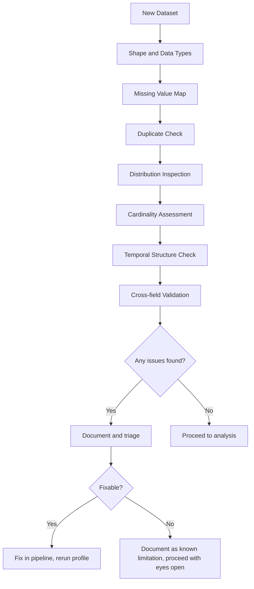

# Chapter 05: Exploratory Data Analysis

The dataset landed in Priya Sharma's inbox on a Tuesday morning with a subject line that said "FY2022-2024 maintenance records — please analyze for anomalies." There was no data dictionary. There was no steward contact. There was a 40-million-row Parquet file in an S3 bucket she had read access to, and a meeting with the program manager scheduled for Friday.

She had done EDA before. But she had done it on clean Kaggle datasets where someone had already decided what the columns meant. This was different. The column named `MAINT_CODE` had 847 unique values. The column named `DAYS_ELAPSED` had a minimum value of -14. The column named `UNIT_ID` mapped to approximately 2,400 distinct unit identifiers, none of which matched the unit roster she had been given separately.

By Wednesday afternoon she had her first real finding: 11% of records had timestamps that were chronologically impossible — completion dates that preceded start dates. The program manager had not asked her to find this. The anomaly model he wanted would have trained on it without noticing.

That is what EDA actually is in federal data science: the work you do before you trust anything.

*Note: Priya is a composite character representing common patterns in DoD data science engagements. No single individual is depicted.*

## What You'll Build

By the end of this chapter, you will be able to:

- Profile any government dataset systematically — distributions, nulls, duplicates, data types, cardinality, temporal patterns — before writing a single model
- Detect and characterize government-specific data patterns: fiscal year seasonality, procurement award cycles, military unit identifier schemes
- Run EDA at scale using PySpark on Databricks when pandas cannot handle the row count
- Use Qlik's associative engine for interactive hypothesis testing that is faster than writing a new query for every question
- Produce EDA outputs that satisfy a data steward's quality review, not just your own curiosity
- Identify the difference between a data quality problem (fix it) and a real signal (model it)

## The Purpose of EDA in Government Data

Here is the pattern that burns teams in commercial data science and then burns them again in federal work, but worse: they skip EDA because they are under timeline pressure, they build a model, the model produces results that look plausible, and six months later someone finds out the model was trained on bad data.

In a startup, the cost of that failure is a bad product feature. In a DoD context, the cost might be a readiness report that misinforms a fleet commander, a procurement anomaly detector that flags the wrong vendors, or a logistics model that gave confidence to a supply chain decision that should not have been made.

EDA is not optional. It is the professional standard of care for any data science work that influences a decision.

The government data environment makes this harder in specific ways, and easier in one specific way. Harder: government data often has no documentation, has been generated by source systems that were never designed for analytics, and reflects decades of process changes that show up as encoding inconsistencies. Easier: most government data is about real physical things — ships, people, contracts, aircraft — and those physical realities constrain what values are possible. A ship cannot have a maintenance event before it was commissioned. A contract cannot be awarded for a negative dollar amount. These physical constraints are your best friends for catching bad data.

## Statistical Profiling: What to Run Before Anything Else

The first thirty minutes of any government dataset analysis should produce the same set of outputs, regardless of what the data is about. Call this your standard profile. If you skip any of it, you are making assumptions that will eventually cost you.

*Figure: Standard EDA profiling sequence for government datasets. Every step generates findings that either go into your model card or back into the data pipeline.*

### Shape and Data Types

Row count, column count, and data type inference. This seems trivial but is not. Government data frequently has columns that are typed as strings but contain numeric values with leading zeros that cannot be dropped (ZIP codes, unit identifiers, DODAAC codes), date fields stored as integers (YYYYMMDD format is common in DoD ERP exports), and boolean fields stored as "Y"/"N" or "1"/"0" with no documentation.

The code examples in `01_statistical_profiling.py` cover all of this. The point here is the discipline: run it first, every time, before you look at anything else.

### Missing Values: The Map Matters More Than the Count

The percentage of null values per column tells you less than the pattern of nulls. A column that is 5% null is fine if the nulls are randomly distributed. It is a serious problem if the nulls cluster — if, for example, `COMPLETION_DATE` is null for exactly 100% of records from one source system, or for all records prior to FY2019.

Clustered nulls tell you something about the data collection process. Non-clustered nulls are often ignorable or imputatable. You cannot distinguish these cases from a single percentage.

The right approach is a null pattern analysis: group the data by source system, by fiscal year, by unit identifier, and check null rates within groups. If they are uniform, fine. If one group is systematically more null than others, that is your finding.

### Duplicate Detection in DoD Data

DoD data is reliably duplicated because source systems retry on failure without deduplicating on success. The Army GFEBS system, the Navy SAMS-E maintenance system, and multiple logistics ERPs all have documented retry behavior that produces duplicate records.

Duplicates in DoD data fall into two types:

**True duplicates:** Identical rows on every column. Drop one.

**Near-duplicates:** Rows that share a business key (say, work order ID and hull number) but differ on one field — often a timestamp or a status field. These are the dangerous ones. They represent the same real-world event recorded twice, where one recording is more recent or more complete. Dropping either one arbitrarily introduces error. The right approach is to take the most recent record by an audit timestamp field, or the record with the higher completion status, with explicit documentation of that decision.

### Cardinality: When a Column Has Too Many Values

A column with 847 unique values in a dataset of 40 million rows might be a meaningful categorical variable, a free-text field that was never controlled, or an encoding system that changed multiple times over the data's history. You cannot tell from cardinality alone.

The signal is value frequency. If the top 10 values account for 90% of rows and the remaining 837 values each appear fewer than 50 times, the column is probably a controlled categorical with legacy codes that should be cleaned. If the distribution is roughly uniform across hundreds of values, the column is probably a quasi-identifier or a free-text field being used as a category.

Government data frequently has both in the same dataset.

## Government-Specific Data Patterns

The patterns below appear in federal data with enough regularity that you should check for them proactively. Every one of them has caused model failures on real programs.

### Fiscal Year Seasonality

The U.S. government fiscal year runs October 1 through September 30. The last two weeks of September are unlike any other two weeks of the year. Procurement officers obligate remaining budget. Maintenance requests get rushed through. Personnel actions that have been pending all year get finalized.

If you are building any model that involves financial data, contract data, or workload data, and you do not check for fiscal year end effects, your model will learn September as a special-case feature that does not generalize. The fix is straightforward: add a fiscal year calendar feature and inspect whether your target variable distributes differently in September than in other months.

The effect is real and large. In one Navy maintenance dataset, the volume of work orders submitted in the final two weeks of September was 3.8x the monthly average. A model trained without accounting for this would have systematically underestimated Q4 capacity needs.

### Procurement Cycles and Award Cliffs

Federal acquisition follows a predictable cadence: solicitations issue, proposals are due, source selections happen, awards are made. This creates temporal clustering in procurement data that looks like signal but is process structure.

The clearest example: contract award dates cluster at end-of-fiscal-year and at the beginning of the following fiscal year after continuing resolutions lapse. If you are building a spend forecasting model and you do not separate process-driven timing from need-driven timing, your model will predict based on calendar effects rather than mission demand.

### Personnel Readiness Cycles

Military units follow predictable operational cycles: pre-deployment workup, deployment, post-deployment stand-down, reset. Personnel readiness metrics (training currency, equipment qualification rates) track these cycles in predictable ways. A model built on snapshot data from a unit in stand-down will look very different from data from the same unit in pre-deployment workup — even though the underlying population is identical.

Always ask: when in the operational cycle was this data collected? If the answer is "I don't know," that is a finding.

### Unit Identifier Chaos

DoD uses multiple overlapping unit identification schemes simultaneously:

- **UIC (Unit Identification Code)** — Army/Joint
- **DODAAC (Department of Defense Activity Address Code)** — supply chain and contracting
- **Hull numbers** — Navy ships
- **Tail numbers** — aircraft
- **Billet UICs** — personnel management

A dataset that uses any of these as a join key is only as reliable as the mapping between schemes. Cross-scheme joins in DoD data have a documented error rate of 5-15% in publicly studied cases. If you are joining on a unit identifier across two source systems, validate a sample manually before trusting the join.

## EDA on Each Platform

The five platforms support EDA in meaningfully different ways. The right tool depends on your data size, your audience for the EDA outputs, and your classification environment.

### Databricks: Programmatic EDA at Scale

Databricks is the right platform when your dataset is too large for pandas — generally above 5 million rows for complex operations, above 50 million rows for anything. PySpark on a Databricks cluster processes data in parallel across distributed compute, so the operations that take hours on a laptop take minutes.

The pattern for large-scale EDA on Databricks is filter-then-profile:

1. Use Spark to compute aggregate statistics over the full dataset (null counts, distinct values, min/max, percentiles)
2. Draw a stratified sample — typically 1-5% of rows, stratified on your key categorical dimensions — and convert to pandas
3. Do interactive visualization and hypothesis testing on the pandas sample
4. Go back to Spark for any computation that needs the full dataset to be valid

The code in `03_platform_eda_workflows.py` implements this full pattern. The critical constraint: never call `.toPandas()` on a full large DataFrame. Always filter or sample first.

MLflow works well for logging EDA findings alongside model experiments — use it to record summary statistics, data quality findings, and the decisions you made about how to handle them. This creates an audit trail that your security officer and program manager will both appreciate.

### Qlik: Interactive Associative EDA

Qlik's QIX Engine makes it the fastest tool for a specific type of EDA: hypothesis testing by selection. When you want to ask "what happens to this distribution when I restrict to only Type-A events from FY2023 in the Pacific Fleet?" you make three clicks in Qlik and all your charts update instantly, without writing a new query.

This is genuinely faster than the Databricks notebook equivalent — which requires you to write a filter, re-run the cell, look at the output, decide to change the filter, re-run again. For the early hypothesis generation phase of EDA, where you are exploring many possible cuts of the data, Qlik's associative model is faster.

The limit of Qlik for EDA: it does not surface what you do not build a chart for. PySpark profiles every column; Qlik shows only the dimensions and measures you create. Use Qlik for hypotheses you already have, Databricks for discovery of hypotheses you have not thought of yet.

### Palantir Foundry: Ontology-Constrained EDA

In Foundry, EDA happens primarily through two interfaces: Code Workspaces (JupyterLab, for code-based work) and Quiver (for point-and-click analysis of object properties).

The Ontology context changes EDA in a specific way: your data already has semantics attached. When you open an Aircraft object type in Quiver, you know what every property means, who the data steward is, and what the allowed values are — because that information is in the Ontology definition. This makes certain types of EDA faster (you do not have to guess what `ACFT_TYPE_CD` means) and others unnecessary (range validation for controlled fields is enforced by the Ontology schema).

The tradeoff: Code Workspaces give you JupyterLab, which is familiar, but accessing Foundry datasets from a notebook requires the Foundry dataset API rather than direct file reads. The patterns in `03_platform_eda_workflows.py` show the correct access pattern.

### Advana: Dashboard-First EDA

On Advana, most EDA happens through pre-built Qlik dashboards or through Databricks notebooks in the Advana tenant. The platform also provides Collibra for data catalog browsing, which should be your first EDA step on any Advana dataset — not a notebook, not a dashboard.

The Collibra catalog on Advana documents known data quality issues, data lineage, and the business definitions of fields. Checking it before writing a single line of code is not bureaucratic compliance. It is professional practice that saves you from rediscovering problems that have already been found and documented by the data steward.

## Outlier Detection: Which Method Depends on the Data

There is no universal outlier detection method. The right approach depends on the distribution of your data and what you mean by "outlier." These are three distinct things you might mean, and they require different techniques:

**Statistical outliers** — values that are extreme relative to the distribution (Z-score > 3, or IQR method). Use for continuous numeric fields with roughly normal or log-normal distributions. Appropriate for spending amounts, weight measurements, sensor readings.

**Domain-invalid values** — values that are physically or logically impossible. `DAYS_ELAPSED = -14`. `BIRTH_YEAR = 1847`. `CONTRACT_VALUE = -450000`. These are not statistical outliers; they are errors. No amount of Z-score computation will flag them reliably. Flag them with domain rules: if a value is outside the physically possible range, it is wrong regardless of the distribution.

**Anomalies in context** — values that are individually plausible but anomalous relative to what you would expect given other known facts. A contract obligated for $47 million is not a statistical outlier in federal procurement. But if it is a sole-source award to a company incorporated three months ago with no prior federal contracts, it is anomalous in context. This requires multivariate methods: Isolation Forest, Local Outlier Factor, or Mahalanobis distance.

> **Sanity check:** "I'll just use IQR to flag outliers and remove them before training." IQR works on a univariate assumption. A $47 million procurement is within IQR for federal spending. So is a contract with 0 competitors. Neither flags individually. Together they are a serious anomaly. Use the right tool for what you are actually trying to find.

For government data specifically, Isolation Forest tends to outperform IQR-based methods because federal data is multivariate — the combination of characteristics is what makes an observation anomalous, not any single value. The Qlik SSE pattern from Chapter 01 connects well here: train the Isolation Forest in Databricks, score records in batch, surface the flagged records as a Qlik dimension for analyst review.

## Distribution Checks That Matter

Not every distribution check matters equally. For government datasets, these three are the ones that have repeatedly caught real problems:

**Log-normality of financial data.** Federal spending, procurement obligations, and budget amounts follow log-normal distributions — the logarithm of the value is normally distributed. If your financial data does not look log-normal after filtering out zeros, something is wrong with the data (possibly truncation, possibly a merge error, possibly a classification issue where different spending categories were incorrectly combined).

**Temporal gaps.** Plot your data volume by day or week. A gap — a period with zero or near-zero records — is either a legitimate period of inactivity or a data pipeline failure. In DoD logistics and maintenance data, pipelines fail all the time. A gap in December is probably a holiday stand-down. A gap in March might be a pipeline failure. The distinction matters for any time-series model.

**Category frequency imbalance.** In classification problems on government data, the positive class is often rare: contracts that are anomalous, maintenance events that lead to failure, personnel records that indicate readiness concerns. Check your class balance before splitting data. A 1% positive rate requires SMOTE, class weights, or a different evaluation metric — accuracy is meaningless on imbalanced classes.

## Data Quality Assessment as Structured EDA Output

EDA is not just for you. It produces deliverables: a data quality assessment that tells your program manager what the data can and cannot support, and what needs to be fixed in the upstream pipeline before the model will be reliable.

A useful data quality assessment has exactly these components:

| Component | What to Document |
|-----------|-----------------|
| Row count and date range | "40,234,771 rows spanning FY2019-Q1 through FY2024-Q4" |
| Source systems | Which systems contributed, and their relative volume |
| Null rates | Per-column, with any clustering patterns noted |
| Duplicate rate | With type (true vs. near-duplicate) and how you handled them |
| Domain violations | Every field where values fell outside the physically possible range |
| Known issues inherited from Bronze | From the Collibra data catalog, not your own discovery |
| Recommended actions | What needs to be fixed upstream vs. what you handled in your pipeline |
| Data tier used | Bronze, Silver, or Gold — and why |

Do not write this as a paragraph. Write it as a table or structured list that the data steward can review and sign off on. Programs that move from EDA to modeling without this sign-off are programs that re-do their modeling later when the data quality problems surface in production.

## Where This Goes Wrong

**Failure Mode 1: EDA as Theater**

**The mistake:** Running a quick `.describe()`, seeing no obvious problems, and moving on. Calling this "EDA."

**Why smart people make it:** There is always timeline pressure. The program manager wants the model by Friday. EDA feels like overhead. `df.describe()` takes two seconds and produces output that looks authoritative.

**How to recognize you're making it:**
- Your EDA documentation is a single screenshot of `.describe()` output
- You found out about the chronological impossibility issue (completion before start) from someone else, after you had already begun modeling
- The data quality assessment section of your model card is blank or says "data reviewed and found suitable"
- You have never contacted the data steward for any dataset you have analyzed

**What to do instead:** Run the full profiling sequence from `01_statistical_profiling.py` on every new dataset. Budget three to five days for EDA on any dataset you have not worked with before. The output is a deliverable, not just a prerequisite.

---

**Failure Mode 2: Sampling Wrong**

**The mistake:** Drawing a simple random sample of a large dataset, doing EDA on the sample, and assuming the findings generalize to the full dataset.

**Why smart people make it:** Sampling is taught as a valid statistical technique. And it is — but simple random sampling on a dataset with significant class imbalance or temporal structure will produce a sample that misrepresents the rare events you care most about.

**The specific damage:** A simple random 1% sample of a 40-million-row maintenance dataset with a 1% failure rate will contain, on average, 4,000 failure events and 396,000 non-failure events. That sounds like a lot of failures. But the failure events in your sample may cluster in one fiscal year, one ship class, or one source system — because the underlying data has that structure. Your sample EDA will miss it.

**What to do instead:** Stratified sampling. Define the strata that matter for your problem (fiscal year, unit type, source system, event category) and sample proportionally within each stratum. The code in `01_statistical_profiling.py` implements this pattern. It takes ten more minutes to write and prevents weeks of confusion later.

---

**Failure Mode 3: Treating Every Anomaly as an Error**

**The mistake:** Flagging outliers and immediately removing them before modeling, on the grounds that outliers are "noise."

**Why smart people make it:** Outlier removal is standard preprocessing advice. Many tutorials recommend it. And it is correct — for statistical outliers that are measurement errors.

**The cost in government data:** The most anomalous procurement records in your dataset might be the ones your program manager wants the model to find. The most anomalous readiness record might be the one that preceded a major maintenance failure. Removing outliers before you understand them means your model will be unable to detect exactly the events it should be most alert to.

**How to recognize you're making it:**
- Your model preprocessing pipeline drops any row where a numeric feature is more than 3 standard deviations from the mean
- You have not categorized outliers as "domain-invalid" vs. "anomalous-but-real" before deciding what to do with them
- The program manager asks "why didn't the model flag [specific event]?" and the answer is that the record was removed during preprocessing

**What to do instead:** Classify each type of outlier before touching it. Domain-invalid values (negative elapsed days, future completion dates) — fix or remove. Anomalous-but-real values — keep, flag, and potentially make them the target of your analysis rather than removing them.

## Practical Takeaway: The EDA Checklist

Before you close out EDA on any government dataset and move to modeling, confirm every item below is documented.

**Profile completeness**
- [ ] Row count and column count recorded
- [ ] All data types verified (especially date fields stored as integers, booleans stored as strings)
- [ ] Null rates computed per column, with clustering analysis for any column above 5% null
- [ ] Duplicate check run: true duplicates removed, near-duplicates classified and handled with documented logic
- [ ] Cardinality assessed for all categorical columns; unexpected high-cardinality columns investigated
- [ ] Value range validation for all numeric columns against known domain constraints

**Government-specific checks**
- [ ] Fiscal year end effect checked for any temporal data
- [ ] Source system field verified and null rate compared across source systems
- [ ] Unit identifier field validated against external roster where available
- [ ] Temporal gaps plotted and explained (pipeline failure vs. legitimate inactivity)

**Outlier handling**
- [ ] Domain-invalid values identified, documented, and removed or corrected
- [ ] Statistical outliers flagged and classified (real anomaly vs. error)
- [ ] No outliers removed without documentation of the rationale

**EDA outputs**
- [ ] Data quality assessment written in structured format
- [ ] Data tier used (Bronze/Silver/Gold) documented
- [ ] Known issues from Collibra catalog reviewed and incorporated
- [ ] Data steward contacted for any field with unexplained quality issues
- [ ] All findings logged (in MLflow if using Databricks, or in a shared team document)

## Platform Comparison

| Dimension | Databricks | Qlik | Palantir Foundry | Advana |
|-----------|-----------|------|-----------------|--------|
| Best for | Full statistical profiling, large-scale computation | Hypothesis testing by selection, interactive exploration | Ontology-contextualized EDA, point-and-click analysis | Dashboard-first exploration of curated DoD datasets |
| Scale | 100M+ rows via PySpark | Millions of rows in-memory | Millions of rows in Code Workspaces | Depends on underlying platform (Databricks on Advana) |
| Visualization | matplotlib, seaborn, plotly in notebooks | Native charts, associative highlighting | Quiver (no-code), matplotlib in Code Workspaces | Qlik dashboards on Advana |
| Code required | Yes (Python/PySpark/SQL) | No (for analytics); Script for advanced | Optional (Quiver) or Yes (Code Workspaces) | No (for dashboards) |
| Audit trail | MLflow experiment logging | Qlik app version history | Foundry lineage + audit log | Platform audit logs |
| Data catalog integration | Unity Catalog | Limited | Ontology definitions | Collibra |
| Best EDA phase | Discovery, full profiling | Hypothesis testing | Semantically-grounded exploration | Consumer-level exploration |

## Exercises

See the `exercises/` directory for hands-on EDA practice using real-world government data scenarios.

## Chapter Close

**The one thing to remember:** EDA is not the step before real work. EDA is the work. Everything built on data that was not properly profiled will eventually fail in a way that is embarrassing, expensive, or both.

**What to do Monday morning:** Pull the last dataset you modeled and run the EDA checklist from this chapter against it. If any box is unchecked, document what you do not know about that dataset. If you find something you should have caught before building the model, fix the pipeline and rerun. Every team has a dataset that was "good enough" that later turned out not to be. Find yours before your program manager does.

**What comes next:** Chapter 06 covers supervised machine learning on federal platforms. The EDA you just learned to do is the prerequisite — you need to understand your data's distributions, class balance, temporal structure, and quality issues before you choose a model architecture, split your data, or set an evaluation metric. Chapter 06 assumes you have done this work. If you haven't, go back.
