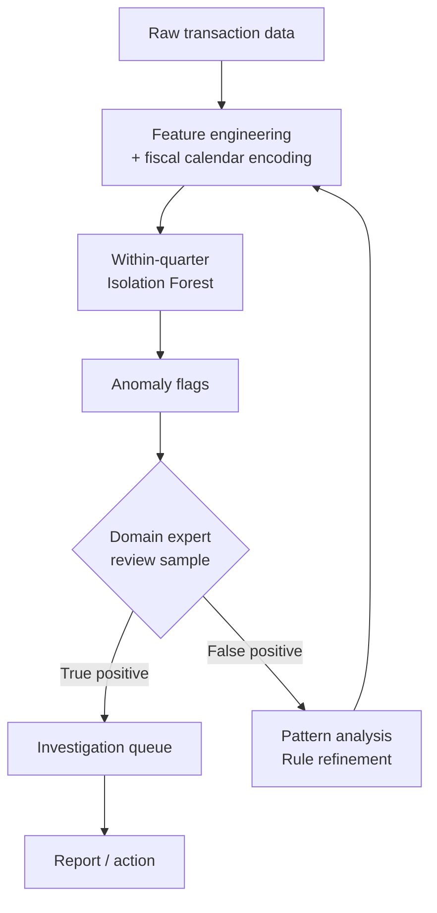

# Chapter 07: Unsupervised Machine Learning

The anomaly detection system had been running for six weeks when it flagged the same nineteen transactions every morning.

Marcus had built it for a Navy financial management office — a simple isolation forest over GFEBS obligation data, looking for outliers in the daily transaction stream. The system worked. The model was sound. The anomalies it kept flagging were, technically, anomalies.

They were also end-of-quarter adjustments that every DoD financial analyst on the planet would recognize in under ten seconds.

The PM pulled Marcus into a room on week seven. "We've been ignoring the system's flags every single morning," she said. "That's not an anomaly detection system. That's a morning routine." She was not wrong.

What Marcus had built was a model trained on twelve months of data that treated all variation as equal. The model had no concept of fiscal calendar. It had no concept that Q4 obligation surges are not fraud — they are policy. He had applied a general-purpose algorithm to a domain-specific problem and gotten a general-purpose answer that domain experts found useless.

This is where most government unsupervised ML projects get stuck. Not in the math. In the gap between what the algorithm detects and what the human expert needs to know.

Unsupervised learning is the branch of machine learning that works without labeled examples. No one has pre-classified the data as "normal" or "anomalous," "cluster A" or "cluster B," "topic 1" or "topic 2." The algorithm has to find structure in the data on its own. That makes it enormously useful in government environments where labeled data is rare, expensive to create, or doesn't exist yet. It also makes it deceptively easy to build something that produces confident-looking outputs that experts cannot use.

This chapter covers how to do it right.

## What You'll Build

By the end of this chapter, you will be able to:

- Apply K-means, DBSCAN, and hierarchical clustering to federal procurement and readiness datasets
- Reduce high-dimensional government data to interpretable lower-dimensional representations using PCA and UMAP
- Build anomaly detection pipelines on financial and logistics data — including the domain adaptations that prevent Marcus's problem
- Apply topic modeling (LDA and BERTopic) to FOIA responses, contract text, and federal register documents
- Run these workloads on Databricks (PySpark ML), Palantir Foundry, and within Advana's analytics environment
- Interpret and validate unsupervised model outputs with domain experts — the step most tutorials skip entirely

## Why Labels Are Rare in Government Data

Before clustering your first dataset, understand why unsupervised approaches dominate in federal data science.

Government data is enormous in volume and sparse in human judgment about it. SAM.gov Contract Data (formerly FPDS-NG) has 150 million contract action records. The Defense Logistics Agency manages 5 million National Stock Numbers. GFEBS processes millions of financial transactions per year across the Army alone. No team of analysts has labeled these records as "normal" or "anomalous," "competitive" or "non-competitive," "efficient" or "wasteful." The labels that do exist are often partial: a fraction of contracts have been audited, a fraction of invoices have been flagged for review.

That means if you wait for labeled data to do supervised learning, you will wait for years. Unsupervised methods let you find structure in the data now — and then bring the structure to domain experts who can tell you whether it maps to something real.

The flip side: without labels, you have no ground truth to validate against. A clustering algorithm will always produce clusters. A topic model will always produce topics. Whether those clusters or topics correspond to anything meaningful in the real world is a question the algorithm cannot answer. You have to answer it, with domain expertise and careful validation.

> **Sanity check:** "Our unsupervised model found five clusters, so there are five distinct types of contracts in this dataset." The model found five clusters because you asked for five clusters. Try three. Try ten. Run silhouette scores. Talk to a contracting officer. The number of "natural" groups in real-world data is rarely obvious, and the algorithm does not know what you are trying to find.

## Clustering

Clustering is the most common unsupervised task in government analytics: group similar records together so analysts can characterize each group, find anomalies within groups, or target resources toward specific segments.

### K-means: Fast, Interpretable, Opinionated

K-means is the starting point for most clustering work. It partitions n observations into k clusters where each observation belongs to the cluster with the nearest mean. It is fast, scales well, and produces clusters that are easy to explain to a non-technical audience.

The algorithm has two hard requirements you need to respect: it assumes clusters are roughly spherical (convex) and roughly equal in size. Government data violates both of these constantly. Contract award amounts span five orders of magnitude. Ship maintenance records cluster by vessel type in ways that produce wildly unequal group sizes. K-means still works as a first pass, but treat the outputs as hypotheses, not conclusions.

The practical workflow on government data:

```python
# See code-examples/python/01_clustering.py for full implementation
```

**Choosing k:** Run the algorithm for k = 2 through 20. Plot the within-cluster sum of squares (inertia) against k. The "elbow" in the plot — where additional clusters stop reducing inertia much — is a candidate value for k. Also plot the silhouette score: higher is better, and a score above 0.5 generally indicates meaningful separation. Neither metric replaces domain knowledge, but both help you narrow the range.

**Scaling matters enormously.** If your feature set includes both obligation amounts (millions of dollars) and number of line items (tens), and you do not scale, the dollar amounts dominate the distance calculation completely. StandardScaler or RobustScaler before every clustering run — no exceptions. RobustScaler is preferable for government financial data because it uses median and IQR rather than mean and standard deviation, making it less sensitive to the extreme outliers that appear in every federal spending dataset.

### DBSCAN: When Clusters Are Not Round

DBSCAN (Density-Based Spatial Clustering of Applications with Noise) finds clusters of arbitrary shape and explicitly marks outliers as noise. That second property is why it appears in anomaly detection workflows: the points DBSCAN cannot assign to any cluster are, by definition, the most isolated points in the data.

Unlike K-means, DBSCAN does not require you to specify the number of clusters in advance. It requires two parameters: `eps` (the maximum distance between two points for one to be considered a neighbor of the other) and `min_samples` (the minimum number of points to form a dense region). Getting these right for a new dataset requires experimentation.

For government data, DBSCAN is useful when you suspect the natural cluster structure is irregular — geographic clusters of vendors, maintenance failure patterns that concentrate around specific equipment age ranges, or procurement patterns that vary by quarter rather than by some continuous feature.

```python
# DBSCAN with parameter search
from sklearn.preprocessing import RobustScaler
from sklearn.cluster import DBSCAN
from sklearn.neighbors import NearestNeighbors
import numpy as np
import pandas as pd

def find_dbscan_eps(X_scaled: np.ndarray, min_samples: int = 5) -> float:
    """
    Estimate eps using the k-distance graph method.
    Sort the k-nearest-neighbor distances and look for the elbow.
    The distance at the elbow is a reasonable eps starting point.
    """
    nbrs = NearestNeighbors(n_neighbors=min_samples).fit(X_scaled)
    distances, _ = nbrs.kneighbors(X_scaled)
    k_distances = np.sort(distances[:, -1])  # Distance to k-th neighbor

    # The elbow heuristic: find the point of maximum curvature
    # In practice, plot this and look for the bend
    diff = np.diff(k_distances)
    elbow_idx = np.argmax(diff)
    return float(k_distances[elbow_idx])
```

### Hierarchical Clustering: When You Need a Tree

Hierarchical clustering builds a dendrogram — a tree of cluster merges — that lets analysts explore structure at multiple granularity levels. Instead of committing to k clusters upfront, you cut the tree at different heights to get different numbers of clusters.

In government analytics, dendrograms are useful for visualizing how organizational units relate to each other (are these two commands doing similar things?), how contract vehicles cluster by award characteristics, or how equipment types relate by failure patterns.

The downside: hierarchical clustering does not scale to large datasets. Ward linkage with SciPy's implementation starts getting slow above ~50,000 records. For large datasets, consider clustering a sample and then assigning the full dataset to the nearest cluster centroid.

### Platform Spotlight: Databricks ML on Government Cloud

Databricks MLlib (PySpark) runs distributed clustering natively, which matters when your dataset is large enough that scikit-learn would take hours on a single node. The API mirrors scikit-learn conceptually but operates on Spark DataFrames.

```python
# Distributed K-means on Databricks GovCloud
from pyspark.ml.clustering import KMeans
from pyspark.ml.feature import VectorAssembler, StandardScaler
from pyspark.sql import SparkSession

spark = SparkSession.builder.getOrCreate()

# Load from Unity Catalog
df = spark.table("navy_logistics.maintenance.work_orders")

# Assemble features into a single vector column (required by MLlib)
feature_cols = ["days_overdue", "parts_cost", "labor_hours", "equipment_age_years"]
assembler = VectorAssembler(inputCols=feature_cols, outputCol="features_raw")
df_assembled = assembler.transform(df.dropna(subset=feature_cols))

# Scale features
scaler = StandardScaler(inputCol="features_raw", outputCol="features",
                        withStd=True, withMean=True)
scaler_model = scaler.fit(df_assembled)
df_scaled = scaler_model.transform(df_assembled)

# Train K-means — runs distributed across cluster nodes
kmeans = KMeans(k=5, seed=42, maxIter=20, featuresCol="features", predictionCol="cluster")
model = kmeans.fit(df_scaled)

# Assign clusters to all records
df_clustered = model.transform(df_scaled)

# Summary statistics per cluster — useful for characterizing each group
df_clustered.groupBy("cluster").agg(
    {"days_overdue": "avg", "parts_cost": "avg", "labor_hours": "avg"}
).orderBy("cluster").show()
```

On a 10-node Databricks cluster in GovCloud DoD, K-means on 10 million records runs in under 2 minutes. The same job in scikit-learn on a single node would take 20–40 minutes.

### Platform Spotlight: Palantir Foundry

In Foundry, clustering typically runs inside a **Transform** — a versioned, scheduled Python computation that writes its output back to the Ontology as a dataset or enriches existing objects with new properties.

The practical workflow: write a Python transform that reads an object type (e.g., MaintenanceWorkOrder), runs scikit-learn clustering, and writes the cluster assignment back as a property on each object. Once cluster assignments are properties in the Ontology, Workshop applications can filter and visualize by cluster, and AIP Logic can reason about cluster membership when answering natural language queries.

Foundry's pipeline versioning means every re-run of your clustering transform is tracked: when you retrain with new data, the previous cluster assignments are preserved in history, and you can trace how a specific work order's cluster assignment changed over time.

## Dimensionality Reduction

Government datasets routinely arrive with hundreds of columns: every possible accounting code, every possible maintenance attribute, every possible contractual characteristic. Running clustering or anomaly detection on 400 features directly produces results dominated by the curse of dimensionality — in high-dimensional space, every point is roughly equidistant from every other point, and distance-based algorithms stop working.

Dimensionality reduction compresses the feature space down to a lower-dimensional representation that preserves the structure you care about.

### PCA: The Workhorse

Principal Component Analysis finds the directions of maximum variance in your data and projects it onto those directions. The first principal component captures the most variance, the second captures the most remaining variance orthogonal to the first, and so on.

PCA is linear, which means it assumes the important structure in your data can be captured by linear combinations of features. For many government financial datasets — where variables like obligation amounts, modifications, and line item counts move together in roughly linear ways — PCA works well. For more complex manifold structures, UMAP is better.

A useful diagnostic: the **explained variance ratio**. Plot cumulative explained variance against number of components. When you reach 80–90% explained variance, you have probably captured the essential structure. In most government financial datasets, 80% of variance is captured in the first 5–15 components out of hundreds.

```python
from sklearn.decomposition import PCA
from sklearn.preprocessing import RobustScaler
import pandas as pd
import numpy as np

def pca_with_diagnostics(df: pd.DataFrame, feature_cols: list[str], n_components: int = 20):
    """
    Run PCA with explained variance diagnostics.
    Returns transformed data and component loadings for interpretation.
    """
    X = df[feature_cols].dropna()
    scaler = RobustScaler()
    X_scaled = scaler.fit_transform(X)

    pca = PCA(n_components=n_components)
    X_pca = pca.fit_transform(X_scaled)

    # Explained variance summary
    cumulative_var = np.cumsum(pca.explained_variance_ratio_)
    print("Components needed for 80% variance:", np.argmax(cumulative_var >= 0.80) + 1)
    print("Components needed for 90% variance:", np.argmax(cumulative_var >= 0.90) + 1)

    # Component loadings — which original features drive each component?
    loadings = pd.DataFrame(
        pca.components_.T,
        index=feature_cols,
        columns=[f"PC{i+1}" for i in range(n_components)],
    )

    # Top features for PC1 and PC2 — useful for labeling axes in visualizations
    print("\nTop 5 features driving PC1:")
    print(loadings["PC1"].abs().sort_values(ascending=False).head())

    return X_pca, loadings, pca
```

**Interpreting PCA in government data:** The components are not automatically meaningful. If PC1 loads heavily on obligation amount, award count, and modification count, a contracting specialist might recognize this as a "contract complexity" axis. That interpretation requires domain input — the algorithm only gives you the direction of maximum variance, not a label for what it represents.

### UMAP: When Structure Is Non-linear

UMAP (Uniform Manifold Approximation and Projection) is the current state of practice for high-dimensional data visualization and as a preprocessing step before clustering. It preserves both local and global structure better than t-SNE and runs faster on large datasets.

In government analytics, UMAP is particularly useful for:
- Visualizing contract portfolios in 2D to spot natural groupings before running formal clustering
- Reducing text embedding dimensions (from 768 dimensions down to 10–50) before clustering FOIA documents or contract descriptions
- Identifying visual outliers in readiness data that analysts can then investigate

```python
import umap
import pandas as pd
from sklearn.preprocessing import RobustScaler

def umap_projection(
    df: pd.DataFrame,
    feature_cols: list[str],
    n_components: int = 2,
    n_neighbors: int = 15,
    min_dist: float = 0.1,
    random_state: int = 42,
) -> pd.DataFrame:
    """
    Project high-dimensional data to 2D (or n_components) using UMAP.

    n_neighbors controls local vs. global structure:
        small (5-15): preserves fine local structure
        large (50-200): preserves global structure, more spread out

    min_dist controls cluster tightness in the projection:
        small (0.0-0.1): tight clusters, good for finding groups
        large (0.5-1.0): more spread, good for continuous gradients

    Requires: pip install umap-learn
    """
    X = df[feature_cols].dropna()
    scaler = RobustScaler()
    X_scaled = scaler.fit_transform(X)

    reducer = umap.UMAP(
        n_components=n_components,
        n_neighbors=n_neighbors,
        min_dist=min_dist,
        random_state=random_state,
        verbose=False,
    )
    embedding = reducer.fit_transform(X_scaled)

    result = df.loc[X.index].copy()
    for i in range(n_components):
        result[f"umap_{i+1}"] = embedding[:, i]

    return result
```

> **Note:** UMAP is not deterministic even with a fixed random seed when run in parallel. For reproducibility on a Databricks cluster (which uses Spark's parallel execution), either run UMAP on a collected Pandas DataFrame (after `.toPandas()`) rather than on a distributed Spark DataFrame, or fix the random state and document that re-runs on different cluster configurations may produce different embeddings. The structure will be similar but the rotation and scale may differ.

## Anomaly Detection

Back to Marcus's problem.

Anomaly detection in government data is harder than it looks, and most off-the-shelf tutorials will lead you to Marcus's outcome: a model that produces flags every morning that domain experts learn to ignore. Here is how to avoid that.

### Isolation Forest: The Standard Starting Point

Isolation Forest randomly partitions the feature space by choosing a feature and a split value at random. Anomalies — points that are unusual in some combination of features — require fewer splits to isolate than normal points. The anomaly score is the average number of splits required to isolate each point.

It works. It is fast. It handles high-dimensional data. And it will flag your quarter-end financial adjustments without mercy unless you account for temporal structure.

```python
from sklearn.ensemble import IsolationForest
from sklearn.preprocessing import RobustScaler
import pandas as pd
import numpy as np


def build_fiscal_aware_anomaly_detector(
    df: pd.DataFrame,
    feature_cols: list[str],
    date_col: str,
    contamination: float = 0.01,
) -> pd.DataFrame:
    """
    Isolation forest with fiscal calendar awareness.

    The fix for Marcus's problem: train separate models for each fiscal quarter,
    so Q4 surges are not flagged as anomalies against Q1 baselines.

    Args:
        df: DataFrame with transactions
        feature_cols: Numeric features for anomaly scoring
        date_col: Date column for fiscal quarter extraction
        contamination: Expected fraction of anomalies (0.01 = 1%)

    Returns:
        DataFrame with anomaly_score and is_anomaly columns
    """
    df = df.copy()
    df[date_col] = pd.to_datetime(df[date_col])

    # Extract DoD fiscal quarter (Oct=Q1, Jan=Q2, Apr=Q3, Jul=Q4)
    month = df[date_col].dt.month
    df["fiscal_quarter"] = pd.cut(
        month,
        bins=[0, 3, 6, 9, 12],
        labels=["Q2", "Q3", "Q4", "Q1"],
        right=True,
    )

    scaler = RobustScaler()
    df[feature_cols] = df[feature_cols].fillna(df[feature_cols].median())
    X_scaled = scaler.fit_transform(df[feature_cols])

    df["anomaly_score"] = np.nan
    df["is_anomaly"] = False

    # Train and score within each fiscal quarter
    for quarter in ["Q1", "Q2", "Q3", "Q4"]:
        mask = df["fiscal_quarter"] == quarter
        if mask.sum() < 10:  # Not enough data for this quarter
            continue

        X_q = X_scaled[mask]
        model = IsolationForest(
            contamination=contamination,
            n_estimators=100,
            random_state=42,
            n_jobs=-1,
        )
        model.fit(X_q)

        scores = model.score_samples(X_q)
        preds = model.predict(X_q)

        df.loc[mask, "anomaly_score"] = scores
        df.loc[mask, "is_anomaly"] = preds == -1

    return df
```

This is the key adaptation: train within fiscal quarters, not across the entire year. A Q4 obligation surge is normal within Q4. It is only anomalous compared to Q1. The model should compare Q4 transactions to other Q4 transactions.

Similarly: if your data covers multiple organizations, train within-organization models rather than a single global model. A large command's transaction volumes are "normal" for that command; flagging them as anomalies against a smaller command's baseline produces noise.

### One-Class SVM and Autoencoders

Isolation Forest is the right starting point for tabular government data. Two alternatives appear in more specialized contexts:

**One-Class SVM** — Learns a boundary around "normal" data in a kernel-transformed feature space. More expressive than Isolation Forest for some data shapes, but does not scale as well to large datasets (training time is O(n²) in the worst case). Use for datasets under ~100,000 records where you have a clean sample of known-normal transactions to train on.

**Autoencoders** — Neural network-based anomaly detection. The network learns to reconstruct "normal" data; anomalies reconstruct poorly and have high reconstruction error. Useful for sequential data (time series of sensor readings, multi-step financial workflows) and for high-dimensional data like images or text embeddings where tree-based methods underperform. Runs on Databricks GPU clusters for large-scale use; available in Palantir AIP through the LLM integration layer for text-based anomaly detection.

### Validating Anomaly Detection Results

This is the step most practitioners skip. The validation workflow for any anomaly detection system in government should involve:

1. **Sample the flags.** Take 50 randomly selected anomaly flags and walk through each one with a domain expert. Record: was this actually anomalous? Was it a known pattern that should not be flagged?

2. **Calculate the signal-to-noise ratio.** Of the 50 reviewed flags, how many were genuinely worth investigating? If fewer than 20%, the contamination parameter is too high or the feature set is missing a key domain signal.

3. **Document the false positive patterns.** When domain experts dismiss a flag, why? Build rules or features to prevent that pattern from generating future flags. This is not cheating — it is domain knowledge encoded into the model.

4. **Establish a baseline for the alternative.** If analysts were manually reviewing transactions before your model existed, how many anomalies were they finding per week? Your model should find at least as many, with fewer false positives.



*Figure: Anomaly detection pipeline with validation loop. The feedback from domain experts drives feature refinement — skipping this loop produces a system that generates noise.*

## Topic Modeling

Every government organization produces enormous quantities of text. Contract descriptions. FOIA responses. After-action reports. Program office meeting minutes. Audit findings. Inspector General reports.

Topic modeling finds the latent themes in a corpus of documents without requiring human annotation of what the themes are. The output is a set of topics — each represented as a distribution over words — and a document-topic assignment that tells you how much each document relates to each topic.

### LDA: The Classic Approach

Latent Dirichlet Allocation (LDA) is the standard probabilistic topic model. It assumes each document is a mixture of topics, and each topic is a distribution over words. Given a corpus, it infers both the topic-word distributions and the document-topic mixtures.

LDA works on bag-of-words representations — it ignores word order, which is a significant limitation for short or highly technical texts. But for longer government documents (contract performance work statements, audit reports, FOIA responses with multiple pages), bag-of-words captures enough signal to produce useful topics.

```python
# See code-examples/python/03_topic_modeling.py for full implementation
```

The preprocessing pipeline for government text deserves as much attention as the model itself:

- Remove standard English stopwords, but also add government-specific stopwords: "shall," "contractor," "government," "period," "performance," "requirement." These words appear in nearly every contract and contribute nothing to topic distinctiveness.
- Preserve meaningful multi-word phrases: "earned value management," "cost-plus-fixed-fee," "sole source," "8(a)" should be treated as single tokens, not split.
- Stem or lemmatize carefully. The words "obligation," "obligated," and "obligations" should collapse to the same token. But "contract" and "contracting" carry different meanings in some government contexts.

### BERTopic: Better Topics from Better Embeddings

BERTopic uses transformer-based sentence embeddings (BERT and its variants) rather than bag-of-words. Because embeddings capture semantic similarity, BERTopic produces more coherent topics for short or technical texts where word co-occurrence is sparse.

The workflow: embed documents using a sentence transformer, reduce embedding dimensions with UMAP, cluster the reduced embeddings with HDBSCAN, and extract topic keywords using class-based TF-IDF (c-TF-IDF) over the cluster members.

For government text, BERTopic outperforms LDA on:
- Short contract descriptions (50–200 words)
- Technical specifications with specialized vocabulary
- Mixed corpora where the same concept appears with different terminology

```python
from bertopic import BERTopic
from sentence_transformers import SentenceTransformer
import pandas as pd


def run_bertopic_on_contracts(
    contract_texts: list[str],
    n_topics: int = 20,
    min_topic_size: int = 10,
) -> tuple[BERTopic, list[int], list[float]]:
    """
    Run BERTopic on contract description text.

    Uses a sentence transformer for embeddings — no API call required,
    runs locally or on a Databricks GPU cluster.

    Args:
        contract_texts: List of contract description strings
        n_topics: Approximate number of topics (BERTopic auto-adjusts)
        min_topic_size: Minimum documents per topic (raise to reduce noise topics)

    Returns:
        (model, topics, probabilities) — topics is a list of topic IDs per document

    Requires: pip install bertopic sentence-transformers
    """
    # Use a lightweight model for CPU environments;
    # swap for "all-mpnet-base-v2" on GPU for better quality
    embedding_model = SentenceTransformer("all-MiniLM-L6-v2")

    topic_model = BERTopic(
        embedding_model=embedding_model,
        nr_topics=n_topics,
        min_topic_size=min_topic_size,
        verbose=True,
    )

    topics, probs = topic_model.fit_transform(contract_texts)

    # Print top words for each topic
    print("\nTop topics:")
    for topic_id in sorted(set(topics)):
        if topic_id == -1:
            continue  # -1 is the outlier topic
        top_words = [word for word, _ in topic_model.get_topic(topic_id)[:7]]
        doc_count = topics.count(topic_id)
        print(f"  Topic {topic_id} ({doc_count} docs): {', '.join(top_words)}")

    return topic_model, topics, probs
```

> **Note:** BERTopic's embedding step can be compute-intensive for large corpora (>100,000 documents). On a Databricks GPU cluster (e.g., g4dn.xlarge in GovCloud), embedding 100,000 contract descriptions takes approximately 8–12 minutes. On CPU, plan for 2–3 hours. Pre-compute and cache embeddings if you expect to re-run topic modeling with different parameters.

### Topic Modeling in Palantir Foundry

Foundry's AIP Logic layer can call LLMs directly within a pipeline to extract structured topic labels from document clusters. The workflow:

1. Run BERTopic or LDA to produce document clusters
2. For each cluster, assemble a representative sample of documents
3. Call an LLM via AIP Logic with a prompt like: "Here are 10 contract descriptions that have been grouped together by a topic model. In 5 words or fewer, what is the primary theme of this group?"
4. Use the LLM-generated label as the human-readable topic name

This combines the statistical coherence of a proper topic model with the interpretability of natural language labels — and it sidesteps the most painful part of topic modeling, which is manually reading thousands of top words and deciding what the topic "is."

## Practical Takeaway: Unsupervised ML Validation Checklist

Unsupervised models produce outputs that look convincing by default. Use this checklist before treating any unsupervised output as actionable.

**For clustering:**
- Did you try at least three values of k (or the equivalent parameter)? Do the results change dramatically?
- Did you scale the features before running the algorithm?
- Have you shown the cluster assignments to a domain expert and asked: "Do these groupings make sense to you?"
- Can you characterize each cluster in 1–2 sentences using the cluster's top features?
- Have you checked that the clusters are not simply recovering a feature you already know (e.g., all "cluster 1" records are from the same fiscal year)?

**For anomaly detection:**
- Have you reviewed a sample of flagged anomalies with domain experts?
- Is the signal-to-noise ratio above 30% (more than 1 in 3 flags is worth investigating)?
- Have you accounted for known cyclical patterns (fiscal quarters, maintenance cycles, deployment schedules)?
- Is the contamination parameter calibrated to your actual expected anomaly rate, or did you leave it at the default?

**For topic modeling:**
- Can a domain expert read the top 10 words of each topic and name the topic in 5 words or fewer?
- Are there "junk" topics dominated by stopwords or boilerplate text that slipped through preprocessing?
- Does the document-topic distribution make sense? (If a contract description about ship maintenance lands 80% in your "IT services" topic, something is wrong.)

## Platform Comparison

| Capability | Advana / Databricks | Navy Jupiter | Palantir Foundry | Qlik |
|---|---|---|---|---|
| Clustering (large-scale) | PySpark MLlib (distributed) | Databricks notebooks | Python transforms | Not native |
| PCA / dimensionality reduction | scikit-learn, Spark ML | scikit-learn via Databricks | Python transforms | Limited |
| Anomaly detection | Isolation Forest, MLlib | MLlib, scikit-learn | Python + AIP Logic | Insight Advisor (basic) |
| Topic modeling | scikit-learn LDA, BERTopic | scikit-learn | BERTopic + AIP Logic labels | Not native |
| Result persistence | Unity Catalog tables | Unity Catalog / iQuery | Ontology properties | QVD export |
| Visualization of clusters | Databricks SQL dashboards | Tableau / Qlik | Workshop applications | Qlik Sense |
| GPU support for embeddings | GovCloud GPU clusters | Via Databricks | Foundry GPU transforms | No |

## Where This Goes Wrong

**Failure Mode 1: Treating Cluster Count as a Finding**

**The mistake:** Reporting "the model found four distinct contract types" when the model was told to find four clusters.

**Why smart people make it:** K-means always produces exactly k clusters. If you specify k=4, you get four clusters, every time, regardless of whether the data has four natural groups. The output looks authoritative.

**How to recognize you're making it:**
- You ran the algorithm once with one value of k
- You did not plot silhouette scores across a range of k values
- The "finding" of N groups is the first number in your report

**What to do instead:** Run for k=2 through 20. Plot silhouette scores. Bring the top 2–3 candidate values of k to domain experts and ask which grouping is most interpretable. Report the selected k as a modeling decision, not a discovery.

---

**Failure Mode 2: Anomaly Detection Without Domain Calibration**

**The mistake:** Running a generic anomaly detector on domain-specific data and treating all flags as equally worth investigating.

**Why smart people make it:** The algorithm gives each record an anomaly score. It is tempting to sort by score and start reviewing from the top. The math is correct; the problem is that "statistically unusual" and "worth investigating" are different things.

**How to recognize you're making it:**
- Domain experts are dismissing flags without much thought
- The same types of records keep appearing at the top of your anomaly list
- You have not asked a domain expert: "What would a real anomaly look like in this data?"

**What to do instead:** Before building the model, interview a domain expert and ask: "What are the most common patterns in this data that look unusual but are actually normal?" Encode those patterns as features or as training filters. Then interview again after you have flags: "Of these 20 flags, which ones would you actually investigate?" Use the answer to calibrate your model.

---

**Failure Mode 3: Topic Models That Require a PhD to Interpret**

**The mistake:** Presenting topic model output as a list of top words per topic and expecting non-technical stakeholders to understand what the topics mean.

**Why smart people make it:** The top-words representation is what topic modeling papers use. It feels like the natural output format.

**How to recognize you're making it:**
- Stakeholders nod politely when you present the topics and then never use them
- You cannot explain what "Topic 7" is in plain language
- The topic labels in your report are "Topic 1," "Topic 2," etc.

**What to do instead:** After running the topic model, name every topic before presenting it. Use the LLM-labeling approach from the BERTopic section, or manually read 20 documents from each topic cluster and write a 5-word label. Present named topics ("Ship Propulsion Maintenance," "Software License Procurement," "Personnel Training Contracts") rather than word lists.

## Exercises

See [exercises/exercises.md](exercises/exercises.md) for hands-on practice.

---

**The one thing to remember:** Unsupervised models always produce output. Whether that output is meaningful requires a domain expert to tell you. Build the validation loop before you build the model, or you will build Marcus's anomaly detection system.

**What to do Monday morning:** Take one dataset you are currently working with or planning to work with. Open a notebook and run K-means for k=3, 5, and 10. Plot the silhouette scores. Then take the k=5 result to a domain expert — someone who works with this data operationally — and ask them whether the five groups make intuitive sense. Their answer will tell you more about your next steps than any model metric will.

**What comes next:** Chapter 08 covers deep learning — specifically where neural networks outperform the classical approaches in this chapter, and where they do not. The distinction matters in government environments where model explainability and computational cost are real constraints. If you cannot explain to an auditor why your model made a decision, gradient descent is not your friend.
