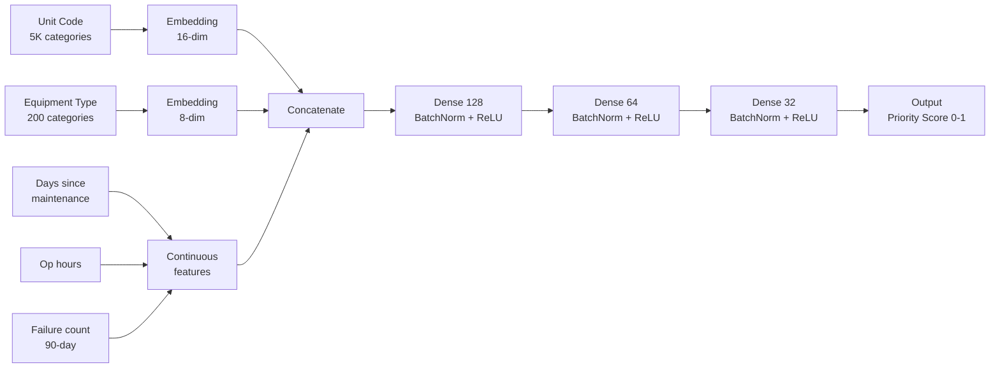
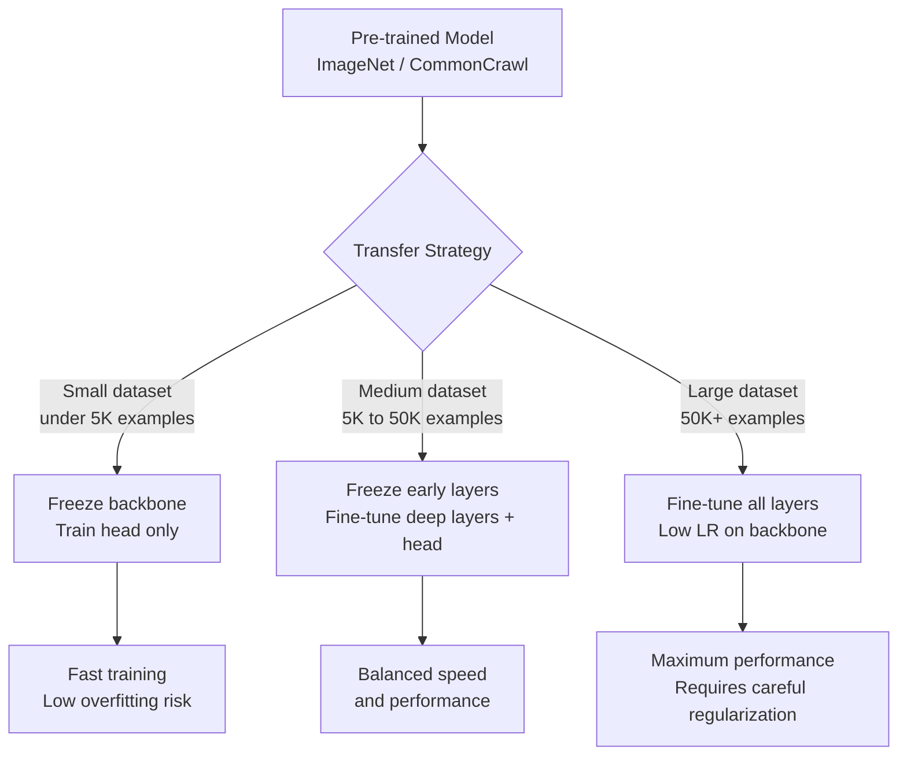

# Chapter 08: Deep Learning and Neural Networks

The video feed was coming in at 30 frames per second from four separate drone platforms. Each frame was 1920x1080. The model had 400 milliseconds to decide — per frame, per camera — whether the object in the bounding box was a civilian vehicle, a military vehicle, or a known threat category. Not 400 milliseconds total. 400 milliseconds per inference, with all four feeds running simultaneously.

Kevin Adeyemi had trained object detection models before. He'd done it at a computer vision startup, on AWS SageMaker, using open-source weights and public benchmark datasets. That was fine work. But it had never mattered the way this mattered.

The program office had approved the use of a YOLOv8 architecture fine-tuned on DoD-classified imagery. The production environment was Palantir Foundry running on Azure Government at IL5. The training had happened on Databricks with A10g GPU clusters. Kevin had four weeks to validate that the model's latency profile was within spec, that its false positive rate on civilian vehicles was below 0.3%, and that the entire inference pipeline could be audited — every prediction logged, every confidence score recorded, every human override captured.

He had built a YOLO model before. He had never built one that needed to be auditable at IL5 classification levels with a documented kill chain review process.

This chapter is about what that kind of engineering actually requires.

Deep learning is not magic. It is differentiable function composition — stacking layers of learned transformations until the composition approximates whatever mapping you need. That framing sounds reductive, but it is actually clarifying. When you treat neural networks as learned function approximators, you can reason about them: what they can do well, where they fail systematically, what architectural choices serve which problems, and why the training process produces a model that generalizes or doesn't. In government contexts specifically, where the cost of a wrong prediction can be enormous, understanding the mechanics is not optional.

## What You'll Build

By the end of this chapter you will be able to:

- Build and train feedforward neural networks in PyTorch for tabular government data (readiness, financial, personnel)
- Apply convolutional neural networks to DoD computer vision tasks: satellite imagery classification, equipment inspection
- Use transformer architectures for NLP tasks on government document corpora: contract language classification, logistics narrative parsing
- Build LSTM-based sequence models for government time series: maintenance forecasting, personnel trends, budget execution
- Fine-tune pre-trained models (YOLO, BERT, ViT) on domain-specific government datasets using transfer learning
- Import and deploy pre-trained models into air-gapped IL5 environments following DoD media transfer procedures
- Run GPU-accelerated training on Databricks Mosaic AI with A10g instances and manage GPU costs on federal platforms
- Deploy models in Palantir Foundry's AIP-integrated pipeline for operational decision support
- Log experiments, compare architectures, and version models with MLflow 3.0
- Understand the audit and explainability requirements that apply to DoD AI systems under DoD Directive 3000.09

## What a Neural Network Actually Is

Start here, because the foundation matters.

A feedforward neural network takes an input vector, multiplies it by a weight matrix, adds a bias, passes the result through a nonlinear activation function, and repeats that operation across multiple layers. The final layer produces an output — a classification, a regression value, a probability distribution. Training is the process of adjusting the weights to minimize a loss function, using the chain rule to propagate gradients backward through the layers.

That's the whole thing. Every architecture — convolutional networks, transformers, recurrent networks — is a variation on this pattern with structural constraints added for specific data types. CNNs add local connectivity and weight sharing for spatial data. Transformers add attention mechanisms for sequence data. LSTMs add gating for temporal dependencies.

The reason deep learning works so well across disparate domains is not that neural networks are inherently superior to other methods. It is that they are universal function approximators given sufficient width and depth, that gradient descent finds surprisingly good solutions for most practical loss landscapes, and that modern hardware (GPUs) can compute the matrix multiplications fast enough to make training feasible on large datasets.

What this means operationally: the choice to use deep learning over a gradient boosting tree or a logistic regression is not an automatic upgrade. Deep learning requires more data, more compute, longer training cycles, more complex debugging, and harder explainability. For a DoD readiness classification problem with 50,000 records and 40 features, XGBoost will likely outperform a neural network and be easier to explain to an auditor. For a satellite imagery classification task with 2 million labeled tiles, a CNN will outperform everything else.

Choose the right tool. Chapter 06 covers the cases where traditional ML wins. This chapter covers the cases where it doesn't.

### PyTorch vs. TensorFlow in Federal Environments

Most of this chapter uses PyTorch. That is a deliberate choice, not an oversight.

PyTorch became the dominant research framework around 2019-2020, and production adoption followed. As of 2025, the major federal platform integrations reflect this: Databricks' Mosaic AI Runtime ships with PyTorch optimized for CUDA; the TorchDistributor integration for distributed training is native; MLflow's deep learning tracking is built around PyTorch's state dict serialization. HuggingFace's `transformers` library — the practical standard for BERT, LLaMA, and ViT fine-tuning — defaults to PyTorch. Palantir Foundry's model import toolchain has explicit support for TorchScript serialization.

TensorFlow is not gone. You will encounter it in two specific contexts in government work:

- **Legacy deployments:** Models trained on TensorFlow 1.x or 2.x that are already in production. These are common in DoD programs that stood up AI capabilities in 2018-2021. Understand TensorFlow well enough to read and modify these models.
- **TensorFlow Lite on edge devices:** Embedded systems (UAV guidance computers, shipboard sensors) sometimes run TFLite models because the runtime is lighter than PyTorch Mobile. If you are deploying to constrained hardware, benchmark both frameworks.

For new development, use PyTorch unless you have a specific reason not to. The ecosystem support on federal platforms is better, the debugging experience is cleaner, and the community momentum means your skills will transfer forward.

JAX is appearing in advanced research contexts (DoD research labs, DARPA programs) but is not yet available on the primary operational platforms covered here. Do not plan a program office deliverable around JAX unless your contract explicitly supports a custom Python environment.

## Feedforward Networks for Tabular Government Data

Government data is mostly tabular. Personnel records, financial obligations, logistics inventory, maintenance schedules — these are rows and columns, not images and text. The standard wisdom is that gradient boosted trees (XGBoost, LightGBM) dominate tabular data. That wisdom is broadly correct but not universal. Neural networks win on tabular data when:

- You have very large datasets (millions of rows) where trees start to plateau
- You need to jointly train on multiple input types (tabular + text + image features)
- You need learned embeddings for high-cardinality categorical variables (thousands of unit codes, equipment identifiers, contract vehicle codes)

The third case is the most practically relevant for government analytics. NAICS codes, unit identification codes (UICs), equipment NSNs, and contracting office codes each have thousands of distinct values. One-hot encoding collapses under that cardinality. Neural network embeddings learn dense representations that capture semantic relationships — two NSNs that are often co-requisitioned end up close in embedding space.

See `code-examples/python/01_neural_network_fundamentals.py` for the full implementation of an embedding-based readiness prediction network. The key architectural decisions:

**Learned embeddings for high-cardinality categoricals.** A unit code vocabulary of 5,000 UICs becomes a 16-dimensional dense vector per unit. The embedding learns that Carrier Strike Group 4 and Carrier Strike Group 8 should have similar representations because their maintenance patterns are similar — a fact that one-hot encoding cannot capture.

**Batch normalization between layers.** Government data has temporal distribution shifts: a unit at 80% readiness last quarter might be at 60% now because of a deployment cycle. BatchNorm stabilizes training when feature distributions shift between training and deployment.

**Early stopping with a validation set.** Never train to convergence on the full dataset. Hold out the most recent time period as your validation set — not a random 20% — because you want to know if the model generalizes to data that looks like deployment, not data that looks like training.



*Figure: Embedding-based readiness network architecture. Categorical identifiers are learned as dense vectors; continuous features feed directly into the first hidden layer.*

## Recurrent Networks and LSTMs for Government Time Series

Some government data problems are fundamentally sequential. Equipment that has been running well for 30 days, then poorly for 5, then normally for 2, then fails — the failure story is in the sequence, not just the most recent measurement. A feedforward network that sees today's sensor reading without the context of the preceding 37 days will make worse predictions than one that sees the whole sequence.

LSTMs (Long Short-Term Memory networks) are the standard recurrent architecture for time series in production. The gating mechanism — input gate, forget gate, output gate — lets the model learn what information to preserve from prior steps and what to discard. The practical advantage over vanilla RNNs is that LSTMs do not suffer from vanishing gradients for sequences up to a few hundred steps.

The three government use cases that recurrent architectures handle well:

**Maintenance prediction from sensor streams.** A P-8 aircraft has hundreds of sensors generating readings at regular intervals. The LSTM sees a rolling window of these readings as a sequence. When the sequence pattern starts matching the characteristic signature preceding a known failure mode, the model flags the asset for inspection before the failure occurs. This is the difference between reactive maintenance and predictive maintenance.

**Personnel strength and retention forecasting.** Monthly headcount, promotion cycle data, reenlistment rates — these are sequences with strong autocorrelation and seasonal patterns. An LSTM trained on 10 years of unit-level personnel data captures the deployment-cycle seasonality that kills naive regression models.

**Budget execution rate prediction.** DoD program offices routinely over- or under-execute their annual obligation authority. Monthly obligation amounts, the remaining authority, the days remaining in the fiscal year, and the historical pattern for this type of program form a time series. An LSTM trained on historical execution data can flag programs likely to need reprogramming 60 days before year-end — giving the program office time to act.

### The Indexing Problem: Wall Clock vs. Operational Cycles

Here is where most teams get burned building government time series models. They use calendar dates as their sequence index. This is almost always wrong.

Consider aircraft maintenance data. An F/A-18 has a 400-flight-hour inspection cycle. Two aircraft with the same calendar date could be at completely different points in their maintenance cycle: one at flight hour 380, the other at flight hour 12. A model indexed by calendar date treats these as equivalent states. A model indexed by position within the inspection cycle treats them correctly.

The right sequence index is almost always operational position — flight hours since last major inspection, days since last depot visit, contract days elapsed, position in deployment cycle — not calendar time. This requires a business-domain conversation with the operational analysts, not just the engineers. The data scientists who build the best predictive maintenance models at places like NAVAIR are the ones who understand what the sequence actually represents.

```python
import torch
import torch.nn as nn
import numpy as np
from typing import Tuple

class MaintenanceLSTM(nn.Module):
    """
    LSTM for predicting maintenance failure risk from sequential sensor data.
    Input sequence indexed by operational cycles (flight hours), not calendar time.
    """

    def __init__(
        self,
        n_sensor_features: int,
        hidden_size: int = 64,
        n_layers: int = 2,
        dropout: float = 0.2,
    ):
        super().__init__()
        self.lstm = nn.LSTM(
            input_size=n_sensor_features,
            hidden_size=hidden_size,
            num_layers=n_layers,
            batch_first=True,
            dropout=dropout if n_layers > 1 else 0.0,
        )
        self.dropout = nn.Dropout(dropout)
        # Output layer maps final hidden state to failure probability
        self.head = nn.Linear(hidden_size, 1)

    def forward(self, x: torch.Tensor) -> torch.Tensor:
        # x shape: (batch_size, sequence_length, n_sensor_features)
        lstm_out, (h_n, _) = self.lstm(x)

        # Use the last hidden state of the final LSTM layer
        # h_n shape: (n_layers, batch_size, hidden_size)
        final_hidden = h_n[-1]  # shape: (batch_size, hidden_size)
        out = self.dropout(final_hidden)
        # Sigmoid produces a failure probability in [0, 1]
        return torch.sigmoid(self.head(out)).squeeze(-1)


def create_windows(
    sensor_df,
    asset_id_col: str,
    cycle_col: str,
    feature_cols: list,
    label_col: str,
    window_size: int = 30,
) -> Tuple[np.ndarray, np.ndarray]:
    """
    Create fixed-length windows from multi-asset time series.
    Each asset's history is sliced into overlapping windows.

    The critical detail: windows are created per-asset and sorted by
    operational cycle, NOT by calendar date. Assets with gaps in their
    cycle log (grounded periods) are padded with zeros.
    """
    X, y = [], []

    for asset_id, group in sensor_df.groupby(asset_id_col):
        # Sort by operational cycle position, not calendar date
        group = group.sort_values(cycle_col).reset_index(drop=True)
        features = group[feature_cols].values.astype(np.float32)
        labels = group[label_col].values

        for i in range(window_size, len(group)):
            window = features[i - window_size : i]
            # Label is the status at the END of the window
            X.append(window)
            y.append(labels[i])

    return np.array(X), np.array(y, dtype=np.float32)
```

### Training LSTMs: What's Different from Feedforward Nets

The training loop for an LSTM is similar to feedforward nets with two critical differences.

First, you must use a time-based train/test split — not random split — and you must apply it at the per-asset level. If asset 47 has readings from FY2021 through FY2024, your training set gets FY2021-2023 and your test set gets FY2024. If you randomly split rows, you will have future data from asset 47 in training and past data in test. The model will look accurate on validation but fail catastrophically in production. This is a data leakage pattern that kills more government predictive maintenance programs than any model architecture mistake.

Second, gradient clipping is essential. Backpropagation through time accumulates gradients over the sequence length, and long sequences can produce gradient explosions. Add `torch.nn.utils.clip_grad_norm_(model.parameters(), max_norm=1.0)` before `optimizer.step()` in your training loop. Without it, long sequences will cause NaN losses.

### Platform Spotlight: Databricks for Sequential Training

Running LSTM training on Databricks Mosaic AI works the same as feedforward nets — configure a GPU ML cluster (Runtime 15.x ML), write your training code in a notebook, log to MLflow. The difference is sequence data preprocessing: you typically need Spark to create the windowed dataset from raw time series stored in Delta Lake Bronze/Silver tiers, then convert to PyTorch Datasets for the actual LSTM training.

A practical pattern: use a Databricks notebook with a dual-phase architecture — PySpark cell to generate windows and save as a parquet file to DBFS, then PyTorch cells that load the parquet file into a `Dataset` and run LSTM training. Keep the data engineering in Spark where it belongs (distributed, scalable) and the model training in PyTorch where it belongs (GPU-native, flexible).

## Convolutional Neural Networks: Satellite Imagery and Equipment Inspection

The DoD's ISR apparatus produces enormous volumes of imagery. Satellite imagery for facility monitoring. UAV imagery for battle damage assessment. Depot photography for equipment inspection. All of these are computer vision problems where CNNs are the right tool.

A CNN doesn't operate on flat pixel vectors. It scans the image with learned filters — small weight matrices that detect edges, textures, and eventually higher-level features — and builds a hierarchy of representations. Early layers learn edges. Middle layers learn shapes. Deep layers learn semantic objects. The key operations are convolution (local feature detection with shared weights), pooling (spatial downsampling), and fully connected layers for classification.

For government use cases, you almost never train a CNN from scratch. Scratch-trained CNNs need millions of labeled examples. You have, at most, tens of thousands of labeled images, and the labeling itself is expensive (annotators with clearances, annotation tools approved for classified data). Transfer learning is the practical path.

The full implementation is in `code-examples/python/02_cnn_image_classification.py`. It fine-tunes a ResNet-50 pre-trained on ImageNet for facility type classification from overhead imagery. Key decisions:

**Separate learning rates for backbone and head.** The backbone (pre-trained ResNet layers) gets a 10x lower learning rate than the classification head. You want the head to learn quickly from your labeled imagery while the backbone adapts more slowly — too fast and it catastrophically forgets the ImageNet representations that are still useful.

**Data augmentation for satellite imagery.** Unlike photographs of everyday objects, satellite imagery has no canonical orientation. A logistics depot looks the same from the north as from the south. Apply `RandomVerticalFlip()` and `RandomHorizontalFlip()`. Apply `ColorJitter()` for variance in sensor calibration and atmospheric conditions. These augmentations double or triple effective dataset size without collecting new labels.

**Label smoothing in the loss function.** Government-labeled imagery frequently has ambiguous cases — a facility that is partially an airfield and partially a command center. Label smoothing (setting `label_smoothing=0.1` in `CrossEntropyLoss`) prevents the model from becoming overconfident on these ambiguous examples.

### Platform Spotlight: Databricks GPU Clusters

Training on a laptop is fine for prototyping. For datasets above 50,000 images, you need a GPU cluster.

On Databricks at FedRAMP High on AWS GovCloud (authorized February 27, 2025), you have access to A10g instances through Mosaic AI's serverless GPU compute — no long-term reservation required. The A10g has 24GB VRAM: enough for training ResNet-50, BERT-base, or running inference with models up to roughly 7 billion parameters in 8-bit quantization.

```python
# Multi-GPU training on Databricks using TorchDistributor
# Runs in a Databricks notebook where `spark` is already defined
from pyspark.ml.torch.distributor import TorchDistributor

def train_on_distributed(n_gpus: int = 4):
    """
    Wrapper for multi-GPU training via Databricks TorchDistributor.
    Handles rank assignment, process spawning, and gradient sync automatically.
    """
    def train_fn():
        import torch
        import os
        import torch.distributed as dist
        from torch.nn.parallel import DistributedDataParallel as DDP
        from torch.utils.data import DistributedSampler

        local_rank = int(os.environ["LOCAL_RANK"])
        device = torch.device(f"cuda:{local_rank}")

        dist.init_process_group(backend="nccl")

        model = build_facility_classifier(freeze_backbone=False)
        model = model.to(device)
        model = DDP(model, device_ids=[local_rank])

        # DistributedSampler ensures each worker gets a non-overlapping data shard
        train_ds = SatelliteImageDataset(train_dir, transform=train_transforms)
        sampler = DistributedSampler(train_ds)
        train_loader = DataLoader(train_ds, batch_size=32, sampler=sampler, num_workers=4)

        # ... training loop ...

        dist.destroy_process_group()

    distributor = TorchDistributor(
        num_processes=n_gpus,
        local_mode=False,
        use_gpu=True,
    )
    distributor.run(train_fn)
```

The practical workflow: write PyTorch training code in a Databricks notebook, configure a GPU ML cluster (Databricks Runtime 15.x ML), run training, and MLflow automatically captures every run — parameters, metrics per epoch, model artifacts. Register the trained model in Unity Catalog's ML Model Registry. Deploy via Mosaic AI Model Serving for real-time inference.

## Transformers and NLP for Government Documents

The federal government runs on documents. Solicitations. Performance Work Statements. Contracting Officer decisions. After-action reports. Inspector General findings. Congressional Budget Justifications. The volume is staggering — DoD alone processes hundreds of thousands of contract actions per year, each with associated narrative text.

Transformer models — built on the self-attention mechanism from the 2017 paper "Attention Is All You Need" — have become the dominant approach for any NLP task. The intuition behind self-attention: when processing a word, instead of looking only at adjacent words (as an RNN would), attention computes a relevance score between that word and every other word in the sequence. This captures long-range dependencies that recurrent networks systematically miss.

BERT (Bidirectional Encoder Representations from Transformers) is the standard pre-trained encoder for classification and extraction tasks. You fine-tune it on your labeled examples rather than training from scratch. Fine-tuning BERT-base on a classification task takes 3-4 epochs on a single GPU — roughly 20-30 minutes for datasets under 100,000 examples.

The full fine-tuning implementation is in `code-examples/python/03_transformer_nlp.py`. The use case: classifying contract description text into procurement categories (IT Services, Professional Services, Construction, Equipment and Supplies, Research and Development, Other). The HuggingFace `Trainer` API handles training loop, gradient accumulation, mixed-precision, and MLflow logging automatically.

### When Transformers Are Wrong for the Job

BERT has a 512-token maximum input length. A standard Federal Acquisition Regulation clause runs 3,000 tokens. A contracting officer's narrative findings in an Inspector General report can run 15,000 tokens. These don't fit.

Your options when documents exceed 512 tokens:
- **Long-context models:** Longformer handles 4,096 tokens; Llama-based models handle 8,192+. Available through HuggingFace or Databricks Mosaic AI Model Serving.
- **Chunking with aggregation:** Split the document into 512-token chunks, classify each chunk, aggregate (majority vote, or average the softmax outputs). Simple and often sufficient.
- **Hierarchical models:** Encode sentence-level representations with BERT, then encode the sentence sequence with a second lightweight transformer. Better performance, more complexity.

For purely keyword-driven extraction tasks — pulling specific fields out of standardized forms, extracting dollar amounts, dates, contract numbers — a rules-based approach or a fine-tuned token classification model (Named Entity Recognition) is faster, more reliable, and easier to explain than any large language model. When an auditor asks how the model classified a contract, "it matched the pattern `\$[\d,]+` in field 12" is a better answer than "the 110M-parameter model assigned 0.87 probability."

Use the simplest model that gets the job done.

## Transfer Learning: The Practical Path for Government AI

Government AI projects have a structural disadvantage relative to commercial ones: labeled data is expensive. Annotators need clearances. Annotation tools need ATOs. The pipeline needs approval. A commercial image recognition team might label a million images in a month. A DoD team doing equivalent work might label 50,000 in a year.

Transfer learning addresses this directly. A model pre-trained on ImageNet has already learned to detect edges, textures, shapes, and objects. Fine-tuning that model on 5,000 labeled images of maintenance anomalies is dramatically more effective than training a CNN from scratch on the same 5,000 images — because the pre-trained weights encode visual knowledge that transfers.



*Figure: Transfer learning strategy by dataset size. Government datasets typically fall in the small-to-medium range — freeze more of the backbone to prevent overfitting on limited labels.*

The government-specific wrinkle is domain gap. ImageNet contains photographs of everyday objects — dogs, chairs, cars. Your application may involve overhead imagery, thermal sensors, or equipment interiors that look nothing like those photographs. When the domain gap is large, training only the classification head underperforms. Test: if the model performs at chance on your validation set after 10 epochs of head-only training, the domain gap is too large. Unfreeze the last two or three backbone blocks and retrain with stronger regularization (higher dropout, lower learning rate, more data augmentation).

### Transfer Learning in Air-Gapped Environments

This is the part that nobody on your program warned you about, and it will add weeks to your schedule if you don't plan for it.

At IL5 and above, your model training environment has no internet access. The `pip install transformers` and `model = ResNet50(weights="IMAGENET1K_V2")` that work on your laptop will fail silently or throw a connection timeout on the classified network. Pre-trained model weights are hosted on HuggingFace Hub and PyTorch Hub — both on the public internet, both inaccessible.

The process for getting pre-trained weights into an air-gapped environment:

**Step 1: Download on an unclassified system.** On an unclassified machine, download the full model artifact — not just the config, but the weights file. For HuggingFace models this means `model.save_pretrained("/path/to/output")` which produces `config.json`, `tokenizer.json`, and `pytorch_model.bin` (or `model.safetensors` for newer models). For PyTorch Hub models, the weights download on first call to `torch.hub.load()` and cache to `~/.cache/torch/hub/checkpoints/`.

**Step 2: Package for transfer.** Create a single archive of the model directory. Compute its SHA-256 hash and document it. This hash is the chain-of-custody record. Most programs require a completed DD-1149 (Requisition and Invoice/Shipping Document) or equivalent transfer form.

**Step 3: Virus scan and media transfer.** The archive goes on approved removable media (typically government-furnished USB drive with hardware write-protection). The receiving side's ISSO or SysAdmin runs the virus scan before the media mounts.

**Step 4: Install in the secure environment.** Load from local path instead of internet. For HuggingFace: `AutoModel.from_pretrained("/path/to/local/model")`. For PyTorch Hub: set `TORCH_HOME` environment variable to a local directory containing the pre-downloaded weights.

The process takes two to six weeks at organizations with a mature transfer process. At organizations doing this for the first time, plan for three months. The engineering lesson: your model selection process should happen before the transfer request goes in, not after. You cannot pivot to a larger BERT model after three weeks of waiting for the weights to clear.

**Pre-load a model zoo.** On long-running IL5 programs, work with the ISSO to establish a library of approved model weights — ResNet variants, BERT-base, BERT-large, DistilBERT, a ViT variant, and a 7B quantized language model — imported once and stored in a designated directory on the secure network. The first import takes months. Every project that comes after can use the same approved weights in hours.

## GPU Compute on Federal Platforms: Cost and Availability

GPU time is expensive everywhere. On federal platforms it is expensive and administratively constrained. You need to understand the cost structure before you design a training pipeline, because the design choices — batch size, precision, number of GPUs, serverless vs. dedicated cluster — have large dollar consequences.

### Databricks Mosaic AI Pricing Model

On Databricks in a federal deployment (AWS GovCloud, FedRAMP High), GPU compute falls into two categories:

**Serverless GPU compute (Mosaic AI):** Pay per token processed or per training run. No cluster to configure. Databricks handles the A10g provisioning automatically. This is the right choice for model serving (inference) and for training runs under 4 hours. The cost model is predictable per run.

**Dedicated GPU clusters:** You configure a cluster with a specific instance type (ml.g5.xlarge through ml.g5.48xlarge for A10g; preview access to H100 instances on some GovCloud regions). You pay by the second the cluster is running — whether it's training or sitting idle while you debug your code. This is where federal programs hemorrhage compute budget.

The two biggest GPU budget mistakes on government contracts:

**Leaving clusters running.** A data scientist starts a training cluster at 9 AM, runs an experiment, hits a lunch break, comes back at 1 PM. The cluster ran idle for four hours at roughly $3-8/hour per GPU. Over a project, this adds up to tens of thousands of dollars. Use auto-termination (Databricks allows configuring idle termination at 30, 60, or 120 minutes) and configure it from day one.

**Overprovisioning for prototyping.** An 8-GPU cluster runs training 7x faster than a 1-GPU cluster (not 8x — communication overhead takes a cut). But for a 45-minute single-GPU training run, launching an 8-GPU cluster for 7 minutes is not cost-effective. Single-GPU prototyping, multi-GPU training only when you have confirmed the architecture and are doing final runs.

| Phase | Right approach | Wrong approach |
|---|---|---|
| Feature development | CPU cluster or local machine | GPU cluster running idle |
| Architecture search | 1x A10g, early stopping | 8x A10g, full training |
| Final training runs | Multi-GPU with distributed sampler | Single GPU for large dataset |
| Model serving | Serverless (pay per inference) | Dedicated cluster running 24/7 |
| Exploratory analysis | Standard cluster | GPU cluster for tabular EDA |

### Palantir Foundry GPU Compute

Palantir Foundry Code Repositories (the Python execution environment inside Foundry, distinct from the visual Pipeline Builder) support GPU-backed transforms at IL5 on Azure Government. The economics differ from Databricks: Foundry's compute billing is typically included in enterprise contract pricing rather than metered per GPU-hour, which changes the cost calculus.

The practical limitation on Foundry GPU compute is not cost but availability and configuration overhead. Foundry's GPU scheduling is less flexible than Databricks' — you specify resource requirements in the transform configuration, and the platform schedules execution when resources are available. For iterative model development (run, inspect, adjust hyperparameters, re-run) this scheduling latency makes Foundry Code Repositories a poor development environment. Use Databricks for development. Use Foundry for operationalized, scheduled training runs that produce artifacts for deployment.

### Model Size vs. IL Level: Where Large Models Can and Cannot Run

Not every model can run at every classification level. The constraints are practical, not policy — they come from hardware availability and data residency requirements.

| Platform | Max IL | GPU available | Notes on large models |
|---|---|---|---|
| Databricks on AWS GovCloud | IL5 (ITAR/CUI) | A10g 24GB, H100 preview | 70B+ models require multi-GPU; possible but expensive |
| Palantir Foundry Azure Gov | IL5 | Available in Code Repos | Training possible; inference via AIP at IL5 |
| Advana (DoD tenant on Databricks) | IL5 | A10g via GovCloud | Same Databricks constraints; CDAO controls provisioning |
| Navy Jupiter | IL5 (Navy data) | A10g via Advana/Databricks | Coordinate with Jupiter team for GPU allocation |
| JWICS-connected systems | IL6 / TS | Typically NVIDIA V100 or A100 on managed hardware | No public cloud; on-prem GPU clusters only |

The A10g has 24GB VRAM. A 7B-parameter model in 4-bit quantization requires roughly 4GB. A 13B model in 4-bit requires roughly 7GB. A 70B model in 4-bit requires roughly 35GB — exceeding a single A10g. Running 70B models at IL5 on AWS GovCloud requires a multi-GPU configuration (two A10g instances at minimum) and adds complexity to serving. This is achievable but requires explicit program office approval for the cost.

At IL6 (SCI/TS), you are off public cloud entirely. The hardware is whatever the program's SIEM-attached compute stack provides — typically V100 or A100 GPUs on on-premises hardware. Large models are technically possible but require coordination with the program's infrastructure team and may need months of lead time for hardware provisioning. In practice, most IL6 AI programs use models under 10B parameters unless specifically funded for the compute infrastructure.

The rule: size your model to the inference environment, not the training environment. You can train a 7B model on a cloud cluster and then quantize and export it for inference. You cannot run a 70B model in 4-bit on a single A10g for latency-sensitive real-time inference. Know your production compute constraints before model selection.

## DoD AI Governance: Directive 3000.09

DoD Directive 3000.09 establishes policy for autonomous weapons systems, but its engineering implications reach into any AI system used in operational military contexts. The relevant requirements for a data scientist:

**Human judgment must be exercised in use-of-force decisions.** Your model is decision support, not the decision maker. The interface must visually distinguish model output from human decision.

**The system must minimize unintended engagements.** Your false positive rate on a safety-critical class is a legal and policy constraint, not just a model quality metric. It goes in the requirements document. It gets tested. It gets certified.

**Systems must be designed for failure safety.** What does your model do when confidence is low? It must have a defined behavior — escalation to human review, flag for analyst queue — rather than defaulting silently to the highest-probability class.

The engineering translation of these requirements is in `code-examples/python/04_operational_inference_pipeline.py`. The key structural element is an `OperationalInferencePipeline` wrapper that enforces a confidence threshold (below threshold → `requires_human_review = True`), logs every inference to an audit trail, and never outputs a prediction without capturing the full probability distribution alongside it.

In a Palantir Foundry deployment, the `requires_human_review` flag triggers an AIP Logic Action that routes the item to a human analyst queue in Workshop. The prediction is not acted on until a human reviews it. That is the policy. Your code enforces it.

### Platform Spotlight: Palantir AIP for Operational AI

Palantir Foundry's AIP layer is where trained models become operational in high-consequence government environments. The integration pattern is not "deploy a REST endpoint and call it." Foundry models are registered in the platform and invoked through the Ontology.

When Kevin's YOLO model makes an inference about a vehicle in an imagery frame, that inference is not just a JSON response to an API call. It is a prediction attached to a `DetectedObject` Object Type in the Foundry Ontology, linked to the `ImageryFrame` it came from, linked to the `DroneAsset` that captured it. Every prediction has full data lineage. Every human override is captured as an Action in the Ontology. The entire inference chain is auditable.

This is the architectural reason that high-consequence government AI systems end up on Palantir rather than a pure ML engineering platform. The auditability and operational integration are built into the platform design, not bolted on afterward.

When the Inspector General asked for an audit of all vehicle detections where model confidence was below 90%, the Foundry Ontology answered the query in 3.2 seconds across 847,000 inference records. The same query against a flat file would have taken an hour of pandas work.

## Where This Goes Wrong

**Failure Mode 1: Training on the Wrong Distribution**

**The mistake:** The model trains and validates on historical data, then deploys on current data from a different operational context — different geography, different season, different equipment generation.

**Why smart people make it:** Training and validation metrics look good. The technical review passes. Nobody asks whether the test set matches the deployment distribution.

**How to recognize you're making it:**
- Model accuracy degrades sharply in the first month of production deployment
- The examples that fool the model all share a characteristic absent from the training set
- Prediction confidence scores on live data are systematically lower than on held-out test data
- The training data came from one theater of operations; deployment is in another

**What to do instead:** Treat distribution shift as a first-class engineering problem from day one. Log prediction confidence distributions in production. Alert when mean confidence drops more than 5 percentage points below training baseline. Plan for model retraining every time operational context changes significantly.

---

**Failure Mode 2: Using Deep Learning When It Isn't Warranted**

**The mistake:** A senior analyst asks for "an AI model" to predict equipment failures. You build a 6-layer neural network. It performs worse than logistic regression on the same features. The program office loses confidence in the entire AI effort.

**Why smart people make it:** Deep learning is current, impressive, and "neural network" carries weight in briefings. The pressure to show sophisticated technology is real in government contracts.

**How to recognize you're making it:**
- The dataset has fewer than 100,000 rows
- You have fewer than 10 informative features
- The XGBoost baseline you "quickly put together" matches or beats your tuned network

**What to do instead:** Always establish a strong baseline first. In practice: XGBoost with reasonable hyperparameters. If the neural network doesn't beat the baseline by 3+ percentage points on the primary metric, ship the XGBoost. Explainability is easier. Auditability is simpler. The contract sponsor is happier.

---

**Failure Mode 3: Ignoring the Confidence Score**

**The mistake:** Deploying a model that outputs a class label without exposing the confidence distribution to the end user or downstream system.

**Why smart people make it:** The API returns a label. The application displays a label. Clean and simple. The probability distribution feels like implementation detail.

**How to recognize you're making it:**
- Users treat model outputs as facts rather than probabilistic predictions
- There is no escalation path for low-confidence predictions in the production system
- The audit trail shows predictions but not confidence scores
- No one has defined what the model should do when it is uncertain

**What to do instead:** Always expose confidence scores. Define a threshold below which predictions route to human review. Document that threshold in the system's AI ethics review and update it when model behavior changes.

## Practical Takeaway: Operational Model Evaluation

Standard accuracy is not sufficient for evaluating operational AI. This is the evaluation framework that should accompany every model review:

| Metric | What it measures | Threshold guidance |
|---|---|---|
| Overall accuracy | Gross correctness | Depends on baseline (random, previous model) |
| Macro F1 | Performance across all classes, equal weight | Higher is better; watch for class imbalance masking |
| FPR on safety-critical class | False positives on the most dangerous error mode | Define contractually; typically < 1% |
| Expected Calibration Error (ECE) | Does 80% confidence actually mean 80% accuracy? | Below 0.05 is well-calibrated |
| Confidence at threshold | What % of predictions require human review? | Must be operationally sustainable for the analyst team |
| Latency P99 | Worst-case inference time | Define per use case (400ms for real-time; seconds acceptable for batch) |

Log all of these to MLflow on every evaluation run. Include `fpr_safety_critical_class` in every status brief alongside accuracy. The program office asking "how accurate is the model?" needs to hear the full answer — including the error modes that matter most.

See `code-examples/python/04_operational_inference_pipeline.py` for the complete evaluation implementation including confidence calibration curves and the reliability diagram.

## Platform Comparison

| Capability | Advana (via Databricks) | Navy Jupiter (via Databricks) | Palantir Foundry / AIP | Qlik | Databricks (standalone) |
|---|---|---|---|---|---|
| GPU training | A10g via GovCloud IL5 | A10g via GovCloud IL5 | External training; deploy via AIP | Not applicable | A10g GA, H100 preview |
| Pre-trained model access | HuggingFace via Databricks | HuggingFace via Databricks | AIP k-LLM (model-agnostic) | N/A | Unity Catalog Model Registry |
| Multi-GPU training | TorchDistributor | TorchDistributor | Code Repository (custom) | N/A | TorchDistributor |
| Experiment tracking | MLflow 3.0 | MLflow 3.0 | Foundry Model Registry | N/A | MLflow 3.0 |
| Inference serving | Mosaic AI Model Serving | Mosaic AI Model Serving | AIP Logic + Workshop | N/A | Mosaic AI Model Serving (250K+ QPS) |
| Prediction audit trail | MLflow inference tables | MLflow inference tables | Ontology Actions (full lineage) | N/A | MLflow inference tables |
| Human-in-the-loop routing | Custom (via Workflows) | Custom (via Workflows) | Native (AIP + Workshop queues) | N/A | Custom |
| DoD IL5 GPU | Yes (AWS GovCloud) | Yes (AWS GovCloud) | Yes (Azure Gov IL5) | N/A | Yes (AWS GovCloud) |
| Air-gapped model import | Via DBFS media transfer | Via DBFS media transfer | DD-1149 + Foundry import API | N/A | Via DBFS media transfer |
| LSTM / sequence models | Full PyTorch support | Full PyTorch support | Code Repos (scheduled) | N/A | Full PyTorch + distributed |
| Max practical model size (IL5) | 7B (single A10g, 4-bit) | 7B (single A10g, 4-bit) | IL5 Azure GPU (varies) | N/A | 70B+ (multi-GPU) |

Databricks is the right platform for training and experimentation. Palantir Foundry is the right platform for operational deployment where lineage, auditability, and human-in-the-loop workflows are hard requirements. These two platforms have a formal partnership as of 2025: train on Databricks, register in Unity Catalog, export to Foundry via the Palantir-Databricks integration.

## Putting It Together

Kevin's final pipeline used four distinct phases:

**Training:** Databricks on AWS GovCloud (FedRAMP High, IL5), PyTorch 2.0, A10g instances. YOLOv8 pre-trained on COCO, fine-tuned on the classified imagery dataset. 18 training runs over 12 days. MLflow logged every run: architecture config, learning rate schedule, per-class average precision, and the false positive rate on civilian vehicle frames. The 0.3% FPR threshold was not hit until run 14.

The pre-trained YOLOv8 weights were downloaded unclassified, submitted for transfer via DD-1149, scanned at the secure facility boundary, and available on the IL5 Databricks DBFS within 11 days of Kevin's initial request. He had started on the unclassified environment with a public-domain satellite dataset while the weights transfer was in process — three weeks of architecture testing that would have been wasted time if he had waited for the approved weights before starting.

**Evaluation:** The full evaluation suite ran against a held-out test set drawn from operational imagery from the deployment theater — not the training theater. This is the detail that almost everyone skips and that catches most distribution shift problems.

**Registration:** The trained model artifact registered in Unity Catalog's ML Model Registry with version tags, training data lineage, and the evaluation report attached as a tracked artifact. The model card documented: training data characteristics, known failure modes, confidence threshold, and the required human review rate at that threshold.

**Deployment:** Palantir Foundry on Azure Government IL5. The model was exported and registered in Foundry's model registry. An AIP Logic function wrapped model inference, applied the confidence threshold, and routed low-confidence predictions to the human analyst queue in Workshop. Every inference produced a `VehicleDetection` object in the Foundry Ontology — confidence score, bounding box, timestamp, source drone asset, and analyst determination where applicable.

The audit trail answered every Inspector General query. The FPR on civilian vehicles was 0.27% against live data — within spec. The program office certified the system for limited operational use.

That is what "production AI in a government context" actually means.

## Exercises

See the [exercises](./exercises/exercises.md) directory for hands-on practice problems.

---

**The one thing to remember:** Deep learning is the right tool for specific problems — large labeled datasets, unstructured inputs (images, text, audio), sequential data with temporal dependencies, high-cardinality categorical embeddings. For everything else, simpler models win on performance, maintainability, and the ability to explain your decision to a contracting officer, an Inspector General, or a congressional oversight committee.

**What to do Monday morning:** Take the AI problem your team is currently working on. Answer three questions explicitly, in writing, before writing any model code: Does the dataset have enough labeled examples? Have you run the simplest reasonable baseline and measured its performance? And — critically for government work — do you know where this model will eventually run and what that environment's GPU memory budget is? The architecture you prototype on your laptop needs to fit in production. Know the constraints first.

**What comes next:** Chapter 09 covers MLOps — the engineering discipline of keeping trained models working in production after you've handed them off. Everything in this chapter ended with a registered model artifact. Chapter 09 is the story of what happens next: versioning, drift detection, retraining triggers, CI/CD pipelines for model updates, and the monitoring patterns that tell you when Kevin's vehicle detection model needs to be retrained because the operational context has shifted.
