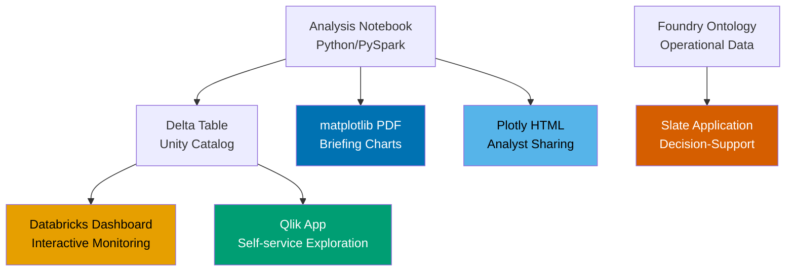

# Chapter 10: Visualization and Dashboards

The briefing was at 0800. The admiral had forty minutes before his next meeting, and Lieutenant Commander Danielle Reyes had spent three days building the dashboard that was supposed to change how he thought about readiness.

She'd done everything right. The data was clean — she'd personally validated it against the source systems. The analysis was sound. The underlying model had an 87% accuracy rate on holdout data. She had bar charts, trend lines, a correlation matrix, and a geospatial map showing equipment availability by region.

The admiral looked at the dashboard for ninety seconds. Then he looked at her. "What am I supposed to do with this?"

She didn't have an answer.

The charts were accurate. They were also completely wrong for the audience, the decision, and the thirty seconds of attention a flag officer gives any slide that isn't immediately legible. The correlation matrix required a statistics background to read. The geospatial map used color gradients that didn't render clearly on the conference room projector. The trend line showed the last eighteen months, but the admiral only cared about the next sixty days. The data told the right story. The visualization buried it.

Danielle walked out of that briefing room knowing exactly what she needed to build next.

*This scenario is a composite drawn from practitioner accounts of visualization failures in federal data science engagements. The pattern is common enough that most data scientists working in government can name their own version of this story.*

Visualization is not the end of data science work. It's the last mile — the part where all the cleaning, modeling, and analysis either reaches the decision-maker or doesn't. And "doesn't" is the far more common outcome, because most data scientists learn visualization last and treat it like formatting. It is not formatting. It is translation. You are converting a model's output into a claim a human can act on, in the time and context that human actually has.

Government visualization has a specific problem that commercial data science doesn't share at the same scale: your audience often cannot ask follow-up questions. A flag officer doesn't email you for the raw data. A program office director isn't going to click through to the underlying notebook. What they see is what they get. The visualization is the finding.

## What You'll Build

By the end of this chapter you will be able to:

- Build publication-quality static visualizations in matplotlib and seaborn for government briefings and technical reports
- Create interactive dashboards with Plotly that work in Databricks notebooks and standalone HTML exports
- Design Qlik Sense dashboards that use the associative engine effectively, not just as a PowerPoint substitute
- Understand Palantir Slate's architecture for building operational applications backed by the Foundry Ontology
- Build and share dashboards in Databricks — including the SQL warehouse-backed dashboard model introduced in 2024
- Apply government-specific visualization design rules: colorblind-safe palettes, chart type selection for procurement and readiness data, annotation standards for briefing decks
- Know when to use which tool and why

## The Design Decisions That Determine Whether Anyone Acts

Before writing a single line of code, you need to answer four questions about any visualization you're about to build:

**Who is the audience, and how much time do they have?** An analyst reviewing a dataset has twenty minutes. A program manager reviewing a weekly report has five. A flag officer in a briefing has thirty seconds per chart. These are not the same visualization. The analyst gets a scatterplot with all the data. The program manager gets a trend line with a decision threshold marked. The flag officer gets a single number in a large font with a red/green indicator and two words of context.

**What decision does this visualization need to support?** If you cannot name a specific decision, you do not have a visualization requirement — you have a data dump. "Show readiness over time" is not a requirement. "Show whether Carrier Strike Group 4 will be mission-capable for the October deployment window" is a requirement. The second one tells you exactly what to put on the x-axis, what to put on the y-axis, where to draw the threshold line, and what color to use for the past versus the projected period.

**What does the audience already believe, and what does the data contradict?** This is the question most data scientists never ask. If the decision-maker already believes readiness is declining, showing them it's declining doesn't change anything. Showing them which specific maintenance event category is driving 73% of the decline, and that it's addressable with a $4.2 million targeted investment, gives them something to act on. Lead with what's new, not with what confirms.

**What format will this be consumed in?** A Databricks notebook chart looks different when exported to PDF. A Qlik dashboard on a 4K monitor looks different on a 1080p projector. An interactive Plotly chart has no interactive features when screenshotted for a briefing. Design for the consumption format, not for your development environment.

None of these questions are technical. All of them determine whether your visualization works.

## Matplotlib: The Baseline That Goes Everywhere

Matplotlib is the visualization library that every other Python visualization library either wraps or reacts to. It runs on every platform in this handbook — Databricks notebooks, Palantir Foundry Code Workspaces, local Jupyter, and government-issued laptops with restricted package environments. If you can only have one visualization library, it's matplotlib.

The problem is that matplotlib's defaults are bad. The default figure size is wrong for briefings. The default font sizes are unreadable when exported to PDF. The default color cycle was designed for line plots and produces muddy results on bar charts. The default gridlines are too heavy. The default axis labels require squinting.

None of this is hard to fix. Here's the configuration block that goes at the top of every government visualization script:

```python
import matplotlib.pyplot as plt
import matplotlib.ticker as mticker
import numpy as np
import pandas as pd

# Government briefing style — optimized for PDF export and projector display
plt.rcParams.update({
    "figure.figsize": (10, 6),
    "figure.dpi": 150,
    "font.size": 11,
    "axes.titlesize": 13,
    "axes.labelsize": 11,
    "axes.spines.top": False,
    "axes.spines.right": False,
    "axes.grid": True,
    "grid.alpha": 0.3,
    "grid.linewidth": 0.8,
    "xtick.major.size": 0,
    "ytick.major.size": 0,
    "legend.frameon": False,
    "figure.facecolor": "white",
    "savefig.bbox": "tight",
    "savefig.dpi": 200,
})

# Colorblind-safe palette (Okabe-Ito, verified against common color vision deficiencies)
GOVT_PALETTE = {
    "blue":   "#0072B2",
    "orange": "#E69F00",
    "green":  "#009E73",
    "red":    "#D55E00",
    "purple": "#CC79A7",
    "sky":    "#56B4E9",
    "yellow": "#F0E442",
    "black":  "#000000",
}
```

Two rules about color in government visualization. First: use a colorblind-safe palette. Roughly 8% of men have some form of color vision deficiency. In a room of twenty analysts, one or two cannot distinguish your red from your green. When your status indicator uses red for "below threshold" and green for "above threshold," roughly 10% of your audience sees two shades of brown. The Okabe-Ito palette above was specifically designed to remain distinguishable across all common color vision types.

Second: use color to encode meaning, not decoration. If red means "critical," it should mean critical everywhere in the visualization, not just on the bars you wanted to highlight. If you use color inconsistently, your audience will stop trusting the color encoding entirely and start reading the labels instead — which defeats the purpose.

### Chart Types for Government Data

The five chart types that cover 90% of government data science visualization needs:

**Time series with threshold line.** Used for readiness, budget execution, training currency, maintenance backlogs. Put time on the x-axis, the metric on the y-axis, and a horizontal line marking the required threshold. Color the region below the threshold differently from the region above it.

```python
def plot_threshold_timeseries(
    dates, values, threshold,
    title, ylabel, threshold_label="Required",
    figsize=(12, 5)
):
    """
    Time series with threshold line and below-threshold shading.
    Standard format for readiness, budget, and training currency charts.
    """
    fig, ax = plt.subplots(figsize=figsize)

    # Plot the metric
    ax.plot(dates, values, color=GOVT_PALETTE["blue"], linewidth=2, zorder=3)

    # Shade below threshold in red, above in transparent
    ax.fill_between(
        dates, values, threshold,
        where=[v < threshold for v in values],
        alpha=0.2, color=GOVT_PALETTE["red"], label="Below threshold"
    )

    # Threshold line
    ax.axhline(threshold, color=GOVT_PALETTE["red"], linewidth=1.5,
               linestyle="--", label=f"{threshold_label}: {threshold}")

    ax.set_title(title, fontweight="bold", pad=12)
    ax.set_ylabel(ylabel)
    ax.legend(loc="lower left")

    # Format x-axis dates
    fig.autofmt_xdate()

    return fig, ax
```

**Horizontal bar chart for ranked comparisons.** Used for vendor spending, program-by-program comparisons, unit readiness rankings. Horizontal orientation is almost always better than vertical for government data: labels are longer than numbers, and the human eye reads rows faster than columns.

```python
def plot_ranked_bars(
    labels, values, title, xlabel,
    highlight_top_n=3, figsize=(10, 7)
):
    """
    Horizontal bar chart, sorted descending, top N highlighted.
    Standard for vendor, program, or unit comparisons.
    """
    sorted_idx = np.argsort(values)
    sorted_labels = [labels[i] for i in sorted_idx]
    sorted_values = [values[i] for i in sorted_idx]

    colors = [
        GOVT_PALETTE["blue"] if i >= len(sorted_values) - highlight_top_n
        else "#cccccc"
        for i in range(len(sorted_values))
    ]

    fig, ax = plt.subplots(figsize=figsize)
    bars = ax.barh(sorted_labels, sorted_values, color=colors, edgecolor="none")

    # Value labels on bars
    for bar, val in zip(bars, sorted_values):
        ax.text(
            bar.get_width() + max(sorted_values) * 0.01,
            bar.get_y() + bar.get_height() / 2,
            f"${val/1e6:.1f}M" if val > 1e6 else f"{val:,.0f}",
            va="center", ha="left", fontsize=9
        )

    ax.set_title(title, fontweight="bold", pad=12)
    ax.set_xlabel(xlabel)
    ax.set_xlim(0, max(sorted_values) * 1.15)
    ax.xaxis.set_major_formatter(
        mticker.FuncFormatter(
            lambda x, _: f"${x/1e6:.0f}M" if x >= 1e6 else f"{x:,.0f}"
        )
    )

    return fig, ax
```

**Small multiples for cross-unit comparison.** When you need to show the same metric across fifteen ships, twenty program offices, or ten NAICS categories, small multiples — one mini-chart per entity, laid out in a grid — beats a single overcrowded chart every time.

**Distribution with annotation.** Histograms or density plots with vertical lines marking the mean, the threshold, and notable outliers. Used for contract value distributions, maintenance cycle time analysis, personnel qualification rates.

**Scatter plot with categorical encoding.** Two numeric dimensions plus one categorical dimension encoded as color. Used for cost vs. schedule performance across contracts, or parts failure rate vs. time since last maintenance by ship class.

## Plotly: When the Chart Needs to Talk Back

Static matplotlib charts work for briefings and reports. When your audience is an analyst who needs to explore the data — zooming, filtering, hovering to see exact values — static charts fail. Plotly produces interactive HTML that runs in Databricks notebooks, in Foundry Code Workspaces, and as standalone files you can email.

The critical rule: know your delivery format before choosing Plotly over matplotlib. An interactive chart screenshotted into a PowerPoint slide has no interactive features. It also usually looks worse than a matplotlib chart designed for that format.

```python
import plotly.graph_objects as go
import plotly.express as px
from plotly.subplots import make_subplots

def plotly_readiness_dashboard(df, fy_col, unit_col, readiness_col, threshold=0.75):
    """
    Interactive readiness trend dashboard in Plotly.
    Works in Databricks notebooks (display(fig)) and as standalone HTML.

    Args:
        df: DataFrame with unit readiness data
        fy_col: Fiscal year column name
        unit_col: Unit identifier column
        readiness_col: Readiness rate column (0.0 to 1.0)
        threshold: Minimum required readiness rate
    """
    units = df[unit_col].unique()[:8]  # cap for readability

    fig = make_subplots(
        rows=2, cols=1,
        subplot_titles=["Readiness Rate by Unit Over Time",
                        "Units Below Threshold by Period"],
        vertical_spacing=0.12,
        row_heights=[0.65, 0.35]
    )

    colors = list(GOVT_PALETTE.values())

    # Top panel: trend lines per unit
    for i, unit in enumerate(units):
        unit_df = df[df[unit_col] == unit].sort_values(fy_col)
        fig.add_trace(
            go.Scatter(
                x=unit_df[fy_col],
                y=unit_df[readiness_col],
                name=str(unit),
                mode="lines+markers",
                line=dict(color=colors[i % len(colors)], width=2),
                marker=dict(size=6),
                hovertemplate=(
                    f"<b>{unit}</b><br>"
                    "Period: %{x}<br>"
                    "Readiness: %{y:.1%}<extra></extra>"
                )
            ),
            row=1, col=1
        )

    # Threshold line
    fig.add_hline(
        y=threshold,
        line_dash="dash",
        line_color=GOVT_PALETTE["red"],
        annotation_text=f"Required: {threshold:.0%}",
        annotation_position="bottom right",
        row=1, col=1
    )

    # Bottom panel: count of units below threshold per period
    below_threshold = (
        df[df[readiness_col] < threshold]
        .groupby(fy_col)[unit_col]
        .nunique()
        .reset_index()
    )
    below_threshold.columns = [fy_col, "units_below"]

    fig.add_trace(
        go.Bar(
            x=below_threshold[fy_col],
            y=below_threshold["units_below"],
            name="Units below threshold",
            marker_color=GOVT_PALETTE["red"],
            opacity=0.7,
            hovertemplate="Period: %{x}<br>Units below threshold: %{y}<extra></extra>"
        ),
        row=2, col=1
    )

    fig.update_layout(
        height=700,
        title_text="Readiness Dashboard",
        title_font_size=14,
        showlegend=True,
        legend=dict(orientation="h", yanchor="bottom", y=1.02, xanchor="right", x=1),
        plot_bgcolor="white",
        paper_bgcolor="white",
    )
    fig.update_xaxes(showgrid=True, gridcolor="#eeeeee")
    fig.update_yaxes(showgrid=True, gridcolor="#eeeeee")
    fig.update_yaxes(tickformat=".0%", row=1, col=1)

    return fig


def export_plotly_for_briefing(fig, output_path: str, width=1200, height=700):
    """
    Export a Plotly figure to a high-resolution PNG suitable for briefings.
    Requires kaleido: pip install kaleido

    This converts an interactive chart to a static image for inclusion
    in PowerPoint or PDF. Quality is better than screenshotting the browser.
    """
    fig.write_image(output_path, width=width, height=height, scale=2)
    print(f"Saved: {output_path}")
```

### Platform Spotlight: Databricks Dashboards

Databricks introduced its native dashboard product in 2024, built on top of Databricks SQL warehouses. It replaces the older "Legacy Dashboards" with a new product called Lakeview Dashboards, now generally available.

The architecture matters: Lakeview Dashboards run queries against a SQL warehouse endpoint, not against a notebook. This means the data source is a SQL query against Delta tables in Unity Catalog, not a pandas DataFrame in memory. The implication for government data scientists is significant: your data pipeline needs to land in a Delta table before it can feed a Databricks dashboard. The exploratory notebook where you computed the result is not the dashboard.

The workflow is:

1. Build and validate your analysis in a Databricks notebook (Python/PySpark)
2. Write the final dataset to a Delta table in Unity Catalog (`df.write.saveAsTable("catalog.schema.readiness_summary")`)
3. Build a Lakeview Dashboard against that table using SQL queries
4. Share via workspace URL or export as PDF

```python
# Step 2: Write analysis output to Delta for dashboard consumption
# Run this at the end of your analysis notebook

from pyspark.sql import SparkSession

spark = SparkSession.builder.getOrCreate()

# Convert your pandas result to Spark and write to Unity Catalog
result_spark = spark.createDataFrame(result_df)

(result_spark
    .write
    .format("delta")
    .mode("overwrite")
    .option("overwriteSchema", "true")
    .saveAsTable("gov_data.readiness.monthly_unit_summary")
)

print("Dashboard source table written. Open Databricks Dashboards to build the view.")
```

> **Note:** Databricks Lakeview Dashboards require a SQL Warehouse (serverless or pro tier), not a standard compute cluster. On Advana, confirm with your workspace administrator which SQL warehouse endpoint is available for your team before building dashboards against it.

## Platform Spotlight: Qlik Sense on Advana

Qlik is the primary business intelligence layer on Advana, where it serves 100,000+ DoD users across financial management, logistics, procurement, and readiness domains. If you're doing government data science, you will encounter Qlik. Whether you're building in it or presenting to stakeholders who use it, understanding how it works changes how you design everything upstream.

### The Associative Model Is Not PowerPoint

The biggest mistake data scientists make with Qlik is treating it like a more interactive version of a static report. It's not. The QIX Engine — Qlik's in-memory associative engine — means that every chart on a dashboard is connected to every other chart through the data model. When a user makes a selection (clicks on "FY2024" in a filter), every visualization on the sheet updates simultaneously to show only FY2024-relevant data. The excluded data turns gray. Related data highlights green.

This is not a filter. It's associative inference. The user is not querying the database; they are interacting with a fully connected in-memory model of all the data. The performance implications are real: for datasets above roughly 20 million rows, the QIX engine starts hitting memory limits in standard deployments. Advana handles this through data partitioning and node configuration, but extremely large datasets need to be pre-aggregated before being loaded into a Qlik app.

The design implication: when you build a Qlik app, you are not building a set of individual charts. You are building a data model and then building windows into that model. The data model defines what associations are possible. If your data model doesn't connect contracts to vendors, you cannot click on a vendor in one chart and have the contract chart update. Design the data model first. Build charts second.

### Qlik Load Script: Data Modeling Before Visualization

The Qlik Data Load Script is where your data transformation and association logic lives. It's SQL-like but not SQL. Government data scientists who know pandas or SQL find it readable within a day.

```qlik
// Qlik Load Script: Procurement dashboard data model
// Connects contract awards to vendor data and NAICS classifications

// Table 1: Contract awards from FPDS-NG (via Advana data catalog)
CONTRACT_AWARDS:
LOAD
    contract_award_unique_key              AS award_key,
    award_id_piid                          AS piid,
    recipient_uei                          AS vendor_uei,
    recipient_name                         AS vendor_name,
    awarding_agency_name                   AS agency,
    naics_code,
    obligation_amount,
    Date(award_date, 'YYYY-MM-DD')         AS award_date,
    Year(award_date)                       AS calendar_year,
    // Map to fiscal year: Oct-Dec of year N is FY N+1
    If(Month(award_date) >= 10,
       Year(award_date) + 1,
       Year(award_date))                   AS fiscal_year,
    // Fiscal quarter
    If(Month(award_date) >= 10, 1,
       If(Month(award_date) <= 3, 2,
          If(Month(award_date) <= 6, 3, 4))) AS fiscal_quarter
FROM [lib://DataCatalog/procurement_awards_fy2020_fy2024.qvd]
(qvd)
WHERE obligation_amount > 0
  AND naics_code <> ''
;

// Table 2: NAICS code descriptions (join key: naics_code)
NAICS_DESCRIPTIONS:
LOAD
    naics_code,
    naics_description,
    naics_sector
FROM [lib://DataCatalog/naics_reference_2022.qvd]
(qvd)
;

// Table 3: Vendor profile data (join key: vendor_uei)
VENDOR_PROFILES:
LOAD
    uei                                    AS vendor_uei,  // matches CONTRACT_AWARDS.vendor_uei
    business_type,
    small_business_flag,
    sba_certified_flag,
    entity_state
FROM [lib://DataCatalog/sam_vendor_profiles_current.qvd]
(qvd)
;
```

Three tables, three join keys. Qlik automatically associates them through the matching field names (`naics_code` appears in both CONTRACT_AWARDS and NAICS_DESCRIPTIONS; `vendor_uei` appears in CONTRACT_AWARDS and VENDOR_PROFILES). No explicit JOIN statement required. The QIX Engine handles the association at query time.

> **Note:** The `.qvd` format (Qlik Data File) is Qlik's proprietary binary format for optimized data loading. On Advana, data stewards pre-stage data as QVD files in the data catalog library for performance. For new datasets, you load from the source (CSV, Parquet, ODBC connection) and optionally store a QVD for subsequent loads.

### What Goes on a Qlik Sheet vs. What Stays in Your Notebook

Qlik dashboards are for exploration and monitoring. They are not for statistical analysis. The distinction matters.

In a Qlik dashboard, you put: KPI tiles showing current-period metrics against targets, time series trends, ranked bar charts by vendor or program, filter panels for fiscal year and agency, geospatial maps for location-coded data, and tables for drill-down to individual records.

In your analysis notebook, you keep: statistical significance tests, correlation matrices, model outputs, regression coefficients, anomaly scores from Isolation Forest. These do not belong in a Qlik dashboard. Qlik can display the *output* of your statistical analysis (a flagged column, a risk score, a predicted value) but it cannot run the analysis.

The workflow: Python computes the anomaly score → writes it to a Delta table on Advana → Qlik loads that column → Qlik dashboard shows a "Procurement Anomaly Risk" KPI backed by your model's output. The model is invisible to the Qlik user. They see the score.

## Platform Spotlight: Palantir Slate

Palantir Slate is the custom application builder in Foundry. It sits one layer above Qlik and one layer below a full custom web application: you can build anything you could build in HTML/CSS/JavaScript, but you're doing it inside the Foundry security and data access model, with the Ontology backing every data operation.

The use case Slate is built for: operational decision-support applications. Not dashboards. Not reports. Applications — where the user sees data, makes a decision, and takes an action that writes back to the system. A maintenance officer who opens a Slate application, sees which work orders are approaching deadline, assigns technicians to the overdue ones, and marks the high-priority items for supervisor review. The data informs the decision, the action is captured in the Ontology, and the next user who opens the same application sees the updated state.

This is architecturally different from every other tool in this chapter. Qlik, matplotlib, Plotly, and Databricks dashboards are all read-only. Slate is read-write. The Ontology's Action types are what enable write-back: a Slate button triggers a Foundry Action that modifies an Object's properties, which is recorded in the audit log, which feeds into downstream pipelines.

### When to Use Slate vs. Qlik

Use Qlik when the output is a chart or report. Use Slate when the output is a decision.

| Scenario | Right Tool |
|---|---|
| Weekly readiness report for program office | Qlik |
| Real-time maintenance queue where supervisors assign tasks | Slate |
| Budget execution trend analysis for CFO briefing | Qlik or matplotlib/PDF |
| Logistics officer reviewing and approving supply requisitions | Slate |
| Procurement anomaly investigation dashboard | Qlik |
| Aircraft scheduling application where ops officer sets fly/no-fly status | Slate |

Slate applications are built in JavaScript with Foundry's component library. Data scientists who are not front-end developers typically collaborate with application developers on Slate builds. Your role is: defining the Ontology objects and Actions that the application needs, writing the Code Workbook transforms that compute derived properties, and validating that the application's data is correct. The Slate developer builds the UI.

## Putting It Together: The Briefing-Ready Stack

A complete government visualization workflow for a readiness briefing:



*Figure: Visualization stack for government data science. The output format depends on the audience and whether the consumer needs to act or just observe.*

The admiral problem at the start of this chapter had a specific solution: one chart, one number, one decision. When Danielle built the second version, she put a single gauge showing carrier readiness against the deployment threshold, a three-line summary of what was driving the gap, and a dollar figure for the targeted maintenance investment needed to close it. The admiral made a decision in four minutes.

Ninety seconds of visualization. Three days of analysis. The three days don't matter if the ninety seconds fail.

## Annotation: The Thing Everyone Skips

Every chart that goes to a decision-maker needs at least two of these three elements: a title that states the finding (not just the topic), a source line, and a threshold or benchmark marker.

A title that states the finding: "Carrier Readiness Rate, FY2024" is a topic. "Carrier Readiness Fell Below 75% Threshold in Q3 FY2024 for the First Time Since FY2019" is a finding. The finding title does the work so the chart doesn't have to.

A source line: every government visualization that leaves your notebook gets a data source note. "Source: SAMS-E maintenance records via Advana, FY2024 Q1–Q3. Extracted 2024-09-15." This protects you when a stakeholder disputes the numbers — you have documented provenance.

A threshold or benchmark: if there's a required level, show it. If there's a prior-year comparison, show it. A metric without context is a number. A metric against a threshold is a finding.

```python
def annotate_for_briefing(ax, title_finding, source, threshold=None,
                           threshold_label=None, prior_value=None):
    """
    Add standard government briefing annotations to a matplotlib axes.

    title_finding: States the finding, not just the topic.
    source: Data provenance string.
    threshold: Optional numeric threshold to mark.
    prior_value: Optional prior period value for comparison annotation.
    """
    ax.set_title(title_finding, fontweight="bold", fontsize=12, pad=10, wrap=True)

    # Source line at bottom of figure
    ax.figure.text(
        0.01, -0.02, f"Source: {source}",
        fontsize=8, color="#666666", style="italic"
    )

    if threshold is not None:
        ax.axhline(threshold, color=GOVT_PALETTE["red"],
                   linewidth=1.2, linestyle="--", zorder=1)
        label = threshold_label or f"Threshold: {threshold}"
        ax.text(
            ax.get_xlim()[1], threshold, f"  {label}",
            color=GOVT_PALETTE["red"], va="center", fontsize=9
        )

    if prior_value is not None:
        ax.axhline(prior_value, color="#888888",
                   linewidth=1, linestyle=":", zorder=1)
        ax.text(
            ax.get_xlim()[1], prior_value, f"  Prior period: {prior_value:.1f}",
            color="#888888", va="center", fontsize=9
        )
```

## Platform Comparison

| Capability | matplotlib/seaborn | Plotly | Databricks Dashboards | Qlik Sense (Advana) | Palantir Slate |
|---|---|---|---|---|---|
| Primary use | Static charts for reports/PDFs | Interactive charts in notebooks | Monitored operational metrics | Self-service BI, exploration | Operational decision apps |
| Interactivity | None | Full (hover, zoom, filter) | Moderate (filter widgets) | Full (associative) | Full (+ write-back) |
| Write-back | No | No | No | No | Yes (via Ontology Actions) |
| Classification level | Depends on runtime | Depends on runtime | Up to IL5 (AWS GovCloud) | NIPR/SIPR on Advana | Up to IL5/IL6 (Azure Gov) |
| Audience | Technical, report recipients | Analysts, notebook users | Operations, monitoring | All DoD staff on Advana | Decision-makers + operators |
| FE skills required | None | None | None | Load Script (basic) | JavaScript (Slate dev) |
| Data source | Any Python object | Any Python object | Delta tables (SQL warehouse) | QVD / direct query | Foundry Ontology |
| Best for | Briefing decks, publications | Analyst tools, interactive reports | Real-time operational monitoring | Exploratory analysis, reporting | Operational applications |

## Where This Goes Wrong

**Failure Mode 1: Building for Yourself**

**The mistake:** Designing the visualization for the person who built the analysis (you), not for the person who will use it.

**Why smart people make it:** You spent three days on the analysis. You know every dimension of the data. A chart that shows everything you know feels more honest than one that shows one finding. But your audience didn't spend three days on the analysis. They have thirty seconds.

**How to recognize you're making it:**
- Your charts have more than five data series
- Your legend requires reading to decode
- The title names the data source rather than the finding
- You have included a methodology footnote longer than the chart title
- You are describing the chart in your verbal briefing rather than letting it speak

**What to do instead:** Ask yourself: if I could only show one number, what would it be? Start there. Add context only if the decision-maker needs it to act.

**Failure Mode 2: Choosing the Tool Before Choosing the Audience**

**The mistake:** Starting a visualization task by opening Qlik (or matplotlib, or Plotly) before deciding who the output is for and how they will consume it.

**Why smart people make it:** Tool familiarity. You know Qlik. You default to Qlik. The problem is a Qlik dashboard sent as a screenshot has no interactive features and often renders poorly at non-standard aspect ratios.

**How to recognize you're making it:**
- You are screenshotting an interactive chart for a static document
- You built a Databricks dashboard and the end user cannot access the Databricks workspace
- You sent a Plotly HTML file to someone whose email system strips HTML attachments
- You built a Slate application for a user who needed a PDF

**What to do instead:** Name the delivery format before opening any tool. Briefing deck → matplotlib PDF. Analyst tool → Plotly HTML or Databricks dashboard. Real-time operations → Qlik or Slate. Then pick the tool.

**Failure Mode 3: The Dashboard That Nobody Opens**

**The mistake:** Building a beautiful dashboard that answers every possible question — and having no one use it.

**Why smart people make it:** Building the comprehensive dashboard feels like doing the work thoroughly. Users will use it once they see how much is in it. They won't. A dashboard that requires a twenty-minute tutorial to use effectively is a dashboard that gets opened twice.

**How to recognize you're making it:**
- Your Qlik sheet has more than eight chart objects on it
- Users are asking you to email them screenshots because "it's easier"
- You have never watched an end user actually use your dashboard without your help
- The dashboard was built in three weeks and has been opened twelve times in three months

**What to do instead:** Build for one decision at a time. One KPI. One trend. One ranked list. One threshold comparison. If the decision-maker needs more, build a second sheet. Keep each sheet to three to five objects maximum. Design for the person who will open it at 7 AM before a 0800 briefing and has never clicked around it before.

## Practical Takeaway: The Visualization Design Checklist

Run this before delivering any visualization to a stakeholder:

**Audience and purpose**
- [ ] I can name the specific person or role who will look at this
- [ ] I can name the specific decision this visualization needs to support
- [ ] I know what format this will be consumed in (PDF, screen, projector, email)
- [ ] The visualization is designed for that format, not for my development environment

**Content**
- [ ] The title states the finding, not just the topic
- [ ] There is a data source annotation
- [ ] Any required thresholds or benchmarks are marked
- [ ] The chart has no more data series than necessary to support the decision
- [ ] Color is used consistently and encodes meaning (not decoration)
- [ ] The color palette is colorblind-safe

**Platform**
- [ ] The tool I used is appropriate for how this will be consumed
- [ ] If this is going into a PDF or slide, I did not use an interactive chart
- [ ] If this is for analyst self-service, I verified the user can access the platform
- [ ] If this writes back to any system, the write-back has been tested

**Government-specific**
- [ ] PII/PHI is not visible in chart labels, tooltips, or axis values
- [ ] Data classification is consistent with the platform it's hosted on
- [ ] If this is for a classified briefing, the visualization was generated in the appropriate classified environment

## Chapter Close

**The one thing to remember:** Visualization is translation. The chart is not evidence of your analysis — it is the vehicle that delivers the finding to the person who needs to act on it. If they cannot act in thirty seconds, the translation failed.

**What to do Monday morning:** Find the last chart you sent to a decision-maker. Ask: does the title state the finding or just the topic? Is the threshold or benchmark marked? Are there more than five data series? If any answer is "no / yes / yes," rebuild it with the standards in this chapter before the next time it goes out.

**What comes next:** Chapter 11 covers deployment and scaling — how analysis that works in a notebook gets packaged into something that runs reliably for the people who need it. The visualization choices you made in this chapter determine what your deployed product looks like to its users. A model without a usable output layer is a model nobody uses.
