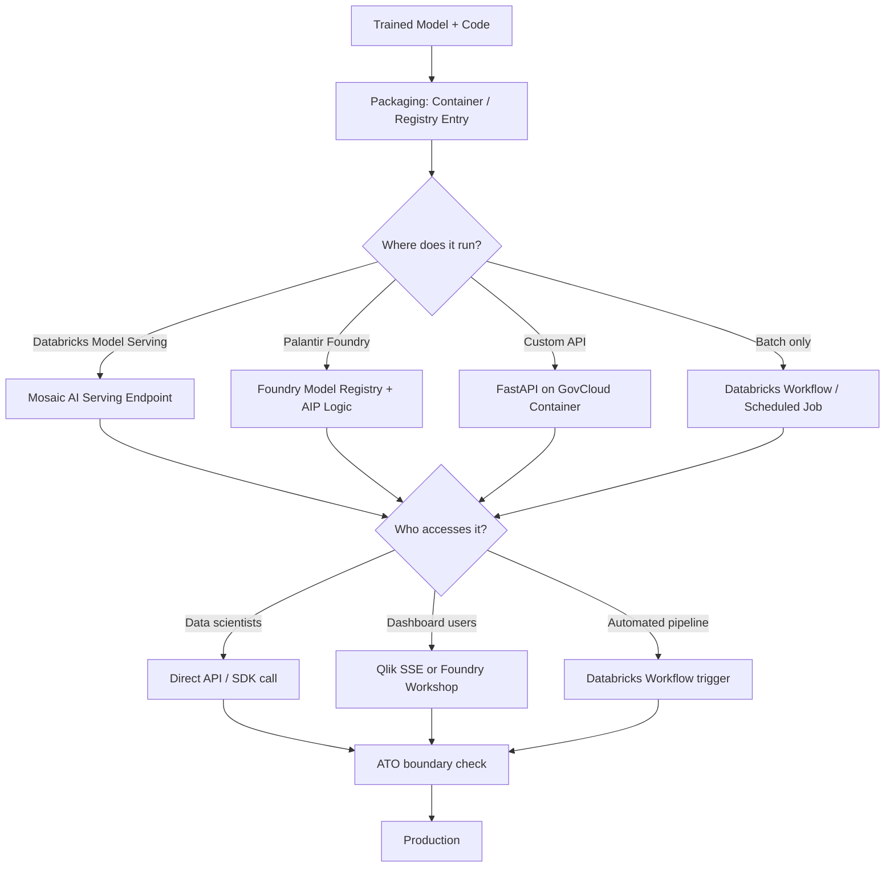

# Chapter 11: Deployment and Scaling

The model worked. Seven weeks of feature engineering, three rounds of hyperparameter tuning, and an MLflow experiment log that had grown to 247 runs — and the F1 score on the holdout set was 0.84. Marcus Webb printed the evaluation report and brought it to the program manager's office on a Thursday afternoon.

The program manager looked at the numbers for about ninety seconds. Then he asked a question Marcus had not prepared for.

"When can the fleet use it?"

Marcus did not have an answer. He had been so focused on building a good model that he had not thought carefully about what deploying it actually meant in this environment. His model ran in a Databricks notebook. The fleet operators who would use the output did not have Databricks access. The data the model needed to score came from a system on SIPRNET; the Databricks workspace was on NIPRNET. The model used a Python package that was not on the approved software list. And nobody had asked the ATO office whether adding a machine learning inference service counted as a new system component.

The model was ready. The deployment was not even started.

This is the gap that ends federal data science programs. Not bad models. Not wrong analysis. The gap between a notebook that produces a result and a system that produces that result reliably, securely, repeatably, and with authorization for the people who need it to use it.

*Note: Marcus is a composite character representing a pattern observed across multiple DoD analytics programs. No single individual or program is depicted.*

## What You'll Build

By the end of this chapter, you will be able to:

- Describe the difference between a model and a deployed model service, and why that difference matters under DoD acquisition rules
- Structure a model deployment for the correct platform based on classification level, user base, and latency requirements
- Package a model as a container image that can run in a FedRAMP-authorized cloud environment
- Register and serve a model through Databricks Model Serving (Mosaic AI) or Palantir Foundry's model registry
- Write a FastAPI inference endpoint suitable for an IL4 environment
- Explain what an ATO covers and what it does not, and identify the deployment decisions that require security office involvement before you make them
- Build a scaling strategy that fits the operational tempo of your program, not the defaults from a commercial tutorial

## The Deployment Problem Is Not Technical

Before any code: the hardest part of deploying a model in a federal environment is not containerization or API design. It is authorization.

Every software component in a DoD system must have an Authority to Operate. The ATO is issued by an Authorizing Official (AO) based on a security assessment of the system's configuration, data handling, and risk posture. When you add a new component — including a machine learning inference service — you may be expanding the scope of an existing ATO, or you may be creating a system component that needs its own.

This is not bureaucratic overhead. The NIST Risk Management Framework (RMF) process that underlies DoD ATOs exists because federal systems handle data that affects real people and real operations. A model that scores personnel readiness records is processing PII at IL4. Deploying it without proper authorization is not just a process violation — it can expose the program to legal liability and mission risk.

What this means operationally:

- Talk to your security officer before you start deployment planning. Not after you have built the container. Before.
- Understand the boundary of the existing system ATO. Is an inference API inside that boundary? Does adding a new service endpoint require a change request?
- If you are using a platform (Databricks Model Serving, Palantir Foundry, Advana) that already has a DoD ATO, your deployment may inherit that coverage — but you need to confirm it, in writing, with the AO's office.

> **Note:** The ATO guidance in this chapter reflects publicly available NIST RMF and DoD RMF documentation. For any specific program, you must consult your program's Authorizing Official and System Security Plan. This chapter does not constitute legal or compliance advice.

## What "Deployment" Means in the Federal Context

In commercial ML, "deployment" often means: push a Docker container to a Kubernetes cluster, expose a REST endpoint, done. In the federal context, deployment has more components:



*Figure: Federal model deployment decision tree. The ATO boundary check is not a final step — it should happen before packaging, not after.*

The five deployment patterns you will use most in DoD data science work:

| Pattern | When to Use | Platform | Latency |
|---------|------------|----------|---------|
| Batch scoring job | Nightly or weekly scoring of large datasets | Databricks Workflow | Hours acceptable |
| Real-time REST endpoint | Interactive applications, Qlik SSE, low-latency scoring | Databricks Model Serving / FastAPI | < 500ms required |
| Foundry pipeline + Workshop | Operational decision-support tools with writeback | Palantir Foundry | Seconds acceptable |
| Embedded model (SSE) | Scoring inside an existing Qlik dashboard | Qlik + Python SSE server | < 2s acceptable |
| Edge/offline | Disconnected operations, deployed assets | Custom container | Variable |

## Packaging: From Notebook to Deployable Artifact

A Databricks notebook is not a deployable artifact. It is a development environment. Before you can deploy, you need to produce something that can run outside that environment.

### The MLflow Model Format

MLflow serializes models in a format that includes the model artifact, the Python environment specification, and an inference schema. This is the standard for Databricks-based deployments.

```python
import mlflow
import mlflow.sklearn
from sklearn.ensemble import GradientBoostingClassifier
import pandas as pd
import numpy as np

# Train your model (see Chapter 06 for the full training pattern)
# Assume X_train, y_train are ready

model = GradientBoostingClassifier(n_estimators=100, max_depth=4, random_state=42)
model.fit(X_train, y_train)

# Define the input schema — this is what the serving endpoint will validate
from mlflow.models.signature import infer_signature
signature = infer_signature(X_train, model.predict(X_train))

# Log and register in one step
with mlflow.start_run():
    mlflow.sklearn.log_model(
        sk_model=model,
        artifact_path="maintenance_risk_model",
        signature=signature,
        registered_model_name="ship_maintenance_risk_classifier",
        # Include pip requirements for reproducibility
        pip_requirements=["scikit-learn==1.4.0", "pandas==2.1.4", "numpy==1.26.3"]
    )
```

The `registered_model_name` argument creates or updates an entry in the Unity Catalog Model Registry. From there, you can promote versions through Development → Staging → Production lifecycle stages — which maps cleanly to your program's dev/test/prod environment separation.

### The `palantir_models` Format

For Foundry deployments, use `palantir_models` (not the deprecated `foundry_ml`):

```python
import palantir_models as pm
from palantir_models_serializers import SklearnSerializer

# Wrap the trained model for Foundry's registry
model_adapter = pm.ModelAdapter(
    model=trained_model,
    serializer=SklearnSerializer()
)

# Publish — this makes the model available in AIP Logic and Workshop
published = pm.publish_model(
    model_adapter,
    model_name="ship_maintenance_risk",
    description="Predicts maintenance overrun risk for surface fleet CBM",
    tags={"program": "task_force_hopper", "il_level": "IL4", "version": "1.0"}
)
print(f"Model RID: {published.rid}")
```

## Databricks Model Serving: Mosaic AI

Databricks Model Serving (branded as Mosaic AI Model Serving in 2025) is the right choice for real-time inference when your data and users are already in the Databricks ecosystem.

As of 2025, the infrastructure handles 250,000+ queries per second with serverless GPU compute available on demand. For DoD GovCloud workspaces, A10g GPU instances are available in general availability as of mid-2025.

### Creating a Serving Endpoint

```python
import mlflow.deployments

client = mlflow.deployments.get_deploy_client("databricks")

# Create endpoint — this provisions a dedicated inference server
# backed by the registered model version you specify
endpoint = client.create_endpoint(
    name="ship-maintenance-risk-v1",
    config={
        "served_models": [
            {
                "model_name": "ship_maintenance_risk_classifier",
                "model_version": "3",        # production-promoted version
                "workload_size": "Small",     # Small / Medium / Large
                "scale_to_zero_enabled": True # cost control for non-24/7 workloads
            }
        ],
        "traffic_config": {
            "routes": [
                {
                    "served_model_name": "ship-maintenance-risk-v1",
                    "traffic_percentage": 100
                }
            ]
        }
    }
)
print(f"Endpoint state: {endpoint['state']}")
print(f"Endpoint URL: {endpoint['config']['served_models'][0]['endpoint_url']}")
```

### Calling the Endpoint

```python
import requests

# Token auth — in production, use a service principal, not a personal token
token = os.environ["DATABRICKS_TOKEN"]
endpoint_url = "https://<workspace>.azuredatabricks.net/serving-endpoints/ship-maintenance-risk-v1/invocations"

payload = {
    "dataframe_records": [
        {
            "days_since_last_maintenance": 72.0,
            "open_work_orders": 3,
            "mission_capable_pct_30d": 81.5,
            "operational_tempo_score": 68.0
        }
    ]
}

response = requests.post(
    endpoint_url,
    headers={"Authorization": f"Bearer {token}"},
    json=payload,
    timeout=10
)
result = response.json()
print(f"Risk score: {result['predictions'][0]}")
```

### Scale-to-Zero for Government Workloads

Federal programs rarely need 24/7 inference. Most DoD analytics applications score records in batch (nightly) or in response to user-triggered events during business hours. `scale_to_zero_enabled: True` means the endpoint spins down when not in use, which reduces cost. The tradeoff is cold start latency — the first request after a zero-scale period takes 30–90 seconds to warm up.

For workloads where that latency is acceptable (program manager dashboards, weekly reports), scale-to-zero is the right default. For workloads where it is not (real-time operator tools, Qlik SSE calls that users experience directly), set `scale_to_zero_enabled: False` and accept the always-on cost.

## Custom FastAPI Endpoint for IL4 Environments

When your model needs to run outside the Databricks ecosystem — or when you need more control over the API contract, authentication, or logging — a containerized FastAPI application is the right approach.

This pattern is common when:
- The inference consumer is a non-Databricks application (a legacy DoD portal, a custom web app, a Qlik SSE server)
- Your program has specific audit logging requirements for every inference request
- You are running in an environment where Databricks Model Serving is not available or not authorized

```python
# app/main.py — FastAPI inference service
# Designed for deployment in an IL4 FedRAMP-authorized container environment

from fastapi import FastAPI, HTTPException, Depends, Header
from pydantic import BaseModel, Field, validator
from typing import List, Optional
import mlflow.sklearn
import pandas as pd
import logging
import os
from datetime import datetime

# Structured logging — every inference request is logged for audit
logging.basicConfig(
    level=logging.INFO,
    format='{"timestamp": "%(asctime)s", "level": "%(levelname)s", "message": "%(message)s"}'
)
logger = logging.getLogger(__name__)

app = FastAPI(
    title="Ship Maintenance Risk API",
    description="Predicts maintenance overrun risk for surface fleet work orders. IL4.",
    version="1.0.0",
    # Disable Swagger UI in production — reduces attack surface
    docs_url="/docs" if os.getenv("ENVIRONMENT") != "production" else None,
    redoc_url=None
)

# Load model at startup — not per-request
MODEL_URI = os.environ.get("MODEL_URI", "models:/ship_maintenance_risk_classifier/Production")
model = None

@app.on_event("startup")
async def load_model():
    global model
    try:
        model = mlflow.sklearn.load_model(MODEL_URI)
        logger.info(f"Model loaded from {MODEL_URI}")
    except Exception as e:
        logger.error(f"Failed to load model: {e}")
        raise RuntimeError(f"Cannot start service without model: {e}")


class MaintenanceRecord(BaseModel):
    """Input schema for a single work order to score."""
    days_since_last_maintenance: float = Field(..., ge=0, le=3650,
        description="Days since last completed maintenance event")
    open_work_orders: int = Field(..., ge=0, le=100,
        description="Count of currently open work orders for this hull")
    mission_capable_pct_30d: float = Field(..., ge=0, le=100,
        description="Mission capable rate averaged over last 30 days")
    operational_tempo_score: float = Field(..., ge=0, le=100,
        description="Operational tempo index (0=stand-down, 100=max ops)")
    hull_number: Optional[str] = Field(None, description="Hull identifier for audit logging")

    @validator("days_since_last_maintenance")
    def validate_days(cls, v):
        if v < 0:
            raise ValueError("days_since_last_maintenance cannot be negative")
        return v


class ScoringRequest(BaseModel):
    records: List[MaintenanceRecord] = Field(..., min_items=1, max_items=500,
        description="Up to 500 records per request")


class ScoringResponse(BaseModel):
    predictions: List[float]
    model_version: str
    scored_at: str
    record_count: int


def verify_api_key(x_api_key: str = Header(...)):
    """
    Simple API key auth for service-to-service calls within the same IL4 boundary.
    In production, replace with CAC/PIV-based OAuth or a service principal token.
    """
    valid_key = os.environ.get("API_KEY")
    if not valid_key or x_api_key != valid_key:
        raise HTTPException(status_code=401, detail="Invalid API key")
    return x_api_key


@app.post("/score", response_model=ScoringResponse)
async def score_records(
    request: ScoringRequest,
    api_key: str = Depends(verify_api_key)
):
    """Score maintenance records for overrun risk."""
    if model is None:
        raise HTTPException(status_code=503, detail="Model not loaded")

    # Build feature DataFrame — column order must match training
    feature_cols = [
        "days_since_last_maintenance",
        "open_work_orders",
        "mission_capable_pct_30d",
        "operational_tempo_score"
    ]
    df = pd.DataFrame([r.dict() for r in request.records])[feature_cols]

    try:
        predictions = model.predict_proba(df)[:, 1].tolist()
    except Exception as e:
        logger.error(f"Inference error: {e}")
        raise HTTPException(status_code=500, detail=f"Inference failed: {str(e)}")

    # Audit log — every request logged with hull numbers and scores
    for record, score in zip(request.records, predictions):
        logger.info(
            f"scored hull={record.hull_number or 'unknown'} "
            f"score={score:.4f} "
            f"days_since_maint={record.days_since_last_maintenance}"
        )

    return ScoringResponse(
        predictions=predictions,
        model_version=MODEL_URI,
        scored_at=datetime.utcnow().isoformat() + "Z",
        record_count=len(predictions)
    )


@app.get("/health")
async def health_check():
    """Health check endpoint for container orchestration."""
    return {
        "status": "healthy" if model is not None else "degraded",
        "model_loaded": model is not None,
        "timestamp": datetime.utcnow().isoformat() + "Z"
    }
```

### Containerizing for GovCloud

```dockerfile
# Dockerfile — optimized for FedRAMP IL4 container deployment
# Use a minimal base image — reduces attack surface and scan findings
FROM python:3.11-slim

# Run as non-root user — required for most DoD container security policies
RUN groupadd -r appuser && useradd -r -g appuser appuser

WORKDIR /app

# Copy requirements first for layer caching
COPY requirements.txt .
RUN pip install --no-cache-dir -r requirements.txt

# Copy application code
COPY app/ ./app/

# Set ownership
RUN chown -R appuser:appuser /app
USER appuser

# Health check — used by container orchestration to verify readiness
HEALTHCHECK --interval=30s --timeout=10s --start-period=60s --retries=3 \
    CMD curl -f http://localhost:8000/health || exit 1

EXPOSE 8000

CMD ["uvicorn", "app.main:app", "--host", "0.0.0.0", "--port", "8000", \
     "--workers", "2", "--log-level", "info"]
```

```
# requirements.txt — pin all versions for reproducibility and supply chain security
fastapi==0.111.0
uvicorn[standard]==0.29.0
pydantic==2.7.1
mlflow==2.13.0
scikit-learn==1.4.2
pandas==2.2.2
numpy==1.26.4
```

> **Sanity check:** "I'll just use `latest` for the base image." Do not. Container security scanning on DoD pipelines flags unpinned images as a vulnerability. Pin your base image to a specific digest for production deployments. The CI/CD pipeline in your program's GitLab instance likely enforces this already — check before building.

## Palantir Foundry: Model-to-Application Deployment

Foundry's deployment model is different from Databricks and FastAPI. You do not expose a REST endpoint. Instead, the trained model becomes a resource in the Ontology, and AIP Logic or Foundry Pipelines call it within the operational application.

The deployment path:

1. Train model in Code Workspaces (JupyterLab)
2. Publish with `palantir_models` to the Foundry Model Registry
3. Reference the model in a Code Repository transform or AIP Logic block
4. Expose results through a Workshop application with Actions

This architecture means the model's outputs are governed by the same access controls as all other Ontology data. A user who can see a ship's maintenance history can see the model's risk score for that ship — and only them. The access control is inherited automatically from the Ontology, not configured separately for the model endpoint.

For government programs where fine-grained access control is a hard requirement, this is a significant advantage over a raw REST API.

```python
# Foundry Code Repository transform that calls a published model
# This runs as a scheduled Foundry Pipeline (batch scoring)

from transforms.api import transform, Input, Output
import palantir_models as pm
import pandas as pd

@transform(
    output=Output("/program/maintenance_risk/scored_work_orders"),
    work_orders=Input("/program/readiness/silver/work_orders_enriched"),
)
def compute_risk_scores(work_orders, output):
    """
    Batch scoring transform — runs on schedule via Foundry Pipelines.
    Reads from silver-tier work orders, writes risk scores back to Foundry.
    """
    df = work_orders.dataframe().toPandas()

    # Load the production-tagged model from the registry
    model = pm.load_model("ship_maintenance_risk", alias="production")

    feature_cols = [
        "days_since_last_maintenance",
        "open_work_orders",
        "mission_capable_pct_30d",
        "operational_tempo_score"
    ]
    features = df[feature_cols].fillna(df[feature_cols].median())

    df["risk_score"] = model.predict_proba(features)[:, 1]
    df["risk_tier"] = pd.cut(
        df["risk_score"],
        bins=[0, 0.3, 0.6, 1.0],
        labels=["Low", "Medium", "High"]
    )
    df["scored_at"] = pd.Timestamp.utcnow().isoformat()

    output.write_dataframe(df)
```

## Scaling Strategies for Government Workloads

Commercial scaling tutorials default to horizontal auto-scaling optimized for consumer traffic patterns — thousands of concurrent requests, sub-100ms latency, spike traffic from product launches. Federal analytics workloads look nothing like this.

Typical DoD analytics deployment patterns:

**Batch nightly:** The most common pattern. A Databricks Workflow or Foundry Pipeline runs at 0200 local time, scores all open records, writes results to a Delta table, and the Qlik dashboard shows fresh scores the next morning. Zero real-time latency requirement. Scale by adding cluster nodes, not replicas.

**Business hours burst:** A program manager opens the dashboard, clicks a filter, and a Qlik SSE call scores 200 records in real time. The SSE server needs to handle maybe 10 concurrent requests at peak. This is not a scaling problem. A single SSE server on a t3.medium handles it easily.

**Operational tempo driven:** The model scores records when a trigger fires — a maintenance event closes, a supply request is submitted, a readiness report is generated. Traffic follows operational tempo, not a clock. Design for event-driven architecture (Databricks Workflows with triggers, Foundry Pipeline event inputs) rather than polling.

**Surge during exercises:** Military exercises generate 10-50x normal data volume for 2-4 week periods. If your model scores in real time during exercises, plan for this. Databricks serverless compute handles surge automatically; dedicated clusters require manual scaling or a capacity reservation.

### Horizontal vs. Vertical Scaling on Databricks

For batch scoring jobs: **vertical scaling** (larger instance types) typically outperforms horizontal scaling for scikit-learn models, which do not distribute natively. A single r5.4xlarge node (128GB RAM) will process more records per hour than four r5.xlarge nodes for a pandas-based scoring job.

For Spark-based scoring (PySpark UDFs or native Spark ML): **horizontal scaling** is the right choice. Add worker nodes; Spark distributes the work automatically.

For Databricks Model Serving (real-time): let the platform auto-scale. You set the minimum and maximum replica count; the platform handles the rest.

```python
# Databricks batch scoring job — optimized for high-throughput
# This runs as a scheduled Workflow, not a real-time endpoint

import mlflow.sklearn
import pandas as pd
from pyspark.sql import functions as F
from pyspark.sql.types import DoubleType

# Load the model once on the driver — broadcast to executors via pandas UDF
model = mlflow.sklearn.load_model("models:/ship_maintenance_risk_classifier/Production")

# Broadcast the model so workers don't each load it from storage
broadcast_model = spark.sparkContext.broadcast(model)

# Pandas UDF for distributed scoring — each partition scored independently
from pyspark.sql.functions import pandas_udf

@pandas_udf(DoubleType())
def score_partition(
    days_since_maint: pd.Series,
    open_orders: pd.Series,
    mc_pct: pd.Series,
    tempo: pd.Series
) -> pd.Series:
    """Score a partition of records using the broadcast model."""
    features = pd.DataFrame({
        "days_since_last_maintenance": days_since_maint,
        "open_work_orders": open_orders,
        "mission_capable_pct_30d": mc_pct,
        "operational_tempo_score": tempo
    })
    return pd.Series(
        broadcast_model.value.predict_proba(features)[:, 1]
    )

# Score the full table in parallel across the cluster
df_scored = (
    spark.table("don_jupiter.readiness_silver.ship_maintenance_events")
    .filter("work_order_status = 'OPEN'")
    .withColumn(
        "risk_score",
        score_partition(
            F.col("days_since_last_maintenance"),
            F.col("open_work_orders"),
            F.col("mission_capable_pct_30d"),
            F.col("operational_tempo_score")
        )
    )
    .withColumn("scored_at", F.current_timestamp())
)

# Write back to Delta — MERGE to handle records scored in previous runs
df_scored.createOrReplaceTempView("new_scores")
spark.sql("""
    MERGE INTO don_jupiter.readiness_gold.work_order_risk_scores AS target
    USING new_scores AS source
    ON target.work_order_id = source.work_order_id
    WHEN MATCHED THEN UPDATE SET *
    WHEN NOT MATCHED THEN INSERT *
""")

print(f"Scored {df_scored.count():,} open work orders")
```

## ATO Considerations for Model Deployment

The ATO process for a model deployment touches four areas that data scientists routinely underestimate.

**Data flow authorization.** Your model reads from one system and writes to another. Both systems must be in scope for the ATO. If your scoring pipeline reads from a SIPRNET source and writes to a NIPRNET-accessible table, that data flow crosses a classification boundary and requires explicit review by the security officer. This is not optional.

**Software component authorization.** The Python packages your container uses must be on the program's approved software list (ASL) or go through an approval process. `scikit-learn`, `pandas`, `fastapi`, and `mlflow` are widely approved. Newer or less common packages may require a security review that takes weeks. Build your requirements.txt against what is already approved wherever possible.

**User access authorization.** Who can call your inference endpoint? Access controls on the endpoint must align with the access controls on the data the model was trained on. A model trained on IL4 CUI data cannot be called by users who only have IL2 authorization, even if the model output itself looks innocuous.

**Change management.** Retraining the model and updating the serving endpoint is a change to the production system. Your program's change management process applies. Most programs require a test/staging run with documented evaluation results before a new model version can be promoted to production. Build this into your MLOps workflow from day one.

| ATO Consideration | Who Handles It | When to Raise It |
|------------------|---------------|-----------------|
| Data flow boundary crossing | Security officer | Before architecture design |
| New software package | ISSO/ISSM | Before adding to requirements.txt |
| New system component (new endpoint) | AO/ISSO | Before building |
| Model version update (same endpoint) | Change control board | Before promoting to production |
| Significant model behavioral change | AO review likely | Before deploying a retrained model |

## Platform Comparison: Deployment Options

| Dimension | Databricks Model Serving | Palantir Foundry | Custom FastAPI | Qlik SSE |
|-----------|------------------------|-----------------|---------------|---------|
| Latency | < 100ms (warm) | Seconds (pipeline) | < 50ms | 1–3s |
| Scale | Auto (serverless) | Pipeline-managed | Manual / K8s | Single server |
| Real-time | Yes | No (batch pipeline) | Yes | Yes |
| Access control | Unity Catalog RBAC | Ontology RBAC | Custom / API key | Qlik section access |
| ATO coverage | Databricks IL5 ATO | Palantir FedRAMP High | Program-specific | Qlik IL4 ATO |
| Best for | Real-time scoring in Databricks ecosystem | Operational decision tools | Custom integrations | Dashboard-embedded scoring |
| Cold start | 30–90s (scale-to-zero) | N/A (batch) | 10–30s | None |
| GPU support | Yes (A10g, H100) | Via Code Workspaces | Manual config | No |

## Where This Goes Wrong

**Failure Mode 1: Deploying Before Checking the ATO Boundary**

**The mistake:** Building and deploying an inference service — possibly even running it with real data — before confirming with the security officer that the new component is within the program's ATO.

**Why smart people make it:** The model is done and working. The deployment feels like a technical step, not a compliance step. The security office is slow and asks for documentation you find annoying to produce.

**How to recognize you're making it:**
- You have not spoken to your ISSO since the program kickoff
- The inference endpoint is running in production and nobody has issued a change request
- The model is scoring records that contain PII and you are not sure whether that data handling is in the System Security Plan
- You plan to "sort out the ATO stuff after we show the program manager it works"

**What to do instead:** Security officer conversation, then architecture diagram, then build. In that order.

---

**Failure Mode 2: Notebook as Deployment**

**The mistake:** "Deployment" consists of sharing the Databricks notebook with more users and asking them to run it manually.

**Why smart people make it:** It works for demos. The notebook produces correct output. Formalizing it into a pipeline or endpoint feels like overengineering for what is ultimately a small model.

**The actual cost:** Notebooks run by hand are not reproducible, not auditable, not monitored, and not scalable. When the data scientist who built it leaves the program, the "deployment" breaks. When the source data schema changes, nobody notices until something downstream fails. There is no health check, no retry logic, no alerting.

**What to do instead:** A Databricks Workflow that runs the scoring logic on a schedule is not significantly more work than a notebook — it is maybe four hours of additional effort. Build it that way from the start.

---

**Failure Mode 3: Ignoring Cold Start in User-Facing Applications**

**The mistake:** Deploying a scale-to-zero endpoint as the backend for a Qlik dashboard that program managers use every Monday morning. Monday at 0800 is the first request after the weekend. It takes 75 seconds to respond. The program manager thinks the tool is broken.

**Why smart people make it:** Scale-to-zero saves money and is the recommended default in Databricks documentation. It is the right choice for many use cases.

**How to recognize you're making it:**
- Your endpoint is scale-to-zero and your users access it on a regular schedule with gaps between sessions
- The first request of each day is noticeably slower than subsequent requests
- You have never measured your endpoint's cold start latency

**What to do instead:** For user-facing dashboards, either disable scale-to-zero and accept the always-on cost, or implement a "keep-warm" request (a lightweight scheduled ping that hits the endpoint every 30 minutes to prevent cold start). The keep-warm pattern costs almost nothing and solves the problem entirely.

## Practical Takeaway: Deployment Readiness Checklist

Before any model goes to production, confirm every item below.

**ATO and Security**
- [ ] ISSO has reviewed the deployment architecture and confirmed it is within the current ATO boundary (or change request is in progress)
- [ ] All Python packages in requirements.txt are on the approved software list
- [ ] Data flow diagram shows all classification boundaries the scoring pipeline crosses
- [ ] Access controls on the endpoint match access controls on the training data
- [ ] PII/PHI handling in inference logging reviewed by security officer

**Packaging and Reproducibility**
- [ ] Model is registered in MLflow Model Registry (Databricks) or Foundry Model Registry (Palantir) — not just saved as a local file
- [ ] Model version is pinned in deployment config (not `latest`)
- [ ] Python environment is pinned (all package versions specified)
- [ ] Container image uses a specific base image digest (not `latest` or `slim`)
- [ ] Inference schema is defined and enforced (MLflow signature or Pydantic model)

**Operations**
- [ ] Health check endpoint implemented and monitored
- [ ] Inference requests are logged with enough context for audit (timestamp, input features, output, requesting user/service)
- [ ] Model version is included in every response (for debugging)
- [ ] Error handling covers model load failure, input validation failure, and inference failure separately
- [ ] Alert configured for endpoint unavailability or latency > SLA threshold

**Change Management**
- [ ] Model evaluation results documented before promotion to production
- [ ] Change request submitted for production deployment
- [ ] Rollback procedure defined (which previous model version to revert to and how)
- [ ] Retraining cadence documented in the model card

## Chapter Close

**The one thing to remember:** A good model that is not authorized to run in production is not deployed. Start the ATO conversation before you write a single line of deployment code.

**What to do Monday morning:** Find out the boundary of your program's current ATO. Ask your ISSO: "If I add a machine learning inference endpoint that reads from [your data source] and writes to [your output location], does that require a change request or a new component in the SSP?" Get that answer in writing before proceeding. Then pull your requirements.txt (if you have one) and confirm every package is on the approved software list. Those two conversations will determine your actual deployment timeline more than any technical decision you make.

**What comes next:** Chapter 12 covers ethics, governance, and compliance — the framework that governs what models should be built at all, not just how to build and deploy them. You have now seen the full technical arc from data ingestion through deployment. Chapter 12 asks the harder question: once you can deploy a model that influences a decision about a person or an operation, under what conditions should you? Federal AI governance policy, explainability requirements, and the specific rules that apply to AI-enabled decision-making in DoD contexts are not optional reading for a practitioner working in this environment.
