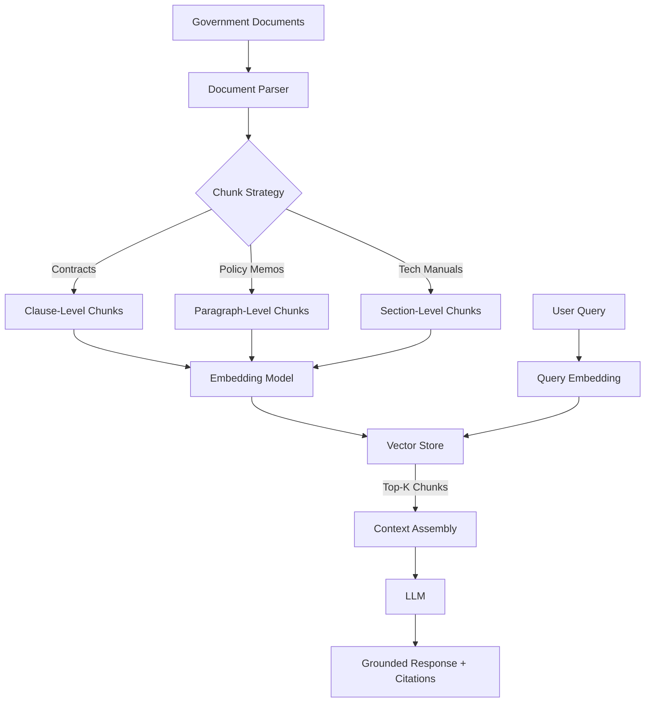

# Chapter 13: Advanced Topics — GenAI, RAG, and LLMs on Federal Platforms

The Situation Room briefing was scheduled for 0800. It was 0754, and Lieutenant Colonel Sarah Okafor was watching her analyst run the same CTRL+F search for the third time across eleven PDF documents — each one an intelligence summary from a different theater command, each one formatted differently, each one describing the same enemy logistics network in completely different terminology.

"There," the analyst said, highlighting a paragraph. "That's the reference we need." He'd found it in document nine of eleven. The briefing started in four minutes.

Okafor had seen this movie before. The information was always there. Finding it was the bottleneck. She'd been told, repeatedly, that the DoD was deploying AI to solve exactly this problem. What she needed was something that could read all eleven documents simultaneously and answer a natural-language question about enemy supply routes in under thirty seconds. What she had was a junior analyst with a sore ctrl finger.

Six months later, deployed on Maven Smart System — Palantir's AI platform running Anthropic's Claude at IL5 — that same workflow took 28 seconds. The analyst typed the question in plain English. The system cited which document each answer came from. The briefing prep dropped from forty minutes to twelve.

That gap — between what AI promises and what actually runs authorized in a federal environment — is what this chapter is about.

## What You'll Build

By the end of this chapter, you will be able to:

- Identify which LLMs are authorized at which classification levels and why that matters for your architecture
- Build a production RAG pipeline on government data using FAISS and ChromaDB with proper chunking for policy documents and contracts
- Write AIP Logic in Palantir Foundry to ground LLM responses in Ontology data, preventing hallucination by design
- Fine-tune a language model using LoRA/QLoRA on Databricks GPU clusters for domain-specific government tasks
- Engineer prompts for contract analysis, policy summarization, and FOIA response generation
- Implement hallucination detection and human-in-the-loop gates for high-stakes decisions
- Map GenAI capabilities across all five federal platforms

---

## The Model Authorization Problem

Here is the hardest part of working with LLMs in the federal government: the model you want to use is almost certainly not authorized where your data lives.

GPT-4, Claude, Gemini — these are commercial models that run on commercial infrastructure. Your contract data, operational data, and classified information cannot legally go to OpenAI's API. This is not a technical limitation. It is a legal one. The moment you send unclassified-but-sensitive acquisition data to a commercial API endpoint, you may have violated data handling requirements, your contract's CUI provisions, or your agency's system security plan.

So the question is not "which LLM is best?" The question is "which LLM is authorized for my data at my classification level?"

### The Authorization Matrix

The authorization picture as of March 2026:

| Model / Provider | Unclassified (CUI) | IL4 | IL5 | IL6 |
|---|---|---|---|---|
| GPT-4o (Azure OpenAI) | Yes (Azure Gov) | Yes | Yes (via Palantir/Azure partnership) | Yes (Azure Gov Top Secret) |
| Claude 3.5 / 3.7 (Anthropic) | Yes (via FedStart) | Yes (via FedStart) | Yes (via Palantir FedStart, April 2025) | In progress |
| Llama 3.1/3.3 (Meta, self-hosted) | Yes | Yes | Yes (air-gapped deployment) | Yes (air-gapped) |
| Mistral 7B/8x7B (self-hosted) | Yes | Yes | Yes (air-gapped) | Yes (air-gapped) |
| Gemini (Google, via FedStart) | Yes | Yes | In progress | No |

> **Note:** Authorization status changes. The table above reflects publicly announced program statuses as of March 2026. Before building a production system, verify current ATO status with your ISSO and check the FedRAMP Marketplace at marketplace.fedramp.gov.

The most important development in 2024-2025 was Palantir's FedRAMP High authorization in December 2024, followed by Anthropic joining the Palantir FedStart program in April 2025. That combination put Claude inside IL5 environments. The Palantir-Microsoft partnership from August 2024 put GPT-4 (via Azure OpenAI) into IL6 environments. Those two deals changed what was architecturally possible for defense AI.

For self-hosted open-source models like Llama 3.3 and Mistral, authorization follows your accredited compute environment. If your IL5 enclave has approved the model binary for import, you can run it. This is the most flexible path but requires the most engineering and security review.

### What "Model-Agnostic" Actually Means

Palantir AIP is built on a "k-LLM philosophy" — one architecture that can use any LLM on the platform interchangeably. When you build an AIP Logic workflow, you choose a model from a dropdown. Swapping from GPT-4 to Claude to Llama 3 requires changing that dropdown, not rewriting your application.

This matters more than it sounds. Model authorization changes. Models get updated, deprecated, and re-approved. If your application is tightly coupled to one model provider's SDK, every authorization change requires an engineering sprint. If you build on AIP's abstraction layer, you swap the model and move on.

The same principle applies when you build your own RAG stack. Design against an interface, not a provider.

---

## RAG at IL5: The Architecture That Actually Works

Retrieval-Augmented Generation is the dominant approach for using LLMs with government documents, and for good reason: it does not require fine-tuning, it is auditable (the source documents are cited), and it keeps sensitive data out of model weights.

The architecture is straightforward. You have a corpus of documents — contracts, technical manuals, policy memoranda, FOIA-eligible records. You chunk those documents, create vector embeddings of each chunk, store them in a vector database, and at query time you retrieve the most relevant chunks and inject them into the LLM's context window along with the user's question.

What is not straightforward is how you implement this at IL5 where you cannot call out to an external embedding API.

### Chunking Government Documents

Government documents have structure that you should exploit. A FAR Part 15 contract is not a continuous essay — it has clauses, sub-clauses, statement of work sections, and performance metrics. A policy memorandum has numbered paragraphs. A technical manual has chapters and subsections.

Naive chunking — splitting every 512 tokens with a fixed overlap — destroys this structure. When your analyst asks "what are the performance requirements for CLIN 0003," a 512-token sliding window chunk might split the performance requirement across two chunks, neither of which contains the full answer.

A better approach for government documents:

```python
# See code-examples/python/02_rag_pipeline.py for full implementation
# Hierarchical chunking strategy for government documents
```

The chunking strategy for government contracts:
- Split at clause boundaries first (identified by regex on FAR clause identifiers like "52.212-4")
- If a clause exceeds your target chunk size (~800 tokens), split at paragraph boundaries
- Always preserve metadata: document name, classification marking, clause number, page number
- Store the parent clause as metadata on each child chunk so retrieval can reconstruct context

For policy documents, split at numbered paragraph boundaries. For technical manuals, split at section headers. The structure is almost always there — you just have to read the document format before writing the chunker.

### Embedding Models at IL5

You have two options for embeddings in a classified environment:

**Option 1: Self-hosted sentence-transformers.** Models like `all-MiniLM-L6-v2` (80MB), `all-mpnet-base-v2` (420MB), or `e5-large-v2` (1.3GB) can be imported into an air-gapped environment and run entirely on-premise. No external API calls. For most government document retrieval tasks, `e5-large-v2` or the MTEB leaderboard's top performers give you production-quality embeddings.

**Option 2: Palantir's built-in embedding infrastructure.** If you are on Foundry at IL5, AIP Logic includes managed embedding models that run within Palantir's accredited environment. You do not manage the embedding model — Palantir does. This is the faster path if you are already in the Palantir ecosystem.



*Figure: RAG pipeline for government documents. The chunk strategy differs by document type. Citations flow back from retrieved chunks to the final response.*

### Vector Store Options

Three options in federal deployments, in order of operational simplicity:

**FAISS** (Facebook AI Similarity Search) is the right choice for a single-machine or batch retrieval workload. It is open source, runs entirely in-memory with optional disk persistence, and has no external dependencies. A corpus of 100,000 document chunks fits comfortably in memory on a modern server. For a RAG system where the corpus changes infrequently, FAISS is the simplest option.

**ChromaDB** adds a persistence layer and metadata filtering on top of FAISS-like vector search. When your analysts need to filter by document classification, program office, or date range before semantic search, ChromaDB handles that cleanly. It also has a server mode for shared access across a team.

**Palantir's built-in vector search.** In Foundry at IL5, AIP Logic can perform semantic search directly against documents stored in Foundry datasets. No separate vector database to stand up. This is the operationally simplest option if you are inside the Palantir environment — and the most common choice on DoD programs where Foundry is the authoritative data platform.

> **Sanity check:** "Can't I just use pgvector on PostgreSQL?" You can, and in some programs you will find it already approved. The tradeoff is that pgvector is slower at large scale than purpose-built vector stores, and its filtering + semantic search combination requires more careful query design. It is a reasonable choice for corpora under 50,000 chunks.

---

## Palantir AIP: Ontology-Grounded AI

The fundamental problem with general-purpose LLMs is that they hallucinate. They sound confident while saying things that are false. For a consumer asking ChatGPT about restaurant recommendations, this is annoying. For an acquisition officer asking an AI to summarize contract obligations, this is a liability.

Palantir's architectural answer to hallucination is the Ontology.

When you build an AI workflow in AIP Logic, the LLM does not have direct access to raw database tables or document blobs. It interacts with the Ontology — a semantic layer where every entity (a contract, a supplier, a program, an aircraft tail number) is defined as an Object Type with typed Properties and Links to other Objects.

When the LLM wants to know a supplier's performance history, it calls a Data Tool against the Ontology. It gets back structured data. When it wants to update the status of a contract action, it calls an Action Tool — a pre-defined write operation that a human administrator approved in advance. The LLM cannot perform arbitrary database writes. It can only take Actions that your team has explicitly defined, reviewed, and authorized.

This is not a safety theater. It is a genuine architectural constraint.

### Building Your First AIP Logic Workflow

AIP Logic is Palantir's no-code environment for building LLM-powered functions. The interface looks like a flow diagram: input comes in, goes through one or more LLM blocks with defined tools, produces output.

The components:

- **Use LLM Block**: The core unit. You write a system prompt, configure which tools the LLM can call, and define the output format (structured JSON or free text)
- **Data Tools**: Read-only access to Ontology objects. Example: "Get all open purchase orders for vendor X with value > $1M"
- **Logic Tools**: Execute Foundry Functions — TypeScript business logic that can do complex computations before returning results to the LLM
- **Action Tools**: Write-back operations. Example: "Create a contract action record," "Flag document for review"

The model-agnostic design means your AIP Logic workflow runs identically whether the underlying model is GPT-4, Claude, or Llama 3. You select the model at the block level and can switch without touching the workflow logic.

### Agent Studio for Conversational Workflows

AIP Agent Studio goes one level above AIP Logic. While Logic handles single-shot or batch functions, Agent Studio builds persistent conversational agents with memory and multi-turn context.

On a Navy shipbuilding program, the use case looks like this: an agent embedded in a Workshop dashboard that a procurement officer can ask "Which of our current suppliers have CPARS ratings below Satisfactory for the last two fiscal years?" The agent calls the relevant Data Tools, queries the Ontology, and returns a grounded answer with links to the underlying CPARS records. The procurement officer can follow up: "Of those, which have active contracts expiring in the next 90 days?" The agent maintains conversational context.

This is the difference between a search interface and an operational AI assistant.

---

## Fine-Tuning on Databricks: When to Do It and How

Most government AI use cases do not need fine-tuning. RAG handles most document Q&A tasks. Prompt engineering handles most classification and summarization tasks. Fine-tuning is expensive, time-consuming, and creates a model artifact you have to maintain and re-authorize every time the base model updates.

Fine-tune when:

- Your task requires domain-specific reasoning that in-context examples cannot convey (specialized military technical terminology, highly specific regulatory interpretation)
- Your inference budget requires a smaller model to be cost-effective at scale (fine-tuned 7B Llama can match GPT-4's accuracy on a narrow task at 1/20th the compute cost)
- You have labeled data that captures expert human judgment you want to encode (e.g., thousands of contract line-item award decisions annotated by a senior contracting officer)

Do not fine-tune to "teach the model your data." That is what RAG is for. Fine-tune to change how the model reasons, not what it knows.

### LoRA and QLoRA on Databricks GPU Clusters

Low-Rank Adaptation (LoRA) and its quantized variant QLoRA are the practical approaches to fine-tuning at government scale. They work by training a small set of adapter weights that sit alongside the frozen base model — instead of updating 7 billion parameters, you are updating ~8 million adapter parameters. This makes fine-tuning possible on hardware you can realistically get approved in a government environment.

On Databricks, the workflow runs on GPU-enabled clusters (typically A100 or H100 nodes). MLflow tracks every training run. Unity Catalog stores the resulting model artifact.

The Databricks Mosaic AI Training framework (formerly MosaicML) provides managed fine-tuning that wraps this complexity:

```python
# See code-examples/python/01_llm_integration.py for detailed implementation
# Quick reference: LoRA config for a 7B parameter model
from peft import LoraConfig, get_peft_model

lora_config = LoraConfig(
    r=16,           # rank of the adapter matrices
    lora_alpha=32,  # scaling factor
    target_modules=["q_proj", "v_proj"],  # which weight matrices to adapt
    lora_dropout=0.05,
    bias="none",
    task_type="CAUSAL_LM"
)
```

The `r` parameter controls the capacity of your adapter. r=8 is a minimal fine-tune for simple style adaptation. r=64 or higher is for tasks where you genuinely need significant behavioral change. Start at r=16 for most government domain adaptation tasks.

> **Note:** QLoRA reduces GPU memory requirements by approximately 4x by quantizing the base model to 4-bit precision during fine-tuning. A 13B parameter model that would require 2x A100 80GB GPUs with standard LoRA fits on a single A100 with QLoRA. This matters when you are working within government compute budgets.

### Storing Fine-Tuned Models

On Databricks, fine-tuned adapters and merged models register in MLflow's Model Registry and are versioned in Unity Catalog. This gives you full lineage: what data was used for training, what hyperparameters, what evaluation scores.

For Foundry deployments, the `palantir_models` library (the `foundry_ml` replacement as of October 2025) handles model publishing from Code Workspaces into the Foundry model registry, where the model can be called from AIP Logic or downstream pipelines.

---

## Prompt Engineering for Government Work

The best prompt for a government task is specific, structured, and adversarial.

Specific: include the document type, the relevant regulatory framework, and the precise output format. "Summarize this contract" produces mediocre output. "You are reviewing a DoD IDIQ contract. Extract: (1) the maximum ordering value, (2) the performance period, (3) all CLIN descriptions and unit prices, and (4) any liquidated damages clauses. Output as structured JSON with the field names: max_value, performance_period, clins, liquidated_damages." produces usable output.

Structured: government workflows need predictable output. Use JSON output mode when the result feeds downstream automation. For analyst-facing outputs, use a defined template: summary, confidence, citations, recommended action.

Adversarial: test your prompt on documents it should refuse or flag. If your contract analysis prompt classifies a letter of intent as a binding contract, you have a problem. Red-team your prompts with edge cases before deployment.

### Contract Analysis Pattern

The three highest-value contract analysis tasks in federal acquisition:

**CLIN extraction and validation**: Parse all Contract Line Item Numbers, prices, quantities, and performance work statement references. Flag CLINs where the unit price is inconsistent with historical data for that NAICS code.

**Risk clause identification**: Identify all clauses in FAR 52.2XX range that impose performance risks on the contractor — liquidated damages, termination for convenience, key personnel requirements. Surface these for the contracting officer's review.

**Deliverables schedule extraction**: Extract every required deliverable, its due date, and the accepting official. Build a compliance calendar. This task alone can take a contracting officer 2-3 hours on a 150-page contract. A well-designed LLM pipeline does it in 90 seconds.

### Policy Summarization and FOIA Processing

FOIA processing is one of the highest-volume document tasks in federal agencies. Thousands of documents must be reviewed, PII identified, and redaction decisions made. The authoritative human decision on whether to redact stays with the records officer — but the preliminary review and flagging can be AI-assisted.

A FOIA-assist pipeline:
1. Document ingestion and OCR normalization
2. PII detection (names, SSNs, addresses, phone numbers) with confidence scores
3. Exemption classification (which FOIA exemption applies to each flagged segment, if any)
4. Human review queue sorted by confidence — low-confidence AI decisions surface first

The human-in-the-loop requirement is not optional here. FOIA decisions are legally binding. The AI flags; the records officer decides.

---

## Responsible GenAI in High-Stakes Contexts

There is a version of this conversation that is philosophical. We are not having that version.

Here is the practical version: your AI system will be wrong sometimes. The question is whether it fails safely or silently.

### Hallucination Detection

For RAG systems, the most practical hallucination check is attribution testing: does every factual claim in the output trace back to a retrieved chunk? If the LLM says "Vendor XYZ has three unresolved cure notices," you should be able to find that claim in the retrieved documents. If you cannot, the LLM is confabulating.

Two implementation patterns:

**Citation enforcement**: Require the LLM to cite its sources inline. Any claim without a citation is treated as unverified. Build this into your system prompt and validate it at the output layer.

**Entailment checking**: Use a smaller classifier model to verify that each claim in the output is entailed by the retrieved context. This is more expensive (you are running two models per query) but catches hallucinations that cite the wrong source.

```python
# Simplified hallucination detection pattern
def check_response_grounding(response: str, retrieved_chunks: list[str]) -> dict:
    """
    Check whether response claims are supported by retrieved context.
    Returns confidence scores per claim.
    """
    # See code-examples/python/02_rag_pipeline.py for full implementation
    pass
```

### Human-in-the-Loop Gates

Not every AI decision should be automatic. The threshold for human review should be calibrated to the consequence of error.

Build explicit confidence thresholds and consequence tiers into your architecture:

| Decision Type | Error Consequence | Required Gate |
|---|---|---|
| Document classification (which folder) | Low — recoverable | Automated with audit log |
| Contract award recommendation | High — legal, financial | Human review required |
| FOIA redaction decision | High — legal, reputational | Human review required |
| Target identification (Maven) | Extreme — lethal force | Human-on-the-loop + command authority |
| PII flag for security review | Medium — privacy | Human review above threshold |

AIP Machinery (launched February 2025) is Palantir's direct product for this workflow: you define which steps in a process require human approval, and the Workshop application surfaces those decisions to the appropriate reviewer. The automation handles the routine cases; the humans handle the exceptions. Over time, the confidence threshold adjusts as the model proves itself on a given decision type.

---

## DoD AI: Maven, CDAO, and Task Force Lima

Maven Smart System is the most public example of deployed AI in the DoD. It was designated a Pentagon Program of Record in March 2026 — meaning it has stable, long-term funding and is no longer an experimental initiative. That designation matters. Programs of Record survive budget fights in ways that experiments do not.

The CDAO (Chief Digital and Artificial Intelligence Office) now has oversight of Maven. The CDAO is also the organization behind Advana, which means the same office is responsible for both DoD's enterprise data analytics platform and its primary AI warfighting capability. That structural consolidation — data and AI under one office — reflects a mature understanding that you cannot have effective AI without the data infrastructure to support it.

Task Force Lima was the DoD's 2023-2024 initiative to assess AI across the department. Its work fed into the current CDAO strategy. The conclusion that mattered most for practitioners: AI deployment in DoD requires both commercial speed and government-grade security, and the platforms that can deliver both (Palantir, Databricks on GovCloud, Azure OpenAI in classified networks) are the ones being scaled.

---

## Platform Comparison: GenAI Capabilities

| Capability | Advana (Databricks) | Qlik | Databricks (direct) | Navy Jupiter | Palantir AIP/Foundry |
|---|---|---|---|---|---|
| LLM integration | Mosaic AI / DBRX | Limited (third-party) | Native Mosaic AI | Limited | Native AIP (model-agnostic) |
| RAG support | Yes (Vector Search) | No native | Yes (Vector Search) | Limited | Yes (built-in + external) |
| Fine-tuning | Yes (GPU clusters) | No | Yes (GPU clusters) | No | Via Databricks integration |
| Ontology grounding | No | No | No | No | Yes (core differentiator) |
| Agent framework | MLflow agents | No | Yes (Mosaic AI Agents) | No | AIP Agent Studio |
| Classification level | IL5 (Advana) | FedRAMP Moderate | IL5 (GovCloud) | IL5 (Navy) | IL5/IL6 (FedStart/Azure) |
| No-code LLM tooling | Moderate | None | Moderate | None | High (AIP Logic) |
| Human-in-the-loop | Manual workflow | No | Manual workflow | No | AIP Machinery (native) |

The honest read of this table: Palantir AIP has the deepest native GenAI capabilities on federal platforms, particularly for operational AI that needs to ground its answers in structured organizational data. Databricks has the deepest ML development infrastructure for teams that need to train, evaluate, and serve models at scale. These are genuinely different strengths for different use cases — Databricks for building AI, Palantir for deploying AI into operations, as the March 2025 Databricks-Palantir partnership memo explicitly acknowledged.

Qlik and Navy Jupiter are not serious contenders for GenAI workloads in 2026. Their value is elsewhere.

---

## Where This Goes Wrong

**Failure Mode 1: Using the Wrong Authorization Level**

**The mistake:** Sending IL4 or higher data to a commercial LLM endpoint that is only FedRAMP Moderate authorized.

**Why smart people make it:** The developer environment runs against test data, everything works, and the authorization level of the test data is not checked before production deployment. The commercial endpoint produces better results than the authorized one. The pressure to ship something that works overrides the security review.

**How to recognize you're making it:**
- Your SSP (System Security Plan) does not list the LLM API endpoint as an approved external service
- You are making direct calls to `api.openai.com` or `api.anthropic.com` from an environment that handles anything above FedRAMP Moderate
- Nobody on the team has asked "what is the ATO status of this API endpoint?"
- The ISSO has never heard of the AI component of your application

**What to do instead:** Start authorization early. Treat the LLM endpoint as a new external service that requires the same security review as any other external dependency. Use Palantir FedRAMP High or Azure Government endpoints for anything above Moderate. For IL5+, use Palantir/Azure classified environment deployments or self-hosted open-source models.

---

**Failure Mode 2: RAG Without Proper Chunking**

**The mistake:** Chunking government documents with a generic 512-token sliding window and wondering why the retrieval quality is poor.

**Why smart people make it:** The LangChain or LlamaIndex defaults work in demos. A demo document corpus is usually well-formatted prose. Government documents are structured forms, numbered paragraphs, and tables that get destroyed by sliding-window chunking.

**How to recognize you're making it:**
- Your retrieval returns chunks that start or end mid-sentence with no apparent boundary logic
- Contract clause numbers appear in the middle of chunks rather than at the start
- Analysts report that the system "finds the right document but misses the specific answer"
- Your chunk metadata does not include the source clause or section number

**What to do instead:** Build document-type-aware chunkers. Regex on FAR clause identifiers for contracts. Header detection for technical manuals. Numbered paragraph detection for policy memoranda. The 20 lines of code to build a proper chunker will improve your retrieval F1 score more than any change to your vector store or embedding model.

---

**Failure Mode 3: AI Without Human-in-the-Loop for High-Stakes Decisions**

**The mistake:** Automating a decision that has significant legal, financial, or operational consequences without a human review gate.

**Why smart people make it:** The model accuracy is high — 94% on the test set. The speed benefit of full automation is real. The business case for removing the human bottleneck is compelling. The 6% error rate sounds small until it is applied to 10,000 contract actions per year.

**How to recognize you're making it:**
- The AI output directly triggers a downstream action (a payment, a flag, a notification) with no human approval step
- The only human-in-the-loop is after the fact (audit review, not pre-approval)
- The system cannot route uncertain cases to a human — it only produces outputs at fixed confidence
- No one has calculated what the dollar cost or legal exposure of the error rate is

**What to do instead:** Design human review as the default. Automation is the exception that the AI earns through demonstrated accuracy on a specific decision type. Build confidence thresholds. Build escalation paths. Log every AI decision with the confidence score and retrieved context so errors can be diagnosed and learned from.

---

## Practical Takeaway: Your GenAI Readiness Diagnostic

Before your team builds its first production LLM system on a federal program, answer these questions. If you cannot answer any of them, stop and find the answer before writing code.

**Authorization**
- What is the classification level of your data? (CUI, IL4, IL5, IL6)
- What LLM endpoints are approved in your environment's System Security Plan?
- Who is the ISSO and have they been briefed on your AI component?

**Architecture**
- Are you using RAG, fine-tuning, or prompt engineering — and why that choice for this use case?
- Where does your vector store run, and is that environment accredited?
- What embedding model are you using, and where does it run? (No external API calls at IL4+)

**Operations**
- Which decisions in your workflow require human review, and how is that review triggered?
- How do you detect and log hallucinations?
- What is the remediation process when the AI is wrong?

**Platform fit**
- If you are on Foundry: are your source documents in Foundry datasets, and is your Ontology modeled to support the AI use case?
- If you are on Databricks: is your corpus registered in Unity Catalog for lineage tracking?
- Have you run the relevant training data through your data quality checks from Chapter 4?

---

## Chapter Close

**The one thing to remember:** The authorization problem is as important as the technical problem — the best RAG architecture running on an unauthorized endpoint is a security incident waiting to happen, and the worst RAG architecture running on an accredited IL5 system at least keeps your program alive.

**What to do Monday morning:** Pull up your current program's System Security Plan and find the section on authorized external services. Confirm whether any LLM API endpoint is listed. If it is not listed and your team is using one, that is a conversation you need to have with your ISSO before anything else. If you are evaluating a new GenAI component, reach out to your Palantir or Databricks account team and ask specifically about ATO documentation for their AI capabilities at your classification level — both vendors have dedicated federal teams who can accelerate that process.

**What comes next:** This is the final technical chapter. Chapter 14 brings everything together — building a capstone project that takes a real government dataset from raw ingestion through wrangling, EDA, supervised modeling, and production deployment, applying the platform knowledge from every preceding chapter. If you have been reading linearly, you now have all the tools. The last chapter is about putting them to work.

---

*Cross-references: Chapter 8 (Deep Learning) covers neural network foundations underlying LLMs. Chapter 9 (MLOps) covers model deployment patterns, MLflow tracking, and the production pipeline infrastructure that GenAI workflows depend on. Chapter 12 (Ethics and Governance) covers the policy framework — NIST AI RMF, DoD AI Ethics Principles — that governs responsible AI deployment.*
