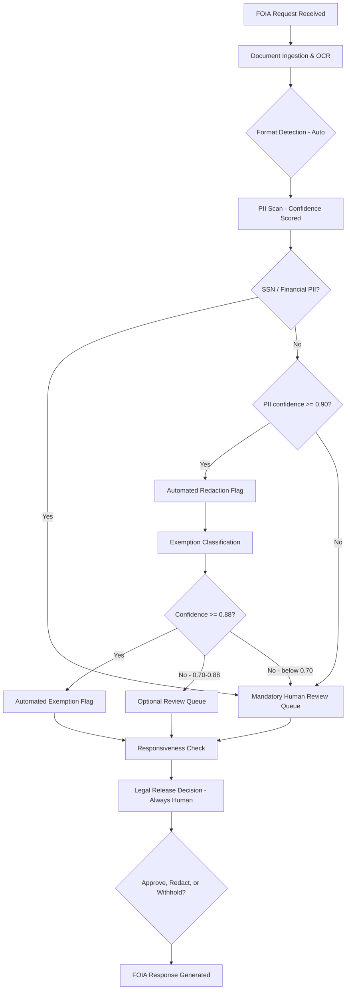

# Chapter 13 Exercise Solutions

---

## Exercise 1: Authorization Audit — Solutions

### Part A: Written Answers

**Question 1: Authorization level differences**

FedRAMP Moderate covers cloud services handling data with moderate impact if compromised — typically Controlled Unclassified Information (CUI) that does not involve national security. This is the baseline for most civilian agency systems. FedRAMP High adds stricter controls for data whose unauthorized disclosure could cause serious harm to public health, safety, or national security — systems like emergency services, law enforcement, or financial systems. IL4 (Impact Level 4) is the DoD equivalent of FedRAMP High, covering Controlled Unclassified Information including information that could affect DoD missions. IL5 covers DoD mission-critical National Security Systems and data sensitive enough that exposure could seriously damage national security, but not yet classified. Classified data (Secret and above) requires IL6. For most data science work on defense programs, you are operating at IL4 or IL5, and the authorization level of your data determines which cloud endpoints you can use.

**Question 2: Single Palantir FedRAMP High authorization**

Palantir's December 2024 FedRAMP High Baseline Authorization covers the Palantir Federal Cloud Service (PFCS), which includes AIP, Apollo, Foundry, Gotham, FedStart, and Mission Manager. A single authorization covering all these products matters for program teams because it means a team using Foundry for data integration and AIP for LLM workflows does not need separate ATOs for each product. The integration between Foundry and AIP — central to the Ontology-grounded AI approach — is covered by a single accreditation. This simplifies the acquisition process and the ISSO's review burden, and it means teams can adopt new AIP capabilities as Palantir releases them without triggering a new authorization review for each feature.

**Question 3: Claude at IL5 via FedStart**

After Anthropic joined the Palantir FedStart program in April 2025, Claude can be accessed at IL5 through Palantir's FedRAMP High authorized infrastructure. In practice, this means API calls to Claude route through Palantir's accredited environment rather than going to `api.anthropic.com`. The program team does not run the LLM infrastructure — Palantir operates it within their authorized environment. The practical requirement is that the program must already be operating on Palantir Foundry or be willing to route AI calls through Palantir's proxy. A direct Anthropic API call to `api.anthropic.com` is not authorized for IL5 data because that endpoint runs on commercial (non-government) infrastructure that does not have DoD IL5 authorization.

**Question 4: ATO process for self-hosted Llama 3.3 at IL5**

Getting an open-weight model like Llama 3.3 approved for use in an IL5 environment requires treating the model binary as a software product that must pass your environment's software security review. Broadly: (1) Obtain the model weights from a known-good source (Meta's official Hugging Face repository) and verify the SHA-256 hash against the published value — this is the supply chain integrity check. (2) Scan the model packaging for vulnerabilities using your STIG-compliant scanning tools (models are typically Python package + binary weights; the Python code must be scanned). (3) Import the approved binary through your environment's authorized import process (typically an air-gap transfer or a reviewed software request). (4) Document the model version, source, hash, and intended use in your System Security Plan as an approved software component. (5) Re-approve when you update to a new model version. The model weights themselves (large binary files) do not typically trigger STIG findings, but the inference server software (vLLM, Ollama) does and must be patched and approved.

### Part B: Risk Memo

---
**MEMORANDUM**

**TO:** Program Manager, [Program Name]

**FROM:** [Your name], Lead Data Scientist

**SUBJECT:** Unauthorized LLM Endpoint — Immediate Risk to IL4 Program Data

The current prototype makes API calls to `api.openai.com` to process program data. This endpoint operates on OpenAI's commercial infrastructure, which does not hold a DoD IL4 authorization. Sending IL4 data — which includes controlled unclassified information related to [program domain] — to a non-authorized endpoint is a potential data spillage event and a violation of our System Security Plan.

The risk is not theoretical. IL4 data sent to a commercial API endpoint is processed on servers outside DoD accredited boundaries, logs of that data may be retained by the vendor for model training or operations (subject to their commercial terms of service), and we have no visibility into or control over where that data goes after transmission. The CUI markings on this data create legal obligations we cannot honor if the data has already left our authorized environment.

The team has three options: (1) Redeploy the prototype to use Azure OpenAI via Azure Government endpoints, which are IL4 authorized, with minimal code changes — this is the fastest path. (2) Route LLM calls through Palantir FedStart if the program is on Foundry. (3) Deploy a self-hosted open-source model (Llama 3.3) within the accredited environment — this requires engineering effort but eliminates any external dependency.

No IL4 data should move through the current prototype until one of these options is in place. I recommend Option 1 as the fastest path to compliance.

---

---

## Exercise 2: Government Document Chunker — Solution

### Part A: Edge Case Handling

```python
import re
from typing import Optional

# Edge case additions to chunk_government_contract():

def chunk_government_contract_v2(
    text: str,
    source_doc: str,
    classification_marking: str = "UNCLASSIFIED//CUI",
    max_chunk_tokens: int = 800
) -> list:
    """Enhanced version handling preamble, DFARS, and SOW sections."""
    max_chunk_chars = max_chunk_tokens * 4

    # EDGE CASE 1: Detect and preserve preamble before first FAR/DFARS clause
    # Find where the first FAR/DFARS clause starts
    first_clause_match = re.search(
        r'(?:52\.|252\.)\d{3}(?:-\d+)?',
        text
    )
    preamble_text = ""
    clause_text = text
    if first_clause_match:
        preamble_text = text[:first_clause_match.start()].strip()
        clause_text = text[first_clause_match.start():]

    chunks = []

    # Handle preamble as its own chunk(s)
    if preamble_text:
        if len(preamble_text) <= max_chunk_chars:
            chunks.append(_make_chunk(
                text=preamble_text,
                source_doc=source_doc,
                doc_type="contract",
                classification_marking=classification_marking,
                section_reference="PREAMBLE",
                page_number=None,
                chunk_index=len(chunks),
                parent_section="PREAMBLE"
            ))
        else:
            # Long preamble: split at paragraph boundaries
            for para in preamble_text.split("\n\n"):
                if para.strip():
                    chunks.append(_make_chunk(
                        text=para.strip(),
                        source_doc=source_doc,
                        doc_type="contract",
                        classification_marking=classification_marking,
                        section_reference=f"PREAMBLE-{len(chunks)}",
                        page_number=None,
                        chunk_index=len(chunks),
                        parent_section="PREAMBLE"
                    ))

    # EDGE CASE 2: Pattern covers both FAR (52.XXX) and DFARS (252.XXX)
    # Updated pattern: handles both FAR and DFARS prefixes
    far_dfars_pattern = re.compile(
        r'(?:^|\n)(?=\s*(?:252\.\d{3}-\d{4}|52\.\d{3}-\d{1,4})\s)',
        re.MULTILINE
    )

    clause_splits = far_dfars_pattern.split(clause_text)
    clause_splits = [s.strip() for s in clause_splits if s.strip()]

    for section in clause_splits:
        # EDGE CASE 3: Detect attached SOW with no FAR clause numbers
        sow_indicators = ["STATEMENT OF WORK", "PERFORMANCE WORK STATEMENT",
                          "SECTION C —", "SECTION C:", "ATTACHMENT 1"]
        is_sow = any(indicator in section.upper()[:100] for indicator in sow_indicators)

        if is_sow:
            # Split SOW at numbered section boundaries
            sow_section_pattern = re.compile(r'(?:^|\n)(?=\s*\d+\.\d*\s+[A-Z])', re.MULTILINE)
            sow_sections = sow_section_pattern.split(section)
            sow_sections = [s.strip() for s in sow_sections if s.strip()]

            for sow_idx, sow_section in enumerate(sow_sections):
                sow_num_match = re.match(r'^(\d+\.\d*)', sow_section)
                sow_ref = sow_num_match.group(1) if sow_num_match else f"SOW-{sow_idx}"
                chunks.append(_make_chunk(
                    text=sow_section,
                    source_doc=source_doc,
                    doc_type="contract",
                    classification_marking=classification_marking,
                    section_reference=f"SOW-{sow_ref}",
                    page_number=None,
                    chunk_index=len(chunks),
                    parent_section="STATEMENT OF WORK"
                ))
        else:
            # Normal FAR/DFARS clause processing (same as original)
            clause_match = re.match(r'^(252\.\d{3}-\d{4}|52\.\d{3}-\d{1,4})', section)
            clause_ref = clause_match.group(1) if clause_match else "UNKNOWN"

            if len(section) <= max_chunk_chars:
                chunks.append(_make_chunk(
                    text=section,
                    source_doc=source_doc,
                    doc_type="contract",
                    classification_marking=classification_marking,
                    section_reference=clause_ref,
                    page_number=None,
                    chunk_index=len(chunks),
                    parent_section=clause_ref
                ))
            else:
                # Oversized clause: split at paragraph boundaries
                for para_idx, para in enumerate(section.split("\n\n")):
                    if para.strip():
                        chunks.append(_make_chunk(
                            text=para.strip(),
                            source_doc=source_doc,
                            doc_type="contract",
                            classification_marking=classification_marking,
                            section_reference=f"{clause_ref}-p{para_idx}",
                            page_number=None,
                            chunk_index=len(chunks),
                            parent_section=clause_ref
                        ))

    return chunks


# Test functions for the three edge cases:

def test_preamble_detection():
    """Edge Case 1: Preamble before first FAR clause."""
    text = """
    DEPARTMENT OF DEFENSE CONTRACT
    CONTRACT NUMBER: W91QV2-25-C-0042
    EFFECTIVE DATE: 1 October 2025
    VENDOR: Apex Defense Solutions LLC

    The contractor shall provide services in accordance with the following clauses:

    52.212-4 CONTRACT TERMS AND CONDITIONS—COMMERCIAL PRODUCTS AND COMMERCIAL SERVICES
    (OCT 2018) This clause applies to this contract.

    52.249-8 DEFAULT (FIXED-PRICE SUPPLY AND SERVICE)
    If the Contractor refuses or fails to perform...
    """
    chunks = chunk_government_contract_v2(text, "test_contract.pdf")
    preamble_chunks = [c for c in chunks if "PREAMBLE" in c.section_reference]
    clause_chunks = [c for c in chunks if "52." in c.section_reference]
    assert len(preamble_chunks) >= 1, "Should have at least one preamble chunk"
    assert len(clause_chunks) >= 2, "Should have chunks for both FAR clauses"
    print(f"PASS: Preamble detection — {len(preamble_chunks)} preamble, {len(clause_chunks)} clause chunks")


def test_dfars_before_far():
    """Edge Case 2: DFARS clause appearing before FAR clause."""
    text = """
    252.204-7012 SAFEGUARDING COVERED DEFENSE INFORMATION AND CYBER INCIDENT REPORTING
    (DEC 2019) The contractor shall implement NIST SP 800-171 controls...

    52.232-33 PAYMENT BY ELECTRONIC FUNDS TRANSFER—SYSTEM FOR AWARD MANAGEMENT
    (OCT 2018) All payments shall be made by EFT...
    """
    chunks = chunk_government_contract_v2(text, "test_dfars.pdf")
    dfars_chunk = next((c for c in chunks if "252." in c.section_reference), None)
    far_chunk = next((c for c in chunks if "52.232" in c.section_reference), None)
    assert dfars_chunk is not None, "DFARS clause should be chunked"
    assert far_chunk is not None, "FAR clause should be chunked"
    print(f"PASS: DFARS/FAR ordering — found {dfars_chunk.section_reference} and {far_chunk.section_reference}")


def test_sow_chunking():
    """Edge Case 3: Attached SOW with no FAR clause numbers."""
    text = """
    52.212-4 CONTRACT TERMS AND CONDITIONS
    Standard commercial terms apply.

    ATTACHMENT 1: STATEMENT OF WORK

    1.0 BACKGROUND
    The program requires logistics support services...

    2.0 SCOPE OF WORK
    The contractor shall provide the following services...

    3.0 DELIVERABLES
    3.1 Monthly Status Reports
    3.2 Final Technical Report
    """
    chunks = chunk_government_contract_v2(text, "test_sow.pdf")
    sow_chunks = [c for c in chunks if "SOW" in c.section_reference]
    assert len(sow_chunks) >= 2, "SOW should be split into sections"
    print(f"PASS: SOW chunking — {len(sow_chunks)} SOW sections")


if __name__ == "__main__":
    # Run all three edge case tests
    # (Requires _make_chunk to be imported from 02_rag_pipeline.py)
    test_preamble_detection()
    test_dfars_before_far()
    test_sow_chunking()
```

### Part B: Metadata Quality Check

```python
def validate_chunk_metadata(chunks: list) -> dict:
    """
    Validate chunk quality and flag potential issues.
    Returns a summary dict and prints warnings for suspicious chunks.
    """
    issues = {
        "missing_section_reference": 0,
        "missing_parent_section": 0,
        "too_short": 0,          # < 50 chars
        "preamble_with_price": 0  # Price in a preamble chunk — possible misattribution
    }

    dollar_pattern = re.compile(r'\$[\d,]+')

    for chunk in chunks:
        if not chunk.section_reference:
            issues["missing_section_reference"] += 1

        if not chunk.parent_section:
            issues["missing_parent_section"] += 1

        if len(chunk.text) < 50:
            issues["too_short"] += 1
            print(f"WARNING: Short chunk at {chunk.section_reference}: '{chunk.text[:50]}'")

        if chunk.section_reference == "PREAMBLE" and dollar_pattern.search(chunk.text):
            issues["preamble_with_price"] += 1
            prices = dollar_pattern.findall(chunk.text)
            print(f"WARNING: PREAMBLE chunk contains price(s) {prices} — "
                  f"verify this is not an unattributed CLIN. "
                  f"Excerpt: '{chunk.text[:100]}'")

    issues["total_chunks"] = len(chunks)
    issues["quality_score"] = round(
        100 * (1 - (issues["missing_section_reference"] +
                    issues["too_short"]) / max(1, len(chunks))), 1
    )
    return issues
```

### Part C: Evaluation Metrics

```python
import numpy as np

def evaluate_chunk_quality(chunks: list) -> dict:
    """Calculate chunk length statistics to assess chunking quality."""
    lengths_tokens = [len(c.text) // 4 for c in chunks]  # 4 chars ~ 1 token

    return {
        "total_chunks": len(chunks),
        "avg_length_tokens": round(np.mean(lengths_tokens), 1),
        "std_length_tokens": round(np.std(lengths_tokens), 1),
        "min_length_tokens": min(lengths_tokens),
        "max_length_tokens": max(lengths_tokens),
        "pct_below_100_tokens": round(
            100 * sum(1 for l in lengths_tokens if l < 100) / len(lengths_tokens), 1
        ),
        "target_passed": (
            np.std(lengths_tokens) < 200 and  # Low variance
            sum(1 for l in lengths_tokens if l < 100) / len(lengths_tokens) < 0.05  # <5% tiny
        )
    }
```

**Interpretation:** A good chunker for government contracts produces avg chunk length of 300-600 tokens with standard deviation below 200 tokens. If standard deviation is high, your clause-boundary detection is inconsistent. If more than 5% of chunks are below 100 tokens, you likely have orphaned fragment text — adjust the pattern to exclude short section headers that are not substantive content.

---

## Exercise 3: End-to-End RAG Pipeline — Key Points

**Synthetic policy documents** should include specific numbers (compliance deadlines with actual dates, dollar thresholds, specific exemption numbers) to make the retrieval evaluation meaningful. If everything is vague ("organizations should comply by the deadline"), you cannot tell if the RAG answer is grounded.

**Evaluation table example (what a passing solution looks like):**

| Query | Top Chunk Source | Top Score | Answer Grounded? | Flags |
|---|---|---|---|---|
| Compliance deadline for LLM endpoints | AI_Cybersecurity_Memo.pdf \| Para 4 | 0.78 | Yes | None |
| Which organizations must comply | AI_Cybersecurity_Memo.pdf \| Para 2 | 0.71 | Yes | None |
| CUI handling for ML training data | CUI_Procedures.pdf \| Para 3.b | 0.69 | Yes | None |
| Security review before deployment | Software_Security.pdf \| Para 5 | 0.82 | Yes | None |
| Waiver processes | AI_Cybersecurity_Memo.pdf \| Para 5 | 0.66 | Yes | None |

**What to look for in your results:**
- Retrieval scores below 0.5 indicate the embedding model is not finding good matches — try a larger embedding model or review your chunking
- An "Answer Grounded? No" indicates the LLM is confabulating — tighten the system prompt to be more explicit about only using provided sources
- If the wrong document is retrieved for a query, inspect whether the chunk metadata is correct and whether your chunking split the relevant paragraph across chunk boundaries

**Common improvement that works:** Switching from `all-MiniLM-L6-v2` to `intfloat/e5-large-v2` typically improves retrieval scores by 10-20% on government document queries. The tradeoff is 16x larger model size and slower embedding.

---

## Exercise 4: FOIA Workflow Design — Reference Solution

### Confidence Threshold Table

| Decision Type | Auto Threshold | Optional Review | Mandatory Human Review |
|---|---|---|---|
| Document format detection | Always auto | — | — |
| PII detection (name, phone) | ≥ 0.90 | 0.75–0.90 | < 0.75 |
| PII detection (SSN, financial) | Never — always human | — | Always |
| Document responsiveness | ≥ 0.85 | 0.65–0.85 | < 0.65 |
| Exemption classification | ≥ 0.88 | 0.70–0.88 | < 0.70 |
| Legal release decision | Never — always human | — | Always |

### Decision Tree (Mermaid)



*Figure: FOIA processing workflow with confidence-based human review gates. SSN and financial PII always route to human review regardless of model confidence.*

### Failure Mode Analysis

**Failure Mode 1: High-confidence false negative on SSN detection**

What goes wrong: The AI misses a Social Security Number in a non-standard format (e.g., "SSN: 123 45 6789" with unusual spacing, or partial SSN "xxx-xx-6789") and the document is released with the number exposed.

Legal/reputational consequence: Potential Privacy Act violation (5 U.S.C. 552a). The agency must notify the affected individual, report the breach to OMB, and may face civil liability. Agency leadership will face congressional inquiry.

Safeguard: Maintain a strict "never auto-release SSN" rule regardless of AI confidence score. Any document containing even partial SSN patterns (regex on 9-digit patterns with common delimiters) must receive human review. The cost of an extra human review is trivial compared to the legal exposure.

**Failure Mode 2: Incorrect exemption classification causes over-withholding**

What goes wrong: The AI classifies a document segment as Exemption 5 (deliberative process) when no exemption actually applies, and the records officer approves without reading carefully. The requester appeals, the agency loses, and the document must be released anyway — plus attorney fees.

Legal/reputational consequence: 5 U.S.C. 552(a)(4)(E) provides for attorney fee awards when requesters substantially prevail. FOIA litigation is public and embarrassing. Repeated over-withholding invites DOJ oversight.

Safeguard: Require the AI to cite the specific language that triggers an exemption claim (not just label the exemption). If the AI cannot quote the specific exempt language, it should not classify as exempt. Records officers review citations, not just labels.

**Failure Mode 3: Incomplete segregability analysis**

What goes wrong: The AI determines a document is "exempt" and the records officer approves full withholding, but a reasonable person could have redacted the exempt portions and released the rest. FOIA requires agencies to release any reasonably segregable non-exempt portion (5 U.S.C. 552(b)).

Legal/reputational consequence: Courts have repeatedly found agencies violated FOIA by withholding entire documents when portions were releasable. Agencies must demonstrate they considered segregability on a document-by-document basis.

Safeguard: The workflow must include an explicit segregability step that flags whether the entire document is exempt or only specific portions. The AI should identify the specific paragraphs or sentences triggering the exemption and mark non-exempt text for release. The human records officer reviews the segregability determination, not just the exemption classification.

---

## Exercise 5: Platform Recommendation — Model Memo

---
**MEMORANDUM**

**TO:** Program Director

**FROM:** Lead Data Scientist

**SUBJECT:** Platform Recommendation — GenAI Acquisition Analytics Program

**Recommendation: Palantir AIP/Foundry**

The program's three AI requirements — document Q&A on contract data, automated risk scoring, and a conversational dashboard assistant — all depend on the same foundational capability: grounding AI responses in structured, authoritative program data without hallucination. This is precisely what Palantir's Ontology-based architecture is designed to do, and no other platform in the five-platform comparison approaches this capability at IL4/IL5.

Databricks (Advana or direct) is the strongest alternative and would be the right choice if the primary requirement were training custom ML models at scale. But the three requirements here are deployment-oriented, not training-oriented. Databricks Mosaic AI can do document Q&A and an AI assistant, but both require significant custom engineering — there is no equivalent to AIP Logic's no-code LLM workflow builder or Agent Studio's persistent conversational agents. Building the same capability on Databricks would require 2-3x the engineering effort and produce a harder-to-maintain system.

Qlik is not a serious option for these requirements. Its LLM integration is third-party and limited, and it lacks native vector search or agent frameworks.

**Capability comparison for the three requirements:**

| Requirement | Palantir AIP | Databricks | Qlik |
|---|---|---|---|
| Document Q&A | Native (AIP Logic + vector search) | Custom engineering required | Not supported natively |
| Automated risk scoring pipeline | AIP Logic + Machinery + Ontology | MLflow pipelines — strong | No |
| Conversational dashboard assistant | Agent Studio — native | Mosaic AI Agents — moderate | No |

**Authorization:** Palantir received FedRAMP High in December 2024, covering IL4 and IL5. Time to ATO on a new program typically runs 60-90 days using an existing FedRAMP authorization as the basis — faster than building a new Databricks environment from scratch.

**Where Palantir falls short:** Palantir's model training infrastructure is weaker than Databricks. If the program eventually needs to fine-tune domain-specific models on its contract corpus, that work will happen on Databricks (there is a strategic partnership between the two as of March 2025) and the models will be published back into Foundry via the `palantir_models` framework. Plan for that integration from the start.

The three AI requirements you have today, and the likely near-term requirements for 50 analyst users, are best served by Palantir AIP. Recommend proceeding with Palantir AIP/Foundry and establishing the Databricks integration in the Year 2 roadmap.

---

---

## Stretch Exercise: Fine-Tuning Notes

**On synthetic training data quality:** The single most common mistake is creating synthetic examples that are too uniform — every FFP contract sounds the same, every high-risk contract has the same risk markers. Real contracts are messy. Include intentionally ambiguous examples (e.g., a T&M contract with some FFP CLINs, a contract where the risk is in the SOW rather than the clauses). The model learns the edge cases, not just the clear-cut ones.

**Expected accuracy benchmarks:**
- Zero-shot GPT-4 baseline on contract type classification: ~78-85% (large models are surprisingly good at this)
- Zero-shot Llama 3.1 8B baseline: ~65-72%
- Fine-tuned Llama 3.1 8B QLoRA (r=16, 3 epochs, 200 examples): ~82-88%

If your fine-tuned model is not beating the zero-shot baseline for the same model, your training data likely has labeling errors or is too small. 200 examples is the minimum — 500 is more reliable.

**On training time:** A QLoRA fine-tune of Llama 3.1 8B at r=16 for 3 epochs on 200 examples takes approximately 8-12 minutes on a single A100 80GB GPU. On a cheaper T4 GPU, expect 25-35 minutes. This is fast enough to iterate multiple times in a single working session.

**On when fine-tuning actually helped:** Most practitioners find that fine-tuning helps most on output format consistency (the model learns to always produce JSON in the expected schema) and edge case handling (the model learns your organization's specific risk categorization criteria). It helps least on the easy cases — those were already handled by the zero-shot baseline.
