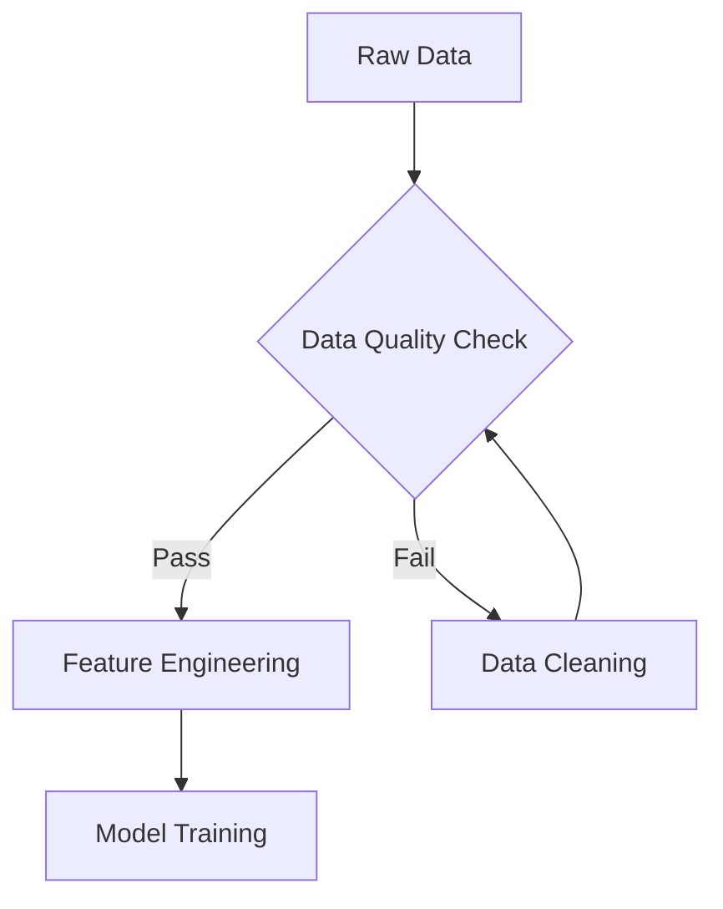

# Content Style Guide: Data Science Learning Handbook

**Purpose:** Every content-writing agent must read and follow this guide before generating any chapter, section, explanation, or example. This guide defines the voice, structure, and formatting standards for the handbook. Deviation from this guide produces content that will be rejected and rewritten.

---

## Who This Guide Is For

This guide is for AI agents (and human contributors) generating content for the Data Science Learning Handbook. The handbook is an operational learning resource, not a textbook and not a blog post. It teaches working data scientists and practitioners. Every word should serve that goal.

---

## Part 1: The Author's Voice — What It Actually Sounds Like

The reference voice comes from *Shrink-Wrap It: The GovCon Productization Playbook* by Amyn Porbanderwala. Study it. The patterns below are observed directly from that text.

### How Chapters Open

Chapters open with a scene, not a thesis statement. A real person, a specific place, a problem in progress. The reader arrives mid-action.

The first chapter opens:

> *The email landed at 4:47 PM on a Friday in early October (three weeks after the loss), timed perfectly to ruin James Hartwell's weekend. He was in his corner office on the fifth floor of a glass-and-steel building in Tysons, the kind of address that signaled a certain tier of GovCon success.*

Notice: specific time, specific day, specific location, specific emotional stakes. No preamble. No "In this chapter, we will explore..." The reader is already inside the story before they realize it started.

Chapter 3 opens with a product demo that goes perfectly — and then hits the wall every reader knows is coming. The reader feels the dread before the author names it. That dramatic irony is intentional.

### Sentence Length and Rhythm

The author mixes very short sentences with longer ones deliberately. Short sentences carry weight. They land.

Examples from the text:
- "That model is now structurally weakening." (7 words, after a long setup paragraph)
- "They'd lost." (2 words, after a 5-sentence buildup)
- "Now they were done." (4 words, punching through)

Then immediately after a short punch, the author expands into a long sentence loaded with specifics:

> *His company had been the incumbent on a Navy program management support contract for seven years. Three successful recompetes. CPARS ratings of Exceptional across every evaluation factor.*

The rhythm: expand, compress, expand, compress. Never three long sentences in a row. Never three short ones either.

### Use of Specific Details

Every scene has granular specifics: contract numbers like "N00024-XX," dollar figures like "$412,000," timeframes like "eighteen months," and named programs like "FedRAMP Moderate" and "CPARS Exceptional." This specificity is not decoration. It signals that the author has actually done this work and earned the right to write about it.

When making a general claim, the author backs it immediately with data:

> *Federal IT spending reached $102.3 billion in FY2025, up from $95 billion in FY2024. This 7.7% year-over-year growth signals...*

When data is uncertain or estimated, the author says so plainly with a disclaimer rather than hedging the sentence:

> *Note: These ranges represent market observations, not guarantees.*

### Direct Reader Address

The author speaks directly to "you" — the practitioner making real decisions. Not to a hypothetical "reader" or a passive third party.

> *So let's fix that.*
> *Maybe you're thinking, "Policy changes slowly."*
> *What to do Monday morning: Complete the Services Business Health Diagnostic above.*

The "What to do Monday morning" close is a consistent structural device. It converts every chapter from theory into immediate action.

### Tone: Confident, Direct, Sometimes Wry

The author states things plainly. There is almost no hedging in the primary prose (disclaimers are handled separately in italicized notes, not woven into the main sentences). When the author has an opinion, they state it.

> *All of these are bad selection criteria.*

No qualifier. No "it could be argued that." Bad. Period.

When something is obvious to the practitioner but still worth saying:

> *Complacency is the enemy of innovation and flexibility.*

When something has a bit of dark humor:

> *his coffee going cold beside the keyboard*
> *paperwork tribbles*
> *a Gantt chart that now looked like a cruel joke*

The wry moments are earned, not forced. They appear in narrative scenes, not in instructional content.

### How Technical Explanations Work

The author introduces a technical concept with a plain-English sentence first, then layers in the detail:

> *The Software Acquisition Pathway (SWP) was no longer an approachable alternative to be used when needed, it was now the law of the land, via fiat.*

Then:

> *The implications will ripple through acquisition strategy. The memo pushes Other Transaction Authorities (OTAs) and Commercial Solutions Openings (CSOs) as primary solicitation methods.*

The author never buries the bottom line. Every technical section ends with a "What this means for you:" block that translates the technical content back into practitioner action.

### Handling Counterarguments

The author raises the obvious objection before the reader can object, then answers it:

> *Maybe you're thinking, "Policy changes slowly. I've seen initiatives come and go." And that is a reasonable assumption, but this time, multiple policy vectors are aligned...*

This pattern appears throughout. The author grants credibility to the counterargument before defeating it. This is harder to write than dismissing objections, and it reads as more trustworthy.

### Stories Are Composites, Not Case Studies

All narrative examples are clearly labeled as composites:

> *This scenario is a composite drawn from interviews with GovCon executives and post-mortem analyses of failed productization attempts (not a single specific case).*

This is disclosed once per composite character, in italics, right after the scene ends. The narrative uses full scenes with named characters and dialogue; the disclosure confirms that the pattern is real even if the person is not.

---

## Part 2: The DO List — Voice Characteristics to Emulate

**DO open sections with scenes, not summaries.** Put a person in a specific place with a specific problem. The reader wants to enter before they're told what to think.

**DO use short punchy sentences at moments of emphasis.** When you want something to land, cut the sentence to its minimum. Let it sit alone.

**DO name specific numbers.** "$412,000" not "hundreds of thousands." "Eighteen months" not "over a year." "47% of respondents" not "many respondents." Specificity is credibility.

**DO address the reader as "you" directly.** The reader is a practitioner making real decisions. Write to that person.

**DO state opinions plainly.** If something is a bad idea, say it is a bad idea. Do not say it "may present challenges" or "could be seen as suboptimal."

**DO raise objections before answering them.** Anticipate what a skeptical practitioner would think, state it honestly, then answer it.

**DO vary sentence length deliberately.** After a long setup, hit with a short one. After a short punch, expand. This is not accidental — it is rhythm.

**DO end every instructional section with an action the reader can take.** "What to do Monday morning," "Next steps," "The question to ask yourself," or similar. Convert theory to practice.

**DO use analogies that come from the real world.** The author uses a car analogy ("A Camry is 90% the same as any other Camry"), tribbles from Star Trek, and office scenes the reader has lived. Make it concrete.

**DO use "Sanity check:" or "Note:" blocks for caveats and disclaimers.** Keep the main prose clean. If you need to hedge, do it in an offset italicized note — not in the middle of a sentence.

**DO let the data do the persuading.** State the number, then interpret it. Do not interpret before the number appears.

**DO write "What comes next:" at the close of each chapter.** One short paragraph that previews the next chapter and explains why it matters. This creates momentum and shows the reader the through-line.

---

## Part 3: The DON'T List — AI Anti-Patterns to Avoid

These patterns are the most common tells that a piece was generated rather than written. Every agent must actively check for and eliminate these before finalizing content.

### Banned Words and Phrases

Never use these words in chapter prose. Remove them if they appear:

| Banned | Use Instead |
|--------|-------------|
| delve | explore, examine, look at, dig into |
| leverage (as a verb) | use, apply, deploy, tap into |
| it's important to note | [state it directly, or move it to a Note: block] |
| in conclusion | [just end the section] |
| let's dive in | [just start the section] |
| landscape | market, environment, field, situation |
| navigate | manage, work through, handle |
| crucial | critical, essential, required — or name the consequence |
| comprehensive | [cut it — it adds nothing] |
| in today's rapidly evolving | [cut the whole phrase — start with the actual point] |
| unlock | [cut — meaningless] |
| cutting-edge | [cut — meaningless] |
| revolutionize | [cut — overused and vague] |
| foster collaboration | [say what collaboration actually means in context] |
| seamlessly integrate | [nothing integrates seamlessly — describe the actual integration] |
| bridge the gap | [say what gap and how] |
| robust | [say what makes it strong or reliable] |
| utilize | use |
| facilitate | help, enable, run |
| Furthermore | [cut or rewrite the transition] |
| Moreover | [cut or rewrite the transition] |
| Indeed | [cut — AI filler] |
| Overall | [cut as opening to a closing paragraph] |
| In summary | [cut — just end it] |
| It is worth noting | [state it or move it to a Note: block] |
| Going forward | [cut or rewrite] |
| At the end of the day | [cut — cliché] |
| Game-changer | [say what changes and how] |

### Structural Anti-Patterns

**DO NOT open a chapter or section with a definition.** "Data cleaning is the process of..." is a textbook opening. Write a scene or a problem instead.

**DO NOT use the "three-point rule" for everything.** AI writing defaults to triads: "First... Second... Third..." or "There are three reasons..." This becomes robotic. Use the number of reasons that actually exist, and vary the structure.

**DO NOT make every paragraph the same length.** AI-generated text has uniform paragraph length. Real prose has one-sentence paragraphs next to eight-sentence paragraphs.

**DO NOT write perfectly balanced pros/cons sections.** Real analysis has a point of view. If something has four significant advantages and one trivial disadvantage, do not pad the disadvantage column to appear balanced. Say the thing clearly: this approach is better, and here is the one caveat.

**DO NOT hedge in the main prose.** Move all hedges to italicized Note: blocks. The main prose should be confident.

**DO NOT write a conclusion that re-states what the section already said.** The chapter close should name "the one thing to remember" (one sentence), "what to do Monday morning" (specific action), and "what comes next" (one paragraph). It is not a summary.

**DO NOT use emoji in headers or bullets.** This is a professional technical handbook, not a social media post.

**DO NOT generate a bulleted list when a paragraph would be clearer.** Reserve bullets for: genuinely enumerable items, checklists, scoring rubrics, and lists longer than four items where parallel structure aids reading. Do not use bullets as a way to avoid writing connected prose.

**DO NOT use passive voice to avoid taking a position.** "It has been noted that..." is AI cowardice. "The data shows..." is better. "The data is wrong about this, and here is why..." is best.

**DO NOT write headers for every two sentences.** A section needs to breathe. Headers should mark genuine topic shifts, not serve as outline markers for every paragraph.

**DO NOT write the same transitional phrase more than once per chapter.** Vary: "The implication is...", "That matters because...", "Here is the hard part:", "Most firms get this wrong in the same way:", etc.

---

## Part 4: Example Passages Showing the Right Voice

### Example 1: Opening a New Concept Section (Right)

> Marcus had spent fifteen years in federal IT: Five years as a contractor, four years as a government PM at an Air Force program office, six years back in industry.
>
> His first meeting wasn't a demo. It was coffee with Lieutenant Colonel James Rivera, an old contact from his government days, at the Starbucks on Crystal Drive.
>
> "I'm thinking about building a workflow tool," Marcus said. "Automation, status tracking, the stuff we always wished we had when I was at Hanscom."
>
> Rivera stirred his coffee. "For what authorization level?"

This opens a concept section on "builder-operator mindset." Notice: no definition, no thesis statement. The concept arrives through action and dialogue. The reader understands the concept before it is named.

### Example 2: Opening a New Concept Section (Wrong)

> In this section, we will explore what it means to have a builder-operator mindset. This is a crucial concept that is important to understand before moving forward. A builder-operator is someone who leverages both technical and business expertise to navigate the complex landscape of federal product development.

Every sentence in the "Wrong" example has an anti-pattern: "In this section we will explore," "crucial," "important to understand," "leverage," "navigate," "complex landscape." This is not writing. This is filler that sounds like writing.

### Example 3: Delivering a Hard Truth (Right)

> Kevin did the math in his head. They'd started with an $800K estimate from their FedRAMP consultant, which had covered the assessment but not the engineering work to actually implement the controls. No one had mentioned that detail at the kickoff meeting.

The hard truth (they underbudgeted catastrophically because of something nobody said aloud) arrives through a character realizing it. The author does not say "This is a common mistake that firms often make." The reader draws that conclusion.

### Example 4: Delivering a Hard Truth (Wrong)

> It is important to note that FedRAMP compliance can often be more costly than initially anticipated. Many firms find themselves in situations where they have underestimated the true costs involved. This comprehensive section will delve into the key factors that contribute to these challenges.

The "Wrong" version hedges ("can often"), generalizes ("many firms"), and delays ("this section will delve into"). Nothing has been said. Three sentences of motion, zero distance traveled.

### Example 5: Closing a Section (Right)

> **The one thing to remember:** The question isn't whether your services business will face product-enabled competition; it's when, and whether or not you'll be prepared. The market shift has begun; the only variable is how quickly individual firms recognize and respond.
>
> **What to do Monday morning:** Complete the Services Business Health Diagnostic above. Calculate your T&M percentage, labor dependency ratio, and technology leverage score. The numbers will tell you how urgent your transformation timeline needs to be. If you score below 60, productization isn't optional for your firm, productization has become survival.
>
> **What comes next:** Recognizing the need to change isn't the same as knowing how to change...

Notice: no "In conclusion," no summary of what was already said, no wrap-up that restates the chapter. The close drives forward into action and into the next chapter.

---

## Part 5: Formatting Standards for the Handbook

### Markdown Structure

**Chapter files** use a single `#` H1 for the chapter title, and `##` H2 for major sections within the chapter. Use `###` H3 for subsections. Do not go deeper than H3 in chapter content.

**Headers should be topic labels, not full sentences.** Write "Revenue Model Options" not "Here Are the Revenue Model Options You Should Consider."

**Bold** is used for: key terms at first introduction, critical warnings, the labels "Note:", "Sanity check:", "The one thing to remember:", "What to do Monday morning:", and "What comes next:".

*Italics* are used for: asides, caveats, composite-story disclosures, and technical sub-notes inside Note blocks.

### Code Blocks

Use fenced code blocks (triple backtick) for all code examples. Always specify the language:

```python
# Data cleaning example
import pandas as pd

df = pd.read_csv('data.csv')
df_clean = df.dropna(subset=['target_column'])
```

Code blocks should be self-contained. Include enough context that a reader can run the example without referring back to prose. Never truncate with `# ... more code here`.

### Mermaid Diagrams

Use Mermaid for process flows, decision trees, and concept relationships. Keep diagrams simple — five to eight nodes is the maximum before a diagram becomes unreadable. Every diagram must have a caption directly below it explaining what it shows.



*Figure: Standard data pipeline flow. Quality checks happen before feature engineering, not after.*

Do not use Mermaid for information that belongs in a table. Use tables for comparisons and structured data. Use Mermaid for processes and relationships.

### Tables

Use tables for comparisons where column alignment aids reading. Every table must have a header row. Keep tables to six columns or fewer. If a table needs more than six columns, split it into two tables or convert to a different format.

| Concept | When to Use | Common Mistake |
|---------|-------------|----------------|
| Mean | Symmetric distributions | Using on skewed data |
| Median | Skewed distributions | Ignoring outlier influence |
| Mode | Categorical data | Applying to continuous data |

### Notes and Caveats

Use this format for caveats, disclaimers, and sanity checks:

> **Note:** These cost ranges are based on Q4 2024 market data. Actual costs vary by vendor selection, project complexity, and your existing infrastructure. Get binding quotes before committing to any approach.

Use this format for harder warnings:

> **Sanity check:** "We can outsource this entirely." You can outsource the tooling, but you cannot outsource accountability. When something goes wrong, you own the outcome, not the vendor.

Both note formats use blockquote syntax (`>`), bold label, and plain prose. No bullet points inside notes.

### Chapter Close Format

Every chapter must end with exactly these three labeled blocks:

**The one thing to remember:** [One sentence. The most important insight the reader must leave with.]

**What to do Monday morning:** [Two to four specific, concrete actions. Not "think about" or "consider" — do.]

**What comes next:** [One paragraph bridging to the next chapter. Tell the reader what problem the next chapter solves and why they need to read it now.]

---

## Part 6: Chapter Structure Template

Use this structure for every chapter. Adapt the scene and specifics. Do not skip sections.

```
# Chapter N: [Title]

[Opening scene — 300 to 600 words. Specific person, specific place, specific problem in progress.
Uses dialogue. Does not name the chapter's concept until the scene has demonstrated it.
Scene ends with the protagonist facing the exact problem this chapter addresses.]

[One transitional paragraph that names the pattern the scene illustrates and why it matters broadly.]

## [First Major Section Heading]

[Section content. Opens with the core question or claim. Uses specifics, data, examples.
If technical, closes with "What this means for you:" in bold.]

### [Subsection if needed]

[Use subsections sparingly. Only when a major section has three or more genuinely distinct components.]

## [Second Major Section Heading]

[Continue pattern. Each section can have its own "Sanity check:" or "Note:" if needed.]

## Where This Goes Wrong

[Two to three failure modes. Each follows this structure:]

**Failure Mode N: [Short Label]**

**The mistake:** [One sentence.]

**Why smart people make it:** [Two to three sentences. Grant credibility to the mistake.]

**How to recognize you're making it:** [Three to five bullet points of observable signals.]

**What to do instead:** [Specific alternative actions.]

## Practical Takeaway: [Action-Oriented Title]

[A tool, diagnostic, worksheet, checklist, or framework the reader can use immediately.
This section should be the most concrete part of the chapter.]

## Chapter Close

**The one thing to remember:** [One sentence.]

**What to do Monday morning:** [Two to four specific actions.]

**What comes next:** [One paragraph bridging to the next chapter.]
```

---

## Quick Reference: The Ten Rules

1. Open with a scene, not a definition.
2. Use specific numbers, names, and places — always.
3. Vary sentence length deliberately. Short punches after long setups.
4. Address the reader as "you" and assume they are a practitioner making real decisions.
5. State your opinion plainly. Do not hedge in main prose.
6. Raise the obvious objection before answering it.
7. Put caveats in `Note:` blocks, not in the middle of sentences.
8. End every chapter with the three-block close: one thing to remember, Monday action, what comes next.
9. Never use the banned word list. Check before finalizing.
10. Check every section for uniform paragraph length — if they are all the same, you have an AI rhythm problem. Fix it.

---

*This style guide is a living document. When the author's voice produces a passage that demonstrates a new pattern not captured here, add it with the source passage as evidence.*
