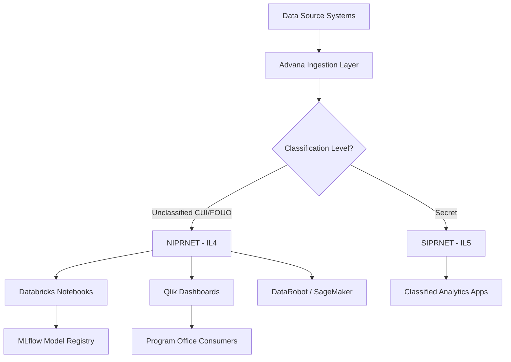
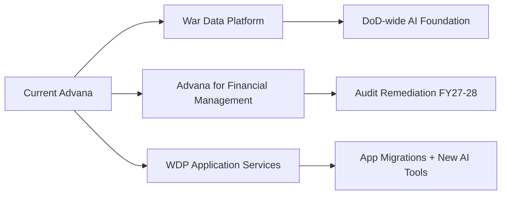

# Advana: DoD Enterprise Data Analytics Platform Guide

The ticket came in on a Tuesday afternoon. A data scientist three months into her first DoD analytics contract, working for a mid-sized defense consultancy out of Crystal City, had just been handed a tasking: build a readiness dashboard for her client's program office, pulling logistics data from GCSS-Army, financial data from GFEBS, and personnel data from DMDC. She had Python experience. She had a Secret clearance. She had a government-furnished laptop with a CAC reader.

She had no idea the data she needed was already in one place.

That place is Advana. Most contractors working in the DoD analytics space hear about it eventually — usually in a meeting, sometimes on a contract statement of work, occasionally in a frustrated conversation with a program officer who says "it's all in the portal, you just need access." What they rarely get is a clear picture of what Advana actually is, how to get into it, what the tools look like, and what's happened to it over the last eighteen months of institutional turbulence.

This guide answers those questions directly.

---

## Platform Overview

Advana — short for Advancing Analytics — is the Department of Defense's enterprise-wide data, analytics, and artificial intelligence platform. It started inside the Office of the Secretary of Defense Comptroller as a financial audit tool. The DoD had been failing independent audits for years, and the root cause kept coming back to the same problem: DoD data lived in thousands of incompatible systems, and no one could pull a consistent picture of anything. Advana was the attempt to fix that.

It grew fast. By 2022, when the Chief Digital and Artificial Intelligence Office came online and absorbed earlier efforts from the Joint Artificial Intelligence Center and Defense Digital Service, Advana had roughly 28,000 users and was connecting hundreds of Pentagon business systems. By 2024, it had grown to somewhere between 80,000 and 100,000 users, 400-plus connected Pentagon business systems, over 3,000 NIPRNET data sources ingested, and 250-plus applications in production across 55-plus DoD organizations.

That is an enormous amount of data infrastructure to build in a short time. It shows both in what the platform can do and in the ways it has struggled.

**The organizational home matters.** Advana lives under the Chief Digital and Artificial Intelligence Office (CDAO), which reports up through the DoD chain. The Deputy Secretary of Defense formally designated Advana as "the single enterprise authoritative data management and analytics platform" for OSD and all DoD components. That designation matters for your work: when a program office tells you they want analytics built on authoritative DoD data, Advana is what that phrase typically points to.

The original prime contractor is Booz Allen Hamilton, working under a five-year, $674 million GSA contract awarded in 2021. That contract has been extended and is active as of early 2026, though the planned $15 billion follow-on recompete (the Advancing Artificial Intelligence Multiple Award Contract, or AAMAC) was canceled in July 2025. More on that in the Current State section.

Advana's data domains span financial management and audit readiness, procurement and contracting, logistics and supply chain, personnel and health, readiness and training, infrastructure tracking, and force management and campaign planning. During COVID-19, it tracked PPE stockpiles in real time across HHS, FEMA, and DoD simultaneously. The platform's scope is genuinely broad — broad enough that the problem in recent years has been focus, not capability.

---

## Getting Access

Access to Advana is not complicated, but it has real prerequisites. You need a CAC or PIV card, a sponsor who can justify your access, and patience with a form.

### What You Need Before You Start

Your Common Access Card (CAC) or Personal Identity Verification (PIV) card handles authentication. Without one, there is no path in — the portal at `https://advana.data.mil` requires certificate-based authentication at the door. If you are a contractor who hasn't set up your CAC reader yet, do that first.

You will also need a DD Form 2875, the System Authorization Access Request form. This is standard DoD access control procedure. The form requires a government sponsor — typically your contracting officer representative (COR) or the program office point of contact — to sign off on the business need and appropriate access level. Fill it out completely. Incomplete 2875s go to the bottom of the queue.

### The Actual Process

1. Navigate to `https://advana.data.mil`
2. Authenticate with your CAC certificate when prompted
3. If this is your first access, the portal will route you to submit a Help Desk ticket
4. Attach your completed DD Form 2875 to that ticket
5. Wait — typical provisioning runs one to three weeks depending on the community space you're requesting access to

If you're requesting access to SIPR-side data (Secret classification), you need at minimum a Secret clearance. The access request process is the same, but the provisioning path goes through different approval chains.

For initial onboarding documentation, DAU (Defense Acquisition University) at `dau.edu` maintains Advana guides and the Advana University introduction document. The DoD Procurement Toolbox at `dodprocurementtoolbox.com` also maintains an Advana simplified onboarding guide that walks through the 2875 process with current screenshots.

> **Note:** Contractor access is available. You don't need to be military or a civilian government employee. What you do need is a valid CAC, a signed 2875, and a government sponsor who is willing to put their name on the access request. Finding that sponsor is usually the actual bottleneck, not the paperwork.

### Community Spaces

Advana is organized into community spaces — functional groupings of data and applications for specific mission areas. There are currently ten community spaces. Your access request should specify which space or spaces you need. Requesting access to everything is not how this works; you need a justified business need for each space.

---

## Available Tools

The tool catalog inside Advana is extensive. What follows is what public DoD documentation confirms is available, not a speculative list.

### Visualization and Business Intelligence

**Qlik Sense** is the primary BI and visualization layer on Advana. Most of the pre-built dashboards that consumers and analysts use are built in Qlik. The platform supports Qlik's Server-Side Extensions (SSE), which is a meaningful capability: SSE lets the analytics layer simultaneously run Python, C++, or Java code, which means you can embed statistical computations, machine learning inference calls, or custom processing directly into a Qlik dashboard without exporting data to a separate environment. For a lot of operational analytics use cases — where the end user is a program manager who wants a dashboard, not a Jupyter notebook — this is the right tool.

**Tableau** and **Power BI** are also referenced in DoD pipeline documentation as available within the Advana ecosystem, though Qlik is the platform's native BI layer.

### Data Science and Machine Learning

**Databricks** is the data lakehouse and ML platform within Advana. This is where data scientists doing serious modeling work will spend most of their time. Databricks on Advana supports Python and PySpark notebooks, Spark-based distributed processing, and access to the Unity Catalog data governance layer.

**MLflow** comes packaged with Databricks and handles experiment tracking, model registry, and deployment management. If you're running hyperparameter tuning experiments or comparing model versions, MLflow is how you track what happened.

**DataRobot** and **C3 AI** provide automated ML capabilities. DataRobot is particularly useful for rapid prototyping — you can run a dataset through it, get a baseline model, understand feature importance, and know what kind of performance ceiling you're working against before you invest time in custom model development.

**Amazon SageMaker** is available for model training and deployment. This is the path for teams that need more GPU-backed compute than the default notebook environments provide, or that need to operationalize models at scale.

### Data Governance

**Collibra** is the data catalog and governance layer. The Office of the Secretary of Defense has a documented Collibra deployment for data governance, including data lineage tracking, glossary management, and access policy documentation. Before you start pulling datasets, Collibra is where you verify what a field actually means, who owns it, when it was last updated, and whether the definition has changed since the last time someone used it. This is not optional discipline — DoD data has a persistent labeling problem, and Collibra is the official place to resolve ambiguity.

### Development and Source Control

**GitLab** handles source code management and CI/CD pipelines within the Advana environment. This matters for teams doing production deployments: your model code, pipeline scripts, and dashboard configurations should live in GitLab, not on your local machine or an ad-hoc shared drive.

**Python** is supported across the environment — natively in Databricks notebooks, and through Qlik's SSE. **R** is referenced in DoD data analytics documentation as available. **APIgee** handles API management for connecting applications and data services.

**Perceptor** is a DoD-specific analytics tool documented in the Advana ecosystem; it handles certain specialized analytics functions within the platform.

---

## Data Access

### What's Connected

Over 400 Pentagon business systems feed into Advana. The major ones data scientists encounter regularly:

**GFEBS** (General Fund Enterprise Business System) — Army financial management. Real-time streaming feeds from GFEBS into Advana are documented, with millisecond-level latency via SAP/SLT services that replicate into MySQL/S3 before federation to the SAP HANA layer.

**GCSS-Army** (Global Combat Support System — Army) — Army logistics. Same real-time streaming pipeline as GFEBS.

**DMDC** — Defense Manpower Data Center. Personnel and human resources data.

**FPDS-NG** — Federal Procurement Data System. Contract and procurement data across all DoD components.

Beyond these, the platform consolidates data from the full range of DoD functional areas: medical and health systems, readiness reporting systems, installation management, and force structure databases.

### The Data Catalog

Collibra is the front door to understanding what's in Advana before you query it. Use it. The platform ingests data from thousands of sources, and source-system data quality is inconsistent. Collibra's lineage documentation tells you where a field came from, what transformations it went through, and what known quality issues exist.

> **Sanity check:** "The data should be clean — it's the authoritative DoD system." Seven consecutive failed DoD audits say otherwise. Data that flows from source systems into Advana has quality issues, definition mismatches, and timeliness gaps. Always check Collibra for known data issues before you build on a new dataset, and always build a sanity-check pass into your pipeline.

### Classification Levels

Advana operates on multiple DoD networks:

| Network | Level | What Lives There |
|---|---|---|
| NIPRNET | Unclassified (CUI/FOUO) | Business operations data; 3,000+ sources |
| SIPRNET | Secret | Classified analytics and force planning data |

Most financial, logistics, procurement, and personnel analytics work happens on NIPRNET at the CUI or FOUO sensitivity level, which maps to Impact Level 4 in the DoD cloud security framework. IL4 requires U.S.-territory data residency and NIPRNET connectivity — your work environment needs to meet those requirements.

SIPRNET access requires a Secret clearance and a separate access request. Data at that level supports operational planning, readiness assessments, and certain force management applications.

DoD briefings have referenced five accredited networks total within the Advana environment, though two are the primary tiers most practitioners encounter.

---

## Data Science Workflows

### The Four Tiers

Advana supports four meaningfully different user types, and the platform is set up differently for each.

**Consumers** get pre-built Qlik dashboards for their functional area. No coding required. If your program officer asks for a view into their budget execution rate, there is likely already a dashboard for that.

**Analysts** build custom dashboards in Qlik, combine data across sources using the Qlik mashup API, and use natural language discovery tools for ad-hoc data exploration. This is the right tier for someone who knows data but doesn't want to manage compute infrastructure.

**Data scientists** work in Databricks notebooks. Python, PySpark, SQL. Full access to MLflow for experiment tracking, DataRobot and C3 AI for automated ML, and SageMaker for scaled deployment. This is where model development happens.

**Data engineers** build and maintain pipelines, set up real-time replication feeds, manage data quality monitoring through ARES/ADVANA, and work with the MySQL/S3/SAP HANA integration layers.

### Notebooks and Coding Environments

Databricks is the primary notebook environment. A typical data science workflow on Advana looks like this:

```python
# Querying procurement data from Advana's Databricks environment
# Authentication happens via CAC-backed session token
from pyspark.sql import SparkSession
from pyspark.sql import functions as F

spark = SparkSession.builder.appName("procurement_analysis").getOrCreate()

# Read from the Unity Catalog — data is organized by domain
df = spark.sql("""
    SELECT
        contract_id,
        vendor_name,
        obligation_amount,
        award_date,
        naics_code,
        reporting_agency
    FROM advana_catalog.procurement.fpds_awards_fy2024
    WHERE reporting_agency = 'DEPARTMENT OF THE ARMY'
      AND obligation_amount > 1000000
""")

# Basic sanity check — procurement data has duplicate records
print(f"Total rows: {df.count():,}")
print(f"Unique contracts: {df.select('contract_id').distinct().count():,}")

# Check for the most common data quality issue: obligation amount sign errors
negative_obligations = df.filter(F.col("obligation_amount") < 0).count()
print(f"Negative obligations (deobligations or errors): {negative_obligations:,}")
```

```python
# MLflow experiment tracking example — readiness model development
import mlflow
import mlflow.sklearn
from sklearn.ensemble import RandomForestClassifier
from sklearn.model_selection import train_test_split
from sklearn.metrics import classification_report
import pandas as pd

# Load readiness data — this would come from the Advana data catalog
# using the appropriate Collibra-documented dataset
df = spark.table("advana_catalog.readiness.unit_readiness_daily").toPandas()

features = ["equipment_pct_mc", "personnel_fill_rate", "training_completion_pct",
            "parts_availability_score", "days_since_last_assessment"]
target = "c_rating"  # C1/C2/C3/C4 readiness rating

X = df[features].fillna(df[features].median())
y = (df[target].isin(["C1", "C2"])).astype(int)  # Binary: ready vs. degraded

X_train, X_test, y_train, y_test = train_test_split(X, y, test_size=0.2, random_state=42)

with mlflow.start_run(run_name="readiness_rf_v1"):
    mlflow.log_param("n_estimators", 100)
    mlflow.log_param("max_depth", 8)
    mlflow.log_param("features", features)

    model = RandomForestClassifier(n_estimators=100, max_depth=8, random_state=42)
    model.fit(X_train, y_train)

    preds = model.predict(X_test)
    report = classification_report(y_test, preds, output_dict=True)

    mlflow.log_metric("precision_ready", report["1"]["precision"])
    mlflow.log_metric("recall_ready", report["1"]["recall"])
    mlflow.log_metric("f1_ready", report["1"]["f1-score"])

    mlflow.sklearn.log_model(model, "readiness_classifier")
    print(f"F1 (ready): {report['1']['f1-score']:.3f}")
```

### Approved Packages

Python packages available through Databricks include the standard scientific stack: pandas, NumPy, scikit-learn, PySpark, matplotlib, seaborn, and the MLflow client library. Package availability in classified environments is not open-ended — you cannot `pip install` arbitrary packages from the internet in an IL4/IL5 environment. The Databricks environment has a curated list of approved packages. If you need something not on that list, the process involves submitting a request through the platform's software approval chain, which can take weeks.

This is not unique to Advana. It is how every IL4-and-above compute environment works. Build it into your project timeline.

---

## Security and Compliance

### Impact Levels in Practice

IL4 covers Controlled Unclassified Information — the bucket that most financial, logistics, and personnel data falls into. Working at IL4 means your compute environment must physically reside in U.S. territory, your connectivity must go over NIPRNET (or a FedRAMP-authorized cloud path approved for IL4), and your data handling must follow DoD CUI marking and handling requirements.

IL5 applies to data that requires stronger protections than IL4 — certain National Security System data, certain personnel records, some acquisition-sensitive data. IL5 adds requirements for U.S.-citizen-only access and physical and logical separation from IL4 data. If you're working in an IL5 workspace, you'll know it, because access provisioning will make it explicit.

SIPRNET access is a separate tier entirely. It requires a Secret clearance, and the physical access requirements are stricter. Most DoD data science work happens at NIPRNET/IL4.



*Figure: Advana data flow by classification level. NIPRNET and SIPRNET are separate pipelines with separate access controls and compute environments.*

### Data Handling Rules

CUI data on Advana must follow DoD CUI program requirements: proper marking on outputs, need-to-know access controls, handling in approved environments only. When you export analysis results — whether a chart, a data extract, or a model output — you are responsible for applying the correct CUI markings.

The Collibra data catalog maintains data classification tags for datasets. Before you pull any dataset for analysis, verify its classification in Collibra. Some datasets have mixed sensitivity (a personnel file might have both unclassified demographic fields and PII-controlled fields). Collibra documents those distinctions.

> **Note:** "Unclassified" does not mean "unrestricted." Controlled Unclassified Information has its own handling requirements and distribution controls. The fact that a dataset lives on NIPRNET does not mean you can email an extract to your personal laptop or post results to a public repository. Treat CUI outputs the way you'd treat FOUO — with specific handling and no public distribution.

### The Audit Situation

This is worth naming plainly because it affects how the platform works and why it's being restructured. The DoD has failed seven consecutive independent financial audits. Advana was built partly to solve this problem — to make DoD financial data legible enough to audit. It hasn't worked yet. The FY 2025 SOC-1 audit of Advana itself produced an adverse result; the specific control deficiencies were classified as CUI and not publicly released.

This is not an indictment of the platform's utility for data science work. Advana hosts 100,000-plus users and generates real operational value across logistics, readiness, and force planning. But the audit failure is why the January 2026 restructuring happened, and it is why the Financial Management track of the restructured platform has hard targets: a clean audit on the FY 2027 Defense Working Capital Fund and a clean audit on the FY 2028 agency-wide financial statements.

---

## Current State (2025–2026)

If you are starting DoD data science work in 2025 or 2026, you need to understand what has happened to Advana over the past eighteen months. The platform is not in crisis — it is still serving six figures of users and running hundreds of applications. But the institutional situation around it is messier than the official documentation suggests.

### The Workforce Reduction

In February and March of 2025, following Defense Secretary Hegseth's directive for 5–8% civilian workforce cuts, CDAO lost approximately 60% of its workforce. That includes two of the top architects of the Advana platform. Contracted support staff was reduced by roughly 80%. Alex O'Toole, the program officer most closely associated with Advana's technical direction, departed for Databricks in January 2025 before the cuts.

The practical result: platform development slowed, some capabilities that required active maintenance degraded, and the institutional knowledge embedded in those positions walked out the door. Officials described data reverting to silos and intelligence sharing returning to "phone calls and PDFs" in some cases. That is not hyperbole from critics — those are characterizations from people inside the building.

### The AAMAC Cancellation

In September 2024, CDAO had announced a 10-year, $15 billion recompete (the Advancing Artificial Intelligence Multiple Award Contract) designed to expand Advana's vendor base, bring in small businesses, and diversify from the Booz Allen Hamilton prime. By July 2025, that solicitation was formally canceled: "This draft solicitation has been canceled as the Advancing Artificial Intelligence Multiple Award Contract (AAMAC) program is currently on hold."

Booz Allen Hamilton's existing $647 million contract continues. The future contracting vehicle for Advana's expansion is unresolved as of early 2026.

### The January 2026 Restructuring

On January 9, 2026, Defense Secretary Hegseth signed the "Transforming Advana to Accelerate Artificial Intelligence and Enhance Auditability" memo. It divides Advana into three tracks:

**War Data Platform (WDP)** — The new data integration foundation. Designed to be DoD-wide, standardized, and built to support agentic AI use cases at scale. Led by senior technical officials within CDAO and Research and Engineering.

**Advana for Financial Management** — Pulled back under the Office of the Under Secretary of Defense (Comptroller). Focused entirely on audit remediation. The audit targets above (FY 2027 and FY 2028 clean audits) are this track's mandate.

**War Data Platform Application Services** — Consolidates all non-audit Advana applications. Manages migrations from legacy Advana to the new WDP. Enables self-service integration of new AI tools.



*Figure: The January 2026 three-way restructuring of Advana. Financial management returns to the Comptroller. The War Data Platform becomes the AI development foundation.*

The implementation timeline runs through 45-day status update intervals, with full operational capability dates not yet publicly confirmed. The 120-day milestone for formalizing WDP requirements falls in May 2026.

CDAO itself was relocated under the Under Secretary of Defense for Research and Engineering (Emil Michael) in August 2025. Michael was given a 120-day clock to recommend a path forward for Advana and Maven Smart System and announced plans to push AI capabilities to all 3 million DoD users across classification levels by December 2025. Whether those targets are met will become clear over the next budget cycle.

> **Note:** Advana was omitted from the DoD's FY 2025 Agency Financial Report for the first time since the platform's inception. The reason was not stated publicly. This is a transparency gap worth tracking if you are working on programs that depend on Advana continuity.

---

## Best Practices

### What Works

**Start in Collibra before you write a single query.** The instinct for people with strong coding backgrounds is to get into a Databricks notebook immediately and start exploring data. On Advana, that approach produces analysis built on fields you don't fully understand from source systems you haven't characterized. An hour in Collibra before you touch the data saves you two weeks of debugging a model trained on a field that was redefined six months ago.

**Use Qlik SSE when the end user is a dashboard consumer, not a data scientist.** The temptation on every contract is to build a Jupyter notebook that generates charts and export those charts to a PowerPoint. That workflow breaks the moment you're not in the room to refresh it. Qlik SSE lets you embed Python computations directly in a dashboard that program office staff can refresh themselves. Build it that way from day one.

**GitLab everything.** Source control discipline in classified environments is inconsistent across teams. Some teams treat the Advana environment like a personal workbench. That is a problem the moment someone leaves, something breaks, or an auditor asks how the model was built. Treat your Advana work the same way you'd treat any production software: version-controlled, documented, reproducible.

**Track the War Data Platform timeline.** The WDP is where the next generation of Advana capabilities is being built. If you are on a multi-year program, understanding the WDP roadmap matters for architecture decisions you make today. Tools and pipelines built on legacy Advana infrastructure will need to migrate.

### What to Avoid

**Do not assume data is clean because it comes from an authoritative system.** The DoD has failed seven audits partly because the authoritative systems have data quality problems. GFEBS and GCSS-Army are the authoritative Army financial and logistics systems, and their data streams into Advana in real time. That real-time feed includes real-time data quality issues. Always build validation into your ingestion pipeline.

**Do not request access to every community space.** Some teams treat Advana access requests like an all-you-can-eat buffet. Government sponsors who sign 2875s for overly broad access requests are taking on accountability they don't want. The request that says "all communities, full access, for a two-year period of performance" goes to the bottom of the queue or gets kicked back entirely. Be specific about what data you need, for what program, and why.

**Do not build on AAMAC assumptions.** The $15 billion multi-vendor expansion was canceled. The contracting vehicle for the next generation of Advana capabilities is unresolved. Do not build a proposal or a program plan around AAMAC as the mechanism; it does not exist.

**Do not skip Advana University.** It is free for authorized users, web-based, and covers the platform's tools and data structures specifically. The time investment is measured in hours. The alternative — figuring out the platform's architecture from scratch while on a billable contract — is measured in weeks.

### Common Pitfalls

**Failure Mode 1: Treating Advana like a commercial cloud platform**

The mistake: Expecting to `pip install` packages freely, iterate on infrastructure configuration, and deploy code with standard DevOps practices.

Why smart people make it: If you've worked in AWS, Azure, or GCP, the Databricks interface looks familiar and the instinct is to work the same way.

How to recognize it: You've spent three days trying to get a package approved that you could install in thirty seconds on your personal laptop.

What to do instead: Submit your full package requirements list to the platform team at project kickoff, not when you need them. Build with the approved catalog first; add to it only when genuinely necessary.

**Failure Mode 2: Building for today's Advana architecture**

The mistake: Designing a data pipeline or application that depends on specific legacy Advana infrastructure components that are scheduled for migration to the War Data Platform.

Why smart people make it: The current architecture is documented and functional. The WDP migration timeline looks abstract.

How to recognize it: Your architecture document cites specific Advana component names that appear on the "legacy tools to be divested" list in the restructuring memo.

What to do instead: Build modular pipelines with clean interfaces between data ingestion, transformation, and presentation layers. When the migration happens, you swap out the ingestion component, not the entire stack.

**Failure Mode 3: Underestimating access lead time**

The mistake: Scheduling a project kickoff for week one and expecting data access to come through in parallel.

Why smart people make it: In commercial projects, cloud access is provisioned in minutes. Advana provisioning takes one to three weeks minimum, often longer for sensitive community spaces.

How to recognize it: Your week-two sprint is blocked on access that hasn't been granted yet.

What to do instead: Submit 2875s before the contract starts. If you cannot do that, the first sprint should be architecture, Collibra data discovery, and training — not analysis that requires live data access.

---

## Platform Comparison

Advana does not exist in isolation. Federal data scientists typically encounter multiple platforms depending on the agency, program, and mission area. Here is where Advana sits relative to the other platforms in this handbook.

| Dimension | Advana | Databricks (standalone) | Qlik (standalone) | Navy Jupiter | Palantir AIP/Foundry |
|---|---|---|---|---|---|
| Scope | DoD-wide enterprise | Data lakehouse compute | BI/visualization | Department of Navy | Mission-specific ontology |
| Primary users | All DoD components | Data engineers, ML engineers | Analysts, program managers | Navy/USMC only | Analysts, operators |
| Data ingestion | 3,000+ pre-connected sources | You build the pipelines | Connects to external sources | Navy ERP/logistics systems | Structured integration layer |
| ML capabilities | Databricks + DataRobot + SageMaker | Native Databricks MLflow | Limited (via SSE) | Limited | AIP AI layer, Gotham |
| Access mechanism | CAC + DD 2875 + sponsor | CAC + FedRAMP auth | CAC + FedRAMP auth | Navy credentials | Contract-dependent |
| Classification | NIPRNET (IL4) + SIPRNET | IL2/IL4 FedRAMP | IL2/IL4 FedRAMP | NIPRNET + SIPRNET | IL4/IL5 |
| Institutional stability | In restructuring (2025-26) | Stable | Stable | Stable | Stable (Maven POR candidacy) |
| Best for | Cross-DoD analytics, audit, readiness | Heavy ML, pipeline work | Executive dashboards, BI | Navy-specific data | Operational AI, ontology-linked data |

The key architectural distinction: Advana is a data platform that includes analytics tools. Palantir Foundry is an ontology platform that includes data access. Databricks (as a standalone deployment) is a compute platform that requires you to bring your own data. When you are doing cross-DoD analytics work — pulling procurement, logistics, personnel, and financial data from multiple military services — Advana is the right starting point because the connections already exist. When you are doing specialized ML work and need GPUs, PySpark cluster customization, or Python environment flexibility that a government-configured Databricks doesn't allow, a standalone Databricks deployment on a FedRAMP-authorized cloud may be faster to work in.

Navy Jupiter serves a similar enterprise-aggregation function to Advana but is scoped specifically to the Department of the Navy. If your work is exclusively Navy and Marine Corps, Jupiter may give you better access to Navy-specific data. If your work spans services, Advana is the only platform with all of it.

Palantir AIP and Foundry are the platforms to reach for when the data problem is not just analytics but operational integration — when you need to connect data to decision-making workflows, link it to an ontology that represents the real-world objects of interest, or run AI-assisted planning at scale. The Maven Smart System, running on Palantir, is currently under consideration as a formal Program of Record. That matters because it affects long-term contracting and access.

---

## Chapter Close

**The one thing to remember:** Advana is the DoD's single authoritative data aggregation platform for cross-component analytics, but it is in a significant transition period — the War Data Platform restructuring will change how data access and AI applications are built on top of it, and practitioners who understand that transition will make better architecture decisions than those who treat today's platform as permanent.

**What to do Monday morning:** If you have a DoD analytics assignment coming up, submit your DD Form 2875 this week — before the contract starts, before your access needs become urgent. Second, spend an hour in the Advana University materials at `dau.edu` before you touch a notebook; the platform architecture documentation there will save you two weeks of figuring it out by trial and error. Third, pull up the January 9, 2026 Hegseth restructuring memo at `media.defense.gov` and read the WDP requirements section; the 120-day milestones will tell you what the platform will look like by the time your project needs production-ready infrastructure.

**What comes next:** The next guide in this series covers Databricks as a standalone Federal analytics environment — how it differs from the Databricks you find inside Advana, what the FedRAMP authorization means for your architecture options, and how to build ML pipelines that can run in both environments without being rewritten from scratch.
