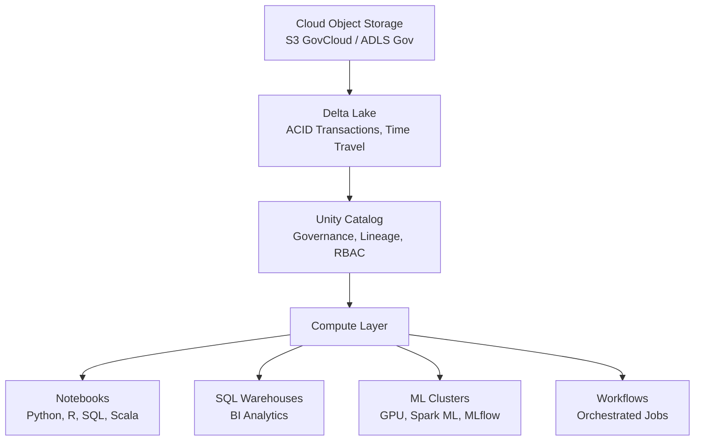

# Databricks for Government

The ticket arrived in the team Slack at 6:43 AM on a Tuesday — three weeks before the contract performance review. The data engineer on a Navy logistics analytics program had spent the weekend migrating the team's Hive Metastore tables to Unity Catalog, and something had gone sideways. Row-level security policies that had protected sensitive logistics codes were gone. Silently. The replacement tables didn't inherit them.

She wasn't careless. She had followed the standard CREATE OR REPLACE TABLE pattern her team had used for two years. What nobody had documented — and what nobody on the team knew — was that, until August 2025, CREATE OR REPLACE TABLE silently dropped column masking and row-level security policies. The platform had changed the behavior in an update. The docs hadn't caught up. The data scientist on the compliance team found the exposure during a routine audit pull.

This story is a composite drawn from patterns reported across government program teams transitioning to Unity Catalog. No classified data was exposed; the exposure was caught in test. But it is exactly the kind of thing that does not appear in product demos.

That is what this guide is for. Not the press release version of Databricks — the working version.

---

## What You'll Build

By the end of this guide you will understand how Databricks is structured as a platform, how it differs in government from its commercial form, how to get access on a real contract, how to run ML workloads that comply with FedRAMP High and IL5 requirements, and where the platform does and does not fit compared to Palantir, Advana, Jupiter, and Qlik.

---

## Platform Overview

Databricks is built around one architectural idea: stop making data engineers choose between a data lake and a data warehouse. The Lakehouse combines the two. Your raw data lives in cheap cloud object storage — S3 on AWS, ADLS Gen2 on Azure — and Delta Lake sits on top of it, giving you ACID transactions, schema enforcement, and time travel without moving the data into a separate warehouse engine.

That distinction matters for government data science. Your procurement files, logistics records, sensor telemetry, and readiness data do not need to move into a separate proprietary format to be queryable, joinable, or governed. They stay in open Parquet files. The governance layer — Unity Catalog — sits above the storage, not inside it.

### The Four Pillars

**Apache Spark** is the distributed compute engine underneath everything. Databricks is the commercial company that built Spark; they know it better than anyone. When your job processes 50 million contract action records, Spark splits that work across a cluster and reassembles the result. The managed cluster environment handles infrastructure so your team does not maintain it.

**Delta Lake** is the storage format. As of 2025, Delta Lake 4.0 on Apache Spark 4.0 is available. Every table you create on Databricks is a Delta table by default. That means every write is transactional — no partial data in a failed job. It means schema enforcement — a bad upstream feed with the wrong column type fails loudly at ingestion, not silently at analysis. Time travel means you can query your logistics table as it appeared 30 days ago with a single SQL clause. For auditors, that alone is worth significant overhead.

**Unity Catalog** is the governance layer. One metastore spans all workspaces, all compute types, all asset types — tables, files, dashboards, ML models, vector indexes. Access is controlled with role-based and attribute-based policies. Data lineage is automatic. Audit logs go to a Delta table you can query. Column masking and row-level security apply at the catalog level, not in application code.

As of December 18, 2025, all new Databricks accounts exclusively use Unity Catalog. The legacy Hive Metastore is being deprecated. If your program is still on legacy DBFS or Hive, migration is not optional — it is a scheduled reckoning.

**MLflow** originated at Databricks and is now an open-source standard for ML experiment tracking. MLflow 3.0, released in 2025, adds tracking for generative AI applications and agentic workflows on top of the traditional model training lifecycle. Every training run in a Databricks notebook automatically logs parameters, metrics, artifacts, and code versions to MLflow with no additional configuration required.



*Figure: Databricks Lakehouse architecture. Data lives in cloud storage in open Delta format. Unity Catalog governs access across all compute types.*

---

## Government Offerings

There are two distinct government deployments of Databricks on AWS. They are not interchangeable.

**Databricks AWS GovCloud DoD** is for the Department of Defense and its direct mission partners. It supports FedRAMP High and DoD IL5 data handling, including Controlled Unclassified Information (CUI) and Unclassified National Security Information (U-NSI). This is the deployment that received its FedRAMP High PMO authorization on February 27, 2025, and IL5 general availability at the same time.

**Databricks AWS GovCloud Community** is for non-DoD federal agencies — civilian agencies, their contractors, and supporting personnel. Same FedRAMP High authorization, different community boundary. A contractor supporting the VA on health analytics uses this. A contractor supporting DIA uses the DoD version. You cannot mix the two without explicit approval from your program office.

On Azure, **Azure Databricks on Microsoft Azure Government (MAG)** has held FedRAMP High authorization since November 2020 — much longer than the AWS GovCloud offering. In 2026, Microsoft and Databricks announced full platform parity on Azure Government, bringing Unity Catalog, Databricks SQL, and the complete Mosaic AI capabilities to the government region. Previously, government teams on Azure had access to a subset of platform features; that gap is closing.

The practical consequence: if your program is tied to a DoD Azure Enterprise Agreement or uses Azure Government as its primary cloud, Azure Databricks is the path. If your program runs on AWS GovCloud — common in newer DoD cloud contracts — the DoD GovCloud deployment is the path.

> **Note:** DoD IL5 authorization covers higher-sensitivity CUI, mission-critical information, and national security systems data. IL4 authorization covers CUI and DoD Controlled Unclassified Information. The IL5 Provisional Authorization was issued in November 2024; general availability followed on February 27, 2025. Do not assume a specific workspace is IL5-enabled without verifying with your program's ISSO.

---

## Getting Access

You do not procure Databricks the way you buy software licenses from a catalog. The mechanism depends on your agency and contract structure.

### Carahsoft

Databricks' **Master Government Aggregator** is Carahsoft Technology Corp. This is the standard path for most federal procurements. Carahsoft holds the vehicles: GSA Multiple Award Schedule, SEWP V (NASA's enterprise-wide procurement), ITES-SW2 for Army programs, NASPO ValuePoint, and OMNIA Partners.

The practical contact for most programs: Databricks@carahsoft.com or (571) 590-6840. Your contracting officer knows Carahsoft; this is not a cold call.

Current GSA Schedule contract numbers include DIR-CPO-5687 (May 2025 through May 2027, with options) and DIR-CPO-6151 (February 2026 through February 2028, with options). Your CO will know which is current.

### AWS Marketplace and JWCC

For DoD programs operating under the Joint Warfighting Cloud Capability (JWCC) contract, Databricks on AWS GovCloud can be procured through AWS Marketplace with pay-as-you-go billing. The charges consolidate with the agency's AWS bill. This simplifies financial management significantly compared to a separate SaaS contract. If your program already has JWCC task orders in place, ask your cloud team about Marketplace billing before initiating a separate Carahsoft procurement.

### Azure Government

For Azure Government deployments, procurement typically flows through Microsoft's enterprise agreement structure or through Microsoft's authorized resellers who hold DoD Azure agreements. Azure Databricks is a Microsoft Azure service in this context — it appears as a resource type in your Azure Government subscription, and billing is part of your Azure consumption. Your program's Azure Government subscription must have the appropriate SKU enabled.

> **Sanity check:** "We can just spin up a workspace in commercial Databricks and point it at GovCloud data." You cannot. The compliance security profile that enforces FedRAMP High controls — hardened compute images, inter-node encryption, enhanced monitoring — is automatically enabled in GovCloud workspaces and does not exist in commercial workspaces. Routing government data through a commercial workspace voids your ATO basis.

---

## Core Tools

A data scientist landing on Databricks for the first time will encounter three primary surfaces: notebooks, workflows, and SQL warehouses. Each has a distinct purpose and distinct cost implications.

### Notebooks

Databricks Notebooks support Python, R, Scala, and SQL in a single file, and you can switch languages cell by cell using magic commands (`%python`, `%sql`, `%r`). For a data scientist who lives in Python but needs to run a quick SQL exploration on the same dataset without leaving the environment, this is practical.

Notebooks are version-controlled and integrate directly with Git repositories — GitHub Enterprise, GitLab, Azure DevOps are all supported. For government programs with source control requirements, this matters. Your notebooks can live in the same repo as your infrastructure code and application code.

Python linting and syntax highlighting via `pyproject.toml` was added to GovCloud notebooks in May 2025. Small detail, real quality-of-life improvement for teams with Python style standards.

```python
# Databricks Notebook Example: Load and inspect a Delta table with access control
# Assumes Unity Catalog workspace and a catalog named 'agency_logistics'

import pyspark.sql.functions as F
from pyspark.sql import SparkSession

spark = SparkSession.getActiveSession()

# Read a Unity Catalog table — row-level security applies automatically
# based on the current user's group memberships in Unity Catalog
df = spark.table("agency_logistics.supply_chain.contract_actions_fy2025")

print(f"Rows visible to current user: {df.count():,}")
print(f"Columns: {len(df.columns)}")

# Quick profile — useful at the start of any new dataset exploration
df.select(
    F.count("*").alias("total_rows"),
    F.countDistinct("contract_id").alias("unique_contracts"),
    F.min("award_date").alias("earliest_award"),
    F.max("award_date").alias("latest_award"),
    F.sum("obligation_amount").alias("total_obligations")
).show()
```

### Workflows

Workflows is the native job orchestration layer. You define a directed acyclic graph of tasks — each task can be a notebook, a Python script, a Spark JAR, a SQL query, or a Delta Live Tables pipeline. Tasks pass parameters to each other. The whole thing can be scheduled on a cron expression or triggered by an API call.

For ML teams, this replaces a sprawling set of manual notebook runs with a reproducible pipeline. Your feature engineering notebook runs at 2 AM, its output triggers model training, training completion triggers evaluation, evaluation passing a threshold triggers a Model Registry promotion. That sequence can be a Workflow with dependencies between tasks.

The alternative — a human running notebooks in order — is not sustainable past the pilot phase. Start thinking about workflows as soon as your process has three steps.

### SQL Warehouses

Databricks SQL Warehouses are serverless SQL query engines that connect to your Delta tables without spinning up a full Spark cluster. They are optimized for interactive BI queries, not training workloads. Tableau, Power BI, and Qlik can connect to a SQL Warehouse via JDBC/ODBC. For the analyst who does not write Python and lives in SQL, this is their primary surface.

Cost distinction: a SQL Warehouse is serverless and bills per DBU consumed per query. A Spark cluster running a notebook bills for the entire time the cluster is running, including idle time. Most programs get burned by idle clusters. Set auto-termination. Set it aggressively — 10 minutes is reasonable for development clusters, not 60.

---

## Data Science on Databricks

You are three months into a Navy readiness analytics contract. Your team has raw maintenance record data in Delta tables, a Feature Store with engineered features for aircraft components, and a mandate to deploy a predictive maintenance model into a production API by the end of the quarter. Here is what the full lifecycle looks like on Databricks.

### Feature Store

The Databricks Feature Store is a centralized repository for feature definitions — the transformations that convert raw data into inputs your models consume. You define a feature function once, register it, and every model that uses `days_since_last_maintenance` or `cumulative_flight_hours` pulls from the same computation. No team writes the same feature calculation twice. No two models use subtly different versions of the same concept.

More important for production: Feature Store records which features were used to train which model. When you deploy, the serving infrastructure automatically retrieves current feature values at inference time. The training-serving skew problem — where features computed differently in training versus serving cause model degradation — is structurally prevented.

### MLflow Experiment Tracking

MLflow tracking starts automatically the moment you call a training function in a Databricks notebook. No configuration required. Every run logs the parameters, metrics, and the model artifact to a tracked experiment. You can compare 40 hyperparameter tuning runs visually in the MLflow UI, pick the best, and register it to the Model Registry in three clicks.

MLflow 3.0 extended this to generative AI. If your team is building a RAG pipeline to answer questions over maintenance documentation, the queries, retrieved context, and responses are all trackable artifacts — not just loss curves.

```python
import mlflow
import mlflow.sklearn
from sklearn.ensemble import GradientBoostingClassifier
from sklearn.model_selection import train_test_split
from sklearn.metrics import roc_auc_score, precision_score, recall_score
import pandas as pd

# Load feature table from Unity Catalog Feature Store
# (In production, use FeatureStoreClient; this is a simplified example)
df = spark.table("agency_logistics.features.aircraft_maintenance_features").toPandas()

X = df.drop(columns=["label", "aircraft_id", "record_date"])
y = df["label"]

X_train, X_test, y_train, y_test = train_test_split(X, y, test_size=0.2, random_state=42)

# MLflow autologging captures params, metrics, model artifact automatically
mlflow.sklearn.autolog()

with mlflow.start_run(run_name="gbm_predictive_maintenance_v3"):
    model = GradientBoostingClassifier(
        n_estimators=200,
        max_depth=5,
        learning_rate=0.05,
        subsample=0.8
    )
    model.fit(X_train, y_train)

    y_pred_proba = model.predict_proba(X_test)[:, 1]
    y_pred = model.predict(X_test)

    # Log custom metrics beyond what autolog captures
    mlflow.log_metric("roc_auc", roc_auc_score(y_test, y_pred_proba))
    mlflow.log_metric("precision", precision_score(y_test, y_pred))
    mlflow.log_metric("recall", recall_score(y_test, y_pred))

    # Tag for program traceability
    mlflow.set_tag("program", "navy_readiness")
    mlflow.set_tag("data_version", "FY2025_Q2")
    mlflow.set_tag("fedramp_level", "high")

print("Run complete. View in MLflow Experiments tab.")
```

### Mosaic AI Model Serving

Mosaic AI Model Serving is the production inference layer. You register a model in Unity Catalog's Model Registry, create a serving endpoint, and within minutes you have an HTTPS endpoint that accepts JSON requests and returns predictions. The infrastructure scales automatically — down to zero when idle, up to handle load.

As of the June 2025 Data + AI Summit announcements, the serving infrastructure handles 250,000 queries per second across Databricks' global infrastructure. For government workloads, the specific number matters less than the architecture: you get autoscaling without pre-provisioning GPU reservations.

Serverless GPU compute on A10g instances is now generally available. H100 access is in the roadmap. For government teams that need GPU inference — embedding models, fine-tuned LLMs for document processing, image classification on satellite or sensor data — this removes the previous requirement to reserve dedicated GPU clusters and maintain them.

### Mosaic AI Gateway

The AI Gateway is a governed proxy layer in front of all AI model calls — both models hosted on Databricks and external models from providers like OpenAI or Anthropic. Every call goes through the gateway. Every call is logged. Rate limits, cost controls, and PII detection can be configured centrally.

For government programs where AI use must be auditable — which is essentially all of them — this is the difference between AI experimentation that remains within governance boundaries and AI experimentation that creates audit findings. The Gateway went to general availability in 2025.

### Vector Search

Databricks Vector Search is the embedding index layer for retrieval-augmented generation (RAG) applications. In 2025, the underlying infrastructure was completely rewritten with separated compute and storage. The result is a 7x reduction in cost at the same query performance, with indexes that scale to billions of vectors.

For government use cases — semantic search over thousands of acquisition documents, policy memos, maintenance manuals, or after-action reports — billion-vector scale matters. A Navy program sitting on decades of maintenance records does not fit in a small index.

```python
from databricks.vector_search.client import VectorSearchClient

# Create a vector search index on a Delta table containing embedded documents
# The sync_type="TRIGGERED" means the index updates when you call it explicitly
# CONTINUOUS would update as the source table changes (higher cost)

vsc = VectorSearchClient()

index = vsc.create_delta_sync_index(
    endpoint_name="govcloud_vs_endpoint",
    index_name="agency_docs.maintenance.manuals_index",
    source_table_name="agency_docs.maintenance.technical_manuals",
    pipeline_type="TRIGGERED",
    primary_key="doc_id",
    embedding_source_column="content",
    embedding_model_endpoint_name="databricks-gte-large-en"
)

# Query the index — returns nearest neighbors by semantic similarity
results = index.similarity_search(
    query_text="hydraulic system failure indicators F/A-18",
    columns=["doc_id", "manual_title", "section", "content"],
    num_results=5
)

for r in results["result"]["data_array"]:
    print(f"Score: {r[-1]:.4f} | {r[1]} — {r[2]}")
```

---

## Unity Catalog

Unity Catalog is not optional. For any account created after December 18, 2025, Hive Metastore does not exist as an option. Unity Catalog is the default, the only option, and the foundation everything else runs on.

The three-level namespace is: `catalog.schema.table`. A government agency might structure this as `dod_logistics.supply_chain.contract_actions` or `va_health.claims.adjudication_records`. The catalog is the top-level organizational boundary. An agency can have multiple catalogs — one per program, one per classification level, one per data domain — with distinct access policies at each level.

### Governance That Actually Works

The access control model is additive and explicit. A user has no access to a table until explicitly granted. Grants can be to individual users, to service principals (for automation), or to groups synced from your identity provider. Column-level masking means a sensitive column returns redacted values for users without elevated access — the column is always present in the schema, always accessible to code, but the values are masked based on the caller's identity.

Row-level security works the same way: the predicate that filters rows is evaluated per user at query time. A logistics analyst sees records for their region. A program manager sees records for their program. A system-wide auditor sees everything. All three run the same query against the same table.

Here is the gotcha that opened this guide: when you replace a table with `CREATE OR REPLACE TABLE`, the new table does not inherit the security policies of the old table. This was fixed in an August 2025 update — column masking and row-level security policies are now retained on table replacement. If your program is running GovCloud workspaces that predate that update, verify the behavior in your specific runtime version before assuming policies persist.

### Lineage and Audit

Unity Catalog tracks data lineage automatically. You can trace which notebook wrote a table, which upstream tables fed it, and which downstream dashboards or models consume it. For a government program that receives audit requests — which is all of them, eventually — being able to say "this model's training data came from these five source tables, transformed by these notebooks, run by these service principals" is the difference between a two-hour audit response and a two-week one.

Audit logs are queryable Delta tables in your Unity Catalog audit log destination. Every data read, write, schema change, permission grant, and model registration is a record. Compliance teams can query them in SQL. SIEM tools can ingest them. There is no separate audit export process.

---

## GPU and AI Infrastructure

Government programs doing serious ML have a GPU problem. GPU clusters are expensive when reserved, unavailable when not reserved, and require operational overhead to manage. The 2025 Databricks serverless GPU model changes the math.

A10g instances are now available on-demand in serverless model serving. You define an endpoint, specify the GPU instance type, and Databricks handles provisioning, scaling, and teardown. Your team pays for what it uses. There are no reservation commitments. For programs that run batch inference jobs once a day — embedding a day's worth of new documents, running anomaly detection on sensor logs — serverless is significantly cheaper than a dedicated cluster that sits idle 23 hours a day.

For distributed training workloads — fine-tuning a large language model on domain-specific government data, training a computer vision model on satellite imagery — Databricks provides **TorchDistributor**, which runs PyTorch distributed training across a multi-GPU Spark cluster.

```python
from pyspark.ml.torch.distributor import TorchDistributor
import torch
import torch.nn as nn
from torch.utils.data import DataLoader, TensorDataset

def train_distributed(learning_rate, batch_size):
    """
    Training function executed on each worker node.
    TorchDistributor handles rank assignment and communication backend.
    """
    import torch.distributed as dist

    # Each worker gets its rank from the environment
    rank = int(os.environ.get("RANK", 0))
    world_size = int(os.environ.get("WORLD_SIZE", 1))

    # Simple model — replace with your actual architecture
    model = nn.Sequential(
        nn.Linear(128, 256),
        nn.ReLU(),
        nn.Linear(256, 64),
        nn.ReLU(),
        nn.Linear(64, 2)
    )

    model = model.cuda()
    model = nn.parallel.DistributedDataParallel(model)

    optimizer = torch.optim.Adam(model.parameters(), lr=learning_rate)
    criterion = nn.CrossEntropyLoss()

    # Training loop omitted for brevity — implement your standard PyTorch loop here
    # Return the final model path for MLflow logging
    return "/dbfs/tmp/distributed_model.pt"

# Launch distributed training across 4 GPUs (2 workers x 2 GPUs each)
distributor = TorchDistributor(
    num_processes=4,
    local_mode=False,
    use_gpu=True
)

result = distributor.run(train_distributed, learning_rate=1e-4, batch_size=64)
print(f"Training complete. Model saved at: {result}")
```

---

## Security and Compliance

### The Authorization Stack

The full compliance picture for Databricks government deployments as of early 2026:

| Authorization | Cloud | Status |
|---|---|---|
| FedRAMP High | AWS GovCloud | Authorized (Feb 27, 2025) |
| FedRAMP High | Azure Government | Authorized (Nov 2020) |
| FedRAMP Moderate | AWS GovCloud | Authorized (prior) |
| DoD IL2 | Both | Authorized |
| DoD IL4 | Both | Authorized |
| DoD IL5 | AWS GovCloud | GA (Feb 2025) |
| DoD IL5 | Azure Government | Authorized (2021) |
| ITAR Ready | AWS GovCloud | Confirmed |

**Accreditation specifics:** Databricks is installed at all classification levels. The SaaS offering (managed Databricks on GovCloud) is accredited at IL5. For IL6/classified workloads, Databricks is not currently available as a managed service; Palantir or on-premises enclaves fill that gap. JWICS SaaS availability is expected in early 2027, with additional network accreditations expected to follow.
| HIPAA | AWS GovCloud Community | Eligible |

IL6 (classified, SECRET and above) is not currently supported as a managed SaaS service on Databricks. Databricks can be installed on-premises at IL6, but for managed classified processing, Palantir or on-premises enclaves remain the primary options until JWICS SaaS accreditation is finalized.

**JWICS accreditation:** Databricks is pursuing JWICS accreditation for its government SaaS offering, with availability expected in early 2027. Additional network accreditations are expected to follow. This would extend Databricks' reach to TS/SCI and higher-side workloads. Until that accreditation is finalized, JWICS-classified workloads should use Palantir Foundry/Gotham or an on-premises classified enclave. Track this timeline if your program has future classified compute requirements that could be served by a managed lakehouse.

### What the Compliance Security Profile Does

The compliance security profile is automatically enabled on all GovCloud workspaces. You do not turn it on. You cannot turn it off. It enforces:

- Instance types that support hardware-level inter-node encryption for all cluster communication
- Hardened compute images that have passed FedRAMP High control testing
- Enhanced monitoring hooks that feed into the underlying cloud provider's audit infrastructure

The practical impact for data scientists: some instance types available in commercial Databricks are not available in GovCloud. If a community forum answer tells you to use a specific instance type that does not appear in your workspace's cluster creation dialog, that is why.

### Network Isolation

For programs with strict network isolation requirements — common in DoD — Databricks supports VPC endpoint (Private Link) configurations that route all data plane traffic through private network paths rather than public internet. As of 2025, serverless Private Link support for VPC-hosted resources and S3 is in public preview on GovCloud.

Zero Trust network architectures are supported. Databricks has published architectural guidance for Zero Trust configurations, and Unity Catalog audit logs provide the access visibility that Zero Trust frameworks require.

### Credential Security

Single-use refresh tokens for OAuth applications became configurable in 2025. Tokens rotate after each use. For service principals running automated jobs, this limits the blast radius of a compromised token to a single session. If your program's ISSO has asked about token rotation, this is the technical control to point to.

---

## Integration with Other Federal Platforms

### Palantir Partnership

Databricks and Palantir formalized a strategic partnership in 2025. The technical integration is meaningful: Palantir Foundry can read directly from Databricks Unity Catalog tables via **zero-copy integration** — Foundry reads the underlying Delta files without duplicating data into Palantir's storage. This matters for programs that use Palantir for operational decision-making and Databricks for data engineering and ML training. The data engineering work stays in Databricks. The operator-facing workflows run in Foundry. The same data serves both without the cost and governance complexity of dual ingestion.

Delta Sharing enables this and similar patterns with other platforms. An agency can share a Delta table with a mission partner, a BI tool, or a downstream platform via an open protocol. The receiving party does not need a Databricks account.

In a DoD context, Delta Sharing is particularly relevant for cross-command data sharing. A combatant command's Databricks workspace can share curated datasets with a service-level analytics team, or with a mission partner operating on a separate cloud tenant, without duplicating data or managing separate transfer mechanisms. The protocol respects Unity Catalog access controls at the sharing boundary, so the data provider controls exactly which tables and columns the recipient can access. For programs that need to share data across organizational boundaries while maintaining governance, this is the mechanism to plan around.

### Advana

Advana — the DoD CDAO's enterprise data and analytics platform — uses Databricks as a foundational component of its data infrastructure. If you are working on an Advana-connected program, you are already working in an environment where Databricks is the underlying compute. Understanding Databricks directly makes you more effective on Advana rather than dependent on abstracted platform tooling.

### Delta Sharing with Qlik, Power BI, and Tableau

Databricks SQL Warehouses connect directly to Qlik, Power BI, and Tableau via JDBC/ODBC connectors. For programs where analysts use Qlik for dashboards — common in civilian agency programs — the data can live in Delta tables on Databricks and be served to Qlik without ETL, without a data copy, and without a separate data warehouse. The Databricks SQL Warehouse is the query engine; Qlik is the visualization layer.

---

## Best Practices

### Cluster Sizing

The most common mistake on government Databricks programs: cluster over-provisioning. A team gets access to GovCloud, spins up a large cluster to be safe, forgets to set auto-termination, and generates a five-figure bill in a month for clusters that were idle most of the time.

Rules of thumb:
- Development clusters: enable auto-termination at 10 minutes
- Interactive analysis: single-node clusters or SQL Warehouses are sufficient for most queries under 100 million rows
- Training jobs: use job clusters that spin up for the job and terminate when it finishes — not all-purpose clusters left running
- Serverless compute is now available for notebooks and workflows; use it for workloads that do not require custom libraries, and you eliminate idle cluster cost entirely

### Notebook vs. Jobs

Notebooks are for exploration. Jobs are for production. This sounds obvious, but most programs run production pipelines as manually triggered notebooks for longer than they should. The risk is real: a notebook run depends on the cluster state, the user's environment, and whatever global variables are set. A Workflow job gets a fresh cluster, defined inputs, and logged outputs.

The migration path from notebook to job is straightforward: parameterize the notebook using Databricks Widgets, test it in a Workflow task, then convert the cluster to a job cluster. That migration from ad-hoc notebook to scheduled job is the first step in operational maturity for any ML pipeline.

### Unity Catalog Patterns

Organize catalogs by data domain and access boundary, not by team. A single team may need read access to multiple domains. A single domain may be shared across teams. Organizing by team creates a sprawling metastore that becomes difficult to audit.

Recommended structure for a DoD program:
- `raw_data` catalog: unprocessed ingest, write access to ingest pipelines only
- `curated` catalog: cleaned, validated data, read access to analysts and data scientists
- `features` catalog: Feature Store tables, governed by ML engineering team
- `models` catalog: Model Registry, governed by ML engineering team
- `reporting` catalog: tables specifically prepared for BI tooling, governed by data governance team

This separation makes audit responses straightforward. When an auditor asks "who can read raw data," the answer is a single catalog permission query.

---

## Platform Comparison

There is a persistent question in government data science programs: Databricks or Palantir? The honest answer is that they solve different problems, and the programs that treat them as direct competitors are usually asking the wrong question.

| Dimension | Databricks | Palantir Foundry/AIP | Advana | Qlik | Navy Jupiter |
|---|---|---|---|---|---|
| Primary use case | Data engineering, ML, AI | Operational decisions, ontology modeling | DoD enterprise analytics | BI visualization | Navy data environment |
| FedRAMP High | Yes (AWS + Azure Gov) | Yes | Hosted on Databricks | Yes | DoD network |
| IL5 | Yes | Yes | Via Databricks | No | DoD classified up to IL6 |
| Classified (IL6+) | No | Yes | No | No | Yes |
| Open source foundation | Yes (Spark, Delta, MLflow) | No (proprietary) | Databricks underneath | No | Mixed |
| ML training | Native, strong | Limited | Via Databricks | No | Limited |
| Operator-facing UX | Notebooks, dashboards | Purpose-built apps | Purpose-built | Strong | Limited |
| Data engineering | Very strong | Moderate | Strong | Weak | Limited |
| Cost model | Consumption | Enterprise contract | Program-funded | License | Program-funded |

Databricks' real competition is not Palantir for most programs — it is the alternative of building on native AWS or Azure services directly. AWS SageMaker, EMR, and Glue can do what Databricks does. The difference is integration: stitching together SageMaker for training, EMR for Spark, Glue for ETL, and Lake Formation for governance requires significantly more engineering than a single Databricks workspace where those capabilities are unified under one platform and one governance layer.

The programs that should lean heavily toward Databricks: those with complex data engineering requirements, ML lifecycle management needs, and multi-team data sharing. The programs that should lean toward Palantir: those with operational workflow requirements, classified data needs beyond IL5, or a primary use case of building mission-application UIs on top of integrated data.

Qlik's place in this comparison is visualization, not compute. Qlik does not replace Databricks; it connects to Databricks SQL Warehouses as a BI tool and surfaces data to analysts who do not write code.

Advana is Databricks. If you are working in Advana and wondering whether Databricks is relevant to you, the answer is yes — Databricks is the infrastructure underneath.

---

## Where This Goes Wrong

**Failure Mode 1: Treating GovCloud Like Commercial**

**The mistake:** A team develops a solution in commercial Databricks, validates it, then assumes it will migrate cleanly to GovCloud.

**Why smart people make it:** Commercial Databricks has more features, faster release cadence, and more community examples. It is natural to develop where it is easiest.

**How to recognize you're making it:**
- You are using instance types that do not appear in the GovCloud cluster creation dropdown
- You are using a feature that was recently announced but is not in the GovCloud release notes
- Your cluster configuration does not include the compliance security profile settings

**What to do instead:** Develop in GovCloud from the start. The GovCloud release notes are a separate document from the commercial release notes — read them. Features arrive in GovCloud weeks to months after commercial.

---

**Failure Mode 2: Skipping the Unity Catalog Migration**

**The mistake:** Running on legacy Hive Metastore workspaces past the December 2025 deprecation deadline because migration is disruptive.

**Why smart people make it:** Migrations break things. Programs under delivery pressure avoid risk. The legacy environment still works, until it does not.

**How to recognize you're making it:**
- Your workspace was created before December 2025 and you have not started the UC migration
- Your team refers to storage paths as `/dbfs/mnt/...` rather than three-level UC names
- Audit requests for data lineage cannot be answered from the platform

**What to do instead:** Start the Unity Catalog migration on a non-production workspace. Identify tables that have row-level security or column masking policies and test the migration path thoroughly. Plan for the table replacement gotcha described at the start of this guide — verify that your runtime version retains policies on table replacement before assuming it does.

---

**Failure Mode 3: Under-Governed AI Experimentation**

**The mistake:** Data scientists start using LLMs and AI functions in notebooks without going through the AI Gateway, bypassing usage logging and governance controls.

**Why smart people make it:** The AI functions in Databricks SQL are easy to call. Calling an LLM from a notebook is three lines of Python. Governance feels like friction.

**How to recognize you're making it:**
- Your AI Gateway usage logs show no traffic, but your team is clearly using AI
- You cannot answer the question "what external model APIs are being called and with what data"
- Your ISSO has not reviewed any AI system as part of your ATO process

**What to do instead:** Configure the AI Gateway before your team starts AI experimentation. Route all external model calls through the gateway. The logging is the evidence you need when your ATO process asks about AI controls.

---

## Practical Takeaway: GovCloud Readiness Checklist

Run through this before your first production deployment on Databricks GovCloud:

**Access and Authorization**
- [ ] Confirm workspace is GovCloud DoD or GovCloud Community based on your program's classification
- [ ] Confirm workspace IL level (IL2, IL4, or IL5) with your ISSO
- [ ] Verify compliance security profile is enabled (should be automatic — confirm in workspace settings)
- [ ] Service principals created for automation, personal credentials not used in production pipelines

**Unity Catalog**
- [ ] All production tables registered in Unity Catalog with three-level namespace
- [ ] Row-level security and column masking policies tested after any table replacement operations
- [ ] Audit log destination configured and queryable
- [ ] Data lineage visible for production tables

**Compute**
- [ ] Development clusters have auto-termination set to 10 minutes or fewer
- [ ] Production pipelines use job clusters, not all-purpose clusters
- [ ] Instance types verified against GovCloud available instance list

**ML and AI**
- [ ] MLflow experiment tracking confirmed working for all training runs
- [ ] Model Registry in Unity Catalog (not legacy Workspace Model Registry)
- [ ] AI Gateway configured before any external model API calls
- [ ] Inference tables enabled on production serving endpoints for monitoring

**Procurement and Compliance**
- [ ] Procurement vehicle confirmed (Carahsoft GSA, AWS Marketplace, Azure EA)
- [ ] ATO documentation includes Databricks as a component
- [ ] Data sharing agreements cover any Delta Sharing connections

---

## Chapter Close

**The one thing to remember:** Databricks' government deployment is not the same as commercial Databricks — the compliance security profile, the instance type constraints, the GovCloud-specific release cadence, and the Unity Catalog enforcement all require you to treat the GovCloud workspace as its own environment from day one.

**What to do Monday morning:** Open the AWS GovCloud release notes at `docs.databricks.com/aws/en/release-notes/gov-cloud/2025` and compare them against your workspace version. Check whether your current workspace uses Unity Catalog or legacy Hive Metastore. If legacy, start the migration planning conversation with your program's data architect this week, not next quarter. If you are in procurement, verify whether JWCC AWS Marketplace billing would simplify your current contract vehicle.

**What comes next:** Governance does not stop at the platform layer. The Palantir Foundry platform guide covers the operational side of that equation — how a mission-focused platform handles Ontology-driven access control, writeback actions, and the kind of operational decision workflows that Databricks alone was not designed to support. Reading the two guides together gives you the full picture of how the DoD's two dominant analytics platforms divide that labor.
