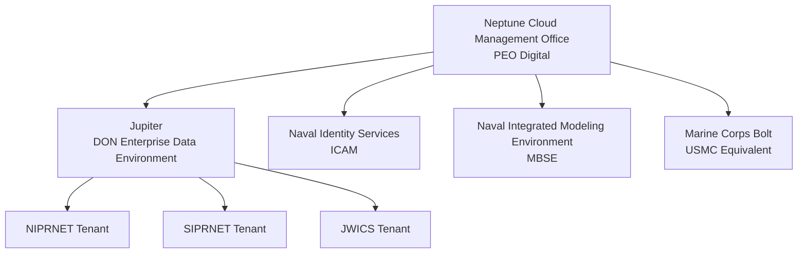
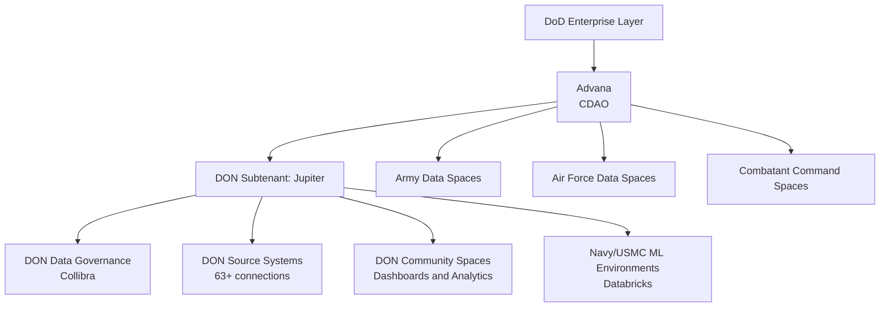

# Navy Jupiter Platform Guide

Commander Sarah Okafor had been working Navy logistics analytics for six years when she first heard someone mention Jupiter in a briefing. She was sitting in a conference room at Norfolk Naval Station, trying to explain to her commanding officer why it had taken her team three weeks to answer what sounded like a simple question: how many surface ships in the Atlantic Fleet had maintenance actions more than 30 days past due?

The answer was buried across four separate databases. Two of the databases had different schema conventions for ship identifiers. One of the four required a separate access request that took a week to process. The fourth system had a field called "days_past_due" that, as her data engineer discovered at 11 PM on a Thursday, was populated inconsistently across fiscal years because someone had changed the definition in FY2019 and not backfilled the historical data.

Three weeks. For one question.

By the time Okafor's team answered it, the commanding officer had already gotten a rough estimate from a manual spreadsheet review and moved on. The data was correct. It was also irrelevant.

Jupiter was built for exactly this problem. The platform exists to ensure that a DON data scientist or analyst can locate the right dataset, understand what it contains, trust its quality tier, and start working — without spending three weeks chasing down schemas, access requests, and historical anomalies. Whether it actually delivers on that promise depends on how well you understand what it is, how it's structured, and where it sits in the larger DoD data architecture.

---

## Platform Overview

Jupiter is the Department of the Navy enterprise data environment. It launched in April 2020 under the Department of the Navy Chief Information Officer (DON CIO) and Chief Data Officer (CDO), with a mandate to make DON data **discoverable, accessible, understandable, and usable** across the Naval enterprise.

The platform serves Navy and Marine Corps military personnel, civilians, and contractors. As of the most recent public reporting, Jupiter supports over 4,000 DON users — a number that has grown since launch but still represents a smaller footprint than Advana's 100,000+ DoD-wide user base.

Structurally, Jupiter is the DON subtenant of Advana, the DoD-wide analytics platform managed by the Chief Digital and AI Office (CDAO). This relationship matters in practice: Jupiter operates within the same technical infrastructure as Advana, shares many of the same tool components, and provides DON-specific data governance and community spaces layered on top of the enterprise foundation. You get DON data sovereignty and Navy-specific governance, with Advana's enterprise tooling available underneath.

The platform's three core mission areas track the Navy's primary operational categories:

- **Warfighting**: readiness, maintenance, and operations data
- **Business**: financial management, procurement, and contracts
- **Readiness**: personnel, training, and health

The name is not accidental. Jupiter is the largest planet in the solar system. The DON chose it deliberately — signaling the platform's role as a gravitational center for Naval data, with tools like Collibra, Databricks, Tableau, and iQuery orbiting within the ecosystem.

---

## Getting Access

The access story for Jupiter is one of its genuine strengths. The DON CDO released a policy memo establishing **baseline access** for all DON personnel: any Navy or Marine Corps military member, civilian, or contractor with a valid Common Access Card (CAC) or Personal Identity Verification (PIV) token can access Jupiter and selected baseline datasets without additional approval steps.

You go to [https://jupiter.data.mil](https://jupiter.data.mil), authenticate with your CAC or PIV, and you're in.

This is not how most government data platforms work. The standard model involves access request forms, data owner approvals, system security officer review, and a wait time measured in weeks. Jupiter's baseline CAC access policy eliminates that friction for the starting point. You can discover what data exists, browse the catalog, and begin exploring available datasets on day one.

The caveats are real. Baseline access does not mean access to everything. More sensitive data spaces — command-restricted datasets, higher classification tiers, PII/PHI datasets requiring specific justification — require additional access controls and approvals. Access to Jupiter on SIPRNET and JWICS requires the appropriate clearance and follows the additional access procedures for those networks. The baseline policy opens the door; it does not give you every room in the building.

For most DON data scientists starting a new project, the workflow is:

1. Authenticate at https://jupiter.data.mil with your CAC
2. Open the Collibra data catalog and search for relevant datasets
3. Identify whether the datasets you need are in a publicly accessible space or require elevated access
4. If elevated access is needed, contact the data steward listed in Collibra or reach DON_Data@navy.mil for guidance

The network access question is separate from the portal authentication question. NIPRNET access through the standard CAC flow handles most unclassified and CUI work. If your project involves Secret data, you will need Jupiter on SIPRNET. TS/SCI work requires JWICS access, which is a separate system with its own access procedures. Not all tools in Jupiter are available at every network tier — verify which capabilities exist on the classification level your project requires before committing to a workflow.

---

## Available Tools

Jupiter's tool ecosystem is not Jupiter-specific. Most of these tools exist because Jupiter is the DON subtenant of Advana, which means the DoD-wide tool agreements extend into Jupiter's tenant. What Jupiter adds is the DON-specific data environment in which those tools operate.

**iQuery** is the DON-specific data query interface. It gives analysts direct access to DON data assets for ad hoc exploration and querying without requiring Databricks notebook infrastructure. If you know SQL and you want to ask a direct question of a DON dataset, iQuery is the fastest path. It is not a full analytics environment — it is a query tool, and should be treated as one.

**Collibra** is the data governance and metadata platform. This is where you go to understand what data exists before you touch any of it. Collibra catalogs all DON data assets within Jupiter and extends its coverage to data in the broader Advana ecosystem. Each dataset entry includes metadata: the data source, update frequency, data owner and steward, applicable sensitivity designations, and which quality tier (bronze, silver, or gold) the data occupies. The standard practice for any new DON analytics project is to start in Collibra, not in code.

**Databricks** handles the heavy lifting for data engineering and data science. Python, PySpark, and SQL are all available in Databricks notebooks. If you are building ML models, running large-scale transformations, or engineering data pipelines from DON source systems, Databricks is your primary environment. The federated development model used by Task Force Hopper runs through Databricks — centralized data governance via Collibra, decentralized ML development in Databricks notebooks at the fleet level.

**Qlik** provides business intelligence and visual analytics. It is part of the broader Advana tool ecosystem available to DON users and handles dashboard creation, report generation, and data exploration for analysts who do not work in notebook environments.

**Tableau** rounds out the visualization toolkit. DON Tableau Day — a documented community event for sharing visualizations and best practices — reflects the size of the Tableau user base within Jupiter. Organizations can automate data source feeds into Tableau and build repeatable visual products against gold-tier data. The CNO Executive Metrics Dashboard is the highest-visibility example of what production-grade Tableau work in Jupiter looks like.

SQL and Python are the standard query and scripting languages across all these tools. No surprises there. If you have worked in any enterprise analytics environment, the tool interfaces will feel familiar even if the specific DON data models take time to learn.

---

## Data Sources

Jupiter connects to over 63 DON source systems across the warfighting, business, and readiness domains. The data sources span finance, personnel, logistics, maintenance, medical, and operational categories — the full breadth of how the Department of the Navy operates.

These are not simple flat file imports. Jupiter's pipelines pull from ERP systems, legacy Navy databases, real-time operational feeds, and readiness reporting systems. The common data models that tie these sources together are one of Jupiter's most consequential design decisions — they make it possible to join personnel records to maintenance records to operational deployment histories in a single query, something that was categorically impossible when those systems lived in isolated silos.

The gold-tier data is what matters most for anything going into a decision. Jupiter implements a three-tier data quality model:

| Tier | What It Means | When to Use It |
|------|--------------|----------------|
| Bronze | Raw data ingested directly from source systems, minimal transformation | Development, exploration, understanding raw source patterns |
| Silver | Organized, structured, cleaned data with standard schema applied | Intermediate analysis, building toward validated outputs |
| Gold | Verified, validated, authoritative data meeting DON quality standards | Official reporting, command dashboards, senior leader briefings |

The tier you use is not a preference. It is a compliance decision. When the CNO's readiness dashboard updates on Monday morning, it pulls from gold-tier data — not because it would be technically difficult to pull from silver, but because the consequence of incorrect readiness reporting at that level is a bad decision in a Pentagon briefing. Gold is the tier that has passed the governance gauntlet. Use it for anything that will influence command decisions.

Jupiter is also approved to process PII and PHI. That approval is uncommon enough to be worth calling out explicitly. Personnel analytics, health readiness modeling, and behavioral analysis against individual service member records are all within scope — with appropriate access controls. The PII/PHI approval is what made Navy Reserve's training budget optimization work possible, because the analysis required individual-level training records alongside administrative and budget data.

---

## Data Science Workflows

The practical workflow on Jupiter depends on which role you occupy in the data pipeline.

If you are building a model, the standard path goes like this: catalog exploration in Collibra to identify and understand relevant datasets, data access and initial profiling in iQuery or a Databricks notebook, exploratory analysis against bronze or silver data, feature engineering and model development in Databricks against silver data, validation against gold-tier authoritative data, and deployment back into a dashboard or reporting pipeline via Tableau or Qlik.

```python
# Standard Jupiter data access pattern via Databricks
# This example queries a hypothetical readiness dataset on NIPRNET
# All platform-specific connectors require environment setup — see DON_Data@navy.mil

import pandas as pd
from pyspark.sql import SparkSession
from pyspark.sql.functions import col, datediff, current_date

spark = SparkSession.builder.appName("ReadinessAnalysis").getOrCreate()

# Access gold-tier maintenance data (requires appropriate access role)
maintenance_df = spark.table("gold.surface_force.maintenance_actions")

# Filter to open maintenance actions
open_actions = maintenance_df.filter(col("status") == "OPEN")

# Calculate days since scheduled completion
# Surface force data has known schema variation pre/post FY2019 — verify before joining
open_actions = open_actions.withColumn(
    "days_overdue",
    datediff(current_date(), col("scheduled_completion_date"))
)

# Identify high-overdue items (>30 days)
overdue = open_actions.filter(col("days_overdue") > 30)

print(f"Open maintenance actions: {maintenance_df.count():,}")
print(f"Actions >30 days overdue: {overdue.count():,}")

# Convert to pandas for model feature engineering
overdue_pd = overdue.toPandas()
```

> **Note:** *The table names and schema above are illustrative. Actual table paths, schema structures, and access controls vary by data domain and classification level. Always verify current schema in Collibra before building pipelines against Jupiter data. Surface force data has documented inconsistencies in maintenance action fields spanning fiscal year changes.*

The collaboration model deserves attention. Jupiter was designed around co-production — the idea that operators and warfighters participate alongside data scientists throughout the problem framing, data access, and model development process. This is not abstract principle. Task Force Hopper operationalized it: surface fleet subject matter experts (who knew what maintenance data meant operationally) worked alongside data scientists (who knew how to clean and model it), with the collaboration happening inside Jupiter's shared development environments.

If you arrive at a Jupiter project expecting to work in isolation and hand finished models to operators at the end, you will produce worse products than teams that build in the operator relationship from day one. The platform structure encourages collaboration; use it.

```python
# Example: Feature engineering for predictive maintenance
# Uses bronze data for exploration; gold for final validation

import numpy as np
from sklearn.ensemble import RandomForestClassifier
from sklearn.model_selection import train_test_split
from sklearn.metrics import classification_report

# Assume overdue_pd is a pandas DataFrame loaded from Jupiter gold-tier data
# Core features for surface ship maintenance prediction

feature_cols = [
    "ship_age_years",
    "hull_type_code",
    "last_drydock_days_ago",
    "maintenance_backlog_count",
    "deployment_days_ytd",
    "avg_days_overdue_last_6mo"
]

target_col = "became_critical_within_90_days"

# Drop rows with NaN in features — maintenance data has known gaps
model_df = overdue_pd[feature_cols + [target_col]].dropna()

X = model_df[feature_cols]
y = model_df[target_col]

X_train, X_test, y_train, y_test = train_test_split(
    X, y, test_size=0.2, random_state=42, stratify=y
)

clf = RandomForestClassifier(n_estimators=100, max_depth=8, random_state=42)
clf.fit(X_train, y_train)

y_pred = clf.predict(X_test)
print(classification_report(y_test, y_pred))

# Feature importance — useful for explaining predictions to operators
importances = pd.Series(
    clf.feature_importances_,
    index=feature_cols
).sort_values(ascending=False)
print("\nFeature importances:")
print(importances)
```

For data engineers building pipelines, Databricks handles ingestion and transformation. The pattern is bronze ingestion (raw source data with minimal transformation), silver transformation (standardized schema, cleaned fields, consistent identifiers), and gold validation (business rule checks, cross-system reconciliation, steward sign-off). Collibra tracks the data lineage and governance state throughout this lifecycle.

---

## Security and Compliance

Jupiter holds Authority to Operate on all three major DoD classification networks. This is the platform's most operationally significant technical characteristic.

Most government analytics platforms operate on a single network tier. Jupiter runs on NIPRNET, SIPRNET, and JWICS — three separate accreditations covering unclassified through Top Secret/SCI classification levels. That means a team working on personnel analytics at the unclassified level (NIPRNET) and a team working on operational intelligence analytics at TS/SCI (JWICS) are both working within the Jupiter ecosystem, with different data spaces and access controls appropriate to their classification tier.

| Network | Classification Level | Access Method |
|---------|---------------------|---------------|
| NIPRNET | Unclassified (including CUI, FOUO, PII, PHI) | CAC/PIV baseline access |
| SIPRNET | Secret | Valid CAC + Secret clearance; separate SIPR access procedures |
| JWICS | Top Secret / SCI | TS/SCI access; separate JWICS procedures |

The PII and PHI approvals sit on NIPRNET but they are not trivial to get. The platform-level approval means that PII/PHI processing is within scope; it does not mean your specific project automatically has authorization to pull individual medical records. Work with your data steward and legal/privacy review chain before assuming your project's PII/PHI access is covered by the platform-level approval.

The bronze/silver/gold tiering system is the other major compliance structure. Data does not graduate between tiers because someone ran a cleaning script. It moves through a governance workflow in Collibra: data stewards review, business rules are applied and documented, discrepancies are flagged and resolved. The process is slower than running a `df.dropna()` and calling it clean. It is also the difference between data that a CNO dashboard can credibly use in a congressional briefing and data that cannot.

> **Sanity check:** "Gold tier just means someone looked at it once." No. Gold-tier data in Jupiter has been through the full Collibra governance workflow: steward review, business rule application, cross-system reconciliation, and documented lineage from source to current state. When the CNO dashboard flags readiness concerns, the gold-tier sourcing is what allows the Navy to defend those numbers to Congress. If your project produces outputs that will influence command decisions, the data must be gold or you must document why you are using a lower tier and what the limitations are.

---

## Key Use Cases

### CNO Executive Metrics Dashboard

The highest-visibility production use case on Jupiter. Built by Naval Information Warfare Center (NIWC) Atlantic and launched in January 2025, the dashboard feeds from Jupiter's gold-tier data and provides Admiral Franchetti with real-time readiness, manning, and maintenance metrics. The dashboard features over 12 automatically updated metrics accessible through clickable graphics, and it is used weekly for briefings at the Pentagon, before Congress, and at the White House.

The technical architecture is worth understanding: automated data pipelines from DON source systems through Jupiter's bronze-to-gold governance workflow, final visualization built in Tableau, updated automatically without manual data pulls or refresh triggers. The dashboard does not require a data analyst to manually export and upload data before each briefing. It runs itself.

This is the template for what production analytics on Jupiter looks like at scale.

### Task Force Hopper

Launched in summer 2021 and named for Admiral Grace Hopper, Task Force Hopper is the Naval Surface Force's AI/ML operationalization effort. The task force selected Advana-Jupiter as its primary common development environment for data storage, cleaning, model development, and deployment.

The surface fleet's data situation at launch was candid about its starting point. Task Force Hopper leadership described the challenge in 2022 as: "Our data is so vast and complex. There's no common data ecosystem, no data catalog, and not enough clean data." Jupiter's Collibra catalog was the direct response to that diagnosis. The task force adopted a federated model — centralized catalog and standards enforced through Jupiter, decentralized AI development nodes at the fleet level where domain expertise exists.

The use cases from Task Force Hopper include predictive maintenance for surface ships (condition-based maintenance using sensor and maintenance history data), administrative efficiency tooling, readiness analytics, and operational lethality improvement studies. A surface force data and AI plan was published in 2023-2024 formalizing the approach.

### Navy Reserve

The U.S. Navy Reserve — approximately 59,000 personnel — adopted Jupiter formally in 2021. The Reserve established a Force Data Officer (FDO) role in 2021 (filled by Capt. Kathleen Powell) to lead its data science program within the platform.

The primary Reserve use case involves training budget optimization. Reserve training budgets allocate funding across a large, distributed population of selectively selected reservists with high variability in training requirements, availability, and location. Jupiter gave the Reserve data scientists the personnel records, training histories, and budget data in one place, with the PII approvals needed to work at the individual reservist level. The project moved from R&D through pilot into production — a full deployment cycle on a single platform.

### DON Financial Management and Audit Readiness

Jupiter connects to DON financial systems to support audit readiness work. The Navy Comptroller has publicly referenced big data analytics through Jupiter as a critical component of the path to a clean DoD financial audit — the same goal that drives Advana's financial management data integration work at the enterprise level. The two efforts are connected: Jupiter's financial data pipelines feed into the same audit readiness structure that Advana supports DoD-wide.

---

## Neptune Cloud Management Office

Jupiter does not exist in isolation. It runs inside infrastructure managed by the Neptune Cloud Management Office, which the Department of the Navy established formally in 2023 under PEO Digital.

Neptune is the DON's cloud management and delivery function — a "concierge service" for digital offerings across the enterprise. It manages not just infrastructure-as-a-service and platform-as-a-service, but enterprise application services. Jupiter is one of the enterprise services in Neptune's portfolio, alongside Naval Identity Services (ICAM), the Naval Integrated Modeling Environment (MBSE), and Marine Corps Bolt (the USMC-specific equivalent).

By fiscal 2025, Neptune had organized into two components: one Navy-focused and one Marine Corps-focused. This split mirrors the DON's own organizational structure and recognizes that Navy and USMC data needs, while related, are not identical.

What this means for data scientists working in Jupiter: you do not manage the underlying cloud infrastructure. Neptune handles that. The compute resources, storage, network connectivity, and platform stability that Jupiter runs on are Neptune's operational responsibility. Your responsibility stops at the Databricks notebook and the Collibra catalog.



*Figure: Neptune Cloud Management Office organizational structure. Jupiter is one of four enterprise services managed under Neptune, with separate instances across the three DoD classification networks.*

---

## Relationship to Advana

Jupiter is a DON subtenant of Advana. The relationship is hierarchical and worth understanding precisely because it affects what you can access and how.

Advana is the DoD enterprise data and analytics platform managed by the Chief Digital and AI Office (CDAO). It serves over 100,000 DoD users across all services and functional areas. Jupiter is the DON-specific tenant within that enterprise structure — not a separate platform built on different infrastructure, but a dedicated DON space within the Advana ecosystem with DON-specific data governance, data sources, and community tools layered on top.



*Figure: Advana enterprise architecture showing Jupiter as the DON subtenant. Other service branches occupy parallel tenant spaces within the same enterprise structure.*

The practical implication: data scientists working in Jupiter can access both DON-specific data (the 63+ source systems connected through Jupiter's pipelines) and DoD-wide data available through Advana's enterprise layer. The same tools — Databricks, Qlik, Collibra — run at both layers. If you need to join DON personnel data to a DoD-wide contract action database, the architecture supports it.

The diverging capabilities piece matters going forward. The January 2026 Hegseth memo restructuring Advana into a "War Data Platform" will affect Jupiter as the DON subtenant. Jupiter's own governance and data pipelines should remain operational, but the DoD-wide tooling and data access that Jupiter inherits from Advana depends on what the War Data Platform retains versus restructures. The CDAO's staffing reductions in 2025 (reported at approximately 60%) created uncertainty around which Advana capabilities will survive the transition at full capacity. Watch this space.

---

## DON Data Governance and Gold-Tier Best Practices

Most teams get the tool setup right and the governance wrong. The Collibra catalog is not optional documentation you fill out after the project is done. It is the starting point.

Before you write a line of code on any DON analytics project, search Collibra for the datasets you think you need. Read the metadata. Understand which quality tier those datasets occupy. Look at who the data steward is. Check the lineage — where did this data come from, what transformations have been applied, and when was it last validated?

This front-loading takes two to four hours on a new project. It saves two to four weeks later, because you will not discover mid-sprint that the field you built your feature engineering around was populated inconsistently before FY2019, or that the dataset you assumed was enterprise-wide only covers Atlantic Fleet commands, or that the data owner changed the schema six months ago and the documentation has not caught up.

Here is where most teams get burned on gold-tier data specifically: they assume gold means recent. It does not. Gold means validated to the standard. Validation takes time. A dataset can be gold-tier authoritative and still have a 30-day refresh lag because the governance workflow requires steward sign-off before each update cycle. If your project requires near-real-time data and you are counting on gold-tier sourcing, verify the update frequency in Collibra before your project timeline is locked.

The data steward relationship is the other underused asset. Every gold-tier dataset in Collibra has a named data steward. That person knows the quirks in the data, the historical anomalies, the fields that look clean but are not, and the business rules that govern what "valid" means for that dataset. A one-hour call with the right data steward at the start of a project is worth more than three weeks of your own exploratory analysis. Make the call.

> **Note:** *The DON CDO policy memo streamlining baseline access does not override the data steward approval process for sensitive or restricted datasets. If a dataset in Collibra shows a restricted access designation, work through the steward contact, not around them. PII/PHI data in particular requires documented business need justification even with platform-level PII/PHI approval.*

---

## Platform Comparison

Jupiter occupies a specific niche in the DoD analytics environment. Understanding where it sits relative to the other platforms helps you make the right decision about where to start work on a given project.

| Platform | Scope | Strengths | When to Use Jupiter Instead |
|----------|-------|-----------|---------------------------|
| Advana (CDAO) | DoD enterprise | DoD-wide data integration, 100,000+ users, financial and logistics data across all services | When your project is DON-specific and you need DON data governance; Jupiter is the DON front door to Advana |
| Palantir Foundry/AIP | IL4/IL5 mission analytics | Ontology-based data integration, real-time operational data, strong AI/ML deployment pipeline | When your project is primarily intelligence/ISR analytics or requires Palantir's ontology model; Jupiter handles broader DON enterprise analytics |
| Databricks (standalone) | Data engineering and ML | Best-in-class lakehouse and ML infrastructure, MLflow, Unity Catalog | Jupiter runs Databricks as its ML environment — use Jupiter when you need DON data; use standalone Databricks when your project is not DON-specific |
| Maven Smart System | Intelligence and ISR | DoD AI for intelligence analysis | Parallel effort to Jupiter; different mission focus |
| Marine Corps Bolt | USMC-specific | Marine Corps data governance and analytics | Jupiter has USMC component, but Bolt is the USMC-native equivalent within Neptune |

The honest assessment: Jupiter is the right starting point for any DON analytics project. It is the DON's actual enterprise platform, with the data governance, tool ecosystem, and multi-network accreditation that enterprise work requires. The user base of 4,000+ is smaller than some comparable platforms, which means community support is thinner and publicly available documentation is less extensive. You may hit corners of the platform where the answer to your question is "email DON_Data@navy.mil" rather than "search the documentation." That is the current reality.

The CNO dashboard and Task Force Hopper are production-grade examples, not pilots. The platform has demonstrated it can carry real decision-making weight. Start there.

---

## Where This Goes Wrong

**Failure Mode 1: Bypassing Collibra at the Start**

**The mistake:** Skipping catalog exploration and jumping directly to querying known datasets, based on what worked in a previous project or what a colleague recommended.

**Why smart people make it:** Starting in the catalog feels like overhead. You know roughly what data you need. The instinct is to find a table, pull some data, and start exploring. That instinct works in environments where you know the data well. It fails in Jupiter because DON data sources span dozens of feeder systems with non-obvious interdependencies.

**How to recognize you're making it:**
- You discover mid-project that a field you relied on has a different definition in earlier fiscal years
- A stakeholder review reveals your analysis covers only one Fleet or one component when you assumed enterprise-wide coverage
- Your pipeline breaks because a source system schema changed and no one told you

**What to do instead:** Budget two to four hours of Collibra catalog work before writing any code. Identify the canonical datasets for your domain, read the metadata and steward notes, verify coverage scope, and check the last validation date. Then code.

---

**Failure Mode 2: Treating Gold Tier as a Destination Rather Than a Standard**

**The mistake:** Assuming gold-tier data is always current and always available for your specific analytical need, and building project timelines that treat gold access as frictionless.

**Why smart people make it:** The bronze/silver/gold system sounds like a straightforward pipeline. Bronze goes in, gold comes out. In practice, gold validation is a governance process with human review steps, and its refresh frequency is determined by business requirements — not by your project timeline.

**How to recognize you're making it:**
- Your project timeline requires data freshness that the gold tier's update cycle cannot support
- You are three weeks into development when you discover that gold-tier access for your specific dataset requires a data steward approval you have not started

**What to do instead:** Confirm the gold-tier update frequency for your specific datasets in Collibra at project kickoff. If your use case requires more frequent updates than gold supports, document that explicitly and work with your data steward on options — which may include a silver-tier workflow with appropriate caveats, or requesting an expedited gold validation cycle for your project.

---

**Failure Mode 3: Working Around Operators Instead of With Them**

**The mistake:** Building the model, then scheduling a briefing to explain it to the operators who will use it.

**Why smart people make it:** The waterfall mental model is deeply embedded in how most people learned to build analytics products. You build a thing, you show the thing, you get feedback, you revise the thing. The problem is that DON operational data is complex enough that domain expertise in the data is inseparable from domain expertise in the mission. A data scientist who does not understand what "FMC rate" means operationally will build the wrong model even if the code is technically correct.

**How to recognize you're making it:**
- Operators review your outputs and immediately identify that a metric you treated as a proxy is not how they actually measure the thing you are trying to predict
- Your model's precision and recall look good in validation but the fleet says the predictions do not match reality

**What to do instead:** Follow Task Force Hopper's co-production model. Put an operator in the room for problem framing. Let them review the data dictionary before you engineer features. Run your feature importance outputs past a subject matter expert before tuning the model. The extra time in the front half saves rework on the back half.

---

## What to Do Monday Morning

Before you start work on any DON analytics project using Jupiter:

1. **Authenticate at https://jupiter.data.mil with your CAC.** Confirm your access tier and which data spaces are available to you at baseline.

2. **Open Collibra and search for your domain.** Spend two hours understanding what datasets exist for your problem area, who owns them, what tier they occupy, and when they were last validated.

3. **Contact the data steward for your primary dataset.** One conversation at the start is worth weeks of discovery work later. Ask about known data quality issues, schema history, and update frequency.

4. **If you are a data scientist building models, open a Databricks notebook and start with exploratory analysis against bronze or silver data.** Do not commit to gold-tier workflows until you understand what the data contains.

5. **If you need elevated access or need help beyond the catalog**, email DON_Data@navy.mil.

---

**The one thing to remember:** Jupiter's value is not the tools — it is the governance structure that makes DON data trustworthy enough to inform decisions at the level of a CNO briefing. The bronze/silver/gold tiering and Collibra catalog are not process overhead; they are why gold-tier data can credibly appear in a Pentagon briefing. Use the governance infrastructure, not around it.

**What comes next:** Understanding Jupiter's place in the DON ecosystem is half the picture. The other half is knowing how to work effectively with the DoD's enterprise-level data infrastructure — the Advana layer that Jupiter sits within. The Advana platform guide covers the DoD-wide data sources, the CDAO tool ecosystem, and the financial and logistics data integration that runs at the enterprise level above Jupiter's DON tenant. If your project pulls data from multiple service branches or requires DoD-wide visibility, the Advana guide is the next stop.

---

*Sources: DONCIO CHIPS Magazine, DAU/WARU, DVIDS, DefenseScoop, Defense One, FedScoop, MeriTalk, PEO Digital, Federal News Network, Surface Warfare Magazine. All information in this guide is based on publicly available sources. Jupiter portal access requires a valid CAC/PIV at https://jupiter.data.mil. For access questions, contact DON_Data@navy.mil.*
