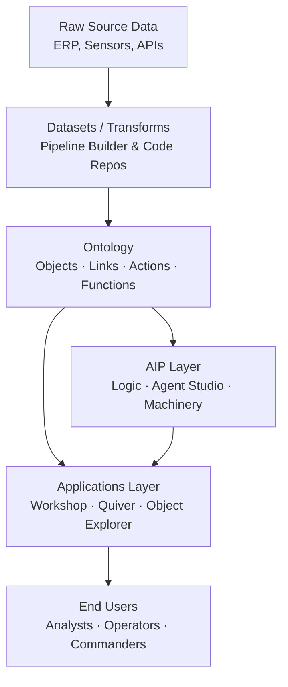
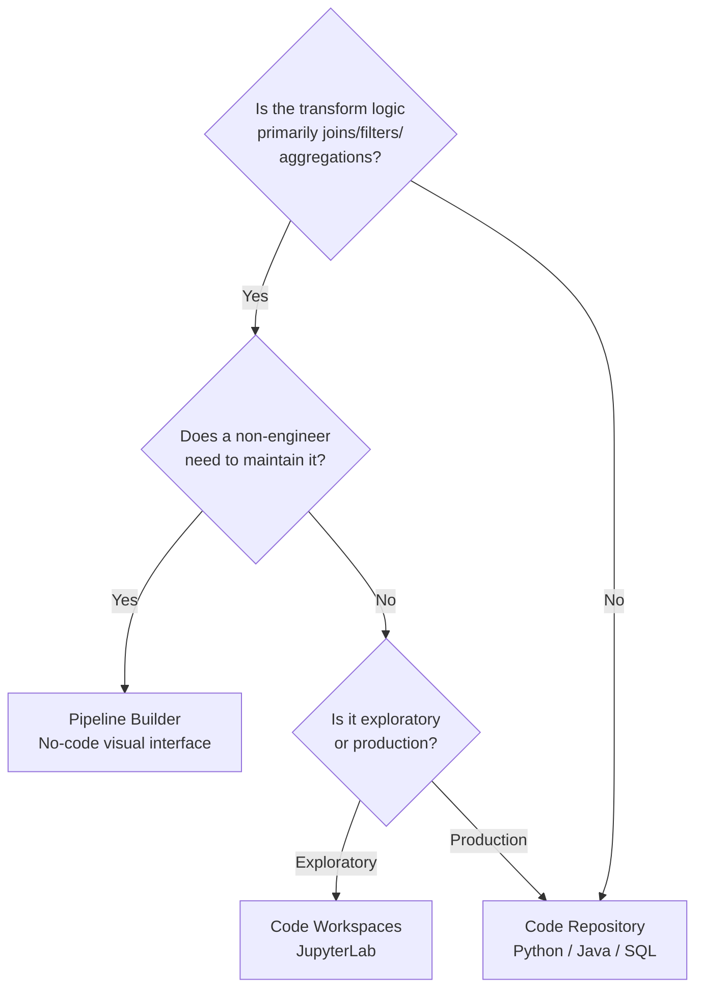

# Palantir AIP / Foundry Platform Guide

Sarah had been a data scientist at a defense contractor for six years when her program office told her they were moving to Palantir. She had done Databricks, she had done Advana, she had done custom Jupyter servers on Air Force cloud infrastructure. She figured this would be roughly the same thing with different branding.

She was wrong in ways that took her three months to fully understand.

The first surprise: there were no tables. There were *objects*. An aircraft wasn't a row in a `dim_aircraft` table — it was an `Aircraft` object with properties, with links to `Mission` objects and `Pilot` objects, with actions you could trigger directly from the interface. When the LLM in the AIP Logic block asked about F-35 availability, it wasn't querying raw SQL. It was querying through that semantic layer, with access controls enforced at the property level, with a shared definition of what "aircraft" meant baked into the data model itself.

That's the thing about Palantir. The architecture forces a decision about meaning before it lets you do anything else. Whether that sounds brilliant or annoying to you right now probably depends on how much time you've spent cleaning up the aftermath of someone else's undocumented schema.

This guide covers what you actually need to know to work on Foundry and AIP as a practitioner in a federal environment. It assumes you already know Python. It does not assume you already know what an Ontology is.

---

## What You'll Be Able to Do After This Guide

- Understand Foundry's product architecture and how AIP, Gotham, Apollo, and Foundry relate to each other
- Get access to a Foundry environment and know what FedRAMP High, IL4/IL5/IL6 mean for your work
- Build transforms and pipelines in Pipeline Builder and Code Repositories
- Train and publish ML models using the `palantir_models` library (not `foundry_ml` — that's gone)
- Wire LLMs into operational workflows using AIP Logic and Agent Studio
- Know when Palantir is the right tool and when it is not

---

## Platform Overview

### The Product Family

Palantir ships four distinct platforms, and federal data scientists will encounter all of them. They share infrastructure and the Ontology layer, but they serve different purposes.

**Foundry** is the enterprise data integration, analytics, and AI deployment platform. It handles everything from raw data ingestion to operational dashboards. Civil government agencies — DHS, HHS, NIH, NASA, the Department of Justice — run on Foundry. So does a large slice of commercial enterprise. If someone at your program office says "we're on Palantir," they almost certainly mean Foundry.

**Gotham** is the original Palantir product, built for defense and intelligence. Where Foundry thinks in datasets and pipelines, Gotham thinks in intelligence profiles and graph networks — linked entities, pattern-of-life analysis, counter-terrorism workflows. The Army's $10 billion Enterprise Agreement signed in July 2025 covers both Foundry and Gotham under a single consolidated framework.

**AIP** — the Artificial Intelligence Platform — is not a separate product you install. It is a layer on top of Foundry (and Gotham) that connects large language models to your Ontology. AIP Logic, Agent Studio, AIP Machinery: all of these are the mechanisms by which LLMs read from and write to your real organizational data rather than generating plausible-sounding nonsense into a chat window.

**Apollo** is the continuous delivery system that handles deployment, configuration management, and software updates across all Palantir environments — including classified networks with no internet connectivity. From your perspective as a data scientist, Apollo is largely invisible: it is the reason Foundry updates appear in your environment without requiring a ticket to your system administrator. For program managers, Apollo is the answer to "how does Palantir manage software in an air-gapped environment."

### The Ontology: What Actually Differentiates This Platform

Every data platform has tables. Every data platform has pipelines. Palantir has those too, but they are not what makes Foundry different from everything else.

The differentiator is the Ontology.

Think of it this way: in a conventional data environment, you have a `personnel` table and a `mission` table and a `vehicle` table, connected by foreign keys that only make sense if you read the schema documentation — which is three versions out of date. When a new analyst joins the program, they spend two weeks figuring out which `id` column actually joins to what. When someone builds a new dashboard, they probably duplicate a definition that already exists somewhere else.

The Ontology replaces that with a semantic layer that lives above the data. **Object Types** are schema definitions of real-world entities: `Aircraft`, `Supplier`, `Patient`, `Contract`. **Objects** are instances — the actual F-35 with tail number 104, the actual contract N00024-25-C-4477. **Properties** are the characteristics attached to those objects. **Link Types** are defined relationships between object types: "Pilot flies Aircraft," "Contract awards to Supplier." **Links** are the instances of those relationships.

Two additions make the Ontology operationally useful rather than just descriptively useful. **Actions** are defined sets of changes to Ontology data that users can trigger — "Approve Purchase Order," "Reassign Asset," "Update Mission Status." They enable writeback: the platform stops being read-only and becomes a system of record. **Functions** are TypeScript-authored business logic that can run arbitrary computations on Ontology data, powering everything from calculated properties to complex decision rules.

The consequence for AI is significant. When an LLM in AIP Logic queries your data, it queries through the Ontology. It gets objects with defined semantics, not raw column values from tables it cannot interpret. This is Palantir's answer to LLM hallucination on business-critical data: ground the model in a semantic layer that your organization controls and defined.

The consequence for access control is equally significant. Permissions can be enforced at the object and property level. A user with access to the `Aircraft` object type might only see the `tail_number` and `status` properties, not `maintenance_history` or `assigned_unit`. This matters a great deal in government environments where data sensitivity varies within a single object.



*Figure: Foundry architecture from raw data to operational user. The Ontology sits in the middle of everything — it is not an optional abstraction layer.*

---

## Getting Access

### FedRAMP, IL4/IL5/IL6, and What They Mean for Your Work

In December 2024, Palantir received FedRAMP High Baseline Authorization for its full product suite under the Palantir Federal Cloud Service (PFCS) and PFCS-SS designations. This single authorization covers AIP, Apollo, Foundry, Gotham, FedStart, and Mission Manager.

Before that authorization, Palantir was available at FedRAMP Moderate and at DoD Impact Levels 4 and 5 on Microsoft Azure. The December 2024 FedRAMP High designation opened the door to civilian agencies handling high-impact information — the kind of data that could cause serious harm if disclosed: law enforcement sensitive information, certain health records, financial data.

For DoD work specifically:

- **IL4** covers Controlled Unclassified Information (CUI) — most acquisition data, contractor-sensitive data, some personnel records. Palantir has been IL4 authorized on Azure for several years.
- **IL5** covers National Security Systems data that is unclassified but sensitive — higher-sensitivity CUI, DoD-only data. IL5 also runs on Azure Government.
- **IL6** covers Secret-level classified data. This is where the August 2024 Microsoft partnership becomes important: Palantir was the first industry partner to deploy Azure OpenAI Service in Azure Government Top Secret (IL6). The full Palantir stack — Foundry, Gotham, AIP, Apollo — runs in that environment.

In practice: if you are working on an unclassified federal program using Foundry in the commercial or Azure Government cloud, you are operating at FedRAMP High or IL4/IL5. If you are on a classified DoD program, you may be on IL6 via the Azure classified enclave. Your environment will determine which LLMs are available inside AIP — the k-LLM model-agnostic architecture means different models can be configured for different classification levels.

> **Note:** The authorization boundary matters for what data you can bring into your Foundry environment, not just whether you can access Foundry at all. A data scientist working in a FedRAMP High enrollment cannot ingest data that requires IL5 controls, even though IL5 environments exist. Know your program's ATO before you start moving data.

### The FedStart Program

FedStart is a Palantir offering that lets third-party software vendors deploy their products inside Palantir's existing security accreditation envelope. For a smaller ISV that would otherwise spend 18 to 24 months pursuing a separate FedRAMP authorization, FedStart compresses that timeline to weeks or months.

For your work as a data scientist, FedStart matters because it determines which third-party tools might already be available inside your Foundry environment. As of 2025, notable additions include:

- Anthropic's Claude (April 2025) — available as an AIP-connected LLM in government environments
- Google Cloud (April 2025) — streamlined FedRAMP High/IL5 accreditation for ISVs on Google Cloud
- Unstructured.io (August 2025) — AI-ready document parsing at FedRAMP High and IL5

If you need a specific model or tool and your program office is asking about ATO timelines, FedStart is worth raising.

---

## Core Concepts

### Datasets and the Foundry Data Layer

Below the Ontology, Foundry manages data as **datasets**: versioned, immutable snapshots of data in tabular or file form. Every transform produces a new dataset version. You can branch datasets like code branches in Git, run transforms on the branch, and merge the results — without touching the production data.

This branching model is one of Foundry's quieter differentiators. In most data environments, a data scientist doing exploratory work is either touching the production table directly (dangerous) or maintaining a separate copy that drifts from production (annoying). Foundry's branch-based approach means you can run experimental transforms on a branch, validate the output, and promote to main when ready. The lineage graph tracks every transformation step back to the source.

**Transforms** are the functions that produce datasets from other datasets. Pipeline Builder handles no-code transforms through a visual interface. Code Repositories handle production transforms in Python, Java, or SQL. Both are backed by the same scheduling, versioning, and lineage infrastructure.

### Branches

Branches in Foundry work similarly to Git branches but extend across the entire platform — not just code. A branch can contain:

- Modified datasets
- Changes to Ontology object types and link types
- Updated transforms
- New or modified Functions and Actions

The development workflow is: create a branch, make changes, test the transform outputs, validate the Ontology behavior, then merge to the main branch. This separation between development and production state is enforced at the platform level rather than left to convention.

---

## Data Science Tools

### Know Which Environment to Use

Foundry has three code-based development environments. They are not interchangeable. Using the wrong one creates technical debt you will deal with for months.

**Code Repositories** is where production work lives. Full Git version control — branches, commits, pull requests, code review. Python, Java, and SQL are all supported. Your transform functions run here; your production ML pipelines run here; anything that needs to be maintained, versioned, and scheduled belongs in a Code Repository. If you are building something that other people will depend on, it goes in a Code Repository.

**Code Workspaces** is the modern IDE environment for exploratory data science and model development. You get JupyterLab or RStudio in the browser, with direct access to Foundry datasets as training data. When you are ready to publish a trained model, you use the Models sidebar to register it in Foundry's model management system. As of November 2025, Code Workspaces also has an AIP agent sidebar — a coding assistant backed by any LLM available on your enrollment — and supports read/write access to Snowflake Iceberg tables via Unity Catalog.

**Code Workbook** is the legacy environment. It is a notebook-style interface that still works, and some programs have years of analysis built in it, but Palantir has marked it `[Legacy]` in the documentation. New work should go in Code Workspaces. If you inherit Code Workbook notebooks, know that you can export the Python and SQL code to a Code Repository for production use.

The practical rule: if you are exploring data or building a model, use Code Workspaces. If you are writing a production transform that runs on a schedule and feeds other datasets, use a Code Repository. If someone points you at Code Workbook, ask whether there is a migration plan.

### Python in Foundry

Python 3.10 is the primary language for data science work. The key libraries and patterns:

```python
# Foundry transform — production pipeline in a Code Repository
# This function reads two input datasets and produces a cleaned output

from transforms.api import transform, Input, Output
import pandas as pd


@transform(
    output=Output("/defense-programs/logistics/vehicle_status_clean"),
    raw=Input("/defense-programs/logistics/vehicle_status_raw"),
    reference=Input("/defense-programs/reference/vehicle_master"),
)
def compute(output, raw, reference):
    df = raw.pandas()
    ref = reference.pandas()

    # Drop records where vehicle_id cannot be resolved against master list
    valid_ids = set(ref["vehicle_id"])
    df_clean = df[df["vehicle_id"].isin(valid_ids)].copy()

    # Normalize status codes — the source system uses three different encodings
    status_map = {"SVCBL": "serviceable", "NS": "non_serviceable", "NMCS": "non_mission_capable"}
    df_clean["status_normalized"] = df_clean["status_code"].map(status_map).fillna("unknown")

    output.write_pandas(df_clean)
```

The `@transform` decorator is the core Foundry pattern. Your function declares its inputs and outputs; the platform handles scheduling, lineage tracking, and output versioning automatically. When the `vehicle_status_raw` dataset updates, Foundry knows this transform needs to re-run.

For SQL in Code Repositories, Foundry uses Spark SQL:

```sql
-- Foundry SQL transform: aggregate maintenance events by unit and month
-- Input: /defense-programs/maintenance/maintenance_events
-- Output: /defense-programs/maintenance/monthly_summary

SELECT
    unit_id,
    DATE_TRUNC('month', event_date) AS event_month,
    COUNT(*) AS total_events,
    SUM(CASE WHEN severity = 'critical' THEN 1 ELSE 0 END) AS critical_events,
    AVG(resolution_hours) AS avg_resolution_hours
FROM maintenance_events
WHERE event_date >= '2024-01-01'
GROUP BY unit_id, DATE_TRUNC('month', event_date)
ORDER BY unit_id, event_month
```

---

## ML on Foundry

### The `palantir_models` Library

If you find documentation or a Stack Overflow post referencing `foundry_ml`, stop reading it. That library was deprecated on October 31, 2025 and is no longer available. All ML work in Foundry uses `palantir_models`.

The model development workflow goes:

1. Train your model in Code Workspaces (Jupyter) using standard Python ML libraries — scikit-learn, PyTorch, XGBoost, whatever the problem calls for.
2. Publish the model using `palantir_models`.
3. The model is registered in Foundry's model management system with a version number and alias.
4. The model integrates into the Ontology as a resource — it can be called from AIP Logic blocks, from Functions, or from downstream transforms.

```python
# Code Workspaces — training and publishing a model with palantir_models
# This runs in a Jupyter notebook inside Foundry

import palantir_models as pm
from sklearn.ensemble import GradientBoostingClassifier
from sklearn.model_selection import train_test_split
from sklearn.metrics import classification_report
import pandas as pd

# Load training data directly from a Foundry dataset
# Dataset path references your enrolled Foundry environment
training_data = pm.datasets.load("/defense-programs/supply-chain/maintenance_training_set")
df = training_data.pandas()

features = ["days_since_last_service", "total_flight_hours", "component_age_days",
            "operating_temp_avg", "vibration_anomaly_score"]
target = "failure_within_30_days"

X = df[features]
y = df[target]

X_train, X_test, y_train, y_test = train_test_split(X, y, test_size=0.2, random_state=42)

# Train — GBM works well for tabular maintenance prediction
model = GradientBoostingClassifier(n_estimators=200, max_depth=4, learning_rate=0.05)
model.fit(X_train, y_train)

print(classification_report(y_test, model.predict(X_test)))

# Publish to Foundry model registry
# The model is now available to AIP Logic and downstream transforms
published = pm.models.publish(
    model=model,
    name="component_failure_predictor",
    description="GBM model predicting component failure within 30 days based on maintenance history",
    features=features,
    target=target,
)

print(f"Published model version: {published.version}")
print(f"Model RID: {published.rid}")
```

Once published, this model becomes a first-class object in your Foundry environment. You can version it, alias stable releases (e.g., `production` vs. `experimental`), and wire it into an AIP Logic block so that an LLM agent can call the failure predictor when answering questions about asset readiness.

### Model-Backed Ontology Objects

The most operationally powerful pattern in Foundry is the model-backed Ontology object. The idea: rather than having a model output that lives in a dataset nobody checks, you surface model predictions as properties on Ontology objects that end users interact with daily.

For example: the `Aircraft` object type has a `predicted_failure_probability` property. Behind that property, a deployed `palantir_models` model runs on each object's maintenance history and updates the prediction on whatever schedule your program requires. Operators in Workshop see the prediction alongside the aircraft status. An AIP Logic block can flag high-probability failures in natural language. Actions allow a maintenance coordinator to trigger a work order directly from the same interface.

The model is no longer a thing that data scientists run and analysts check occasionally. It is embedded in the operational workflow.

---

## AIP Capabilities

### AIP Logic

AIP Logic is where you build LLM-powered functions without writing LLM API calls or managing model infrastructure. You build Logic functions through a block-based interface; the core building block is the **Use LLM Block**, which accepts a prompt template and returns the model's response.

What makes AIP Logic different from simply calling the OpenAI API is the tools layer. AIP Logic functions can be equipped with:

- **Data tools** — read from the Ontology, query objects and properties and links
- **Logic tools** — execute Foundry Functions (your TypeScript business logic)
- **Action tools** — write back to the Ontology, trigger Actions safely

The safety model matters. An AIP Logic function with an Action tool cannot take arbitrary write actions. It can only invoke Actions that have been explicitly defined and approved in the Ontology. This is the difference between an LLM that can do anything and an LLM that can do specifically what your organization has approved.

A typical AIP Logic workflow in a defense supply chain context: the LLM receives a natural language query ("what high-failure-risk components need maintenance attention this week?"), uses a Data tool to query `Component` objects with `predicted_failure_probability > 0.7`, formats a natural language summary, and uses an Action tool to create a `MaintenanceReview` task in the system — all within a single Logic function that can be embedded in a Workshop application used by supply chain coordinators.

### Agent Studio

Agent Studio extends AIP Logic to full conversational agents with memory, context, and multi-turn interaction. Agents built in Agent Studio can be deployed inside Foundry Workshop applications or externally via the Ontology SDK (OSDK) and platform APIs.

The difference between a Logic function and an Agent: a Logic function executes once with a prompt and returns a result. An Agent maintains conversation state, can plan multi-step actions, remembers earlier turns, and can ask clarifying questions before taking action. Agents are appropriate when the workflow involves back-and-forth reasoning that cannot be predicted upfront.

### AI FDE — AI Forward Deployed Engineer

AI FDE entered beta in November 2025. It is a conversational agent that can operate Foundry itself through natural language — building transforms, creating Ontology object types, writing Functions, previewing and publishing changes. You describe what you want; it makes the changes; you review and approve.

The practical significance: AI FDE collapses the time between "I need a new data pipeline" and "that pipeline exists and is working." A data scientist can describe the transform logic in prose, have AI FDE generate the transform code, review it in the normal code review workflow, and publish — without hand-coding the boilerplate.

AI FDE requires AIP to be enabled on your enrollment. It is in beta, which means expect rough edges.

### The k-LLM Philosophy

Palantir deliberately built AIP to be model-agnostic. You can configure multiple LLMs simultaneously in your enrollment — GPT-4, Claude, other models — and select different models for different Logic blocks or agents based on capability, cost, or policy requirements.

For government customers, this matters specifically because model availability varies by classification level. In unclassified environments, you may have broad model selection. In the IL6 environment (Azure Government Top Secret), you have Azure OpenAI Service — GPT-4 variants deployed inside the classified enclave, made possible by the August 2024 Palantir-Microsoft partnership. Anthropic's Claude became available in government environments through the FedStart program in April 2025 and is documented as the model underlying the Maven Smart System.

Swapping models does not require rewriting your AIP Logic or agents. The Ontology grounding and the tools layer remain constant across model changes.

---

## Data Integration

### Pipeline Builder vs. Code Repositories

You will hit this decision constantly on Foundry: build the pipeline in Pipeline Builder or write it in a Code Repository?

Pipeline Builder is the visual, no-code/low-code interface. You connect source nodes to transform nodes through a drag-and-drop canvas. Join, filter, union, cast, rename, geospatial transforms — all available as point-and-click operations. As of May 2025, Pipeline Builder can invoke LLMs directly through a "Use LLM" node, and it supports media set transforms for image and PDF manipulation. Scheduling, versioning, and lineage tracking are handled automatically.

Code Repositories handle production transforms in Python, Java, or SQL. They give you full programmatic control — custom logic, complex feature engineering, ML preprocessing, anything that needs more than the visual nodes support.

The practical guidance:

- Use Pipeline Builder for data ingestion, normalization, joins, and filters that a non-engineer needs to understand and maintain. If your government customer's data engineer needs to modify the pipeline in six months, Pipeline Builder produces something they can read without Python knowledge.
- Use Code Repositories for transforms with complex business logic, ML preprocessing, and anything where you need unit tests and code review.
- Do not try to do complex ML feature engineering in Pipeline Builder. The visual interface is not designed for it.



*Figure: Decision tree for choosing the right development environment in Foundry.*

### Multi-Source Connectors and Databricks Partnership

Foundry ships over 200 prebuilt connectors to ERP systems, IoT feeds, databases, cloud storage, and APIs. Batch, micro-batch, and streaming patterns are all supported.

The March 2025 Palantir-Databricks partnership introduced a specific integration that government data scientists will encounter in hybrid architectures: **zero-copy Unity Catalog integration**. Data governed in a Databricks Lakehouse can register directly in Foundry as Virtual Tables without ETL or duplication. From a Foundry workflow, a Virtual Table looks like any other dataset — it has lineage, it participates in transforms, it can be mapped to Ontology objects. The underlying data stays in Databricks Delta Lake format, governed by Unity Catalog, and Foundry reads it in place.

This is the pattern for DoD programs where some data lives on Advana (which runs Databricks) and other workflows run on Foundry. The two platforms do not force a choice anymore. The William Blair analyst note from 2025 put it plainly: Databricks is where you build AI, Palantir is where you deploy AI into operations. Those are not the same problem.

---

## Security and Compliance

### The Authorization Boundary

Foundry's security model is authorization-boundary-first. The Palantir Federal Cloud Service (PFCS) defines a specific boundary that covers AIP, Apollo, Foundry, Gotham, and supporting products. When you work inside a government Foundry enrollment, you are operating inside that boundary.

What this means practically:

- Data access controls are enforced at the Ontology layer — object type, property, and link — not just at the dataset level. A user with read access to `Aircraft` objects may not have read access to the `maintenance_history` property even on the same object.
- Audit logging of data access is native to the platform, not bolted on.
- The AIP layer inherits these controls. An LLM in an AIP Logic block cannot read data that the invoking user does not have permission to see. The Ontology access controls apply to LLM queries the same way they apply to human queries through Object Explorer.
- Apollo, the continuous delivery system, manages software updates and configuration in air-gapped environments without requiring outbound connectivity. For classified network deployments, this is non-negotiable.

The December 2024 FedRAMP High authorization was a multi-year process. It is not uncommon for government programs to require their own Authority to Operate (ATO) on top of the platform-level authorization. Know whether your program needs an additional ATO, and start that conversation early — adding AIP capabilities to an existing Foundry enrollment that was authorized before AIP existed may require a supplemental authorization review.

> **Sanity check:** "FedRAMP High means I can put any sensitive data in Foundry." Not quite. FedRAMP High sets the baseline for what *type* of unclassified sensitive data the platform can handle. Your program's ATO determines what specific data your instance can process. The platform authorization and the program authorization are two different things.

---

## Government Adoption

### The Scale of the Army Deal

The U.S. Army signed a $10 billion, 10-year Enterprise Service Agreement with Palantir in July 2025. That number matters beyond its headline size. The deal consolidated 75 separate contracts — 15 prime contracts and 60 related contracts — into one framework. Volume-based pricing. Available to other DoD components beyond the Army itself.

The consolidation model is significant for data scientists working on Army programs. Instead of navigating a patchwork of individual task orders with different statement-of-work constraints, there is a single enterprise framework. That accelerates deployment timelines and reduces the contracting overhead that historically slowed software delivery to warfighters.

### Maven Smart System

Maven Smart System became a Pentagon Program of Record in March 2026, per a memo from Deputy Defense Secretary Steve Feinberg. That designation means stable, long-term funding — Maven is no longer a program that could be cancelled at the next budget cycle. Oversight transferred from the National Geospatial-Intelligence Agency to the DoD Chief Digital and Artificial Intelligence Office (CDAO).

The publicly documented capabilities: Maven processes large volumes of battlefield data from satellites, radars, drones, sensors, and intelligence reports. It identifies potential targets and threats. It provides an operational map with friendly and enemy positions. It supports natural language queries through AIP — "show me self-propelled artillery detections in this sector" returns relevant data without a user needing to know which dataset to query or how to write the filter.

NATO acquired Maven Smart System NATO (MSS NATO) in April 2025 for employment within Allied Command Operations. A $240 million DoD contract for battlefield decision support followed in January 2026.

The Maven trajectory illustrates the platform's intended direction: operational AI that puts analysis in front of decision-makers in real time, grounded in live data, with natural language access for users who are not data scientists.

### Navy ShipOS and Civilian Agencies

The $448 million Navy ShipOS contract (December 2025) targets shipbuilding supply chain modernization. This is a different use case from Maven — not battlefield decision support, but the industrial logistics problem of tracking complex manufacturing programs across a fragmented supplier base.

On the civilian side, DHS, HHS, NIH, NASA, and the Department of Justice were all active Foundry customers by mid-2025. HHS was one of the earliest Foundry adopters. The FedRAMP High authorization in December 2024 opened the door to civilian high-impact data; the Trump administration's 2025 expansion into federal civilian agencies accelerated deployment across departments.

Accenture Federal Services joined as a preferred implementation partner in June 2025, with 1,000 certified professionals trained on Foundry and AIP. For programs that need a systems integrator, that partnership creates a scaled delivery capability that did not exist in previous years.

---

## Where This Goes Wrong

**Failure Mode 1: Skipping the Ontology**

**The mistake:** Teams build Foundry transforms exactly like they would build any other data pipeline, producing datasets that feed dashboards — and never model the Ontology layer.

**Why smart people make it:** The Ontology has a learning curve. You can build a functioning dashboard in Workshop without ever defining an object type. Early delivery pressure makes skipping it tempting. The result looks fine for six months.

**How to recognize you're making it:**
- Your Workshop application reads directly from datasets rather than Ontology objects
- You have multiple datasets that represent the same real-world entity with slightly different schemas
- When someone asks "what does this field mean," the answer is "check the pipeline code"
- Your AIP Logic blocks read from datasets rather than querying through the Ontology
- LLM-generated outputs have hallucinated field interpretations

**What to do instead:** Define the Ontology before you build the application. It takes longer upfront. Programs that skip it spend months retrofitting, and retrofitting the Ontology after downstream applications are built is significantly harder than modeling it correctly the first time.

---

**Failure Mode 2: Treating Code Workbook as a Production Environment**

**The mistake:** Exploratory analysis done in Code Workbook gets promoted to production by just... running it in Code Workbook on a schedule.

**Why smart people make it:** Code Workbook is frictionless for quick analysis. The results look right. Nobody wants to spend three days migrating a working notebook into a Code Repository with proper tests and review.

**How to recognize you're making it:**
- Production datasets are being produced by notebooks without version history
- Nobody on the team can answer "what changed between last week's run and this week's run"
- The notebook has accumulated ad-hoc fixes that nobody fully understands
- Code Workbook is now marked `[Legacy]` in Palantir documentation

**What to do instead:** Use Code Workbook for what it is designed for — exploration. When something in Code Workbook is worth running more than once, migrate it to a Code Repository. Foundry provides an export function for exactly this purpose.

---

**Failure Mode 3: Using `foundry_ml`**

**The mistake:** Following older documentation, blog posts, or institutional knowledge that references the `foundry_ml` library.

**Why smart people make it:** Palantir documentation existed for years referencing `foundry_ml`. Programs built around it. Onboarding materials for many federal programs were written before October 31, 2025.

**How to recognize you're making it:** Your import statement says `import foundry_ml`. Your models are configured as dataset-backed models. The library throws errors or is simply unavailable.

**What to do instead:** Use `palantir_models`. Full stop. If you inherit a program with `foundry_ml` code, migrating to `palantir_models` is the first priority before any new model development.

---

## Practical Takeaway: Platform Decision Checklist

Before committing to Palantir Foundry as your primary platform for a new program, run through this:

| Question | If Yes | If No |
|----------|--------|-------|
| Do you need to deploy AI into operational workflows (not just analysis)? | Foundry/AIP is well-suited | Consider whether a simpler BI platform covers the need |
| Does your data have complex entity relationships that benefit from semantic modeling? | The Ontology is worth the investment | You may be over-engineering with Foundry |
| Do you need FedRAMP High or IL5/IL6 authorization? | Foundry covers this; check your specific ATO requirements | Simpler platforms may work |
| Do you have Databricks data assets you need to surface without ETL? | Use Unity Catalog Virtual Tables integration | Standard Pipeline Builder connectors |
| Do you need non-engineers to modify data pipelines? | Pipeline Builder is the right tool | Code Repositories give more control |
| Are you training large-scale ML models from scratch? | Foundry works but Databricks may be more efficient at scale | Foundry's model workflow is fine |
| Do you need LLMs grounded in your specific operational data? | AIP Logic + Ontology is the right architecture | Generic LLM APIs without grounding will hallucinate |

---

## Platform Comparison

### Palantir's Position in the Federal Data Environment

The honest comparison is harder than vendor marketing makes it sound, because Palantir, Databricks, Advana, and Qlik are not doing the same thing.

| Dimension | Palantir Foundry/AIP | Databricks (Advana) | Qlik | Navy Jupiter |
|-----------|---------------------|---------------------|------|--------------|
| Core metaphor | Ontology (semantic objects, actions) | Lakehouse (Delta tables, open format) | BI and ETL | DoN enterprise data environment |
| Primary strength | Operational AI deployment | Model building and training at scale | Analytics and data integration | DoN-specific data governance |
| Government authorization | FedRAMP High (Dec 2024), IL4/IL5, IL6 | Advana: DoD-managed IL5 deployment | Limited government security posture | DoN-specific |
| LLM integration | AIP (native, Ontology-grounded) | Mosaic AI (separate tooling) | Minimal | Limited |
| No-code tools | Strong (Pipeline Builder, AIP Logic) | Primarily notebook-based | Strong (Qlik Sense) | Limited |
| Data format | Proprietary + Virtual Tables | Open Delta Lake | Qlik-native + connectors | Varies |
| Scale for model training | Moderate | Excellent (Spark at scale) | Not applicable | Limited |
| Writeback/actions | Native (Actions, Workshop) | Separate tooling required | Limited | Limited |

The practical reality in 2026: Palantir and Databricks are strategic partners, not pure competitors. The Army's enterprise agreement and DoD's Open DAGIR strategy both envision multi-vendor environments. A large DoD program might use Advana (Databricks) for data engineering and bulk ML training, surface that data in Foundry through the Unity Catalog integration, build the operational application in Workshop, and wire in AIP for the LLM layer. That is not a theoretical pattern — it is what programs with assets in both platforms are already doing.

Qlik occupies a different position: BI analytics and ETL, with a strong product for business intelligence dashboards but without Foundry's depth in AI deployment or defense-grade security infrastructure. If your program needs dashboards and reporting for a civilian agency that already has Qlik, Qlik is a reasonable choice. If your program needs to deploy AI into the hands of operators making time-sensitive decisions, Qlik does not have that capability.

---

## Chapter Close

**The one thing to remember:** The Ontology is not optional boilerplate you add after the real work is done — it is the architecture that makes AI grounding, operational writeback, and fine-grained access control possible in Foundry, and skipping it turns a sophisticated platform into an expensive pipeline tool.

**What to do Monday morning:** If you have access to a Foundry enrollment, go to `learn.palantir.com` and run the "Speedrun: Your First Agentic AIP Workflow" module — it takes under an hour and covers the complete path from dataset to Ontology object to AIP Logic function to Workshop application. If you are evaluating Foundry for a federal program, ask for an AIP Bootcamp slot with your own data rather than a vendor demo with canned data. The approximately 75% conversion rate exists because seeing AIP grounded in your actual Ontology data is categorically different from watching a demo.

**What comes next:** The Ontology is the foundation, but the operational power lives in Workshop — the application layer where data scientists' work reaches end users, and where Actions close the loop from decision to data. The next section covers Workshop application design, the decisions that make or break user adoption, and how to build for the operators who will actually use what you build.
