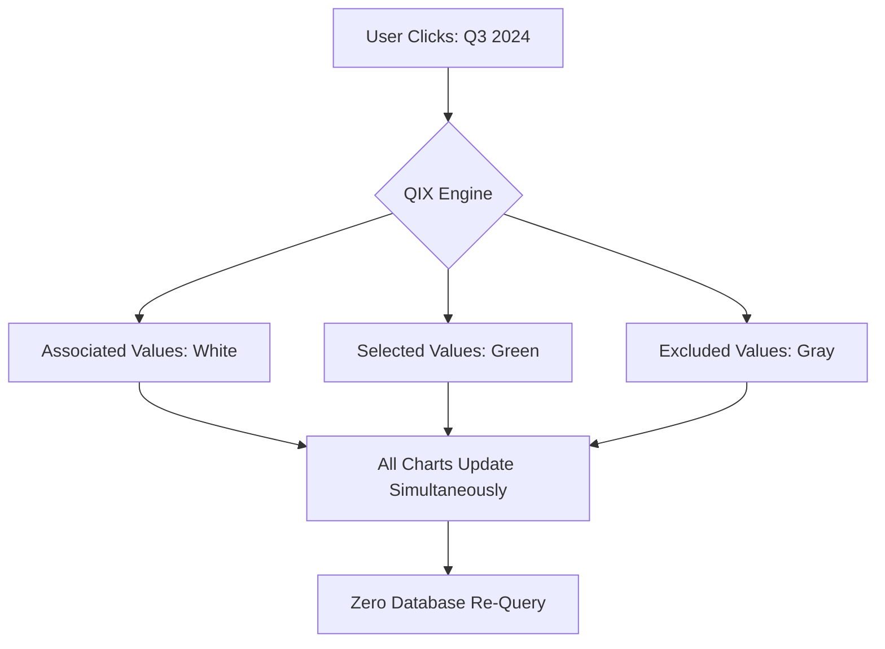
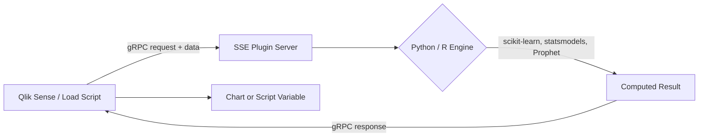
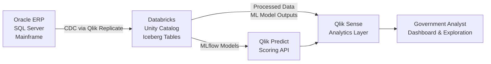

# Qlik for Government

Sarah Nguyen had been staring at the same dashboard for forty minutes. The chart showed contract obligation rates by quarter — useful enough — but the director wanted to know why Q3 looked anomalous, and the chart didn't tell her that. She clicked through to a second dashboard. Then a third. Each answered a slightly different question, none of them the right one. Each required a new query, a new load, a new wait.

A colleague three desks over had Qlik Sense open. He selected "Q3" in his timeline chart. Every other chart on his screen lit up or grayed out simultaneously — vendors, program offices, appropriation types, geographic distribution. No new query. No reload. The engine had already mapped every relationship in the data model. Selecting one dimension didn't filter the view; it revealed which parts of the entire dataset were connected to that selection and which weren't. In forty-five seconds he had his answer: Q3 anomaly was concentrated in one program office, two vendors, and one appropriation type that had run out of obligating authority in August.

That's the difference Qlik's QIX engine makes in practice. It's not a faster BI tool. It's a different way of asking questions.

This guide covers everything you need to work with Qlik in a federal government context — the architecture behind that demo, the compliance posture, how to get access, where to write code, and where Qlik runs into its limits.

## What You'll Work With After This Guide

By the end, you'll understand how to:

- Build and optimize Qlik load scripts for government data sources
- Connect Python and R to Qlik through Server-Side Extensions (SSE)
- Configure Qlik in AWS GovCloud and understand the FedRAMP Moderate boundary
- Use Qlik Predict for no-code ML with explainability outputs
- Stream data from enterprise sources into Databricks via Qlik Replicate
- Know exactly which workloads Qlik handles well and which ones to route elsewhere

---

## Platform Overview

### The QIX Associative Engine

Qlik's core engine — the QIX Engine — is the reason the platform behaves differently from every SQL-based BI tool. It's been in continuous development for more than 30 years, and the architecture reflects a fundamental design choice: store all relationships in memory at load time so that every subsequent user interaction is a traversal of an already-computed graph, not a new database query.

In a SQL-based tool, when you click a filter, the tool executes a WHERE clause against a database. The result comes back. The other charts re-render based on the filtered result set. This is fine for reporting. It's limiting for exploration.

In Qlik, when you load data, the engine builds an in-memory associative map — every value in every field tracks which values in every other field it co-occurs with. When you click "FY2025" in a fiscal year chart, every other field in the entire data model instantly knows which of its values appeared alongside FY2025 records and which didn't. Green means selected. White means associated. Gray means excluded. That three-color state system is visible across all charts simultaneously, with no re-query.

The practical implication: a government analyst investigating contractor performance doesn't need to know in advance which dimensions to join. They select an anomalous value, watch the grays and whites redistribute across the whole screen, and follow the pattern. This is associative discovery. It's the reason Qlik's installed base skews toward analytical users who need to explore data, not just consume pre-built reports.

### Qlik Sense and Qlik Cloud Analytics

The analytics product is **Qlik Sense**, available in several deployment configurations:

- **Qlik Cloud Analytics** — the SaaS product hosted in commercial AWS
- **Qlik Cloud Government** — purpose-built SaaS instance for U.S. public sector, hosted in AWS GovCloud
- **Qlik Cloud Government — DoD** — separate higher-security instance for DoD organizations
- **Qlik Sense Enterprise on Windows** — customer-managed, on-premises or in a government-controlled cloud region
- **Qlik Sense Enterprise on Kubernetes** — containerized deployment

For federal practitioners, the relevant choice is almost always between Qlik Cloud Government (SaaS, Qlik-managed) and Qlik Sense Enterprise on Windows (customer-managed). The SaaS path gets you FedRAMP Moderate authorization and Qlik handling security patching. The on-premises path gives you full data custody but makes you responsible for maintenance and means you're behind on feature releases.

### Talend Integration

In May 2023, Qlik acquired Talend, which had been a standalone ETL leader for years. The acquisition turned Qlik from a BI-plus-CDC company into something closer to an end-to-end data platform. **Qlik Talend Cloud** now handles full ETL/ELT pipelines, data quality profiling, and master data management. Talend retained its **Gartner Magic Quadrant Leader** recognition for Data Integration Tools — for the 10th consecutive year in 2025 — under Qlik's umbrella.

The acquisition matters for government agencies because it means a single vendor can now cover data ingestion, transformation, quality, and visualization under one contract and one compliance boundary.

---

## Government Offerings

### FedRAMP Moderate Authorization

Qlik Cloud Government holds **FedRAMP Moderate** authorization. The sponsoring agency is the U.S. Environmental Protection Agency, which worked with Qlik through the authorization process and is a production user. The third-party assessor (3PAO) is Coalfire. The listing appears in the FedRAMP Marketplace at marketplace.fedramp.gov.

The authorized scope covers:

- Qlik Sense Enterprise SaaS (analytics)
- Qlik Cloud Data Integration
- Qlik Application Automation
- Direct Query
- Qlik Data Gateway — Direct Access

This is an important boundary. The FedRAMP authorization doesn't cover a generic "Qlik" — it covers specific product configurations within Qlik Cloud Government. If you're using Qlik Sense Enterprise on Windows in your own environment, the FedRAMP authorization doesn't automatically transfer; you'd be inheriting AWS GovCloud controls, not Qlik's authorization package.

> **Note:** Qlik Cloud Government holds FedRAMP **Moderate** authorization, not High. This is the single largest compliance gap in Qlik's government posture. For civilian agencies operating CUI at the Moderate impact level, Qlik Cloud Government works. For any workload requiring FedRAMP High — sensitive law enforcement data, financial intelligence, certain DoD systems — you need a different analytics layer. Power BI via Azure Government and Databricks SQL (both FedRAMP High authorized) are the most common alternatives.

### DoD IL2 and IL4

Qlik Cloud Government — DoD supports **DoD Impact Level 2** and **DoD Impact Level 4** data. IL2 covers publicly releasable DoD information. IL4 extends to Controlled Unclassified Information (CUI), covering a large portion of DoD's operational analytics workloads.

IL5 — the level covering National Security Systems above CUI — is not confirmed for Qlik as of March 2026. If your workload requires IL5, Qlik is not the right analytics layer without additional customer-managed controls that Qlik has not documented a supported path for.

### StateRAMP and ITAR

Beyond federal FedRAMP authorization, Qlik Cloud Government holds **StateRAMP Moderate Authorization** — the analogous certification for state and local government. State procurement officers can inherit from this authorization rather than conducting individual security reviews. Texas-specific certification (**TX-RAMP Level 2**) is also in place.

For defense contractors working with controlled technical data, Qlik Cloud Government supports **ITAR compliance**, documented in its security configuration. This covers the specific regulatory requirements around International Traffic in Arms Regulations data handling.

---

## Getting Access

### AWS GovCloud Deployment

Qlik Cloud Government runs on AWS GovCloud (US). You don't manage the AWS infrastructure — Qlik does. What you manage is your tenant configuration: user provisioning, content access controls, data connection credentials, and the Data Gateway if you're querying on-premises sources.

If your agency already has a FedRAMP ATO for another AWS GovCloud-hosted service, the compliance path for Qlik is shorter. The FedRAMP inheritance process lets you use Qlik's existing authorization package as the foundation for your own ATO, rather than starting from scratch.

Deployment options for hybrid scenarios:

- **Qlik Data Gateway — Direct Access**: A lightweight, secure gateway that allows Qlik Cloud Government to run queries against on-premises data sources in real time without moving data to the cloud. This is how agencies with network segmentation requirements connect on-premises databases to the cloud analytics layer without violating data residency policies.
- **Qlik DataTransfer**: A Windows application for uploading data from on-premises sources to Qlik Cloud Government without requiring firewall tunneling. Used when the Data Gateway isn't practical due to network architecture constraints.

### JWCC Procurement (February 2026)

As of February 2026, Qlik Cloud Government — DoD, Qlik Sense Enterprise, and Qlik Data Integration are available in **AWS Marketplace** through **JWCC (Joint Warfighting Cloud Capability)** procurement pathways.

JWCC is the DoD's primary multi-cloud contract vehicle, covering AWS, Azure, Google Cloud, and Oracle. DoD organizations procuring through JWCC can now acquire Qlik directly through AWS Marketplace private listings, which simplifies acquisition significantly: consolidated billing, pre-negotiated terms, faster ordering. If your organization already buys cloud services through JWCC, adding Qlik is straightforward.

The JWCC path offers a choice between Qlik Cloud Government — DoD (SaaS, Qlik-managed) and customer-managed deployment of Qlik Sense Enterprise. Most DoD shops without an existing on-premises Qlik investment should default to the SaaS path unless they have specific data residency or network constraints that require on-premises.

> **Sanity check:** "We'll just buy Qlik on an existing vehicle." Qlik's licensing is user-based and capacity-based. Before any procurement action, validate whether your agency qualifies for JWCC (DoD only), check the FedRAMP Marketplace listing for civilian agencies, or go directly through Qlik's public sector team. Don't assume an existing software vehicle covers Qlik-specific configurations.

---

## Analytics and Visualization

### The Associative Model in Practice

The QIX engine's power comes from the data model you build in the load script. Every table you load becomes a node in an associative graph. Qlik automatically detects relationships between tables through matching field names — if your contracts table and your vendor table both have a `VENDOR_ID` field, Qlik connects them. This is different from defining explicit foreign key joins; the association is inferred and maintained automatically across the entire model.

The consequence: when a user selects "denied claims" in one chart, every other chart in the app immediately shows whether its data is associated with denied claims (white), unrelated to denied claims (gray), or currently selected (green). No WHERE clause. No waiting.

This architecture favors analysts who explore — who don't know in advance which correlations matter. For government use cases like contract anomaly detection, budget execution analysis, audit investigation, and program health monitoring, this exploration-first design is genuinely useful.



*Figure: Qlik's associative model updates all charts simultaneously on selection, without re-querying the underlying database. The engine traverses the in-memory graph computed at load time.*

### Insight Advisor

**Insight Advisor** is Qlik's AI-assisted analytics layer built into Qlik Sense. You type a natural language question — "show me procurement spend by vendor last quarter" — and Insight Advisor generates a recommended chart. It also surfaces **Associative Insights**: when you've made a selection, it highlights which excluded values would have the most impact on a given metric if they were included. This is specifically useful for audit and investigation workflows where an analyst doesn't know which exclusions are meaningful.

Insight Advisor is available in both Qlik Cloud and Qlik Sense Enterprise on Windows, though some features differ between deployments. The cloud version gets updates faster.

### Chart Recommendations and Cognitive Guidance

Beyond natural language queries, Qlik Sense will suggest visualization types based on the fields you've dragged into a chart. This matters less for experienced developers but is genuinely useful for the business analyst building their first Qlik app without a developer's support. Government agencies deploying Qlik for self-service analytics — civilian employees who need to build their own reports — benefit from this without requiring Qlik training for every user.

---

## Data Science on Qlik

### The Data Load Script

Before any visualization exists, there is the load script. This is where data scientists and power users do the real work: connecting to sources, transforming data, building the in-memory model. Qlik's scripting language is SQL-adjacent but has its own patterns.

Core script operations:

```qlik
// Connect to a SQL Server source and load contracts data
LIB CONNECT TO 'SQLServer_Contracts';

Contracts:
LOAD
    contract_id,
    vendor_name,
    obligation_amount,
    performance_start_date,
    performance_end_date,
    program_office,
    naics_code
FROM [dbo].[contract_actions]
WHERE fiscal_year = 2025;

// Load a CSV reference table for NAICS descriptions
NAICS_Reference:
LOAD
    naics_code,
    naics_description,
    psc_category
FROM [lib://DataFiles/naics_reference.csv]
(txt, codepage is 28591, embedded labels, delimiter is ',');
// Qlik will auto-associate these tables on matching naics_code
```

The `LIB CONNECT TO` pattern references a named data connection configured in your Qlik Cloud Government environment. Government deployments use this instead of hardcoded connection strings, which is good practice for credential management and FedRAMP control compliance.

For performance with large government datasets, the standard pattern is QVD files:

```qlik
// Incremental load using QVD files — standard pattern for large data
// Step 1: Load new records since last run
Contracts_New:
LOAD
    contract_id,
    obligation_amount,
    modification_number,
    last_modified_date
FROM [dbo].[contract_actions]
WHERE last_modified_date > '$(vLastLoadDate)';

// Step 2: Load existing QVD excluding records that were just updated
Contracts_Existing:
LOAD *
FROM [lib://QVD/Contracts.qvd] (qvd)
WHERE NOT EXISTS(contract_id);

// Step 3: Concatenate and store new QVD
CONCATENATE (Contracts_New)
LOAD * RESIDENT Contracts_Existing;
STORE Contracts_New INTO [lib://QVD/Contracts.qvd] (qvd);
DROP TABLE Contracts_Existing;
```

QVD is Qlik's proprietary binary format. Loading from QVD is 10x to 100x faster than loading from a database because the data is already in the format the QIX engine expects. For daily refresh jobs against large government databases — contract awards, logistics data, financial transactions — the QVD incremental pattern is what keeps reload times under ten minutes.

### Qlik Predict (AutoML)

**Qlik Predict** — rebranded from AutoML in 2025 — is the no-code machine learning capability built into Qlik Cloud. It's not a replacement for Python ML workflows, but it handles a specific category of government use cases well: analysts who need predictive outputs (contract cost overrun probability, procurement demand forecasting, anomaly scoring) without writing model code.

The workflow: select a target variable, select input features, train. Qlik handles feature engineering, model selection, hyperparameter tuning, and cross-validation. The output is a scoring endpoint you can call from the load script or from a Qlik application.

The July 2025 addition of the **AI Trust Score** is the feature that makes Qlik Predict credible in government contexts. The AI Trust Score assesses data readiness before training — flagging data quality issues, imbalance, and coverage gaps that would undermine model reliability. For federal data governance programs that mandate explainability and auditability of model decisions, having a formalized readiness check built into the training workflow is more than a convenience feature. It's documentation.

What-if analysis and scenario planning are also built in: once you have a model, you can adjust input variables interactively and see how predicted outcomes shift. Budget analysts running "what happens to unit costs if fuel prices increase 15%" scenarios can do this in the Qlik UI without handing the question to a data scientist.

> **Note:** Qlik Predict is appropriate for tabular data classification, regression, and forecasting. It does not handle computer vision, NLP model training, or workloads requiring GPU compute. For those tasks, route to Databricks Mosaic AI or another ML platform and bring predictions back into Qlik as a field.

### Server-Side Extensions (SSE via gRPC)

For practitioners who need Python or R inside Qlik — not just predictive scoring from a pre-trained model but actual runtime computation — **Server-Side Extensions (SSE)** is the integration layer. SSE uses gRPC to let Qlik call an external computation server, pass data to it, receive results, and display those results in charts or use them in load scripts.

The architecture:



*Figure: SSE gRPC architecture. Qlik sends data to an external plugin server, which runs Python or R computation and returns results. Results appear as native Qlik expressions.*

A minimal Python SSE plugin looks like this:

```python
# Minimal SSE plugin: expose scikit-learn predictions to Qlik
# Run this server alongside your Qlik Sense Enterprise environment
import grpc
from concurrent import futures
import ServerSideExtension_pb2 as SSE
import ServerSideExtension_pb2_grpc as SSEGrpc
import pandas as pd
import joblib

# Load your pre-trained model once at startup
model = joblib.load('contract_risk_model.pkl')

class QlikExtension(SSEGrpc.ConnectorServicer):

    def GetCapabilities(self, request, context):
        # Declare what functions this plugin exposes to Qlik
        capability = SSE.Capabilities(
            allowScript=False,
            pluginIdentifier='ContractRiskScorer',
            pluginVersion='1.0'
        )
        return capability

    def ExecuteFunction(self, request_iterator, context):
        # Receive row-level data from Qlik and return scored probability
        rows = []
        for request in request_iterator:
            for row in request.rows:
                features = [d.numData for d in row.duals]
                rows.append(features)

        df = pd.DataFrame(rows, columns=[
            'obligation_amount', 'period_of_performance_days',
            'vendor_past_performance_score', 'naics_risk_index'
        ])

        probabilities = model.predict_proba(df)[:, 1]  # Risk score: 0-1

        # Return results as Qlik rows
        for prob in probabilities:
            dual = SSE.Dual(numData=float(prob))
            row = SSE.Row(duals=[dual])
            yield SSE.BundledRows(rows=[row])


def serve():
    server = grpc.server(futures.ThreadPoolExecutor(max_workers=10))
    SSEGrpc.add_ConnectorServicerServicer_to_server(QlikExtension(), server)
    server.add_insecure_port('[::]:50051')
    server.start()
    server.wait_for_termination()

if __name__ == '__main__':
    serve()
```

In the Qlik load script, you then call this plugin with:

```qlik
// Call the SSE plugin from the load script
ContractRisk:
LOAD
    contract_id,
    vendor_name,
    SSEPlugin.ContractRiskScorer.ScoreRisk(
        obligation_amount,
        period_days,
        vendor_score,
        naics_risk
    ) AS risk_probability
RESIDENT Contracts;
```

Government use cases that actually justify SSE overhead: scikit-learn classification on procurement data for fraud indicators, ARIMA/Prophet forecasting on budget execution timelines, NLP on free-text audit findings. The setup cost is non-trivial — you're maintaining a gRPC server — which is why the SSE pattern is declining in favor of Qlik Predict for simpler ML tasks.

The open-source `qlik-py-tools` library (github.com/nabeel-oz/qlik-py-tools) provides a pre-built SSE plugin implementing common scikit-learn algorithms, time-series models, and NLP preprocessing. For on-premises Qlik Sense Enterprise deployments where Qlik Predict isn't available, this is the fastest path to bringing ML into the environment.

---

## Data Integration

### Talend ETL

**Qlik Talend Cloud** handles ETL/ELT pipelines, data quality, and master data management. For government agencies, the most common use cases are:

- Building transformation pipelines from agency source systems into a data warehouse or lakehouse
- Data quality profiling for FY data — financial data that needs auditable transformation rules
- Master data management for enterprise reference data (vendor SAM registrations, program codes, geographic hierarchies)

Talend's transformation logic runs as code — not just GUI drag-and-drop — which means pipelines are versionable, testable, and auditable. For environments where data lineage documentation is required for compliance, this matters.

### Qlik Replicate (Change Data Capture)

**Qlik Replicate** (originally Attunity, acquired in 2019) is the CDC engine. CDC — Change Data Capture — means instead of extracting a full table copy on every pipeline run, Replicate reads the database transaction log and streams only the records that changed. For large government operational databases, this is the difference between a four-hour full extract and a continuous sub-minute feed.

Sources Replicate handles: Oracle, SQL Server, DB2, PostgreSQL, SAP, mainframe (IBM IMS and VSAM), and a range of SaaS applications. The government stack has a lot of Oracle ERP systems and legacy mainframes. Replicate's mainframe support is a genuine differentiator — most modern CDC tools don't cover VSAM.

Targets include data lakes, warehouses, and streaming platforms. Which brings us to the Databricks integration.

### Databricks Integration (June 2025)

In June 2025, Qlik expanded its integration with the Databricks Data Intelligence Platform. The additions:

- **Real-time UniForm table streaming**: Qlik Replicate streams CDC from enterprise source systems directly into Unity Catalog's managed Apache Iceberg tables. Not batch loads — streaming, with sub-minute latency.
- **Automated Apache Iceberg optimization**: Qlik Open Lakehouse handles automated compaction, partitioning, and pruning of Iceberg tables, which would otherwise require manual Databricks workflows or external orchestration.
- **AI-ready data products**: provisioning data directly into the Databricks Lakehouse in formats optimized for downstream ML training.

The roadmap at announcement included schema inference, Databricks notebook import, and native Spark debugging within Qlik workflows.

This integration reflects how most government agencies with both Qlik and Databricks investments are actually using them: **Qlik Replicate as the ingestion layer, Databricks as the AI/ML processing layer, Qlik Sense as the analytics and reporting layer**. The June 2025 release made that pattern formally supported rather than custom-built.



*Figure: Typical government architecture combining Qlik Replicate for CDC ingestion, Databricks for AI/ML processing, and Qlik Sense for analytics delivery.*

---

## AI Features

### Qlik Answers (GA February 2026)

**Qlik Answers** reached general availability in February 2026. It's a conversational analytics interface that combines three things Qlik had separately: the associative engine (structured data), document and knowledge base content (unstructured data), and LLM reasoning. A user asks a question in plain language and receives an answer with citations — pulling from both structured Qlik data models and unstructured document repositories simultaneously.

The federal government use case this targets: an agency analyst who needs to answer "why did contract spend spike in Q3?" doesn't just want a chart — they want the chart data cross-referenced against relevant policy documents, congressional notifications, or audit reports. Qlik Answers is the product that attempts to bridge that structured/unstructured divide.

The practical qualification: Qlik Answers in Qlik Cloud Government's FedRAMP Moderate environment requires checking which LLM providers Qlik uses for the reasoning layer and confirming those connections are within the FedRAMP boundary. As of early 2026, government customers should verify directly with Qlik which Answers configurations are covered by the FedRAMP authorization package and which require separate review.

### AI Trust Score

The **AI Trust Score**, added to Qlik Predict in July 2025, is a pre-training data readiness assessment. It examines the training dataset and produces a score reflecting data quality, completeness, class balance, and feature coverage. The score is shown before training begins, not after.

For government ML governance, this matters in two ways. First, it gives the analyst a documented, reproducible assessment of whether the data was ready for modeling — which is an audit artifact, not just a convenience. Second, it catches problems before they become deployed model problems: a class imbalance that would cause a fraud detection model to score most records as non-fraud is visible in the AI Trust Score before you train.

### Qlik MCP Server (February 2026)

Also announced in February 2026: the **Qlik Model Context Protocol (MCP) Server**. This allows third-party AI assistants — including Claude and others — to access Qlik's analytical capabilities and governed data products through the MCP protocol. An AI agent can query a Qlik app, retrieve chart data, and incorporate it into a broader reasoning workflow without manual export.

For government agencies building AI-augmented workflows, this is how Qlik fits into an agentic architecture: as a trusted, governed data layer that AI agents can query rather than as a standalone dashboarding tool.

---

## Security and Compliance

### FedRAMP Moderate — What's In and What's Not

The FedRAMP Moderate authorization covers Qlik Cloud Government hosted in AWS GovCloud, managed by Qlik. The authorization covers the full SaaS stack: analytics, data integration, automation, and ML (Qlik Predict). The third-party assessor is Coalfire.

What this means operationally:

- Agencies can inherit Qlik's FedRAMP controls for their own ATO rather than independently assessing the platform
- Data processed through Qlik Cloud Government stays in AWS GovCloud US regions
- Qlik manages patching, availability, and compliance maintenance for the SaaS layer

What the Moderate boundary does not cover:

- FedRAMP High workloads — these cannot run in Qlik Cloud Government as currently authorized
- Classified data — Qlik does not hold any classification authorization
- IL5 DoD data — not confirmed as of March 2026

The FBI's Criminal Justice Information Services (CJIS) data, DoD IL5 data, and most law enforcement sensitive data are all above the Moderate threshold. For those workloads, Qlik Cloud Government is not the right answer, regardless of how well the analytics features might otherwise fit.

> **Note:** The FedRAMP Moderate vs. High gap is Qlik's most significant government limitation. Microsoft Power BI via Azure Government holds FedRAMP High authorization. Databricks holds FedRAMP High on both AWS and Azure GovCloud. If your agency has High-impact workloads, plan accordingly from the start rather than discovering the gap mid-deployment.

### StateRAMP and TX-RAMP

**StateRAMP Moderate** authorization means state and local government agencies can use Qlik Cloud Government under a recognized security framework without individual state security reviews. The StateRAMP listing is maintained and updated by StateRAMP's program management office, not by individual states.

Texas state agencies additionally have **TX-RAMP Level 2** certification available, which Texas state law requires for cloud services handling sensitive state data.

### ITAR

ITAR compliance support in Qlik Cloud Government is relevant for defense contractors handling technical data about defense articles and services. ITAR doesn't have an authorization process the way FedRAMP does — it's a compliance posture. Qlik's AWS GovCloud hosting, combined with its access control and data residency architecture, supports ITAR-compliant configurations. Contractors should review Qlik's ITAR documentation with their export compliance counsel before making deployment decisions.

---

## Best Practices

### Associative Model Design

The data model you build in the load script determines everything about how the QIX engine behaves. Three patterns cause the most problems in government Qlik deployments:

**Synthetic keys.** When two tables share more than one common field name, Qlik creates a synthetic key — a combined key made of all matching fields. Synthetic keys are a performance problem and a debugging nightmare. The fix is to qualify field names so that only the intended join field matches across tables:

```qlik
// Bad: Contracts and Vendors both have 'name' and 'id' → synthetic key
Contracts:
LOAD id, name, vendor_id, amount FROM contracts;

Vendors:
LOAD id, name, registration_date FROM vendors;

// Good: Qualify fields to prevent unintended matches
Contracts:
LOAD
    contract_id,
    contract_name,  // renamed from 'name'
    vendor_id,
    obligation_amount
FROM contracts;

Vendors:
LOAD
    vendor_id AS vendor_id,  // this is the intended join field
    vendor_name,              // renamed from 'name'
    vendor_registration_date
FROM vendors;
```

**Circular references.** If Table A links to Table B, B links to Table C, and C links back to A, Qlik enters a loop state. The engine will not crash but will produce incorrect association results. Fix with Qlik's `Qualify` statement or by breaking the loop via a bridge table.

**Loading too many rows without QVD optimization.** Loading 50 million rows from a live database on every reload is how you get thirty-minute load times that lock users out of the app. QVD incremental loads solve this — load only new and changed records, store the QVD, and the next reload starts from where the last one ended.

### Load Script Optimization

```qlik
// Pattern: Optimized load with date filtering and QVD incremental
// This pattern is standard for large government financial datasets

// Step 1: Get the last load date from a stored variable
Let vLastLoad = Peek('last_load_date', -1, 'LoadDates');
If IsNull(vLastLoad) Then
    Let vLastLoad = '2020-01-01';
End If

// Step 2: Load only changed records
NewData:
LOAD
    transaction_id,
    obligation_amount,
    fiscal_year,
    program_element,
    appropriation_code,
    last_modified_date
FROM [lib://OracleERP/financial_transactions]
WHERE last_modified_date >= '$(vLastLoad)';

// Step 3: Merge with existing QVD
CONCATENATE (NewData)
LOAD * FROM [lib://QVD/financial_transactions.qvd] (qvd)
WHERE NOT EXISTS(transaction_id);

// Step 4: Store updated QVD and record this load's timestamp
STORE NewData INTO [lib://QVD/financial_transactions.qvd] (qvd);
DROP TABLE NewData;
```

### SSE Patterns for Government

When building SSE plugins for government environments, three operational considerations come up repeatedly:

Authentication: your SSE server runs alongside Qlik Sense Enterprise. If it's in a government network, it needs to fit your network security model. Use TLS on the gRPC connection — Qlik supports SSL-secured SSE connections. In a classified or sensitive network, the SSE server should run on the same classified segment as the data.

Compute sizing: the SSE server receives all the data Qlik wants to score. For a chart showing risk scores across 100,000 contracts, all 100,000 records flow over gRPC to the plugin server. Size the plugin server for the data volume, not just the model complexity.

Statelessness: the SSE plugin should be stateless. Each invocation should load the model, score the data, and return results. Don't maintain user session state in the plugin — Qlik's multi-user concurrency model assumes the SSE server is stateless.

---

## Platform Comparison

### Where Qlik Wins

Qlik's strongest position in federal analytics is exploratory, multi-dimensional investigation where the analyst doesn't know in advance what they're looking for. Program health monitoring, anomaly investigation, audit support, contract portfolio analysis — these are use cases where the associative engine's ability to instantly reveal relationships across dimensions is a material advantage over building a series of SQL WHERE clauses.

The full-stack data integration story (Replicate for CDC, Talend for ETL, Qlik Cloud for analytics) under a single FedRAMP Moderate authorization is also an advantage for agencies that want to minimize the number of vendors and compliance boundaries they manage. Consolidating on Qlik from database to dashboard means one contract, one ATO, one vendor support relationship.

Legacy Qlik investments are significant in federal civilian agencies. Many have QlikView deployments that are years old. Qlik's migration path from QlikView to Qlik Sense is well-documented and Qlik actively supports it. If your agency already has QlikView, the migration question is "when" not "whether" — Qlik Sense is the current product, and QlikView development has effectively ended.

### Where Qlik Falls Short

**FedRAMP High is the hard ceiling.** Power BI via Azure Government and Databricks both hold FedRAMP High authorization. Qlik does not. For the portion of federal work that requires High — and it's a significant portion — Qlik Cloud Government is not an option. This is not a planning consideration; it's a hard boundary.

**Cost at scale.** Qlik's per-user licensing is higher than Power BI's $14/user/month (as of April 2025). For agencies deploying analytics broadly across hundreds or thousands of users, the cost gap becomes a meaningful budget constraint. Power BI's Microsoft ecosystem integration — native Teams embedding, Azure AD pass-through, Office 365 data connectors — also makes the switch easier for agencies already running Microsoft GCC.

**No-code ML limitations.** Qlik Predict handles classification, regression, and multivariate forecasting on tabular data. It does not handle deep learning, time-series with complex temporal dependencies, NLP model training, or computer vision. For agencies with ML teams doing serious model development, Qlik Predict is a convenience for simple use cases, not a replacement for Databricks Mosaic AI or SageMaker.

**IL5 gap for DoD.** Databricks is IL5 authorized. Qlik is not confirmed for IL5 as of March 2026. DoD organizations with IL5 data that also want Qlik analytics need to keep those workloads separated and route IL5 analytics through a different platform.

### Comparison at a Glance

| Dimension | Qlik Cloud Government | Power BI (GCC High) | Databricks | Tableau Government |
|---|---|---|---|---|
| FedRAMP Level | Moderate | High (via Azure) | High | Moderate |
| DoD IL | IL2, IL4 | IL2, IL4, IL5 | IL5 | IL2 |
| Core Strength | Associative exploration | Microsoft ecosystem | AI/ML, data engineering | Visual storytelling |
| Data Integration | Talend + Replicate (CDC) | Power Query / Dataflows | Delta Lake, streaming | Connector-dependent |
| No-code ML | Qlik Predict | Copilot / Azure ML | Mosaic AI | Limited |
| Cost (per user/mo) | Higher | ~$14 | Varies by compute | Higher |
| JWCC Available | Yes (AWS, Feb 2026) | Yes (Azure) | Yes | Via Salesforce |
| Mainframe CDC | Yes (Qlik Replicate) | No | No | No |

*Note: IL5 and FedRAMP High authorizations verified as of March 2026. Authorization status changes — check marketplace.fedramp.gov and the DoD Cloud Authorization Office (DCAO) for current status before procurement decisions.*

### The Architecture Decision

You're three months into a Navy analytics contract. Your shop has Qlik Sense Enterprise on Windows running in the program office, handling contract status and budget execution reports that your analysts depend on. Your data engineer just finished a proposal to move all raw data into Databricks. Your director wants to know if you should migrate analytics to Databricks SQL or keep Qlik.

The answer is: keep both, with clear boundaries. Use Qlik Replicate to stream CDC from your source systems into Databricks Unity Catalog. Use Databricks for ML model training, feature engineering, and any workloads that need Spark. Use Qlik Sense connected to Databricks as the analytics layer — your analysts don't need to learn SQL or Databricks notebooks to explore the data. The June 2025 Qlik-Databricks integration formalized exactly this pattern.

The only reason to rethink this is if your workload crosses into IL5, at which point Qlik's role in the analytics layer needs to be evaluated against IL5 requirements, and Databricks SQL becomes the analytics layer instead.

---

## Where This Goes Wrong

**Failure Mode 1: Building a Qlik App Like a SQL Report**

**The mistake:** Designing Qlik apps as fixed-format reports with pre-determined filter combinations, replicating what was already in Crystal Reports or SSRS.

**Why smart people make it:** Government organizations migrating from legacy reporting tools default to what they know. If the old system produced fixed fiscal quarter reports with pre-defined breakdowns, the new Qlik app gets built to replicate those exact outputs.

**How to recognize you're making it:**
- Every app has a set of dropdown filters and a fixed chart layout that never changes
- Analysts request new apps every time they have a new question instead of exploring existing ones
- The QIX engine's associative capability is never used — users only click pre-built filter selections
- App performance is slow because the data model was designed for display, not association

**What to do instead:** Design the data model first, dashboards second. Build a data model that loads the right grain of data with clean associations, then let the visualization layer serve multiple analysis patterns. Train analysts on the selection model — clicking and exploring rather than filtering down to a pre-specified view.

---

**Failure Mode 2: Skipping QVD Optimization for Large Data Sources**

**The mistake:** Loading directly from live Oracle or SQL Server databases on every reload without QVD caching, then wondering why reloads take two hours.

**Why smart people make it:** On a development dataset with 50,000 rows, direct database loads work fine. Nobody notices until the app reaches the production environment where the source table has 20 million rows and every contract action for the past decade.

**How to recognize you're making it:**
- Reload jobs run for more than twenty minutes
- Analysts complain that the app has stale data because nobody wants to trigger a reload
- The reload schedule is set to weekly because daily reloads time out
- DBA teams are complaining about peak query load hitting the source system during business hours

**What to do instead:** Use QVD incremental loads from day one. Store full history in QVD files, load only delta records from the source on each scheduled refresh, concatenate with the QVD, and write back. Reload times drop from hours to minutes.

---

## Practical Takeaway: Government Qlik Readiness Checklist

Before your agency's Qlik deployment goes to production, work through this checklist. It covers the failure modes that generate the most rework:

**Data model and scripting:**
- [ ] No synthetic keys in the data model (check in Data Model Viewer — any table named `$Syn...` is a synthetic key)
- [ ] QVD incremental load implemented for any source table over 1 million rows
- [ ] Field naming convention established and documented (field names drive associations — consistency is required)
- [ ] All data connections use named library connections, not hardcoded connection strings

**Security and compliance:**
- [ ] Data classification confirmed as IL2 or IL4 maximum (for Qlik Cloud Government — DoD)
- [ ] FedRAMP Moderate boundary reviewed against data sensitivity — anything above Moderate stays out
- [ ] Data Gateway configured if querying on-premises sources through Qlik Cloud Government
- [ ] User access roles defined in Qlik's section access (row-level security) before any sensitive data is loaded

**AI and ML:**
- [ ] If using Qlik Predict: AI Trust Score reviewed before model deployment, documented as part of model governance artifact
- [ ] If using SSE: gRPC connection uses TLS, plugin server is sized for production data volumes, plugin is stateless
- [ ] If using Qlik Answers: LLM provider in use confirmed to be within FedRAMP boundary with Qlik directly

**Procurement:**
- [ ] For DoD: JWCC procurement path via AWS Marketplace confirmed, or alternate vehicle identified
- [ ] For civilian agencies: FedRAMP Marketplace listing confirmed, ATO inheritance documented
- [ ] For state/local: StateRAMP Moderate authorization confirmed sufficient, or TX-RAMP if Texas

---

## Chapter Close

**The one thing to remember:** Qlik's associative engine is a fundamentally different architecture from SQL-based BI tools, and that architecture is only useful if your apps are designed to let analysts explore rather than just view fixed reports — which means your data model design matters more than your dashboard design.

**What to do Monday morning:** Pull up your most-used Qlik app (or a new one if you're building from scratch) and check the Data Model Viewer. Count the tables, check for any synthetic keys, and verify that your largest source tables have QVD incremental loads configured. If you find synthetic keys, trace them to their source field naming collision and fix it before the app scales. If reloads are taking more than fifteen minutes, implement QVD caching for the largest tables this week.

**What comes next:** Qlik handles the analytics layer — it shows you what the data says. Databricks handles the computation layer — where the data is stored at scale and where serious ML work runs. The next guide covers how those two platforms work together in government environments, including the Unity Catalog integration, FedRAMP High implications for workload routing, and how to build pipelines where Qlik Replicate feeds Databricks and Databricks outputs feed Qlik Sense.
